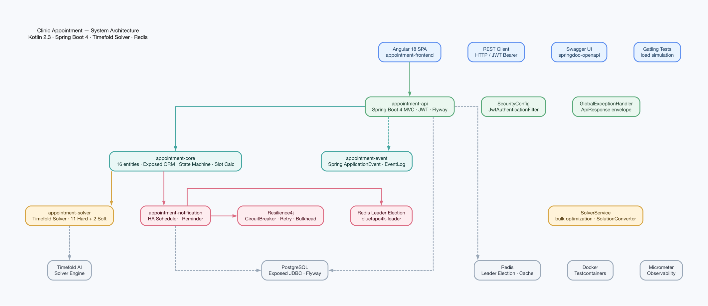
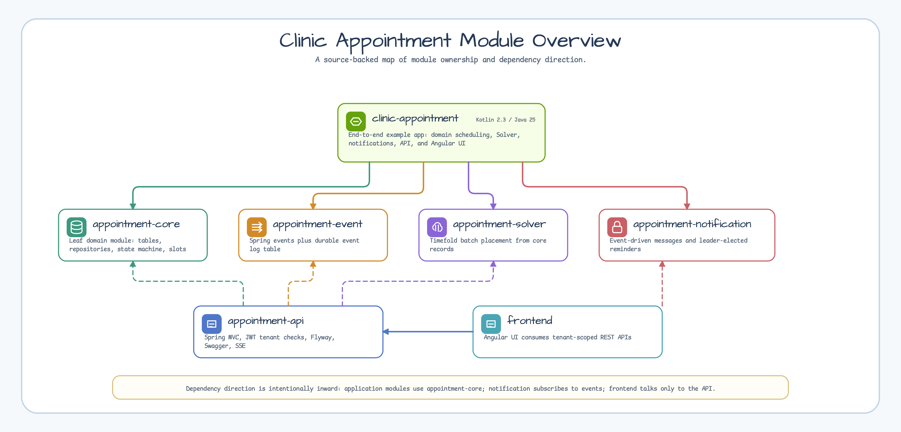

# clinic-appointment

[English](README.md) | [한국어](README.ko.md)

[](https://github.com/bluetape4k/clinic-appointment/actions/workflows/ci.yml)
[](https://kotlinlang.org)
[](https://spring.io/projects/spring-boot)
[](https://openjdk.org/projects/jdk/25/)
[](https://coveralls.io/github/bluetape4k/clinic-appointment?branch=main)
[](https://github.com/Kotlin/kotlinx-kover)
[](https://github.com/bluetape4k/clinic-appointment/commits/main)


Kotlin 2.3, Spring Boot 4, Timefold Solver AI 스케줄링으로 만든 개인병원 예약 관리 시스템입니다.

## 프로젝트 목적

`clinic-appointment`는 도메인 기반 예약 관리, Timefold 최적화, 고가용성 알림,
Spring Boot API, Angular 화면까지 한 번에 다루는 진료 예약 예제입니다.

## 주요 기능

- **예약 상태 머신** - PENDING -> REQUESTED -> CONFIRMED -> CHECKED_IN -> IN_PROGRESS -> COMPLETED 전이, 취소/재배정 지원
- **AI 최적 스케줄링** - Timefold Solver로 의사, 장비, 영업시간을 포함한 12개 Hard + 6개 Soft 제약을 만족하는 최적 배치
- **고가용성 알림** - Redis Leader Election으로 단일 노드 전송 보장, Resilience4j CircuitBreaker/Retry/Bulkhead 적용
- **테넌트 범위 REST API** - `/api/{tenantCode}/...` 경로, JWT tenant 인가, Flyway 마이그레이션, Swagger UI 제공
- **예약 플랜 기반** - 구매 상품 BOM을 불변 진료 의무로 스냅샷하고, 카탈로그 동기화와 신뢰된 구매 이벤트를 통해 방문 예약 이전 단계를 관리
- **예약 정책 기반** - 가예약, 동의, overbooking, 재확인, 운영 장애 복구, 통제된 진료 시간 연장에 대한 tenant baseline과 clinic override를 버전 관리
- **Angular 18 웹 UI** - 예약 조회/생성/상태 변경 인터페이스

카탈로그 동기화 호출자는 [docs/api/catalog-payload-hash.md](docs/api/catalog-payload-hash.md)의
canonical hash 계약과 fixture로 `payloadHash`를 재현할 수 있습니다.

### 예약 플랜 경계

`AppointmentPlan`은 한 번의 구매로 병원이 제공해야 할 진료 의무를 기록합니다.
방문 예약은 그중 어떤 진료를 언제 진행할지 기록합니다. 이번 기반 구현은 카탈로그
스냅샷, 진료 회차, 의존관계, 구매 inbox 판정, 대기 중인 plan-created outbox 이벤트를
저장합니다.

방문 일정 배정, 자원 선점, 고객 동의, outbox 발행, 시술 완료·환불 처리는 구현하지
않았습니다. 이 기능들은 별도 워크플로와 서비스의 책임입니다.

### 예약 정책 경계

Scheduling policy는 앞으로의 예약 결정이 따라야 할 동작을 정의합니다. 이 기능은
예약을 직접 생성하지 않습니다. 이번 기반 구현은 불변 tenant 정책 버전, clinic override,
scope head, preview job, activation command, effective snapshot, privacy-safe metric을
저장합니다.

모든 rollout flag는 기본적으로 꺼져 있으며 다음 순서로만 켭니다.

1. `scheduling.policy.shadow-compile-enabled`
2. `scheduling.policy.effective-read-enabled`
3. `scheduling.policy.admin-write-enabled`
4. `scheduling.policy.preview-worker-enabled`
5. `scheduling.policy.scheduled-activation-enabled`

이 foundation에는 booking consumer flag가 없습니다. 확정 예약은 정책 기반 변경을
적용하기 전에 여전히 고객 동의가 필요합니다.

## 아키텍처



## 모듈 개요



## 대표 요구사항 흐름


전체 요구사항 다이어그램 목록은 [docs/requirements](docs/requirements/README.md)에서 관리합니다.

## 모듈

| 모듈 | 역할 | 개발자 문서 |
|------|------|-----------|
| `appointment-core` | 도메인 모델(16개 엔티티), Exposed ORM 테이블, 리포지토리, 예약 상태머신, 슬롯 계산 서비스 | [README](appointment-core/README.md) |
| `appointment-event` | Spring ApplicationEvent 기반 도메인 이벤트 발행/구독, 이벤트 로그 저장 | [README](appointment-event/README.md) |
| `appointment-solver` | Timefold Solver AI 최적화 - 12개 Hard + 6개 Soft 제약으로 대량 예약 최적 배치 | [README](appointment-solver/README.md) |
| `appointment-notification` | Redis Leader Election + Resilience4j 기반 HA 알림 스케줄러, 리마인더 발송 | [README](appointment-notification/README.md) |
| `appointment-api` | Spring Boot 4 REST API - 예약 CRUD, 슬롯 조회, 재배정, JWT 인증, Swagger | [README](appointment-api/README.md) |
| `frontend/appointment-frontend` | Angular 18 웹 UI - 예약 관리 인터페이스 | [README](frontend/appointment-frontend/README.md) |

## 빠른 시작

> TODO: Docker Compose 환경 구성 후 업데이트 예정

현재는 수동으로 PostgreSQL + Redis를 실행한 뒤 API를 기동합니다.

```bash
# API 서버 기동 (PostgreSQL + Redis 필요)
./gradlew :appointment-api:bootRun
# Swagger UI: http://localhost:8080/swagger-ui.html
```

백엔드 엔드포인트는 테넌트 범위로 동작합니다. 로컬 seed tenant는 `/api/tenant-default/...` 를 사용하며, 프런트엔드 테넌트 라우팅은 후속 단계입니다.

## 빌드 & 테스트

```bash
# 전체 빌드 (frontend 제외)
./gradlew build -x :frontend:appointment-frontend:build

# 모듈별 빌드
./gradlew :appointment-core:build
./gradlew :appointment-solver:build
./gradlew :appointment-api:build

# 특정 테스트 실행
./gradlew :appointment-core:test --tests "fully.qualified.ClassName.methodName"
```

### 사전 준비

- JDK 25
- Docker (Testcontainers가 테스트 시 의존 서비스를 자동으로 기동)
- Node.js 22+ (프런트엔드 빌드 시만 필요)

## 문서

### 요구사항 & 설계

| 문서 | 내용 |
|------|------|
| [요구사항 인덱스](docs/requirements/README.md) | 전체 요구사항 목록 + 구현 상태 |
| [아키텍처](docs/requirements/architecture.md) | 모듈 의존성, 주요 설계 결정 (ADR) |
| [도메인 모델](docs/requirements/domain-model.md) | 16개 엔티티, 예약 상태머신, 테이블 관계 |
| [AI 스케줄러](docs/requirements/solver.md) | Timefold Solver 제약조건 설계 |
| [알림 모듈](docs/requirements/notification.md) | 알림 채널, HA 구성, Resilience4j |
| [프론트엔드](docs/requirements/frontend.md) | Angular 구성, 페이지 구조 |
| [예약 플랜 시각 companion](docs/superpowers/specs/2026-07-26-appointment-plan-and-capacity-design.html) | 플랜, 예약 약속, 장애 재조정, 수용량의 시뮬레이션과 결정 이력 |
| [예약 정책 시각 companion](docs/superpowers/specs/2026-07-27-scheduling-policy-foundation-design.html) | 정책 compile, 승인, 활성화, 복구의 시뮬레이션과 결정 이력 |
| [예약 플랜 복구 런북](docs/runbooks/appointment-plan-foundation-recovery.md) | 격리 확인, dry-run redrive, 롤백, 원천 서비스 책임 |
| [예약 정책 API](docs/api/scheduling-policy.md) | tenant/clinic 정책 endpoint, idempotency, preview polling, 오류, rollout flag |
| [예약 정책 활성화 런북](docs/runbooks/scheduling-policy-activation.md) | worker alert, 60초/5분 activation 처리, replay/retire 복구, V10 준비 조건 |
| [예약 Commitment v2 API](docs/api/visit-commitment.md) | Gateway 인증, 가예약·승인·확정, 멱등성, 오류와 배포 설정 |
| [예약 Commitment v2 운영 런북](docs/runbooks/visit-commitment-operations.md) | shadow/allowlist, 경보, retention, redrive, PostgreSQL rollback |

### 변경 이력

- [CHANGELOG.md](CHANGELOG.md)
