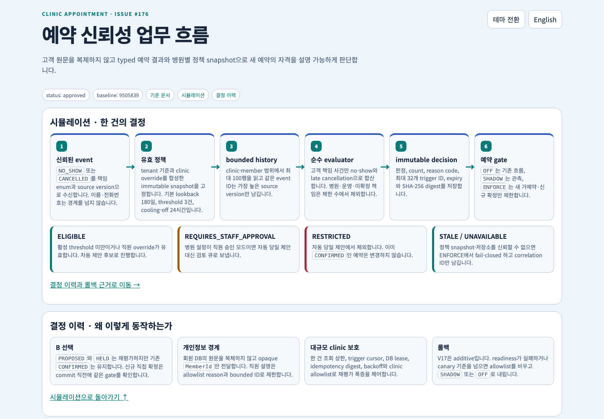
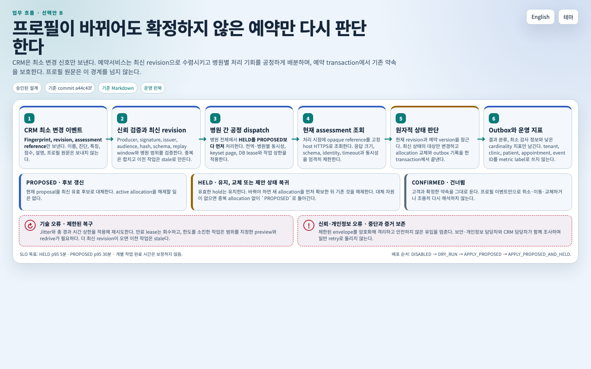
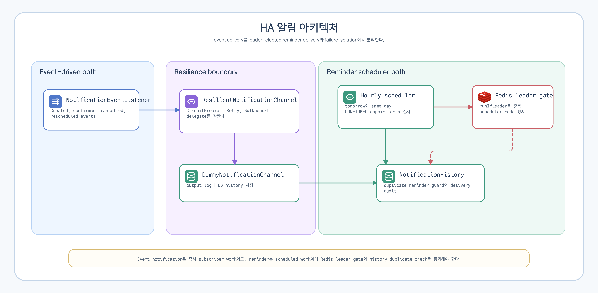
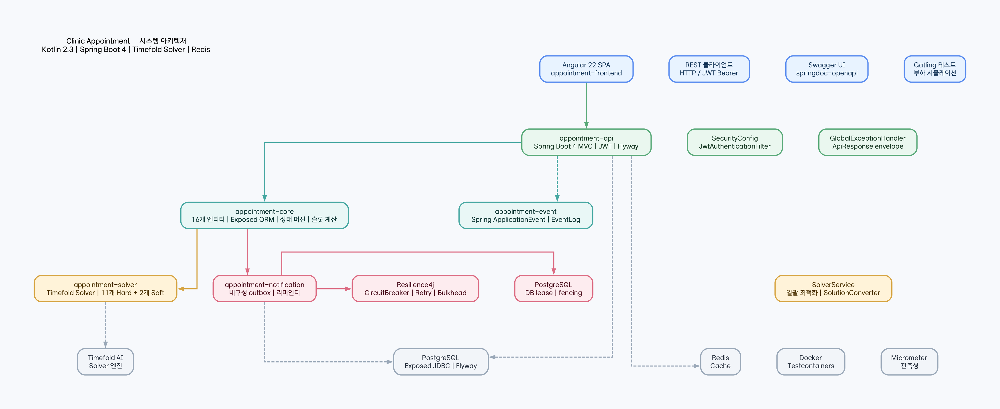
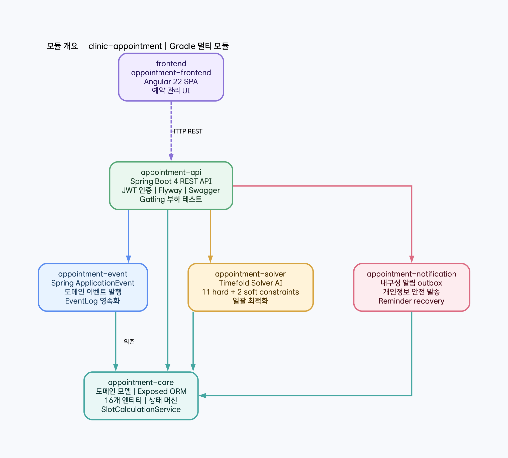
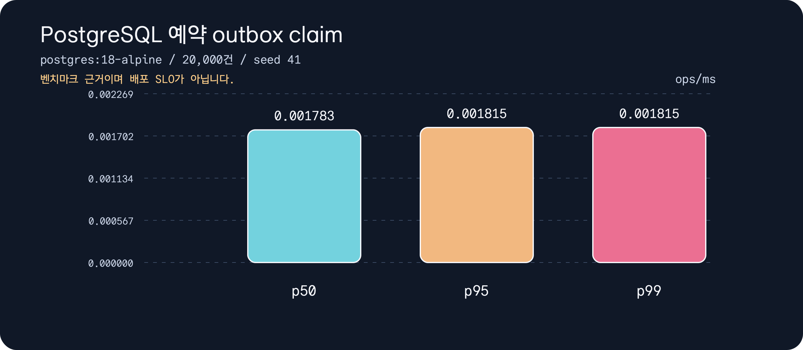
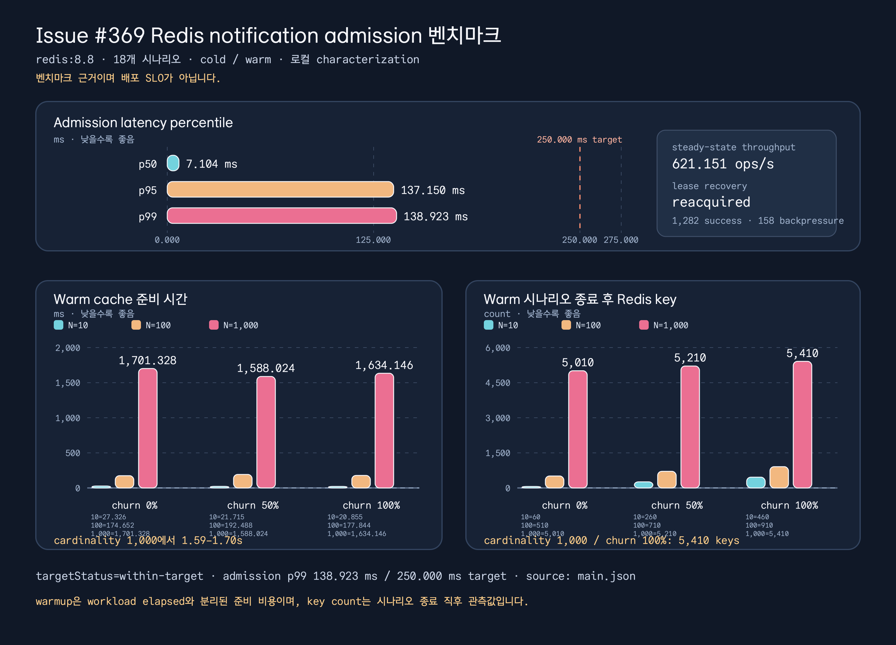
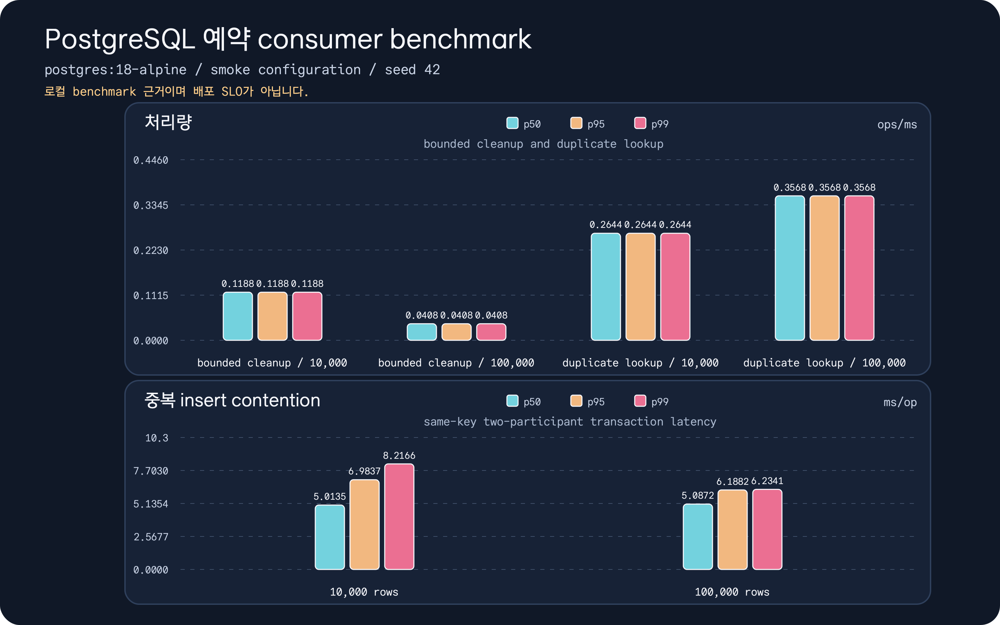

# clinic-appointment

[English](README.md) | [한국어](README.ko.md)

[](https://github.com/bluetape4k/clinic-appointment/actions/workflows/ci.yml)
[](https://kotlinlang.org)
[](https://spring.io/projects/spring-boot)
[](https://openjdk.org/projects/jdk/25/)
[](https://coveralls.io/github/bluetape4k/clinic-appointment?branch=main)
[](https://github.com/Kotlin/kotlinx-kover)
[](https://github.com/bluetape4k/clinic-appointment/commits/main)


Kotlin 2.3, Spring Boot 4, Timefold Solver AI 스케줄링으로 만든 개인병원 예약 관리 시스템입니다.

## 프로젝트 목적

`clinic-appointment`는 도메인 기반 예약 관리, Timefold 최적화, 고가용성 알림,
Spring Boot API, Angular 화면까지 한 번에 다루는 진료 예약 예제입니다.

## 주요 기능

- **예약 상태 머신** - PENDING -> REQUESTED -> CONFIRMED -> CHECKED_IN -> IN_PROGRESS -> COMPLETED 전이, 취소/재배정 지원
- **AI 최적 스케줄링** - Timefold Solver로 의사, 장비, 영업시간을 포함한 12개 Hard + 6개 Soft 제약을 만족하는 최적 배치
- **내구성 알림** - 예약과 함께 개인정보를 최소화한 알림 outbox를 커밋하고, DB lease와 fencing, 병원 간 공정 처리, 발송 시점 회원 조회, 실행 시간이 제한된 Resilience4j 정책으로 전달
- **트랜잭션 예약 메시징** - 예약 aggregate와 개인정보를 제거한 Kafka 4 이벤트 intent를 함께 커밋하고, lease fencing과 allow-list를 적용한 at-least-once relay로 전달
- **테넌트 범위 REST API** - `/api/{tenantCode}/...` 경로, JWT tenant 인가, Flyway 마이그레이션, Swagger UI 제공
- **예약 플랜 기반** - 구매 상품 BOM을 불변 진료 의무로 스냅숏하고, 카탈로그 동기화와 신뢰된 구매 이벤트를 통해 방문 예약 이전 단계를 관리
- **예약 정책 기반** - 가예약, 동의, 오버부킹, 재확인, 운영 장애 복구, 통제된 진료 시간 연장에 대한 테넌트 기준 정책과 병원별 재정의를 버전 관리
- **예약 신뢰도 경계** - 고객 책임 no-show·지각 취소 임계값을 회원 프로필 복제 없이 평가하고, 기존 확정 약속을 보호하며, 제한된 직원 검토 경로를 제공
- **Angular 18 웹 UI** - 예약 조회/생성/상태 변경 인터페이스

카탈로그 동기화 호출자는 [docs/api/catalog-payload-hash.md](docs/api/catalog-payload-hash.md)의
canonical hash 계약과 fixture로 `payloadHash`를 재현할 수 있습니다.

### 예약 플랜 경계

`AppointmentPlan`은 한 번의 구매로 병원이 제공해야 할 진료 의무를 기록합니다.
방문 예약은 그중 어떤 진료를 언제 진행할지 기록합니다. 이번 기반 구현은 카탈로그
스냅숏, 진료 회차, 의존관계, 구매 inbox 판정, 대기 중인 plan-created outbox 이벤트를
저장합니다.

방문 일정 배정, 자원 선점, 고객 동의, outbox 발행, 시술 완료·환불 처리는 구현하지
않았습니다. 이 기능들은 별도 워크플로와 서비스의 책임입니다.

### 예약 정책 경계

Scheduling policy는 앞으로의 예약 결정이 따라야 할 동작을 정의합니다. 이 기능은
예약을 직접 생성하지 않습니다. 이번 기반 구현은 불변 테넌트 정책 버전, 병원별 재정의,
범위별 활성 헤드, 미리보기 작업, 활성화 명령, 유효 정책 스냅숏, 개인정보 안전 메트릭을
저장합니다.

모든 롤아웃 플래그는 기본적으로 꺼져 있으며 다음 순서로만 켭니다.

1. `scheduling.policy.shadow-compile-enabled`
2. `scheduling.policy.effective-read-enabled`
3. `scheduling.policy.admin-write-enabled`
4. `scheduling.policy.preview-worker-enabled`
5. `scheduling.policy.scheduled-activation-enabled`

이 기반 구현에는 예약 생성 경로의 정책 소비 플래그가 없습니다. 확정 예약은 정책 기반 변경을
적용하기 전에 여전히 고객 동의가 필요합니다.

### 예약 신뢰도 경계

예약 신뢰도 evaluator는 typed 예약 결과, 불변 effective policy snapshot, 제한된 회원 이력으로
새 예약 자격을 판단합니다. 예약 경계에는 불투명한 `MemberId`만 전달합니다. clinic allowlist와
`OFF`·`SHADOW`·`ENFORCE` 모드로 단계적으로 전개하며, `PROPOSED`·`HELD`는 검토할 수 있지만
이미 `CONFIRMED`인 약속은 그대로 둡니다.

<a href="docs/visual-companions/booking-reliability-workflow-ko-light.html">
  <picture>
    <source media="(prefers-color-scheme: dark)" srcset="docs/visual-companions/booking-reliability-workflow-ko-dark.png">
    
  </picture>
</a>

[예약 신뢰도 기준 문서](docs/booking-reliability-policy.ko.md), [API 계약](docs/api/booking-reliability.md),
[운영 런북](docs/runbooks/booking-reliability.ko.md), [interactive workflow](docs/visual-companions/booking-reliability-workflow-ko-light.html)를 함께 참고하세요.

<a id="profile-reevaluation"></a>
### 프로필 변경 예약 재평가 경계

CRM이 예약 판단에 영향을 주는 프로필 변경을 알리면 예약서비스는 `PROPOSED`와
`HELD` 예약만 다시 평가합니다. `CONFIRMED` 예약은 그대로 둡니다. 이벤트에는
프로필 원문, 파생 특징, 점수, 설명 대신 범위가 제한된 fingerprint, revision과
opaque assessment reference만 담습니다.

<a href="docs/superpowers/specs/2026-07-30-profile-change-reservation-reevaluation.ko.html">
  <picture>
    <source media="(prefers-color-scheme: dark)" srcset="docs/superpowers/specs/2026-07-30-profile-change-reservation-reevaluation.ko.dark.png">
    
  </picture>
</a>

[업무 흐름 HTML](docs/superpowers/specs/2026-07-30-profile-change-reservation-reevaluation.ko.html),
[기준 설계](docs/superpowers/specs/2026-07-30-profile-change-reservation-reevaluation-design.md),
[운영 런북](docs/runbooks/profile-reevaluation.ko.md)에서 자세한 계약을 확인할 수 있습니다.

### 내구성 알림 경계

예약 명령은 같은 데이터베이스 트랜잭션에서 최소 알림 outbox를 커밋합니다. 알림
실행 모듈은 행을 선점한 뒤에만 회원 시스템에서 최신 연락처·언어·동의를 조회하고,
승인된 template을 메모리에서 렌더링합니다. 종료 행에서는 회원 ID·예약 ID·template
parameter를 제거합니다.

<picture>
  <source media="(prefers-color-scheme: dark)" srcset="docs/requirements/assets/data-flow-05-notification-events-ko-dark.png">
  
</picture>

[알림 설계](docs/requirements/notification.md)와
[운영 런북](docs/runbooks/notification-outbox-operations.md)에서 자세한 기준을 확인할 수 있습니다.

## 아키텍처



## 모듈 개요



## 대표 요구사항 흐름

<picture>
  <source media="(prefers-color-scheme: dark)" srcset="docs/requirements/assets/data-flow-01-appointment-create-ko-dark.png">
  
</picture>

전체 요구사항 다이어그램 목록은 [docs/requirements](docs/requirements/README.md)에서 관리합니다.

## 모듈

| 모듈 | 역할 | 개발자 문서 |
|------|------|-----------|
| `appointment-core` | 예약, 구매 시술 플랜, 스케줄 정책, 방문 확정 약속 도메인과 Exposed ORM 리포지토리, 상태머신, 슬롯 계산 서비스 | [README](appointment-core/README.ko.md) |
| `appointment-event` | Spring ApplicationEvent 기반 도메인 이벤트 발행/구독, 이벤트 로그 저장 | [README](appointment-event/README.ko.md) |
| `appointment-messaging` | Kafka 4 transactional outbox 계약, V23 consumer inbox/quarantine/replay audit, strict envelope codec, bounded relay, lag/retention metrics | [README](appointment-messaging/README.ko.md) |
| `benchmark/appointment-messaging-benchmark` | `kotlinx-benchmark`, Hikari, Flyway를 사용하는 PostgreSQL production schema outbox·consumer inbox 측정 | [Benchmark source](benchmark/appointment-messaging-benchmark) |
| `appointment-solver` | Timefold Solver AI 최적화 - 12개 Hard + 6개 Soft 제약으로 대량 예약 최적 배치 | [README](appointment-solver/README.ko.md) |
| `appointment-notification` | 내구성 outbox 발송, 발송 시점 회원 조회, 리마인더 복구, 개인정보 보존 관리, provider 장애 격리 | [README](appointment-notification/README.ko.md) |
| `appointment-api` | Spring Boot 4 REST API - 예약 CRUD, 슬롯 조회, 재배정, JWT 인증, Swagger | [README](appointment-api/README.ko.md) |
| `frontend/appointment-frontend` | Angular 18 웹 UI - 예약 관리 인터페이스 | [README](frontend/appointment-frontend/README.ko.md) |

## 빠른 시작

> TODO: Docker Compose 환경 구성 후 업데이트 예정

현재는 수동으로 PostgreSQL + Redis를 실행한 뒤 API를 기동합니다.

공식 지원 데이터베이스는 PostgreSQL 하나입니다. API 실행, Flyway 마이그레이션,
일반 CI와 nightly CI의 통합 검증은 PostgreSQL 기준으로 수행하며, H2와 MySQL은
지원 데이터베이스 행렬에 포함하지 않습니다.

### Redis 통합 테스트 이미지 계약

API cache/NearCache와 notification leader·outbox 통합 테스트는 `redis:8.8`을
유일한 지원 이미지로 사용합니다. 각 모듈의 `Redis88Launcher`가
bluetape4k `RedisServer(image = "redis", tag = "8.8")`를 singleton으로 기동하며,
production Redis 설정이나 의존성 버전을 변경하지 않습니다.

- `test-api`와 `test-notification` CI job이 모듈 테스트를 실행하므로 이미지 태그가
  누락되거나 의도하지 않게 바뀌면 `RedisServerContractTest`와 통합 검증이 실패합니다.
- 이 계약은 테스트 호환성만 고정하며 Redis 버전 행렬이나 Redis 8 전용 명령 지원을
  의미하지 않습니다.
- 이미지 롤백이 필요하면 production 설정을 먼저 바꾸지 말고 두 모듈의
  `Redis88Launcher`, 계약 테스트, 이 문서와 lesson을 함께 이전 계약으로 되돌린 뒤
  해당 모듈 테스트를 다시 실행합니다.

```bash
# API 서버 기동 (PostgreSQL + Redis 필요)
./gradlew :appointment-api:bootRun
# Swagger UI: http://localhost:8080/swagger-ui.html
```

백엔드 엔드포인트는 테넌트 범위로 동작합니다. 로컬 seed tenant는 `/api/tenant-default/...` 를 사용하며, 프런트엔드 테넌트 라우팅은 후속 단계입니다.

## 빌드 & 테스트

```bash
# 전체 빌드 (frontend 제외)
./gradlew build -x :frontend:appointment-frontend:build

# 모듈별 빌드
./gradlew :appointment-core:build
./gradlew :appointment-solver:build
./gradlew :appointment-api:build

# PostgreSQL 예약 outbox benchmark (Docker 필요)
./gradlew :appointment-messaging-benchmark:mainSmokeBenchmark
./gradlew :appointment-messaging-benchmark:mainBenchmark

# 특정 테스트 실행
./gradlew :appointment-core:test --tests "fully.qualified.ClassName.methodName"
```

## PostgreSQL 예약 messaging benchmark

benchmark 모듈은 production PostgreSQL Flyway migration을 적용하고, Hikari와 Exposed로
실제 `JdbcAppointmentOutboxStore`를 연결한 뒤 `kotlinx-benchmark`로 bounded `claimBatch`
경로를 측정합니다. bluetape4k PostgreSQL singleton launcher, 고정 seed `41`, synthetic
row `20,000`건을 사용하며 Docker가 필요합니다.



커밋된 [baseline JSON](docs/benchmarks/appointment-messaging-postgresql-baseline.json)은
`main` configuration에서 수집했습니다. 수치는 `ops/ms` throughput이며 benchmark
근거일 뿐 배포 SLO가 아닙니다.

| Percentile | Throughput |
|------------|------------:|
| p50 | 0.001783 ops/ms |
| p95 | 0.001815 ops/ms |
| p99 | 0.001815 ops/ms |

smoke task는 pull request 확인용이고, full task는 nightly CI에서 직렬 실행되며 JSON과
생성 chart artifact를 업로드합니다.

### Redis notification outbox admission benchmark

`:appointment-notification`의 test source harness가 Redis `8.8`에서 clinic cardinality
와 clinic ID churn을 cold/warm 시나리오로 측정합니다. production coordinator와 semaphore
의미론은 변경하지 않으며, internal 타입을 직접 써야 하므로 별도 public benchmark 모듈이
아닌 module-scoped JavaExec task로 격리했습니다.

```bash
# smoke: PR 전 확인용 (cardinality 10/100, churn 0%/100%, cold)
./gradlew :appointment-notification:redisAdmissionBenchmarkSmoke --no-build-cache

# full: cardinality 10/100/1000 × churn 0%/50%/100% × cold/warm
./gradlew :appointment-notification:redisAdmissionBenchmark --no-build-cache

# JSON 계약과 p99 기준 검증
node scripts/validate-redis-notification-admission-benchmark.mjs \
  --input appointment-notification/build/reports/redis-admission/main/redis-notification-admission.json \
  --target-p99-ms 250
```

full baseline의 보수적 worst-scenario aggregate는 admission p50 `7.104ms`, p95
`137.150ms`, p99 `138.923ms`이며, lease recovery는 `reacquired`였습니다. warm
cardinality `1,000`의 준비 시간은 약 `1.59–1.70s`, Redis key count는 churn에 따라
`5,010–5,410`까지 관측됐습니다. 이 수치는 로컬 characterization evidence이고
배포 SLO 증명이 아닙니다. 전체 raw JSON과 해석은
[Issue #369 benchmark analysis](docs/benchmarks/issue-369-redis-admission-benchmark/analysis.ko.md)를
참고하세요.



차트는 커밋된 `main.json`에서 SVG → PNG로 재생성하며, p99 기준과 warm
cardinality/churn에 따른 준비 시간·Redis key count를 함께 보여 줍니다.

### PostgreSQL 예약 consumer benchmark

같은 `kotlinx-benchmark` 모듈에서 PostgreSQL production V23 consumer schema도 실행합니다.
bounded terminal-row cleanup, duplicate inbox lookup, 두 참여자가 동일 key를 insert하는
경로를 측정해 transaction lock contention을 드러냅니다. 처리량 단위는 `ops/ms`,
contention 단위는 `ms/op`입니다.



커밋된 [consumer baseline JSON](docs/benchmarks/appointment-messaging-consumer-postgresql-baseline.json)은
`postgres:18-alpine`, seed `42`, 10,000/100,000건 시나리오의 `smoke` configuration에서
수집했습니다.

| 작업 | 행 수 | p50 | p95 | p99 | 단위 |
|------|------:|----:|----:|----:|------|
| bounded cleanup | 10,000 | 0.118795 | 0.118795 | 0.118795 | ops/ms |
| bounded cleanup | 100,000 | 0.040776 | 0.040776 | 0.040776 | ops/ms |
| duplicate lookup | 10,000 | 0.264357 | 0.264357 | 0.264357 | ops/ms |
| duplicate lookup | 100,000 | 0.356833 | 0.356833 | 0.356833 | ops/ms |
| same-key insert contention | 10,000 | 5.013504 | 6.983680 | 8.216576 | ms/op |
| same-key insert contention | 100,000 | 5.087232 | 6.188237 | 6.234112 | ms/op |

이 수치는 로컬 PostgreSQL benchmark와 lock-contention 근거이며 report의
`deploymentSloEvidence=false`를 유지합니다. 배포 SLO, broker lag, lock-wait 근거는
rollout gate를 닫기 전에 대상 운영 환경에서 별도로 수집해야 합니다.

### 사전 준비

- JDK 25
- Docker (Testcontainers가 테스트 시 의존 서비스를 자동으로 기동)
- Node.js 22+ (프런트엔드 빌드 시만 필요)

## 문서

### 요구사항 & 설계

| 문서 | 내용 |
|------|------|
| [요구사항 인덱스](docs/requirements/README.md) | 전체 요구사항 목록 + 구현 상태 |
| [아키텍처](docs/requirements/architecture.md) | 모듈 의존성, 주요 설계 결정 (ADR) |
| [도메인 모델](docs/requirements/domain-model.md) | tenant 소유권, 도메인 엔티티, 예약 상태머신, 테이블 관계 |
| [AI 스케줄러](docs/requirements/solver.md) | Timefold Solver 제약조건 설계 |
| [알림 모듈](docs/requirements/notification.md) | 내구성 outbox 생명주기, 단계별 전환, 회원정보 경계, provider 장애 격리 |
| [알림 outbox 운영 런북](docs/runbooks/notification-outbox-operations.md) | 카나리 기준, 경보, 재알림, 키 교체, 마이그레이션, 롤백 |
| [예약 messaging 운영 런북](docs/runbooks/appointment-messaging-operations.md) | consumer readiness, MySQL V23 metadata smoke, lag/SLO 경계, replay, 보존·삭제, 롤백 |
| [예약 consumer replay 런북](docs/operations/appointment-consumer-replay-runbook.md) | tenant/clinic 범위 replay 권한, 제한된 Kafka source, audit claim, 보존·삭제 |
| [의존성 1.4.0 캐시 migration 런북](docs/runbooks/dependency-1.4.0-cache-migration.md) | Redis TLS/ACL, Fory v2→v3 canary, exact-key 정리, rollback |
| [캐시 rollout evidence validator](scripts/verify-cache-rollout-evidence.sh) | local/live evidence JSON과 PostgreSQL·broker threshold 검증 |
| [Issue #263 production-like evidence](docs/benchmarks/issue-263-cache-rollout-evidence/2026-08-23/production-like-report.json) | Redis v3 exact-key, PostgreSQL migration/lock-wait, Kafka lag, v2 rollback 보존 결과 |
| [프론트엔드](docs/requirements/frontend.md) | Angular 구성, 페이지 구조 |
| [예약 플랜 시각 동반 문서](docs/superpowers/specs/2026-07-26-appointment-plan-and-capacity-design.html) | 플랜, 예약 약속, 장애 재조정, 수용량의 시뮬레이션과 결정 이력 |
| [예약 정책 시각 동반 문서](docs/superpowers/specs/2026-07-27-scheduling-policy-foundation-design.html) | 정책 컴파일, 승인, 활성화, 복구의 시뮬레이션과 결정 이력 |
| [프로필 변경 예약 재평가 업무 흐름](docs/superpowers/specs/2026-07-30-profile-change-reservation-reevaluation.ko.html) | CRM 최소 이벤트, 병원 간 공정 처리, 상태별 판단, 개인정보를 남기지 않는 복구 흐름 |
| [상품 예약 운영 특성 분류](docs/superpowers/specs/2026-07-29-issue-184-product-scheduling-classification.html) | 상품 특성, 수용량 소유권, 검증된 예약 계약을 확인하는 시뮬레이션 |
| [패키지 상품 구성](docs/superpowers/specs/2026-07-29-issue-184-package-product-composition.html) | 반복형, 복합형, N개 중 M개 선택형 패키지 구성을 비교하는 시뮬레이션 |
| [상품 실행 BOM의 예약 전개 흐름](docs/superpowers/specs/2026-07-29-issue-184-product-bom-to-appointment-flow.html) | 불변 실행 BOM이 방문, 제안, 동의, 확정 예약으로 전개되는 과정의 시뮬레이션 |
| [예약 플랜 복구 런북](docs/runbooks/appointment-plan-foundation-recovery.md) | 격리 확인, 드라이런 재처리, 롤백, 원천 서비스 책임 |
| [예약 정책 API](docs/api/scheduling-policy.md) | 테넌트/병원 정책 엔드포인트, 멱등성, 미리보기 폴링, 오류, 롤아웃 플래그 |
| [예약 정책 활성화 런북](docs/runbooks/scheduling-policy-activation.md) | 작업자 경보, 60초/5분 활성화 처리, 재생/폐기 복구, V10 준비 조건 |
| [방문 확정 약속 v2 API](docs/api/visit-commitment.md) | Gateway 인증, 가예약·승인·확정, 멱등성, 오류와 배포 설정 |
| [방문 확정 약속 v2 운영 런북](docs/runbooks/visit-commitment-operations.md) | shadow/허용목록, 경보, 보존, 재처리, PostgreSQL 롤백 |
| [프로필 변경 예약 재평가 운영 런북](docs/runbooks/profile-reevaluation.ko.md) | 비활성·드라이런 배포, 병원 허용목록, SLO 경보, 제한된 재처리, 개인정보 사고와 롤백 |
| [예약 신뢰도 기준 문서](docs/booking-reliability-policy.ko.md) | 임계값, typed 책임, 개인정보 경계, Choice B 확정 약속 보호, 단계별 전개 계약 |
| [예약 신뢰도 API](docs/api/booking-reliability.md) | 결정·override·clear·감사 endpoint와 capability·병원 범위 검증 |
| [예약 신뢰도 운영 런북](docs/runbooks/booking-reliability.ko.md) | schema readiness, shadow/canary 증거, 제한된 재평가, 보존·삭제, 롤백 |
| [예약 신뢰도 업무 흐름](docs/visual-companions/booking-reliability-workflow-ko-light.html) | 한국어 light-theme 인터랙티브 시뮬레이션과 결정 이력; dark/영문 변형은 visual companion manifest에서 확인 |

### 변경 이력

- [CHANGELOG.md](CHANGELOG.md)
