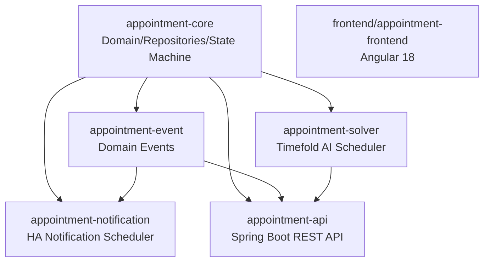

# clinic-appointment

[English](README.md) | [한국어](README.ko.md)

[](https://github.com/bluetape4k/clinic-appointment/actions/workflows/ci.yml)
[](https://kotlinlang.org)
[](https://spring.io/projects/spring-boot)
[](https://openjdk.org/projects/jdk/25/)
[](https://coveralls.io/github/bluetape4k/clinic-appointment?branch=main)
[](https://github.com/Kotlin/kotlinx-kover)
[](https://github.com/bluetape4k/clinic-appointment/commits/main)


A private clinic appointment management system built with Kotlin 2.3, Spring Boot 4, and Timefold Solver AI scheduling.

## Project Purpose

`clinic-appointment` demonstrates an end-to-end clinic scheduling system:
domain-driven appointment management, Timefold optimization, high-availability
notifications, Spring Boot APIs, and an Angular frontend.

## Key Features

- **Appointment state machine** - Supports PENDING -> REQUESTED -> CONFIRMED -> CHECKED_IN -> IN_PROGRESS -> COMPLETED transitions, cancellation, and reassignment.
- **AI schedule optimization** - Uses Timefold Solver to assign appointments while satisfying doctor, equipment, business-hour, 10 hard, and 2 soft constraints.
- **High-availability notifications** - Uses Redis Leader Election to guarantee single-node delivery, with Resilience4j CircuitBreaker/Retry/Bulkhead.
- **REST API** - Provides Spring Boot 4 MVC APIs with JWT authentication, Flyway migrations, and Swagger UI.
- **Angular 18 web UI** - Provides appointment search, creation, and status-change workflows.

## Architecture



## Modules

| Module | Role | Developer Docs |
|------|------|-----------|
| `appointment-core` | Domain model with 16 entities, Exposed ORM tables, repositories, appointment state machine, and slot calculation services. | [README](appointment-core/README.md) |
| `appointment-event` | Domain event publishing/subscription and event log persistence based on Spring ApplicationEvent. | [README](appointment-event/README.md) |
| `appointment-solver` | Timefold Solver AI optimization for bulk appointment placement using 10 hard and 2 soft constraints. | [README](appointment-solver/README.md) |
| `appointment-notification` | HA notification scheduler and reminder delivery using Redis Leader Election and Resilience4j. | [README](appointment-notification/README.md) |
| `appointment-api` | Spring Boot 4 REST API for appointment CRUD, slot lookup, reassignment, JWT authentication, and Swagger. | [README](appointment-api/README.md) |
| `frontend/appointment-frontend` | Angular 18 web UI for appointment management. | [README](frontend/appointment-frontend/README.md) |

## Quick Start

> TODO: Update after the Docker Compose environment is added.

For now, start PostgreSQL and Redis manually, then run the API server.

```bash
# Start the API server (requires PostgreSQL + Redis)
./gradlew :appointment-api:bootRun
# Swagger UI: http://localhost:8080/swagger-ui.html
```

## Build & Test

```bash
# Full build without frontend
./gradlew build -x :frontend:appointment-frontend:build

# Module-scoped builds
./gradlew :appointment-core:build
./gradlew :appointment-solver:build
./gradlew :appointment-api:build

# Run a specific test
./gradlew :appointment-core:test --tests "fully.qualified.ClassName.methodName"
```

### Prerequisites

- JDK 25
- Docker (Testcontainers starts dependencies automatically during tests)
- Node.js 22+ (only needed for frontend builds)

## Documentation

### Requirements & Design

| Document | Description |
|------|------|
| [Requirements Index](docs/requirements/README.md) | Complete requirements list and implementation status. |
| [Architecture](docs/requirements/architecture.md) | Module dependencies and key architecture decisions. |
| [Domain Model](docs/requirements/domain-model.md) | 16 entities, appointment state machine, and table relationships. |
| [AI Scheduler](docs/requirements/solver.md) | Timefold Solver constraint design. |
| [Notification Module](docs/requirements/notification.md) | Notification channels, HA configuration, and Resilience4j. |
| [Frontend](docs/requirements/frontend.md) | Angular structure and page design. |

### Change History

- [CHANGELOG.md](CHANGELOG.md)
