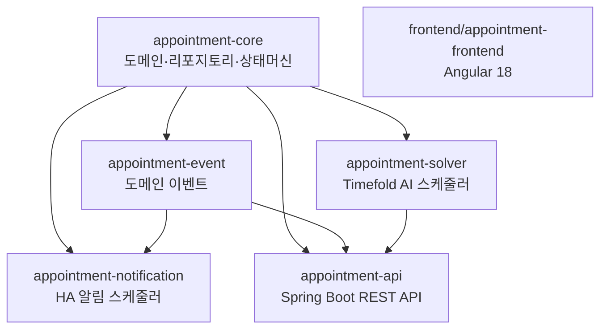

# clinic-appointment

[](https://github.com/bluetape4k/clinic-appointment/actions/workflows/ci.yml)

개인병원 환자 예약 관리 시스템 — Kotlin 2.3 + Spring Boot 4 + Timefold Solver AI 스케줄링

## 주요 기능

- **예약 상태 머신** — PENDING → REQUESTED → CONFIRMED → CHECKED_IN → IN_PROGRESS → COMPLETED 전이, 취소/재배정 지원
- **AI 최적 스케줄링** — Timefold Solver로 의사·장비·영업시간 10개 Hard + 2개 Soft 제약을 동시에 만족하는 최적 배치
- **고가용성 알림** — Redis Leader Election으로 단일 노드 전송 보장, Resilience4j CircuitBreaker/Retry/Bulkhead 적용
- **REST API** — Spring Boot 4 MVC, JWT 인증, Flyway 마이그레이션, Swagger UI 제공
- **Angular 18 웹 UI** — 예약 조회/생성/상태 변경 인터페이스

## 아키텍처



## 모듈

| 모듈 | 역할 | 개발자 문서 |
|------|------|-----------|
| `appointment-core` | 도메인 모델(16개 엔티티), Exposed ORM 테이블, 리포지토리, 예약 상태머신, 슬롯 계산 서비스 | [README](appointment-core/README.md) |
| `appointment-event` | Spring ApplicationEvent 기반 도메인 이벤트 발행/구독, 이벤트 로그 저장 | [README](appointment-event/README.md) |
| `appointment-solver` | Timefold Solver AI 최적화 — 10개 Hard + 2개 Soft 제약으로 대량 예약 최적 배치 | [README](appointment-solver/README.md) |
| `appointment-notification` | Redis Leader Election + Resilience4j 기반 HA 알림 스케줄러, 리마인더 발송 | [README](appointment-notification/README.md) |
| `appointment-api` | Spring Boot 4 REST API — 예약 CRUD, 슬롯 조회, 재배정, JWT 인증, Swagger | [README](appointment-api/README.md) |
| `frontend/appointment-frontend` | Angular 18 웹 UI — 예약 관리 인터페이스 | [README](frontend/appointment-frontend/README.md) |

## 빠른 시작

> TODO: Docker Compose 환경 구성 후 업데이트 예정

현재는 수동으로 PostgreSQL + Redis를 실행한 뒤 API를 기동합니다.

```bash
# API 서버 기동 (PostgreSQL + Redis 필요)
./gradlew :appointment-api:bootRun
# Swagger UI: http://localhost:8080/swagger-ui.html
```

## 빌드 & 테스트

```bash
# 전체 빌드 (frontend 제외)
./gradlew build -x :frontend:appointment-frontend:build

# 모듈별 빌드
./gradlew :appointment-core:build
./gradlew :appointment-solver:build
./gradlew :appointment-api:build

# 특정 테스트 실행
./gradlew :appointment-core:test --tests "fully.qualified.ClassName.methodName"
```

### Prerequisites

- JDK 25
- Docker (Testcontainers — 테스트 시 자동 기동)
- Node.js 22+ (frontend 빌드 시만 필요)

## 문서

### 요구사항 & 설계

| 문서 | 내용 |
|------|------|
| [요구사항 인덱스](docs/requirements/README.md) | 전체 요구사항 목록 + 구현 상태 |
| [아키텍처](docs/requirements/architecture.md) | 모듈 의존성, 주요 설계 결정 (ADR) |
| [도메인 모델](docs/requirements/domain-model.md) | 16개 엔티티, 예약 상태머신, 테이블 관계 |
| [AI 스케줄러](docs/requirements/solver.md) | Timefold Solver 제약조건 설계 |
| [알림 모듈](docs/requirements/notification.md) | 알림 채널, HA 구성, Resilience4j |
| [프론트엔드](docs/requirements/frontend.md) | Angular 구성, 페이지 구조 |

### 변경 이력

- [CHANGELOG.md](CHANGELOG.md)
