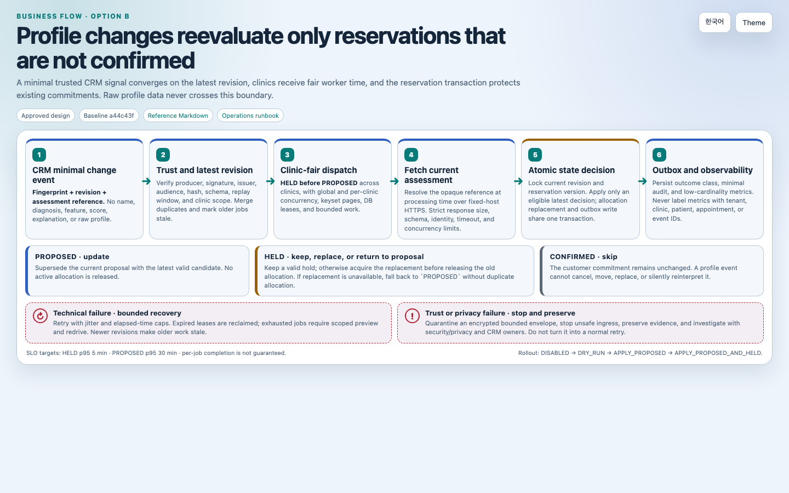
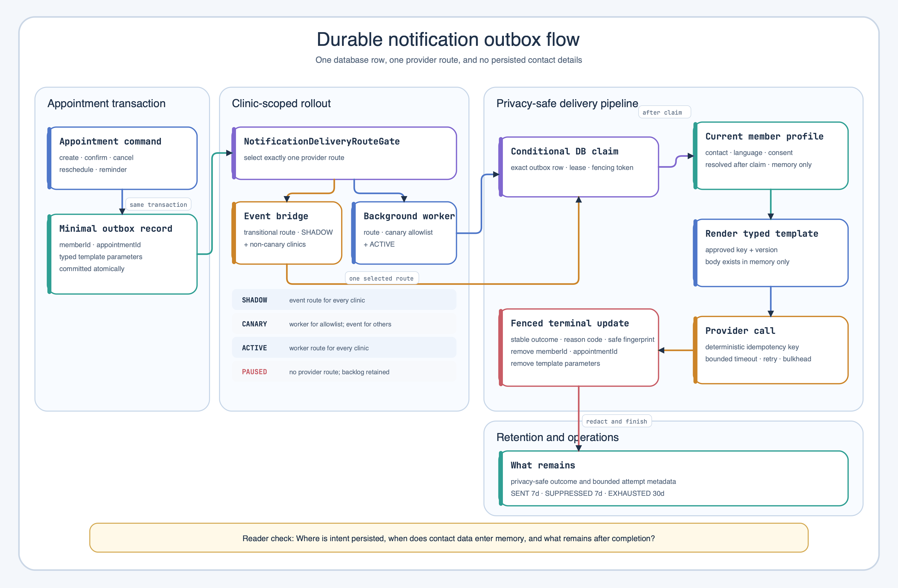
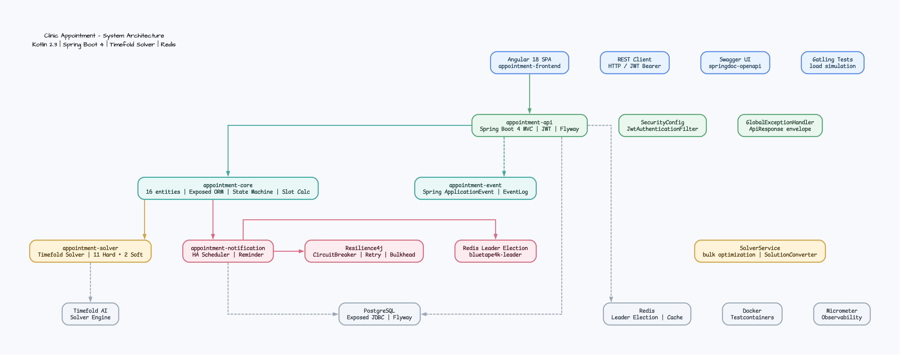
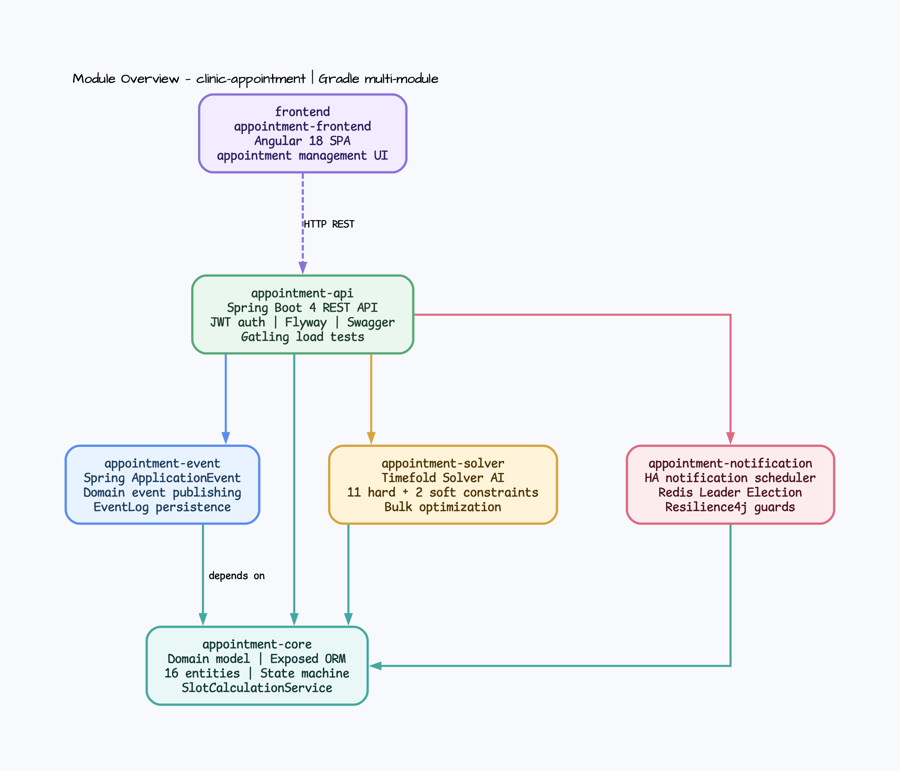
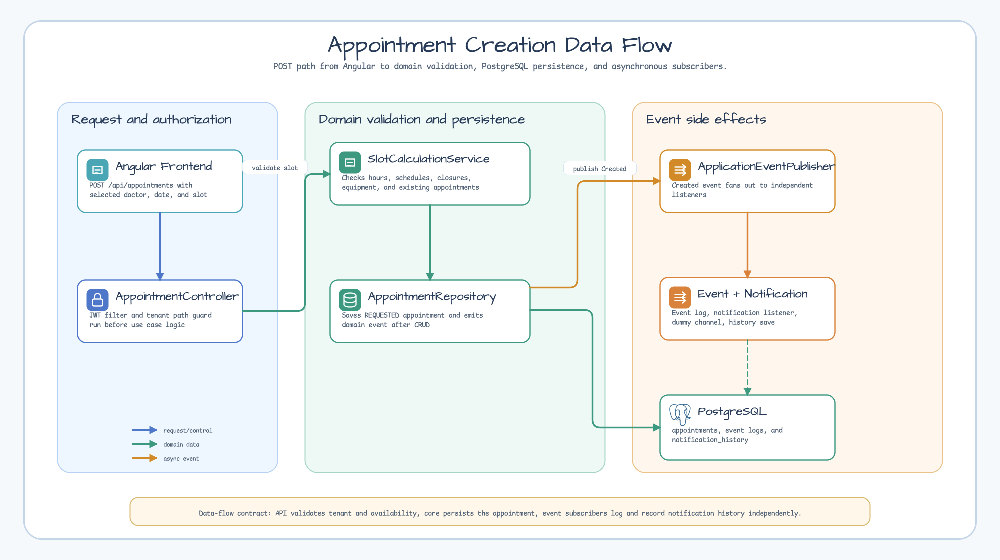

# clinic-appointment

[English](README.md) | [한국어](README.ko.md)

[](https://github.com/bluetape4k/clinic-appointment/actions/workflows/ci.yml)
[](https://kotlinlang.org)
[](https://spring.io/projects/spring-boot)
[](https://openjdk.org/projects/jdk/25/)
[](https://coveralls.io/github/bluetape4k/clinic-appointment?branch=main)
[](https://github.com/Kotlin/kotlinx-kover)
[](https://github.com/bluetape4k/clinic-appointment/commits/main)


A private clinic appointment management system built with Kotlin 2.3, Spring Boot 4, and Timefold Solver AI scheduling.

## Project Purpose

`clinic-appointment` demonstrates an end-to-end clinic scheduling system:
domain-driven appointment management, Timefold optimization, high-availability
notifications, Spring Boot APIs, and an Angular frontend.

## Key Features

- **Appointment state machine** - Supports PENDING -> REQUESTED -> CONFIRMED -> CHECKED_IN -> IN_PROGRESS -> COMPLETED transitions, cancellation, and reassignment.
- **AI schedule optimization** - Uses Timefold Solver to assign appointments while satisfying doctor, equipment, business-hour, 12 hard, and 6 soft constraints.
- **Durable notifications** - Commits a privacy-minimized notification outbox with the appointment, then uses database leases, fencing, fair clinic scheduling, send-time member lookup, and bounded Resilience4j policies for delivery.
- **Tenant-scoped REST API** - Provides Spring Boot 4 MVC APIs under `/api/{tenantCode}/...` with JWT tenant authorization, Flyway migrations, and Swagger UI.
- **Appointment plan foundation** - Snapshots a purchased product BOM into immutable treatment obligations through catalog sync and trusted purchase-event convergence, before any visit is scheduled.
- **Scheduling policy foundation** - Version-controls tenant baselines and clinic overrides for provisional booking, consent, overbooking, reconfirmation, disruption recovery, and controlled operating-hour extension.
- **Angular 18 web UI** - Provides appointment search, creation, and status-change workflows.

Catalog sync callers can reproduce `payloadHash` from the canonical hash
contract and fixture in [docs/api/catalog-payload-hash.md](docs/api/catalog-payload-hash.md).

### Appointment Plan Boundary

An `AppointmentPlan` records what the clinic owes for one purchase. A visit
appointment records when selected treatments will be performed. The foundation
implemented here stores catalog snapshots, treatment occurrences, dependency
edges, purchase inbox decisions, and a pending plan-created outbox event.

It does **not** schedule visits, reserve resources, obtain customer consent,
publish the outbox, or process treatment completion/refunds. Those capabilities
remain separate workflows and services.

### Scheduling Policy Boundary

Scheduling policies define how future booking decisions should behave. They do
not create appointments by themselves. The foundation stores immutable tenant
policy versions, clinic overrides, scope heads, preview jobs, activation
commands, effective snapshots, and privacy-safe metrics.

All rollout flags are off by default and must be enabled in this order:

1. `scheduling.policy.shadow-compile-enabled`
2. `scheduling.policy.effective-read-enabled`
3. `scheduling.policy.admin-write-enabled`
4. `scheduling.policy.preview-worker-enabled`
5. `scheduling.policy.scheduled-activation-enabled`

There is no booking-consumer flag in this foundation. Confirmed appointments
still require customer consent before policy-driven changes are applied.

<a id="profile-reevaluation"></a>
### Profile Change Reevaluation Boundary

When the CRM reports a material profile change, the reservation service
reevaluates only `PROPOSED` and `HELD` reservations. `CONFIRMED` reservations
remain unchanged. The event carries a scope-limited fingerprint, revision, and
opaque assessment reference instead of the profile, derived features, scores,
or explanations.

<a href="docs/superpowers/specs/2026-07-30-profile-change-reservation-reevaluation.html">
  <picture>
    <source media="(prefers-color-scheme: dark)" srcset="docs/superpowers/specs/2026-07-30-profile-change-reservation-reevaluation.en.dark.png">
    
  </picture>
</a>

Open the [interactive workflow](docs/superpowers/specs/2026-07-30-profile-change-reservation-reevaluation.html),
the [reference design](docs/superpowers/specs/2026-07-30-profile-change-reservation-reevaluation-design.md),
or the [operations runbook](docs/runbooks/profile-reevaluation.md).

### Durable Notification Boundary

Appointment commands commit a minimal notification outbox in the same database
transaction. The notification runtime resolves current contact details,
language, and consent from the member service only after claiming a row. It
renders the approved template in memory and removes member, appointment, and
template parameters from terminal rows.

<picture>
  <source media="(prefers-color-scheme: dark)" srcset="docs/requirements/assets/data-flow-05-notification-events-en-dark.png">
  
</picture>

See the [notification design](docs/requirements/notification.md) and
[operations runbook](docs/runbooks/notification-outbox-operations.md).

## Architecture



## Module Overview



## Representative Requirement Flow

<picture>
  <source media="(prefers-color-scheme: dark)" srcset="docs/requirements/assets/data-flow-01-appointment-create-en-dark.png">
  
</picture>

The full requirements diagram catalog is maintained in [docs/requirements](docs/requirements/README.md).

## Modules

| Module | Role | Developer Docs |
|------|------|-----------|
| `appointment-core` | Domain model for appointments, purchased treatment plans, scheduling policies, visit commitments, Exposed ORM repositories, state machines, and slot calculation. | [README](appointment-core/README.md) |
| `appointment-event` | Domain event publishing/subscription and event log persistence based on Spring ApplicationEvent. | [README](appointment-event/README.md) |
| `appointment-solver` | Timefold Solver AI optimization for bulk appointment placement using 12 hard and 6 soft constraints. | [README](appointment-solver/README.md) |
| `appointment-notification` | Durable outbox delivery, send-time member resolution, reminder recovery, privacy-safe retention, and provider isolation. | [README](appointment-notification/README.md) |
| `appointment-api` | Spring Boot 4 REST API for appointment CRUD, slot lookup, reassignment, JWT authentication, and Swagger. | [README](appointment-api/README.md) |
| `frontend/appointment-frontend` | Angular 18 web UI for appointment management. | [README](frontend/appointment-frontend/README.md) |

## Quick Start

> TODO: Update after the Docker Compose environment is added.

For now, start PostgreSQL and Redis manually, then run the API server.

```bash
# Start the API server (requires PostgreSQL + Redis)
./gradlew :appointment-api:bootRun
# Swagger UI: http://localhost:8080/swagger-ui.html
```

Backend endpoints are tenant-scoped. Use `/api/tenant-default/...` for the seeded local tenant; frontend tenant routing is a follow-up phase.

## Build & Test

```bash
# Full build without frontend
./gradlew build -x :frontend:appointment-frontend:build

# Module-scoped builds
./gradlew :appointment-core:build
./gradlew :appointment-solver:build
./gradlew :appointment-api:build

# Run a specific test
./gradlew :appointment-core:test --tests "fully.qualified.ClassName.methodName"
```

### Prerequisites

- JDK 25
- Docker (Testcontainers starts dependencies automatically during tests)
- Node.js 22+ (only needed for frontend builds)

## Documentation

### Requirements & Design

| Document | Description |
|------|------|
| [Requirements Index](docs/requirements/README.md) | Complete requirements list and implementation status. |
| [Architecture](docs/requirements/architecture.md) | Module dependencies and key architecture decisions. |
| [Domain Model](docs/requirements/domain-model.md) | 16 entities, appointment state machine, and table relationships. |
| [AI Scheduler](docs/requirements/solver.md) | Timefold Solver constraint design. |
| [Notification Module](docs/requirements/notification.md) | Durable outbox lifecycle, rollout routes, member-data boundary, and provider isolation. |
| [Notification outbox operations](docs/runbooks/notification-outbox-operations.md) | Canary gates, alerts, re-notify, key rotation, migration, and rollback. |
| [Frontend](docs/requirements/frontend.md) | Angular structure and page design. |
| [Appointment plan visual companion](docs/superpowers/specs/2026-07-26-appointment-plan-and-capacity-design.en.html) | English simulation and decision history for plans, booking commitments, disruption, and capacity. |
| [Scheduling policy visual companion](docs/superpowers/specs/2026-07-27-scheduling-policy-foundation-design.en.html) | English simulation and decision history for policy compilation, approval, activation, and recovery. |
| [Profile change reevaluation workflow](docs/superpowers/specs/2026-07-30-profile-change-reservation-reevaluation.html) | English light/dark workflow for minimal CRM events, fair dispatch, state decisions, and privacy-safe recovery. |
| [Product scheduling classification](docs/superpowers/specs/2026-07-29-issue-184-product-scheduling-classification.en.html) | English simulation for product traits, capacity ownership, and the validated booking contract. |
| [Package product composition](docs/superpowers/specs/2026-07-29-issue-184-package-product-composition.en.html) | English simulation for repeated, composite, and choose-M-of-N package composition. |
| [Execution BOM to appointment flow](docs/superpowers/specs/2026-07-29-issue-184-product-bom-to-appointment-flow.en.html) | English simulation from immutable execution BOM through visits, proposals, consent, and confirmation. |
| [Appointment plan recovery](docs/runbooks/appointment-plan-foundation-recovery.md) | Quarantine inspection, dry-run redrive, rollback, and authority ownership. |
| [Scheduling policy API](docs/api/scheduling-policy.md) | Tenant/clinic policy endpoints, idempotency, preview polling, errors, and rollout flags. |
| [Scheduling policy activation runbook](docs/runbooks/scheduling-policy-activation.md) | Worker alerts, 60s/5m activation handling, replay/retire recovery, and V10 readiness. |
| [Appointment Commitment v2 API](docs/api/visit-commitment.md) | Gateway identity, provisional/approval/confirmation flow, idempotency, errors, and rollout settings. |
| [Appointment Commitment v2 operations](docs/runbooks/visit-commitment-operations.md) | Shadow/allowlist rollout, alerts, retention, redrive, and PostgreSQL rollback. |
| [Profile change reevaluation operations](docs/runbooks/profile-reevaluation.md) | Disabled-to-dry-run rollout, clinic allowlists, SLO alerts, bounded redrive, privacy response, and rollback. |

### Change History

- [CHANGELOG.md](CHANGELOG.md)
