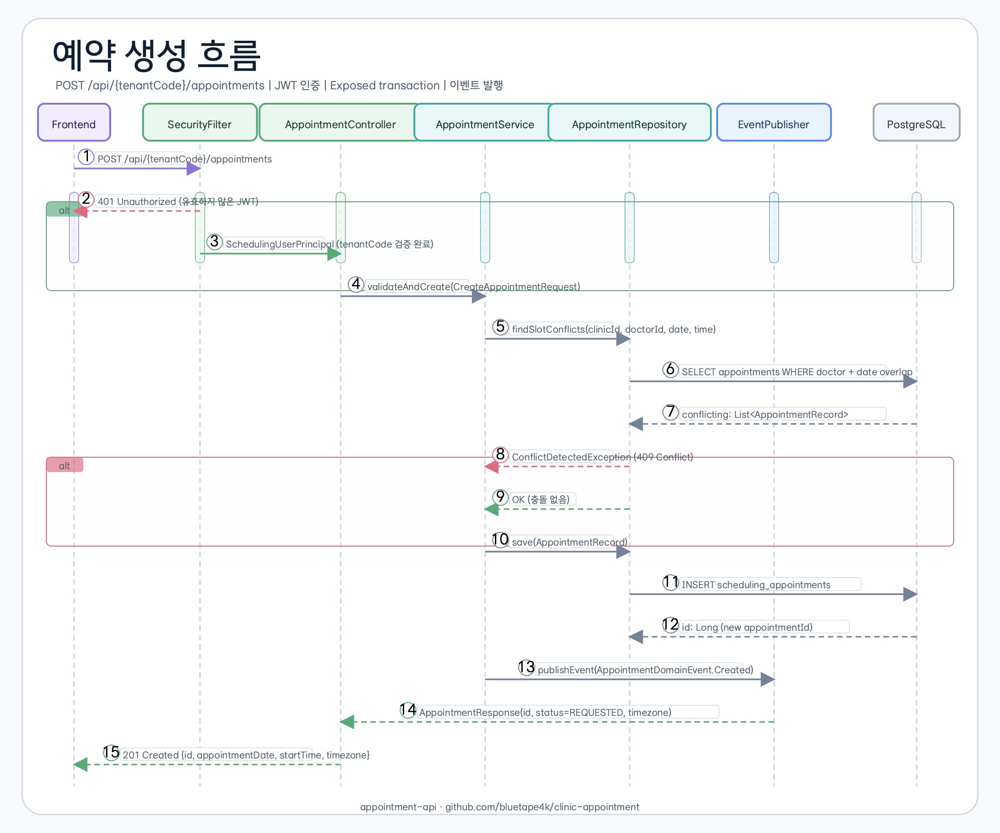
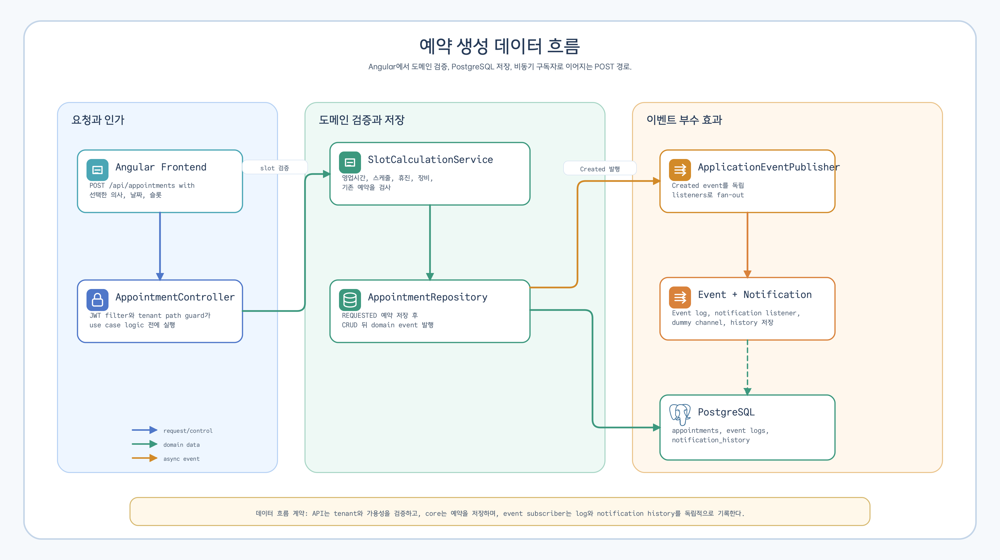

# appointment-api

[English](README.md) | [한국어](README.ko.md)

Spring Boot 4 tenant-scoped REST API 서버 — JWT 인증, Flyway 마이그레이션, Swagger UI, Gatling 부하 테스트.

## 책임

- **하는 것**: HTTP API 제공, 인증/인가, DB 마이그레이션, 도메인 이벤트 발행
- **하지 않는 것**: 알림 직접 발송 없음 (이벤트로 위임), Solver 직접 호출 가능

## API 엔드포인트

| 그룹 | 경로 | 설명 |
|------|------|------|
| 예약 | `GET /api/{tenantCode}/appointments` | 기간별 예약 목록 조회 |
| 예약 | `POST /api/{tenantCode}/appointments` | 예약 생성 |
| 예약 | `PATCH /api/{tenantCode}/appointments/{id}/status` | 상태 변경 (Confirm, CheckIn, Complete 등) |
| 예약 | `DELETE /api/{tenantCode}/appointments/{id}` | 예약 취소 |
| 슬롯 | `GET /api/{tenantCode}/clinics/{clinicId}/slots` | 가용 슬롯 조회 (의사/날짜/진료유형) |
| 재배정 | `POST /api/{tenantCode}/appointments/{id}/reschedule/closure` | 임시휴진 날짜 재배정 실행 |
| 재배정 | `GET /api/{tenantCode}/appointments/{id}/reschedule/candidates` | 재배정 후보 목록 조회 |
| 재배정 스트림 | `GET /api/{tenantCode}/reschedule/batch/stream` | SSE 일괄 재배정 진행 상황 조회 |
| 장비 사용불가 | `GET /api/{tenantCode}/clinics/{clinicId}/equipments/{equipmentId}/unavailabilities` | 목록 조회 |
| 장비 사용불가 | `POST /api/{tenantCode}/clinics/{clinicId}/equipments/{equipmentId}/unavailabilities` | 등록 |
| 장비 사용불가 | `PUT /api/{tenantCode}/clinics/{clinicId}/equipments/{equipmentId}/unavailabilities/{id}` | 수정 |
| 장비 사용불가 | `DELETE /api/{tenantCode}/clinics/{clinicId}/equipments/{equipmentId}/unavailabilities/{id}` | 삭제 |
| 클리닉 | `GET /api/{tenantCode}/clinics`, `/{id}`, `/{id}/operating-hours`, `/{id}/break-times` | 클리닉 조회 |
| 의사 | `GET /api/{tenantCode}/clinics/{id}/doctors`, `/doctors/{id}`, `/{id}/schedules`, `/{id}/absences` | 의사 조회 |
| 진료유형 | `GET /api/{tenantCode}/clinics/{id}/treatment-types`, `/treatment-types/{id}` | 진료유형 조회 |
| 장비 | `GET /api/{tenantCode}/clinics/{id}/equipments`, `/equipments/{id}` | 장비 조회 |
| 대시보드 통계 | `GET /api/{tenantCode}/admin/stats/{appointments,doctors,cancellations}` | 관리자 집계 조회 |
| 플랜용 카탈로그 입력 | `PUT /api/{tenantCode}/clinics/{clinicId}/catalog-sources/{sourceAuthority}/catalog-products/{productId}/versions/{catalogVersion}` | 불변 상품 BOM 버전 동기화 |
| 예약 플랜 | `GET /api/{tenantCode}/clinics/{clinicId}/appointment-plans/{planId}` | 구매 진료 플랜 한 건 조회 |
| 예약 플랜 | `GET /api/{tenantCode}/clinics/{clinicId}/appointment-plans/by-purchase/{authority}/{purchaseId}` | `authority` 경로 변수로 한정된 원천 구매 조회 |
| 예약 정책 | `/api/{tenantCode}/admin/**/scheduling-policies` | 미리보기와 활성화 증거를 사용해 테넌트 기준 정책과 병원별 재정의 관리 |

전체 예약 정책 요청, 생명주기, 유효 정책 조회, 오류 계약은
[Scheduling Policy API](../docs/api/scheduling-policy.md)에 정리되어 있습니다.

### 방문 확정 약속 v2

전체 상태·인증·오류 계약은 [방문 확정 약속 v2 API](../docs/api/visit-commitment.md),
점진 배포·경보·보존·롤백은
[운영 런북](../docs/runbooks/visit-commitment-operations.md)에 정리되어 있습니다.

| 행위자 | 메서드와 경로 | 결과 |
|------|------|------|
| 고객 | `POST /api/v2/appointment-requests` | 정책에 따라 `PROPOSED` 또는 자원을 선점한 `HELD` 가예약 생성 (`202`) |
| 관리자 | `POST /api/v2/admin/appointments` | 정책이 허용한 확정 예약 생성 (`201`) |
| 관리자 | `POST /api/v2/appointments/{id}/approve` | 고객이 동의한 정확한 제안 승인 (`200`) |
| 고객 | `POST /api/v2/appointments/{id}/proposals/{proposalId}/accept` | 현재 변경 제안 수락 (`200`) |
| 고객 | `POST /api/v2/appointments/{id}/proposals/{proposalId}/decline` | 기존 확정을 유지하며 제안 거절 (`200`) |
| 관리자 | `POST /api/v2/appointments/{id}/confirm` | 유효 정책과 동의가 허용한 제안 확정 (`200`) |
| 관리자 | `POST /api/v2/appointments/{id}/change-proposals` | 기존 확정을 취소하지 않고 대체 제안 생성 (`202`) |
| 관리자 | `POST /api/v2/appointments/{id}/proposals/{proposalId}/expire` | 만료 시각에 도달한 제안을 종결하고 최초 선점 해제 (`200`) |
| 관리자 | `POST /api/v2/appointments/{id}/cancel` | 예약을 취소하고 활성 자원 점유 해제 (`200`) |
| 고객 또는 관리자 | `GET /api/v2/appointments/{id}/commitment` | 확정 약속 전용 조회 모델 반환 (`200`) |

이 경로의 요청 본문은 actor, tenant, clinic, patient subject, 정책 mode,
약관 hash, 자원 mapping을 받지 않습니다. 검증된 Gateway principal에서 정확히 한
테넌트와 병원을 도출하며 다중 범위나 서비스 principal은 fail-closed로 거절합니다.
모든 상태 변경 요청은 `Idempotency-Key`가 필요하고, 생성은 `If-None-Match: *`, 기존
aggregate 변경은 최신 `ETag`를 담은 `If-Match`가 추가로 필요합니다.

제안과 확정 약속 응답은 판단에 고정된 불변 정책 스냅숏 ID, hash, 세대,
원본 version을 제공합니다. 이후 정책이 바뀌어도 기존 제안을 새 정책으로 재해석하지
않습니다.

Gateway는 하나의 행위자 불변식을 충족하는 길이 제한 claim을 발행해야 합니다.
예를 들어 병원 `101`의 관리자 token은 다음 claim을 포함합니다.

```json
{
  "sub": "admin-operator-01",
  "jti": "token_01J1M6Y6XRK8N0W2M3P4Q5R6S7",
  "auth_time": 1785373200,
  "allowedTenants": ["tenant-default"],
  "allowedClinicIds": [101],
  "clinicId": 101,
  "actorType": "ADMIN",
  "roles": ["ADMIN"],
  "assurance": "MFA"
}
```

고객 token은 `actorType: "PATIENT"`와 `PATIENT` role, 안정적인
`patientSubject`를 함께 가지며 관리자 role을 포함할 수 없습니다. `clinicId`가
있다면 반드시 `allowedClinicIds`에 포함되어야 합니다. v2 application은 이 claim을
신뢰해 본문의 범위를 받지 않되, 실제 Plan·예약 범위는 저장소에서 다시 확인합니다.

| 요청 종류 | 필수 헤더 | 예 |
|------|------|------|
| 신규 가예약·관리자 직접 생성 | `Idempotency-Key`, `If-None-Match` | `request_01J1M6Y6XRK8N0W2M3P4Q5R6S7`, `*` |
| 기존 확정 약속 상태 변경 | `Idempotency-Key`, `If-Match` | `approve_01J1M6Y6XRK8N0W2M3P4Q5R6S7`, `"3"` |

동의가 필요한 요청은 `evidenceAuthority`와 `evidenceId`만 전달합니다.
`evidenceAuthority`는 현재 테넌트 네임스페이스로 시작해야 하며
(예: `tenant-default:consent-service`), `evidenceId`는 원문 동의나 개인정보가 아닌
20~128자의 추측 불가능한 불투명 참조여야 합니다. 같은 ID를 다른 결정에 재사용하면
안정적인 `409`로 거절됩니다.

#### 활성화와 롤백

| 설정 | 기본값 | 운영 의미 |
|------|------|------|
| `appointment.commitment.api-enabled` | `false` | 운영 어댑터와 준비 증거가 통과한 뒤에만 여는 전체 v2 경로 부트스트랩 게이트 |
| `appointment.commitment.ingress-enabled` | `true` | 신규 고객 가예약과 관리자 직접 생성만 허용 |
| `appointment.commitment.mode` | `OFF` | 신규 계산·쓰기를 차단하는 `OFF`, 비교만 하는 `SHADOW`, 허용목록 기반 `WRITE` |
| `appointment.commitment.clinic-allowlist` | 비어 있음 | `WRITE`를 허용할 병원 ID |
| `appointment.commitment.proposal-ttl` | `30m` | 제안 승인 대기 만료 |
| `appointment.commitment.retry.max-attempts` | `3` | 최초 시도를 포함한 제한 재시도 |
| `appointment.commitment.ceiling.resources-per-slot` | `200` | 한 후보 slot의 의료진·장비·공간 자원 항목 상한 |
| `appointment.commitment.ceiling.candidate-resource-entries` | `10,000` | 한 제안 계산 요청 전체의 자원 항목 합계 상한 |
| `appointment.commitment.idempotency-hash-secret` | 없음 | v2 API 활성화 시 필요한 Base64 비밀값. 디코딩 후 32바이트 이상이어야 하며 JWT·정책 command 비밀값을 재사용하면 안 됨 |
| `appointment.commitment.retention-enabled` | `false` | 프로세스 내부 보존 작업 소유자 활성화. 배포당 한 소유자에서만 사용 |
| `appointment.commitment.retention-interval` | `PT1H` | 범위 제한 보존 작업 실행 사이의 고정 지연 |

`api-enabled=false`는 아직 v2 확정 약속이 한 건도 없는 부트스트랩 단계에서만
사용합니다. 이미 생성된 확정 약속이 있다면 롤백은
`ingress-enabled=false`로 신규 유입만 막아야 합니다. 조회, 승인, 확정, 제안
수락·거절, 변경 제안은 계속 열려 있어 기존 고객을 고립시키지 않습니다.
`WRITE`는 mode와 병원 허용목록이 모두 일치할 때만 신규 row를 허용합니다.
`api-enabled=true`인데 예약 전용 idempotency HMAC 비밀값이 없으면 API는 시작을
거부합니다.

운영 활성화 전에는 신뢰된 환자 identity, 후보 inventory slot, 저장된 제안의
자원 mapping, 확정 조회 모델 대상을 제공하는 `AppointmentCommitmentPlanningResolver`
어댑터도 연결해야 합니다. 기본 resolver는 모든 계획 요청을 거절하므로 어댑터 없이
경로를 열어도 고객이나 자원 정보를 임의로 만들지 않습니다.
Gateway patient subject는 구매 Plan ingress와 같은 HMAC key·algorithm·domain으로
fingerprint하는 `PatientSubjectFingerprintResolver`를 별도 제공해야 합니다. 기본
resolver는 일반 SHA-256으로 추정하지 않고 patient 접근을 fail-closed로 거절합니다.

#### 안정 오류 계약

| 상황 | HTTP / `errorCode` | 호출자 조치 |
|------|------|------|
| body·경로 값 오류 | `400 PAYLOAD_INVALID` | 공개 schema에 맞게 수정 |
| actor·tenant·clinic 범위 불일치 | `403 SCOPE_MISMATCH` 또는 `SCOPE_FORBIDDEN` | 정확한 clinic-scoped Gateway token 사용 |
| 잔여 plan 상한 초과 | `422 PLAN_LIMIT_EXCEEDED` | 잔여 회차를 확인한 뒤 다시 요청 |
| 현재 동의 증빙 누락·불일치 | `422 CONSENT_REQUIRED` | 동의 상태의 책임 시스템이 발행한 증빙 사용 |
| 만료된 제안 | `410 PROPOSAL_EXPIRED` | 새 제안 요청 |
| 멱등키·동의 증빙 재사용 | `409 IDEMPOTENCY_KEY_REUSED` 또는 `CONSENT_EVIDENCE_REUSED` | 원 요청을 재시도하거나 새 reference 발급 |
| 자원·현재 제안 충돌 | `409 RESOURCE_CONFLICT` 또는 `PROPOSAL_NOT_CURRENT` | 확정 약속을 다시 읽고 새 제안 요청 |
| 오래된 `If-Match` | `412 VERSION_CONFLICT` | 최신 `ETag`로 다시 시도 |
| 필수 조건 헤더 누락 | `428 PRECONDITION_REQUIRED` | 생성은 `*`, 변경은 최신 `ETag` 전달 |
| 신규 유입 중단 | `503 INGRESS_DISABLED` | 기존 예약은 유지하고 신규 요청만 보류 |
| legacy 경로로 v2 변경 시도 | `409 NEW_APPOINTMENT_API_REQUIRED` | 확정 약속 v2 엔드포인트 사용 |
| 예상하지 못한 내부 장애 | `500 INTERNAL_ERROR` | `Retry-After: 5` 뒤 같은 멱등키로 재시도 |

`PREDECESSOR_NOT_COMPLETED`는 외부 이행 기준 시스템의 이벤트가 선행 진료의 완료를 아직
증명하지 못했을 때 반환합니다. 예약 API는 예약 상태만으로 임상 완료를 추론하지 않습니다.

### 플랜 기반 기능 플래그

| 설정 | 기본값 | 의미 |
|------|------|------|
| `appointment.plan-foundation.catalog-sync-enabled` | `false` | 카탈로그 동기화 경로 활성화 |
| `appointment.plan-foundation.plan-read-enabled` | `false` | 병원 운영자용 플랜 조회 활성화 |
| `appointment.plan-foundation.purchase-consumer-mode` | `OFF` | `OFF`, `SHADOW`, 제한된 `WRITE`; 운영 `WRITE`에는 outbox 전송 기능 필요 |

`appointment.plan-foundation.scope-overrides[*]`는 정확한
`(tenant-group-id, clinic-id)` 한 쌍에 대해 위 세 값을 덮어쓸 수 있습니다.
nullable 필드는 전역 값을 상속하고, 지정한 필드만 해당 scope에서 우선합니다.
따라서 다른 병원에 영향을 주지 않고 병원별 canary와 rollback을 수행할 수 있습니다.

```yaml
appointment:
  plan-foundation:
    scope-overrides:
      - tenant-group-id: 7
        clinic-id: 11
        catalog-sync-enabled: false
        plan-read-enabled: false
        purchase-consumer-mode: OFF
```

이 YAML 형태는 로컬 Foundation 증명용입니다. 운영 control은 actor, reason,
이전/새 값, expiry, correlation ID의 append-only audit와 effective-value
readback을 제공해야 하며, 그 provider가 없으면 운영 `WRITE`는 계속 차단됩니다.

플랜 조회는 `ADMIN`, `STAFF`, `DOCTOR` 역할, 일치하는 tenant claim, 정확히 일치하는
clinic claim이 모두 필요합니다. `PATIENT` 조회는 보류했습니다. 비활성 경로도 OpenAPI에는
남아 있으며 정제된 `404 FEATURE_DISABLED`를 반환합니다.
카탈로그 writer는 [canonical typed hash 계약](../docs/api/catalog-payload-hash.md)에
따라 `payloadHash`를 계산해야 합니다.

로컬 seed tenant는 `tenant-default` 입니다. JWT의 `allowedTenants` claim에는 요청 URL의 `tenantCode`가 포함되어야 합니다.

**Swagger UI**: 서버 기동 후 `http://localhost:8080/swagger-ui.html`

## 예약 생성 요청 흐름





→ 전체 데이터 흐름: [data-flow.md](../docs/requirements/data-flow.md)

## 사용자 시나리오 범위


## 인증

JWT Bearer Token:
- 헤더: `Authorization: Bearer <token>`
- Tenant path: `/api/{tenantCode}/...`
- Tenant claim: `allowedTenants`에 URL `tenantCode` 포함 필요
- 설정: `JwtSecurityProperties` (`scheduling.security.jwt.*`)
- 필터: `JwtAuthenticationFilter` → `SchedulingUserPrincipal`

## DB 마이그레이션

Flyway — `src/main/resources/db/migration/V*.sql`

> **주의**: `scheduling_*` 테이블명은 Flyway 스크립트에 고정되어 있으므로 변경 금지.

## 핵심 클래스

| 클래스 | 역할 |
|--------|------|
| `AppointmentController` | 예약 CRUD + 상태 변경 |
| `CustomerAppointmentV2Controller` | 고객 가예약 요청과 제안 수락·거절 |
| `AdminAppointmentV2Controller` | 관리자 생성·승인·확정·변경 제안 |
| `AppointmentCommitmentQueryController` | 행위자 범위 확정 약속 전용 조회 |
| `SlotController` | 가용 슬롯 조회 |
| `RescheduleController` | 임시휴진 재배정 |
| `EquipmentUnavailabilityController` | 장비 사용불가 구간 CRUD + 충돌 감지 |
| `ClinicController` | 클리닉 조회 (영업시간, 휴식시간 포함) |
| `DoctorController` | 의사 조회 (스케줄, 부재 포함) |
| `TreatmentTypeController` | 진료유형 조회 |
| `EquipmentController` | 장비 조회 |
| `SecurityConfig` | JWT 기반 Spring Security 설정 |
| `GlobalExceptionHandler` | 전역 예외 처리 → `ApiResponse` 반환 |
| `CatalogProductSyncController` | 제한 검증을 거치는 불변 카탈로그 버전 동기화 |
| `AppointmentPlanController` | tenant/clinic 범위, 환자 참조 미포함 플랜 조회 |
| `TestDataSeeder` | 개발/테스트 초기 데이터 자동 삽입 |

## 의존성

- **내부**: `appointment-core`, `appointment-event`, `appointment-solver`
- **외부**: Spring Boot 4 Web/Security, `jjwt`, Flyway, springdoc-openapi, `exposed-jdbc`

## 실행

```bash
# 기동 (PostgreSQL + Redis 필요)
./gradlew :appointment-api:bootRun

# 빌드
./gradlew :appointment-api:build

# Gatling 부하 테스트
./gradlew :appointment-api:gatlingRun
```

## 타임존

API 응답(`AppointmentResponse`)에는 항상 `timezone` 과 `locale` 필드가 포함됩니다.

```json
{
  "appointmentDate": "2026-04-01",
  "startTime": "09:00:00",
  "endTime": "09:30:00",
  "timezone": "Asia/Seoul",
  "locale": "ko-KR"
}
```

- `appointmentDate` / `startTime` / `endTime` 은 **클리닉 현지 시간** 기준입니다.
- 프론트엔드는 `timezone` 필드를 이용해 `ZonedDateTime` 으로 복원할 수 있습니다.
- UTC 변환은 서버에서 수행하지 않습니다 — 날짜 경계 문제 방지.
- `locale` 은 날짜/시간 표시 형식 전용으로, timezone과 독립적입니다.

상세 설계: [appointment-core 타임존 설계](../appointment-core/README.ko.md#타임존-설계)

## 테스트 실행

```bash
# H2 in-memory (기본)
./gradlew :appointment-api:test

# PostgreSQL Testcontainer
./gradlew :appointment-api:test -Dspring.profiles.active=test,test-postgresql

# MySQL8 Testcontainer
./gradlew :appointment-api:test -Dspring.profiles.active=test,test-mysql
```

### 테스트 구조

| 클래스 | 역할 |
|--------|------|
| `AbstractApiIntegrationTest` | `@SpringBootTest(RANDOM_PORT)` + `@DynamicPropertySource` 기반 추상 클래스 |
| `Containers` | PostgreSQL / MySQL8 Testcontainer singleton |

- Spring Profile에 따라 DataSource를 동적으로 주입 (`@DynamicPropertySource`)
- Controller 테스트는 `RestClient` 방식 사용. MockMvc 미사용
- CI에서 H2 / PostgreSQL / MySQL8 세 환경을 병렬로 검증
