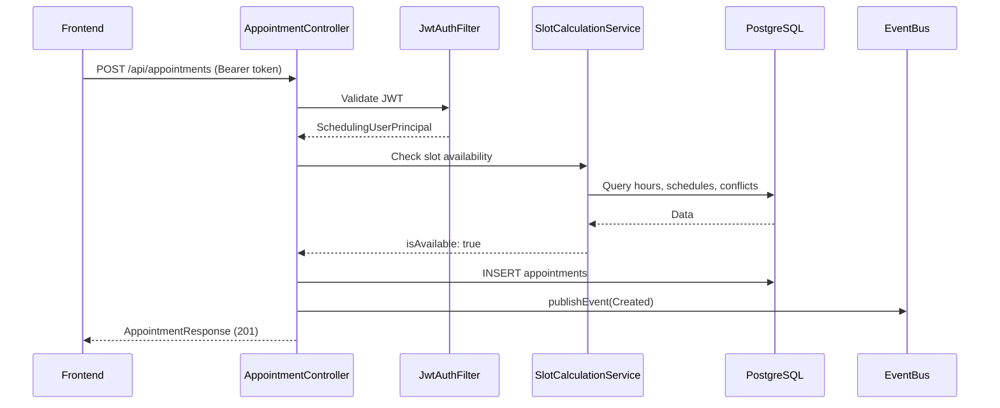

# appointment-api

[English](README.md) | [한국어](README.ko.md)

Spring Boot 4 REST API server with JWT authentication, Flyway migrations, Swagger UI, and Gatling load tests.

## Responsibilities

- **Does**: exposes HTTP APIs, handles authentication/authorization, runs DB migrations, and publishes domain events.
- **Does not**: send notifications directly. Notifications are delegated through events. It may call Solver for scheduling workflows.

## API Endpoints

| Group | Path | Description |
|------|------|------|
| Appointments | `GET /api/appointments` | List appointments by period. |
| Appointments | `POST /api/appointments` | Create an appointment. |
| Appointments | `PATCH /api/appointments/{id}/status` | Change status, such as Confirm, CheckIn, Complete. |
| Appointments | `DELETE /api/appointments/{id}` | Cancel an appointment. |
| Slots | `GET /api/slots` | Query available slots by doctor, date, and treatment type. |
| Reschedule | `POST /api/reschedule/closure` | Reschedule appointments affected by a temporary clinic closure. |
| Reschedule | `GET /api/reschedule/candidates` | List reschedule candidates. |
| Equipment unavailability | `GET /api/equipment-unavailability` | List equipment unavailability windows. |
| Equipment unavailability | `POST /api/equipment-unavailability` | Register an unavailability window. |
| Equipment unavailability | `PUT /api/equipment-unavailability/{id}` | Update an unavailability window. |
| Equipment unavailability | `DELETE /api/equipment-unavailability/{id}` | Delete an unavailability window. |
| Clinics | `GET /api/clinics`, `/{id}`, `/{id}/operating-hours`, `/{id}/break-times` | Query clinic information. |
| Doctors | `GET /api/clinics/{id}/doctors`, `/doctors/{id}`, `/{id}/schedules`, `/{id}/absences` | Query doctor information. |
| Treatment types | `GET /api/clinics/{id}/treatment-types`, `/treatment-types/{id}` | Query treatment types. |
| Equipment | `GET /api/clinics/{id}/equipments`, `/equipments/{id}` | Query equipment. |

**Swagger UI**: `http://localhost:8080/swagger-ui.html` after the server starts.

## Appointment Creation Flow



Full data flow: [data-flow.md](../docs/requirements/data-flow.md)

## Authentication

JWT Bearer Token:

- Header: `Authorization: Bearer <token>`
- Properties: `JwtSecurityProperties` (`scheduling.security.jwt.*`)
- Filter: `JwtAuthenticationFilter` -> `SchedulingUserPrincipal`

## DB Migration

Flyway migration scripts live under `src/main/resources/db/migration/V*.sql`.

> **Important**: `scheduling_*` table names are fixed in Flyway scripts. Do not rename them.

## Core Classes

| Class | Role |
|--------|------|
| `AppointmentController` | Appointment CRUD and status changes. |
| `SlotController` | Available slot lookup. |
| `RescheduleController` | Temporary clinic closure rescheduling. |
| `EquipmentUnavailabilityController` | Equipment unavailability CRUD and conflict detection. |
| `ClinicController` | Clinic lookup, including operating hours and break times. |
| `DoctorController` | Doctor lookup, including schedules and absences. |
| `TreatmentTypeController` | Treatment type lookup. |
| `EquipmentController` | Equipment lookup. |
| `SecurityConfig` | JWT-based Spring Security configuration. |
| `GlobalExceptionHandler` | Global exception handling that returns `ApiResponse`. |
| `TestDataSeeder` | Automatic development/test seed data insertion. |

## Dependencies

- **Internal**: `appointment-core`, `appointment-event`, `appointment-solver`
- **External**: Spring Boot 4 Web/Security, `jjwt`, Flyway, springdoc-openapi, `bluetape4k-exposed-jdbc`

## Run

```bash
# Start the server (requires PostgreSQL + Redis)
./gradlew :appointment-api:bootRun

# Build
./gradlew :appointment-api:build

# Gatling load tests
./gradlew :appointment-api:gatlingRun
```

## Timezone Model

API responses such as `AppointmentResponse` always include `timezone` and `locale`.

```json
{
  "appointmentDate": "2026-04-01",
  "startTime": "09:00:00",
  "endTime": "09:30:00",
  "timezone": "Asia/Seoul",
  "locale": "ko-KR"
}
```

- `appointmentDate`, `startTime`, and `endTime` are based on the clinic's local time.
- The frontend can reconstruct `ZonedDateTime` using the `timezone` field.
- The server does not convert appointment dates/times to UTC, which avoids date-boundary bugs.
- `locale` is for date/time display formatting and is independent from timezone.

Detailed design: [appointment-core timezone design](../appointment-core/README.md#timezone-design)

## Tests

```bash
# H2 in-memory, default
./gradlew :appointment-api:test

# PostgreSQL Testcontainer
./gradlew :appointment-api:test -Dspring.profiles.active=test,test-postgresql

# MySQL8 Testcontainer
./gradlew :appointment-api:test -Dspring.profiles.active=test,test-mysql
```

### Test Structure

| Class | Role |
|--------|------|
| `AbstractApiIntegrationTest` | Abstract class based on `@SpringBootTest(RANDOM_PORT)` and `@DynamicPropertySource`. |
| `Containers` | PostgreSQL / MySQL8 Testcontainer singleton. |

- DataSource is injected dynamically by Spring profile with `@DynamicPropertySource`.
- Controller tests use `RestClient`, not MockMvc.
- CI verifies H2, PostgreSQL, and MySQL8 in parallel.
