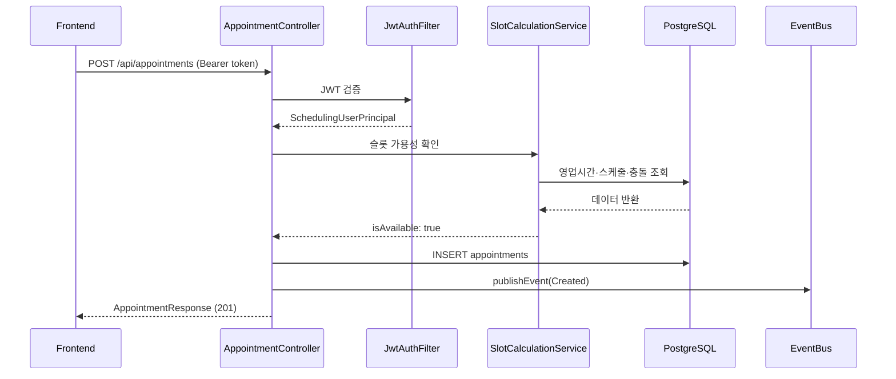

# appointment-api

Spring Boot 4 REST API 서버 — JWT 인증, Flyway 마이그레이션, Swagger UI, Gatling 부하 테스트.

## 책임

- **하는 것**: HTTP API 제공, 인증/인가, DB 마이그레이션, 도메인 이벤트 발행
- **하지 않는 것**: 알림 직접 발송 없음 (이벤트로 위임), Solver 직접 호출 가능

## API 엔드포인트

| 그룹 | 경로 | 설명 |
|------|------|------|
| 예약 | `GET /api/appointments` | 기간별 예약 목록 조회 |
| 예약 | `POST /api/appointments` | 예약 생성 |
| 예약 | `PATCH /api/appointments/{id}/status` | 상태 변경 (Confirm, CheckIn, Complete 등) |
| 예약 | `DELETE /api/appointments/{id}` | 예약 취소 |
| 슬롯 | `GET /api/slots` | 가용 슬롯 조회 (의사/날짜/진료유형) |
| 재배정 | `POST /api/reschedule/closure` | 임시휴진 날짜 재배정 실행 |
| 재배정 | `GET /api/reschedule/candidates` | 재배정 후보 목록 조회 |
| 장비 사용불가 | `GET /api/equipment-unavailability` | 목록 조회 |
| 장비 사용불가 | `POST /api/equipment-unavailability` | 등록 |
| 장비 사용불가 | `PUT /api/equipment-unavailability/{id}` | 수정 |
| 장비 사용불가 | `DELETE /api/equipment-unavailability/{id}` | 삭제 |
| 클리닉 | `GET /api/clinics`, `/{id}`, `/{id}/operating-hours`, `/{id}/break-times` | 클리닉 조회 |
| 의사 | `GET /api/clinics/{id}/doctors`, `/doctors/{id}`, `/{id}/schedules`, `/{id}/absences` | 의사 조회 |
| 진료유형 | `GET /api/clinics/{id}/treatment-types`, `/treatment-types/{id}` | 진료유형 조회 |
| 장비 | `GET /api/clinics/{id}/equipments`, `/equipments/{id}` | 장비 조회 |

**Swagger UI**: 서버 기동 후 `http://localhost:8080/swagger-ui.html`

## 예약 생성 요청 흐름



→ 전체 데이터 흐름: [data-flow.md](../docs/requirements/data-flow.md)

## 인증

JWT Bearer Token:
- 헤더: `Authorization: Bearer <token>`
- 설정: `JwtSecurityProperties` (`scheduling.security.jwt.*`)
- 필터: `JwtAuthenticationFilter` → `SchedulingUserPrincipal`

## DB 마이그레이션

Flyway — `src/main/resources/db/migration/V*.sql`

> **주의**: `scheduling_*` 테이블명은 Flyway 스크립트에 고정되어 있으므로 변경 금지.

## 핵심 클래스

| 클래스 | 역할 |
|--------|------|
| `AppointmentController` | 예약 CRUD + 상태 변경 |
| `SlotController` | 가용 슬롯 조회 |
| `RescheduleController` | 임시휴진 재배정 |
| `EquipmentUnavailabilityController` | 장비 사용불가 구간 CRUD + 충돌 감지 |
| `ClinicController` | 클리닉 조회 (영업시간, 휴식시간 포함) |
| `DoctorController` | 의사 조회 (스케줄, 부재 포함) |
| `TreatmentTypeController` | 진료유형 조회 |
| `EquipmentController` | 장비 조회 |
| `SecurityConfig` | JWT 기반 Spring Security 설정 |
| `GlobalExceptionHandler` | 전역 예외 처리 → `ApiResponse` 반환 |
| `TestDataSeeder` | 개발/테스트 초기 데이터 자동 삽입 |

## 의존성

- **내부**: `appointment-core`, `appointment-event`, `appointment-solver`
- **외부**: Spring Boot 4 Web/Security, `jjwt`, Flyway, springdoc-openapi, `bluetape4k-exposed-jdbc`

## 실행

```bash
# 기동 (PostgreSQL + Redis 필요)
./gradlew :appointment-api:bootRun

# 빌드
./gradlew :appointment-api:build

# Gatling 부하 테스트
./gradlew :appointment-api:gatlingRun
```

## 타임존

API 응답(`AppointmentResponse`)에는 항상 `timezone` 과 `locale` 필드가 포함됩니다.

```json
{
  "appointmentDate": "2026-04-01",
  "startTime": "09:00:00",
  "endTime": "09:30:00",
  "timezone": "Asia/Seoul",
  "locale": "ko-KR"
}
```

- `appointmentDate` / `startTime` / `endTime` 은 **클리닉 현지 시간** 기준입니다.
- 프론트엔드는 `timezone` 필드를 이용해 `ZonedDateTime` 으로 복원할 수 있습니다.
- UTC 변환은 서버에서 수행하지 않습니다 — 날짜 경계 문제 방지.
- `locale` 은 날짜/시간 표시 형식 전용으로, timezone과 독립적입니다.

상세 설계: [appointment-core 타임존 설계](../appointment-core/README.md#타임존-설계)

## 테스트 실행

```bash
./gradlew :appointment-api:test
```

> Controller 테스트는 `@SpringBootTest(RANDOM_PORT)` + `RestClient` 방식으로 작성. MockMvc 미사용.
