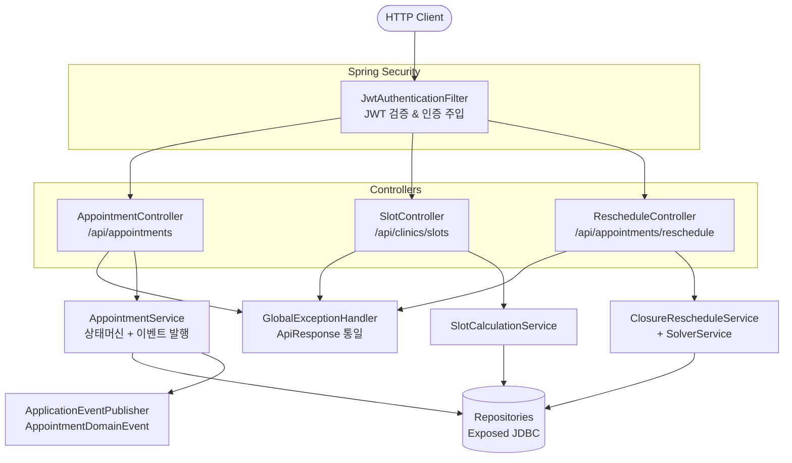
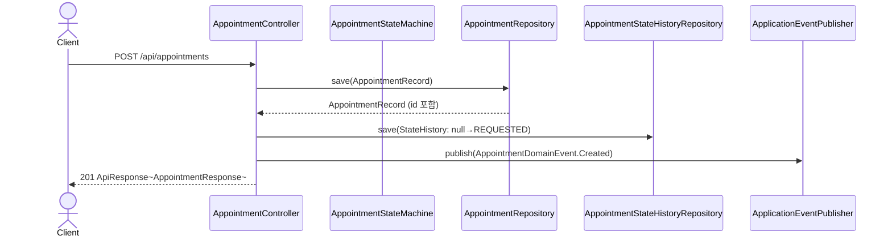
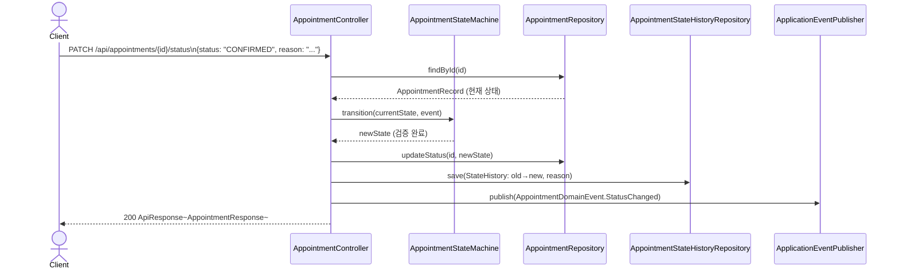
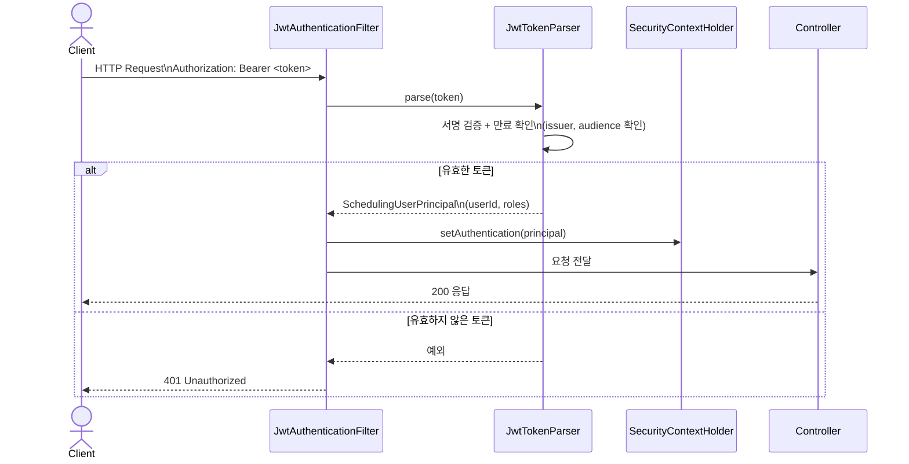

# appointment-api

Spring MVC 기반 REST API 모듈입니다. 예약 CRUD, 슬롯 조회, 휴진 재배정 API를 제공합니다.

---

## API 엔드포인트

### 예약 관리

| Method | Path | 설명 |
|--------|------|------|
| `GET` | `/api/appointments?clinicId=&startDate=&endDate=` | 기간별 예약 조회 |
| `GET` | `/api/appointments/{id}` | 예약 단건 조회 |
| `POST` | `/api/appointments` | 예약 생성 |
| `PATCH` | `/api/appointments/{id}/status` | 상태 변경 |
| `DELETE` | `/api/appointments/{id}` | 예약 취소 |

### 슬롯 조회

| Method | Path | 설명 |
|--------|------|------|
| `GET` | `/api/clinics/{clinicId}/slots?doctorId=&treatmentTypeId=&date=` | 가용 슬롯 조회 |

### 재배정

| Method | Path | 설명 |
|--------|------|------|
| `POST` | `/api/appointments/{id}/reschedule/closure?clinicId=&closureDate=&searchDays=` | 휴진 일괄 재배정 |
| `GET` | `/api/appointments/{id}/reschedule/candidates` | 재배정 후보 조회 |
| `POST` | `/api/appointments/{id}/reschedule/confirm/{candidateId}` | 수동 재배정 확정 |
| `POST` | `/api/appointments/{id}/reschedule/auto` | 자동 재배정 |

---

## 구성

### 레이어 구조



### 예약 생성 시퀀스



### 상태 변경 시퀀스



### JWT 인증 흐름



### 주요 컴포넌트

- `AppointmentController` — 예약 CRUD + 기간별 조회
- `SlotController` — 가용 슬롯 조회
- `RescheduleController` — 휴진 재배정 관리
- `GlobalExceptionHandler` — 통일된 에러 응답 (`ApiResponse`)
- `TestDataSeederConfig` — 개발 프로필용 시드 데이터 등록
- `JwtTokenParser` — JWT 토큰 파싱 및 검증
- `JwtAuthenticationFilter` — Spring Security JWT 인증 필터
- `SecurityConfig` / `NoOpSecurityConfig` — JWT on/off 보안 설정
- `OpenApiConfig` — Swagger UI + Bearer 인증 스키마

### 상태 전이 / 이벤트

- `PATCH /api/appointments/{id}/status` 와 `DELETE /api/appointments/{id}` 는 `AppointmentStateMachine`을 통해 유효한 상태 전이만 허용합니다.
- 상태 변경이 성공하면 `appointment-event` 모듈의 `AppointmentDomainEvent`를 발행합니다.
- 현재 API 계층에서 발행하는 이벤트는 `Created`, `StatusChanged`, `Cancelled` 입니다.

### 응답 포맷

```json
{
  "success": true,
  "data": { ... }
}
```

---

## 보안 (JWT)

외부 인증 서비스에서 발급한 JWT를 Header로 받아 검증합니다.

```yaml
scheduling:
  security:
    jwt:
      enabled: true              # false면 모든 요청 허용 (dev/test)
      secret: base64-encoded-key # 최소 256bit
      issuer: appointment-auth-service
```

### 역할 기반 접근 제어

| Role | GET (읽기) | POST/PATCH/DELETE (쓰기) |
|------|-----------|-------------------------|
| ADMIN | O | O |
| STAFF | O | O |
| DOCTOR | O | X |
| PATIENT | O | X |

### 테스트 환경

기본값(`scheduling.security.jwt.enabled` 미설정)이면 JWT 검증 Skip — 기존 테스트/Gatling 영향 없음.

---

## OpenAPI / Swagger

- Swagger UI: `http://localhost:8080/swagger-ui/index.html`
- API Docs: `http://localhost:8080/v3/api-docs`
- Bearer JWT 인증 스키마 자동 적용

---

## Gatling 스트레스 테스트

3개의 시뮬레이션을 제공합니다.

### 1. AppointmentApiSimulation

예약 API 전반 스트레스 테스트.

| 시나리오 | 사용자 | 내용 |
|----------|--------|------|
| CRUD Flow | 200 / 60s | POST → GET → PATCH → DELETE |
| Slot Query | 100 / 60s | 가용 슬롯 조회 |
| Create Only | 100 / 30s | 예약 생성 쓰기 부하 |

### 2. ClosureRescheduleSimulation

휴진 일괄 재배정 스트레스 테스트.

| 시나리오 | 사용자 | 내용 |
|----------|--------|------|
| Closure Reschedule | 50 / 60s | 예약 5건 생성 → 휴진 재배정 호출 |

검증: **TP95 < 1초**, 실패율 < 5%

### 3. DateRangeQuerySimulation

기간별 예약 조회 스트레스 테스트.

| 시나리오 | 사용자 | 내용 |
|----------|--------|------|
| Weekly Query | 200 / 60s | 일주일 예약 조회 |
| Monthly Query | 100 / 60s | 한달 예약 조회 |

검증: **TP95 < 500ms**, 실패율 < 5%

### 실행 방법

```bash
# 앱 시작
./gradlew :appointment-api:bootRun

# 전체 Gatling 실행
./gradlew :appointment-api:gatlingRun

# 특정 시뮬레이션 실행
./gradlew :appointment-api:gatlingRun --simulation io.bluetape4k.clinic.appointment.api.ClosureRescheduleSimulation
./gradlew :appointment-api:gatlingRun --simulation io.bluetape4k.clinic.appointment.api.DateRangeQuerySimulation
```

---

## 테스트

```bash
# API 모듈 검증
./gradlew :appointment-api:test
```

2026-03-28 기준 모듈 테스트 11건 통과.

---

## 의존성

```kotlin
api(project(":appointment-core"))
api(project(":appointment-event"))
api(project(":appointment-solver"))

implementation(Libs.springBootStarter("web"))
implementation(Libs.springBootStarter("validation"))

// Gatling
gatling(Libs.gatling_charts_highcharts)
gatling(Libs.gatling_http_java)
```
