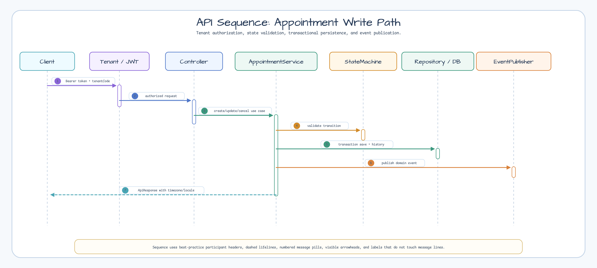
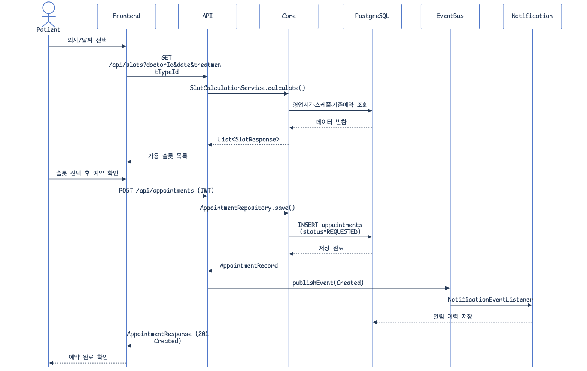
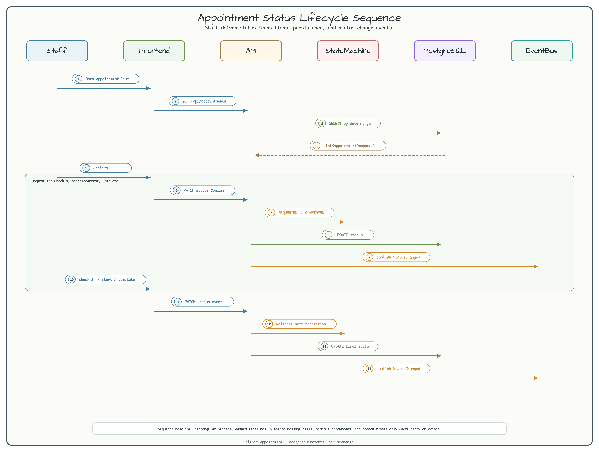

# appointment-api

[English](README.md) | [한국어](README.ko.md)

Spring Boot 4 tenant-scoped REST API server with JWT authentication, Flyway migrations, Swagger UI, and Gatling load tests.

## Responsibilities

- **Does**: exposes HTTP APIs, handles authentication/authorization, runs DB migrations, and publishes domain events.
- **Does not**: send notifications directly. Notifications are delegated through events. It may call Solver for scheduling workflows.

## API Endpoints

| Group | Path | Description |
|------|------|------|
| Appointments | `GET /api/{tenantCode}/appointments` | List appointments by period. |
| Appointments | `POST /api/{tenantCode}/appointments` | Create an appointment. |
| Appointments | `PATCH /api/{tenantCode}/appointments/{id}/status` | Change status, such as Confirm, CheckIn, Complete. |
| Appointments | `DELETE /api/{tenantCode}/appointments/{id}` | Cancel an appointment. |
| Slots | `GET /api/{tenantCode}/clinics/{clinicId}/slots` | Query available slots by doctor, date, and treatment type. |
| Reschedule | `POST /api/{tenantCode}/appointments/{id}/reschedule/closure` | Reschedule appointments affected by a temporary clinic closure. |
| Reschedule | `GET /api/{tenantCode}/appointments/{id}/reschedule/candidates` | List reschedule candidates. |
| Reschedule stream | `GET /api/{tenantCode}/reschedule/batch/stream` | Stream batch reschedule progress with SSE. |
| Equipment unavailability | `GET /api/{tenantCode}/clinics/{clinicId}/equipments/{equipmentId}/unavailabilities` | List equipment unavailability windows. |
| Equipment unavailability | `POST /api/{tenantCode}/clinics/{clinicId}/equipments/{equipmentId}/unavailabilities` | Register an unavailability window. |
| Equipment unavailability | `PUT /api/{tenantCode}/clinics/{clinicId}/equipments/{equipmentId}/unavailabilities/{id}` | Update an unavailability window. |
| Equipment unavailability | `DELETE /api/{tenantCode}/clinics/{clinicId}/equipments/{equipmentId}/unavailabilities/{id}` | Delete an unavailability window. |
| Clinics | `GET /api/{tenantCode}/clinics`, `/{id}`, `/{id}/operating-hours`, `/{id}/break-times` | Query clinic information. |
| Doctors | `GET /api/{tenantCode}/clinics/{id}/doctors`, `/doctors/{id}`, `/{id}/schedules`, `/{id}/absences` | Query doctor information. |
| Treatment types | `GET /api/{tenantCode}/clinics/{id}/treatment-types`, `/treatment-types/{id}` | Query treatment types. |
| Equipment | `GET /api/{tenantCode}/clinics/{id}/equipments`, `/equipments/{id}` | Query equipment. |
| Dashboard stats | `GET /api/{tenantCode}/admin/stats/{appointments,doctors,cancellations}` | Query admin dashboard aggregates. |
| Catalog plan input | `PUT /api/{tenantCode}/clinics/{clinicId}/catalog-sources/{sourceAuthority}/catalog-products/{productId}/versions/{catalogVersion}` | Synchronize one immutable catalog BOM version. |
| Appointment plans | `GET /api/{tenantCode}/clinics/{clinicId}/appointment-plans/{planId}` | Read one purchased treatment plan. |
| Appointment plans | `GET /api/{tenantCode}/clinics/{clinicId}/appointment-plans/by-purchase/{authority}/{purchaseId}` | Read by authority-qualified source purchase. |
| Scheduling policies | `/api/{tenantCode}/admin/**/scheduling-policies` | Manage tenant baselines and clinic overrides with preview and activation evidence. |

The complete scheduling-policy request, lifecycle, effective-read, and error
contract is documented in [Scheduling Policy API](../docs/api/scheduling-policy.md).

### Appointment Commitment v2

See [Appointment Commitment v2 API](../docs/api/visit-commitment.md) for the
complete state, authentication, and error contract, and the
[operations runbook](../docs/runbooks/visit-commitment-operations.md) for
rollout, alerts, retention, and rollback.

| Actor | Method and path | Result |
|------|------|------|
| Patient | `POST /api/v2/appointment-requests` | Creates a `PROPOSED` provisional appointment (`202`). |
| Administrator | `POST /api/v2/admin/appointments` | Creates a policy-authorized confirmed appointment (`201`). |
| Administrator | `POST /api/v2/appointments/{id}/approve` | Approves the exact customer proposal (`200`). |
| Patient | `POST /api/v2/appointments/{id}/proposals/{proposalId}/accept` | Accepts a current change proposal (`200`). |
| Patient | `POST /api/v2/appointments/{id}/proposals/{proposalId}/decline` | Declines a proposal while preserving the confirmed booking (`200`). |
| Administrator | `POST /api/v2/appointments/{id}/confirm` | Confirms a proposal when effective policy and consent permit it (`200`). |
| Administrator | `POST /api/v2/appointments/{id}/change-proposals` | Creates a replacement proposal without cancelling the current booking (`202`). |
| Patient or administrator | `GET /api/v2/appointments/{id}/commitment` | Reads the commitment-native projection (`200`). |

These routes never accept actor, tenant, clinic, patient subject, policy mode,
terms hash, or resource mapping in the request body. They derive one exact
tenant and clinic from the verified Gateway principal; ambiguous or service
principals fail closed. Every mutation requires `Idempotency-Key`; creation
also requires `If-None-Match: *`, and existing-aggregate mutations require the
latest `ETag` in `If-Match`.

| Request kind | Required headers | Example |
|------|------|------|
| New provisional or administrator direct creation | `Idempotency-Key`, `If-None-Match` | `request_01J1M6Y6XRK8N0W2M3P4Q5R6S7`, `*` |
| Existing commitment mutation | `Idempotency-Key`, `If-Match` | `approve_01J1M6Y6XRK8N0W2M3P4Q5R6S7`, `"3"` |

Consent-bearing requests send only `evidenceAuthority` and `evidenceId`. The
authority must start with the current tenant namespace, such as
`tenant-default:consent-service`. The evidence ID must be an unguessable
20-to-128-character opaque reference, never consent text or personal data.
Reusing the same ID for another decision returns a stable `409`.

#### Enablement and rollback

| Property | Default | Operational meaning |
|------|------|------|
| `appointment.commitment.api-enabled` | `false` | Bootstrap gate for all v2 routes before Task 9 wiring |
| `appointment.commitment.ingress-enabled` | `true` | Allows only new patient requests and administrator direct creation |
| `appointment.commitment.mode` | `OFF` | `OFF` blocks new computation/writes, `SHADOW` compares, and `WRITE` uses the allowlist. |
| `appointment.commitment.clinic-allowlist` | Empty | Clinic IDs eligible for `WRITE`. |
| `appointment.commitment.proposal-ttl` | `30m` | Proposal approval expiry. |
| `appointment.commitment.retry.max-attempts` | `3` | Bounded attempts including the initial try. |

Use `api-enabled=false` only during bootstrap, before any v2 commitment exists.
After commitments exist, rollback must set `ingress-enabled=false` to stop new
intake only. Reads, approval, confirmation, proposal acceptance or decline, and
change proposals remain available so existing patients are not stranded.
`WRITE` permits new rows only when both the mode and clinic allowlist match.

#### Stable error contract

| Condition | HTTP / `errorCode` | Caller action |
|------|------|------|
| Invalid body or path value | `400 PAYLOAD_INVALID` | Correct the request using the published schema. |
| Actor, tenant, or clinic scope mismatch | `403 SCOPE_MISMATCH` or `SCOPE_FORBIDDEN` | Use an exact clinic-scoped Gateway token. |
| Remaining plan allowance exceeded | `422 PLAN_LIMIT_EXCEEDED` | Check the remaining allowance before retrying. |
| Missing or invalid current consent | `422 CONSENT_REQUIRED` | Use evidence issued by the current authority. |
| Expired proposal | `410 PROPOSAL_EXPIRED` | Request a new proposal. |
| Reused idempotency key or consent evidence | `409 IDEMPOTENCY_KEY_REUSED` or `CONSENT_EVIDENCE_REUSED` | Replay the original request or obtain a new reference. |
| Resource or current-proposal conflict | `409 RESOURCE_CONFLICT` or `PROPOSAL_NOT_CURRENT` | Reload the commitment and request a new proposal. |
| Stale `If-Match` | `412 VERSION_CONFLICT` | Retry with the latest `ETag`. |
| Missing required precondition header | `428 PRECONDITION_REQUIRED` | Send `*` for creation or the latest `ETag` for mutation. |
| New intake disabled | `503 INGRESS_DISABLED` | Preserve existing bookings and defer only the new request. |
| v2 mutation attempted through a legacy route | `409 NEW_APPOINTMENT_API_REQUIRED` | Use the commitment v2 endpoint. |
| Unexpected internal failure | `500 INTERNAL_ERROR` | Retry with the same idempotency key after `Retry-After: 5`. |

`PREDECESSOR_NOT_COMPLETED` is a reserved public code for Task 8, when external
completion events become available. Task 7 does not infer treatment completion
inside the reservation API.

### Plan Foundation Flags

| Property | Default | Meaning |
|------|------|------|
| `appointment.plan-foundation.catalog-sync-enabled` | `false` | Enables the catalog sync route. |
| `appointment.plan-foundation.plan-read-enabled` | `false` | Enables clinic-operator plan reads. |
| `appointment.plan-foundation.purchase-consumer-mode` | `OFF` | `OFF`, `SHADOW`, or gated `WRITE`; production `WRITE` requires an outbox transport capability. |

`appointment.plan-foundation.scope-overrides[*]` can override those three
values for one exact `(tenant-group-id, clinic-id)` pair. Nullable fields inherit
the global value; a specified field wins only in that exact scope. This supports
clinic-by-clinic canaries and rollback without changing sibling clinics.

```yaml
appointment:
  plan-foundation:
    scope-overrides:
      - tenant-group-id: 7
        clinic-id: 11
        catalog-sync-enabled: false
        plan-read-enabled: false
        purchase-consumer-mode: OFF
```

The YAML form is for local Foundation proof. Production control must provide
append-only actor/reason/old/new/expiry/correlation audit and effective-value
readback; without that provider, production `WRITE` remains blocked.

Plan reads require `ADMIN`, `STAFF`, or `DOCTOR`, a matching tenant claim, and
an exact matching clinic claim. `PATIENT` access is deferred. Disabled routes
remain visible in OpenAPI and return sanitized `404 FEATURE_DISABLED`.
Catalog writers must compute `payloadHash` from the
[canonical typed hash contract](../docs/api/catalog-payload-hash.md).

Use `tenant-default` for the local seed tenant. JWTs must include the requested tenant in the `allowedTenants` claim.

**Swagger UI**: `http://localhost:8080/swagger-ui.html` after the server starts.

## Appointment Creation Flow




Full data flow: [data-flow.md](../docs/requirements/data-flow.md)

## User Scenario Coverage





## Authentication

JWT Bearer Token:

- Header: `Authorization: Bearer <token>`
- Tenant path: `/api/{tenantCode}/...`
- Tenant claim: `allowedTenants` must contain the URL `tenantCode`
- Properties: `JwtSecurityProperties` (`scheduling.security.jwt.*`)
- Filter: `JwtAuthenticationFilter` -> `SchedulingUserPrincipal`

## DB Migration

Flyway migration scripts live under `src/main/resources/db/migration/V*.sql`.

> **Important**: `scheduling_*` table names are fixed in Flyway scripts. Do not rename them.

## Core Classes

| Class | Role |
|--------|------|
| `AppointmentController` | Appointment CRUD and status changes. |
| `CustomerAppointmentV2Controller` | Patient provisional requests and proposal decisions. |
| `AdminAppointmentV2Controller` | Administrator creation, approval, confirmation, and change proposals. |
| `AppointmentCommitmentQueryController` | Actor-scoped commitment-native reads. |
| `SlotController` | Available slot lookup. |
| `RescheduleController` | Temporary clinic closure rescheduling. |
| `EquipmentUnavailabilityController` | Equipment unavailability CRUD and conflict detection. |
| `ClinicController` | Clinic lookup, including operating hours and break times. |
| `DoctorController` | Doctor lookup, including schedules and absences. |
| `TreatmentTypeController` | Treatment type lookup. |
| `EquipmentController` | Equipment lookup. |
| `SecurityConfig` | JWT-based Spring Security configuration. |
| `GlobalExceptionHandler` | Global exception handling that returns `ApiResponse`. |
| `CatalogProductSyncController` | Bounded immutable catalog version synchronization. |
| `AppointmentPlanController` | Tenant/clinic-scoped, patient-reference-free plan reads. |
| `TestDataSeeder` | Automatic development/test seed data insertion. |

## Dependencies

- **Internal**: `appointment-core`, `appointment-event`, `appointment-solver`
- **External**: Spring Boot 4 Web/Security, `jjwt`, Flyway, springdoc-openapi, `exposed-jdbc`

## Run

```bash
# Start the server (requires PostgreSQL + Redis)
./gradlew :appointment-api:bootRun

# Build
./gradlew :appointment-api:build

# Gatling load tests
./gradlew :appointment-api:gatlingRun
```

## Timezone Model

API responses such as `AppointmentResponse` always include `timezone` and `locale`.

```json
{
  "appointmentDate": "2026-04-01",
  "startTime": "09:00:00",
  "endTime": "09:30:00",
  "timezone": "Asia/Seoul",
  "locale": "ko-KR"
}
```

- `appointmentDate`, `startTime`, and `endTime` are based on the clinic's local time.
- The frontend can reconstruct `ZonedDateTime` using the `timezone` field.
- The server does not convert appointment dates/times to UTC, which avoids date-boundary bugs.
- `locale` is for date/time display formatting and is independent from timezone.

Detailed design: [appointment-core timezone design](../appointment-core/README.md#timezone-design)

## Tests

```bash
# H2 in-memory, default
./gradlew :appointment-api:test

# PostgreSQL Testcontainer
./gradlew :appointment-api:test -Dspring.profiles.active=test,test-postgresql

# MySQL8 Testcontainer
./gradlew :appointment-api:test -Dspring.profiles.active=test,test-mysql
```

### Test Structure

| Class | Role |
|--------|------|
| `AbstractApiIntegrationTest` | Abstract class based on `@SpringBootTest(RANDOM_PORT)` and `@DynamicPropertySource`. |
| `Containers` | PostgreSQL / MySQL8 Testcontainer singleton. |

- DataSource is injected dynamically by Spring profile with `@DynamicPropertySource`.
- Controller tests use `RestClient`, not MockMvc.
- CI verifies H2, PostgreSQL, and MySQL8 in parallel.
