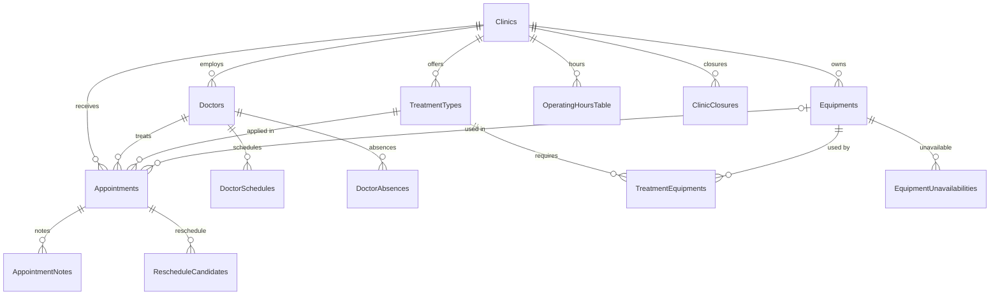
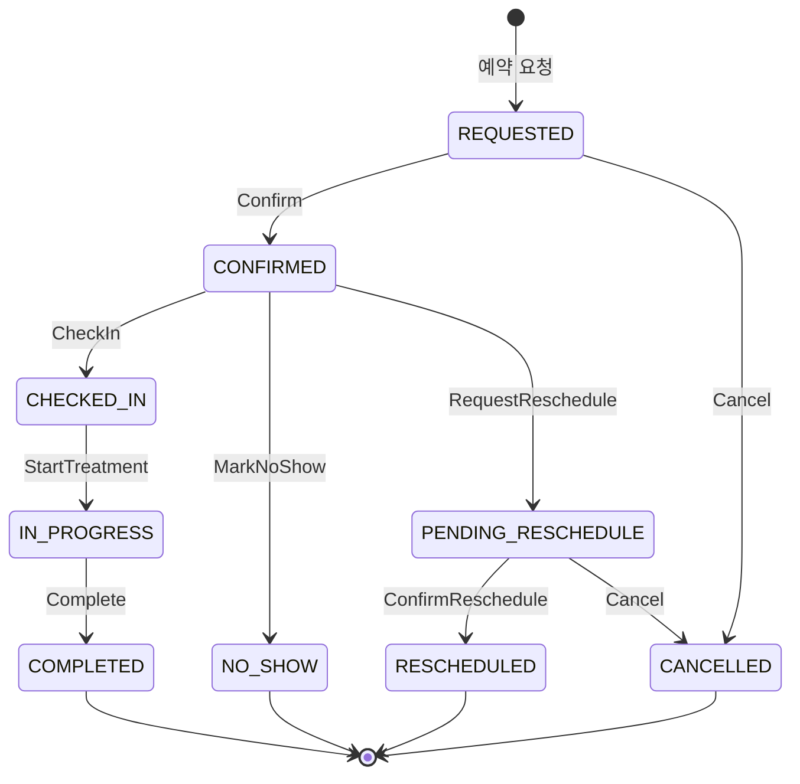

# appointment-core

도메인 모델, Exposed ORM 테이블, 리포지토리, 예약 상태머신, 슬롯 계산 서비스.
모든 다른 모듈의 기반이 되는 leaf 모듈.

## 책임

- **하는 것**: 도메인 엔티티 정의, DB 테이블 스키마, 리포지토리 CRUD, 상태머신 전이 검증, 가용 슬롯 계산
- **하지 않는 것**: Spring Context 의존성 없음, HTTP 없음, 알림 없음, 이벤트 발행 없음

## 핵심 클래스

### 도메인 엔티티 (Record)

| 클래스 | 역할 |
|--------|------|
| `AppointmentRecord` | 예약 — clinicId, doctorId, treatmentTypeId, appointmentDate, startTime, endTime, status |
| `ClinicRecord` | 병원 — slotDurationMinutes, maxConcurrentPatients, openOnHolidays |
| `DoctorRecord` | 의사 — clinicId, providerType, maxConcurrentPatients |
| `TreatmentTypeRecord` | 진료유형 — defaultDurationMinutes, requiredProviderType, requiresEquipment |
| `EquipmentRecord` | 장비 — usageDurationMinutes, quantity |
| `OperatingHoursRecord` | 영업시간 — dayOfWeek, openTime, closeTime, isActive |
| `DoctorScheduleRecord` | 의사 근무 — dayOfWeek, startTime, endTime |
| `DoctorAbsenceRecord` | 의사 부재 — absenceDate, startTime?(null=전일), endTime? |
| `ClinicClosureRecord` | 임시휴진 — closureDate, isFullDay, startTime?, endTime? |
| `HolidayRecord` | 공휴일 — holidayDate, recurring |
| `EquipmentUnavailabilityRecord` | 장비 사용불가 구간 — equipmentId, startDate, endDate, recurrenceRule, exceptions |

### 상태머신

```kotlin
// 상태 전이 예시
val machine = AppointmentStateMachine()
val newState = machine.transition(
    current = AppointmentState.REQUESTED,
    event = AppointmentEvent.Confirm
)   // → AppointmentState.CONFIRMED
```

상태 전이 전체 목록: [도메인 모델 문서](../docs/requirements/domain-model.md#상태-전이도)

### 리포지토리

| 클래스 | 주요 메서드 |
|--------|-----------|
| `AppointmentRepository` | `findByDateRange()`, `findByStatus()`, `save()`, `updateStatus()` |
| `ClinicRepository` | `findById()`, `findAll()` |
| `DoctorRepository` | `findByClinic()`, `findByProviderType()` |
| `TreatmentTypeRepository` | `findAll()`, `findById()` |
| `HolidayRepository` | `isHoliday(date)`, `findByYear()` |
| `RescheduleCandidateRepository` | `findPendingByClinic()`, `save()` |
| `EquipmentUnavailabilityRepository` | `findByEquipment()`, `findOverlapping()`, `save()`, `delete()` |

> **중요**: 모든 리포지토리 호출은 `transaction { }` 블록 안에서 실행해야 함.

### 서비스 value type (`model/service/`)

| 클래스 | 역할 |
|--------|------|
| `SlotQuery` | 슬롯 조회 파라미터 (clinicId, doctorId, treatmentTypeId, date) |
| `AvailableSlot` | 계산된 가용 슬롯 결과 (date, startTime, endTime, doctorId, remainingCapacity) |
| `TimeRange` | 시간 범위 value type + `subtractRanges`, `computeEffectiveRanges` top-level 함수 |

### 서비스

| 클래스 | 역할 |
|--------|------|
| `SlotCalculationService` | 의사/날짜/진료유형 조합의 빈 슬롯 목록 반환 (실시간 단건) |
| `ClosureRescheduleService` | 임시휴진 날짜의 영향받는 예약을 첫 번째 가용 슬롯으로 재배정 |
| `ConcurrencyResolver` | 동시 예약 충돌 해결 |
| `ClinicTimezoneService` | 병원 타임존 변환 |
| `EquipmentUnavailabilityService` | 장비 사용불가 구간 CRUD + `UnavailabilityExpander` 기반 반복 규칙 전개 |

## 의존성

- **내부**: 없음 (leaf 모듈)
- **외부**: `bluetape4k-exposed-core`, `bluetape4k-exposed-jdbc`, `bluetape4k-coroutines`, Exposed ORM

## 테스트 실행

```bash
./gradlew :appointment-core:test

# 특정 테스트
./gradlew :appointment-core:test --tests "*.SlotCalculationServiceTest"
```

> 테스트에서 DB 초기화: `@BeforeEach` — `SchemaUtils.createMissingTablesAndColumns(Table)` + `Table.deleteAll()`
> Testcontainers: `@Testcontainers` 어노테이션 없이 bluetape4k singleton 패턴 사용

## 주요 엔티티 관계도



→ 전체 ERD: [erd.md](../docs/requirements/erd.md)

## 예약 상태머신



→ 상태 전이 전체 목록: [domain-model.md](../docs/requirements/domain-model.md#상태-전이도)

## 타임존 설계

### 저장 원칙

| 컬럼 | 타입 | 기준 |
|------|------|------|
| `appointment_date` | `LocalDate` | 클리닉 현지 날짜 |
| `start_time` / `end_time` | `LocalTime` | 클리닉 현지 시간 |
| `created_at` / `updated_at` | `Instant` (UTC) | 시스템 감사 타임스탬프 |

**예약 시간은 UTC 변환 없이 클리닉 현지 시간으로 저장합니다.**

UTC로 변환하지 않는 이유:
- 예약은 본질적으로 현지 이벤트 — "서울 클리닉 23:00" 를 UTC로 변환하면 날짜가 바뀜
- `WHERE appointment_date = '2026-04-01'` 같은 날짜 기반 쿼리가 timezone에 무관하게 정확
- 슬롯 계산, 영업시간 비교가 동일 timezone 안에서 단순하게 유지됨

### 다국가 SaaS 지원

각 클리닉은 `Clinics.timezone` 컬럼으로 ZoneId를 보유합니다 (예: `"Asia/Seoul"`, `"America/New_York"`).
`Clinics.locale` 은 날짜/시간 **표시 형식**과 언어 용도로만 사용합니다 — 타임존과는 별개입니다
(교민 병원처럼 `locale="ko-KR"` 이지만 timezone이 `"America/Los_Angeles"` 일 수 있음).

### API 흐름

```
Frontend  →  LocalDate + LocalTime (클리닉 현지)
               ↓  변환 없이 저장
DB        →  LocalDate + LocalTime (클리닉 현지)
               ↓  응답 시 Clinics.timezone / locale 포함
Frontend  →  ZonedDateTime 복원 가능 (appointmentDate + startTime + timezone)
```

### ClinicTimezoneService

`ClinicTimezoneService` 는 API 경계에서 timezone 정보를 조합할 때 사용합니다:

```kotlin
// 응답에 timezone/locale 포함 (단일 DB 조회)
val (timezone, locale) = timezoneService.getTimezoneAndLocale(clinicId)

// 크로스-클리닉 비교 시 ZonedDateTime 변환
val zoned: ZonedDateTime = timezoneService.toClinicTime(clinicId, date, time)
```

## 설계 문서

- [도메인 모델 전체](../docs/requirements/domain-model.md)
