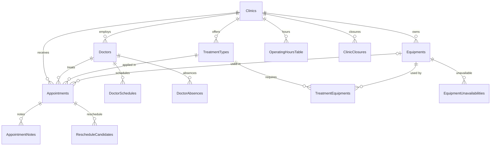

# appointment-core

[English](README.md) | [한국어](README.ko.md)

Domain model, Exposed ORM tables, repositories, appointment state machine, and slot calculation services.
This is the leaf module that all other modules build on.

## Responsibilities

- **Does**: defines domain entities, database table schemas, repository CRUD operations, state-machine transition validation, and available-slot calculation.
- **Does not**: depend on Spring Context, expose HTTP APIs, send notifications, or publish events.

## Core Classes

### Domain Entities (Record)

| Class | Role |
|--------|------|
| `AppointmentRecord` | Appointment with clinicId, doctorId, treatmentTypeId, appointmentDate, startTime, endTime, and status. |
| `ClinicRecord` | Clinic settings such as slotDurationMinutes, maxConcurrentPatients, and openOnHolidays. |
| `DoctorRecord` | Doctor information such as clinicId, providerType, and maxConcurrentPatients. |
| `TreatmentTypeRecord` | Treatment type with defaultDurationMinutes, requiredProviderType, and requiresEquipment. |
| `EquipmentRecord` | Equipment with usageDurationMinutes and quantity. |
| `OperatingHoursRecord` | Operating hours with dayOfWeek, openTime, closeTime, and isActive. |
| `DoctorScheduleRecord` | Doctor working schedule with dayOfWeek, startTime, and endTime. |
| `DoctorAbsenceRecord` | Doctor absence with absenceDate, optional startTime, and optional endTime. |
| `ClinicClosureRecord` | Temporary clinic closure with closureDate, isFullDay, optional startTime, and optional endTime. |
| `HolidayRecord` | Holiday with holidayDate and recurring flag. |
| `EquipmentUnavailabilityRecord` | Equipment unavailability window with recurrence rule and exceptions. |

### State Machine

```kotlin
val machine = AppointmentStateMachine()
val newState = machine.transition(
    current = AppointmentState.REQUESTED,
    event = AppointmentEvent.Confirm,
)   // AppointmentState.CONFIRMED
```

Full transition list: [domain model document](../docs/requirements/domain-model.md#상태-전이도)

### Repositories

| Class | Main Methods |
|--------|-----------|
| `AppointmentRepository` | `findByDateRange()`, `findByStatus()`, `save()`, `updateStatus()` |
| `ClinicRepository` | `findById()`, `findAll()` |
| `DoctorRepository` | `findByClinic()`, `findByProviderType()` |
| `TreatmentTypeRepository` | `findAll()`, `findById()` |
| `HolidayRepository` | `isHoliday(date)`, `findByYear()` |
| `RescheduleCandidateRepository` | `findPendingByClinic()`, `save()` |
| `EquipmentUnavailabilityRepository` | `findByEquipment()`, `findOverlapping()`, `save()`, `delete()` |

> **Important**: every repository call must run inside a `transaction { }` block.

### Service Value Types (`model/service/`)

| Class | Role |
|--------|------|
| `SlotQuery` | Slot query parameters: clinicId, doctorId, treatmentTypeId, date. |
| `AvailableSlot` | Calculated available slot result: date, startTime, endTime, doctorId, remainingCapacity. |
| `TimeRange` | Time range value type plus top-level `subtractRanges` and `computeEffectiveRanges` functions. |

### Services

| Class | Role |
|--------|------|
| `SlotCalculationService` | Returns available slots for a doctor/date/treatment-type combination. |
| `ClosureRescheduleService` | Reassigns appointments affected by a temporary closure to the first available slot. |
| `ConcurrencyResolver` | Resolves concurrent appointment conflicts. |
| `ClinicTimezoneService` | Converts and combines clinic timezone data at API boundaries. |
| `EquipmentUnavailabilityService` | CRUD for equipment unavailability windows and recurrence expansion with `UnavailabilityExpander`. |

## Dependencies

- **Internal**: none. This is a leaf module.
- **External**: `exposed-core`, `exposed-jdbc`, `bluetape4k-coroutines`, Exposed ORM.

## Tests

```bash
./gradlew :appointment-core:test

# Specific test
./gradlew :appointment-core:test --tests "*.SlotCalculationServiceTest"
```

> Test DB setup: `@BeforeEach` with `SchemaUtils.createMissingTablesAndColumns(Table)` and `Table.deleteAll()`.
> Testcontainers: use the bluetape4k singleton pattern without `@Testcontainers`.

## Entity Relationship Overview



Full ERD: [erd.md](../docs/requirements/erd.md)

## Appointment State Machine


Full transition list: [domain-model.md](../docs/requirements/domain-model.md#상태-전이도)

## Timezone Design

### Storage Rules

| Column | Type | Reference |
|------|------|------|
| `appointment_date` | `LocalDate` | Clinic-local date. |
| `start_time` / `end_time` | `LocalTime` | Clinic-local time. |
| `created_at` / `updated_at` | `Instant` (UTC) | System audit timestamp. |

Appointment times are stored as clinic-local date and time without UTC conversion.

Reasons:

- Appointments are local events. Converting "Seoul clinic 23:00" to UTC can shift the date.
- Date-based queries such as `WHERE appointment_date = '2026-04-01'` stay correct regardless of timezone.
- Slot calculation and business-hour comparison remain simple inside the same timezone.

### Multi-Country SaaS Support

Each clinic stores a ZoneId in `Clinics.timezone`, such as `"Asia/Seoul"` or `"America/New_York"`.
`Clinics.locale` is used only for display format and language. It is independent from timezone.

For example, a Korean expatriate clinic can use `locale = "ko-KR"` with `timezone = "America/Los_Angeles"`.

### API Flow

```text
Frontend  ->  LocalDate + LocalTime (clinic local)
               stored without conversion
DB        ->  LocalDate + LocalTime (clinic local)
               response includes Clinics.timezone / locale
Frontend  ->  can reconstruct ZonedDateTime from appointmentDate + startTime + timezone
```

### ClinicTimezoneService

`ClinicTimezoneService` is used at API boundaries when timezone information must be combined:

```kotlin
// Include timezone/locale in a response with one DB lookup.
val (timezone, locale) = timezoneService.getTimezoneAndLocale(clinicId)

// Convert to ZonedDateTime for cross-clinic comparison.
val zoned: ZonedDateTime = timezoneService.toClinicTime(clinicId, date, time)
```

## Design Documents

- [Full Domain Model](../docs/requirements/domain-model.md)
