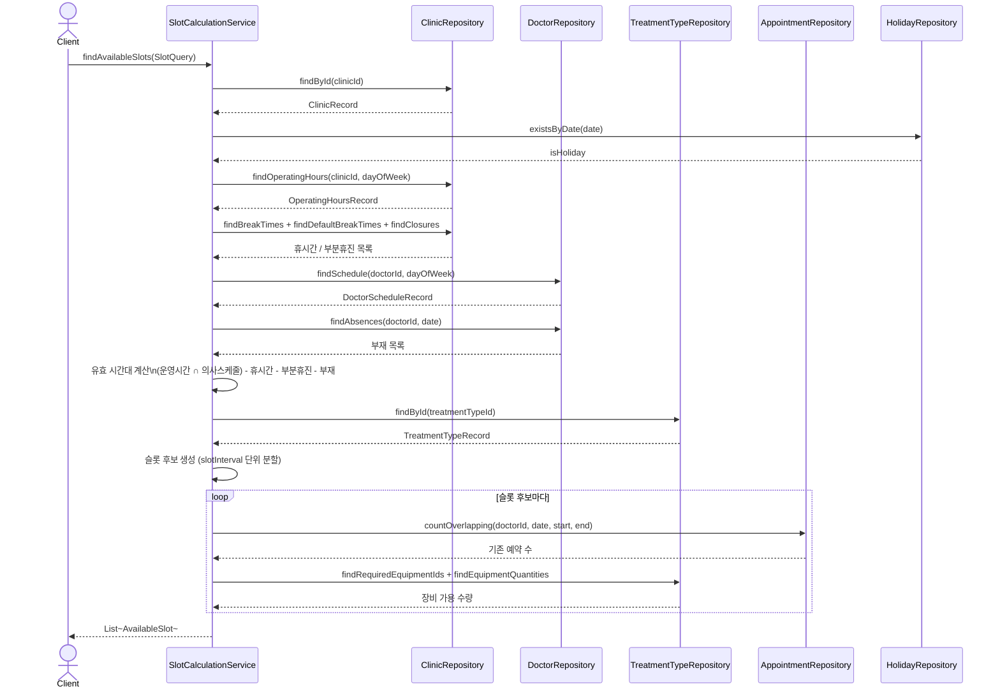
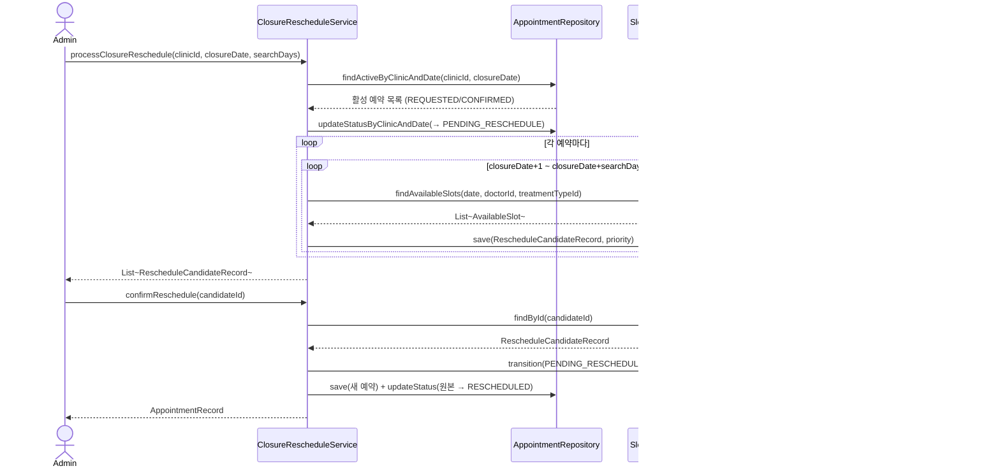
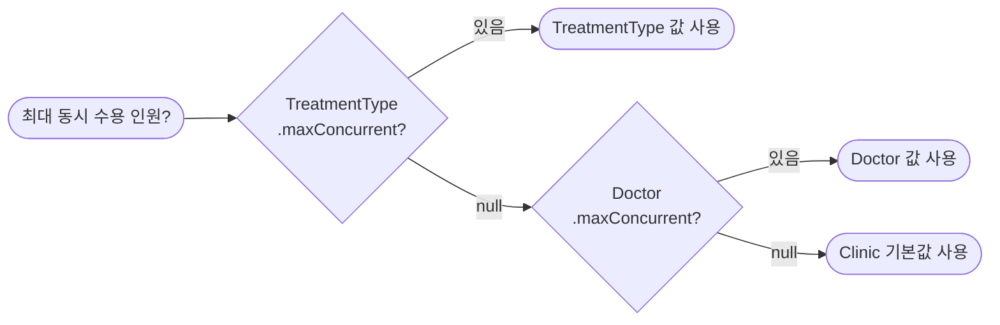
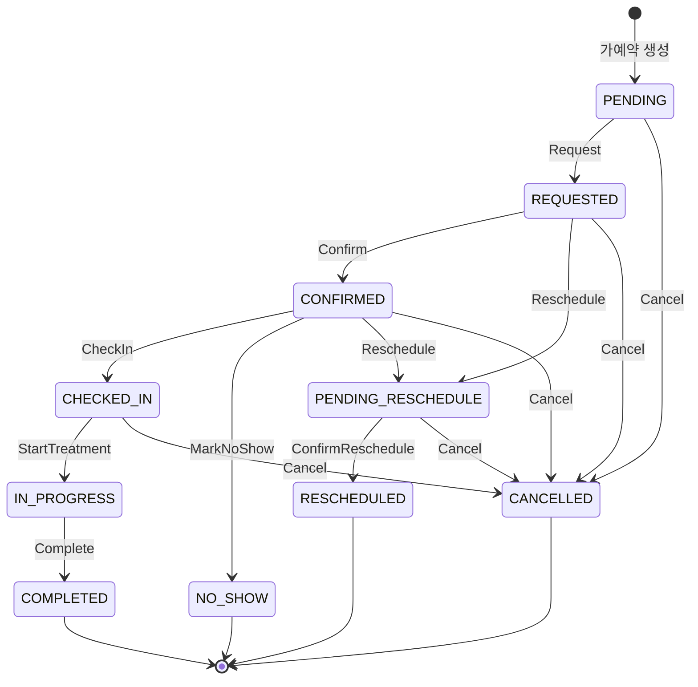

# appointment-core

병원 예약 스케줄링 시스템의 핵심 도메인 모듈입니다.

---

## 패키지 구조

```
io.bluetape4k.clinic.appointment
├── model/
│   ├── tables/          # Exposed Table 정의 (17개)
│   ├── dto/             # Record data class (17개)
│   └── statemachine/    # 예약 상태 머신
├── repository/          # Aggregate Root Repository (6개)
└── service/             # 비즈니스 서비스
    └── model/           # 서비스 모델 (TimeRange, SlotQuery, AvailableSlot)
```

---

## 테이블 (17개)

| 테이블 | Record | 설명 |
|--------|--------|------|
| `Holidays` | `HolidayRecord` | 국가 공휴일 |
| `Clinics` | `ClinicRecord` | 병원 정보 (슬롯 단위, timezone, locale, 동시 수용, 공휴일 영업 여부) |
| `ClinicDefaultBreakTimes` | `ClinicDefaultBreakTimeRecord` | 병원 기본 휴식시간 (모든 영업일 적용, 복수 가능) |
| `OperatingHoursTable` | `OperatingHoursRecord` | 요일별 영업시간 |
| `BreakTimes` | `BreakTimeRecord` | 요일별 휴식시간 |
| `ClinicClosures` | `ClinicClosureRecord` | 임시휴진 (종일/부분) |
| `Doctors` | `DoctorRecord` | 의사/전문상담사 (ProviderType 구분) |
| `DoctorSchedules` | `DoctorScheduleRecord` | 의사 요일별 스케줄 |
| `DoctorAbsences` | `DoctorAbsenceRecord` | 의사 부재 (종일/부분) |
| `Equipments` | `EquipmentRecord` | 장비 (수량 관리) |
| `TreatmentTypes` | `TreatmentTypeRecord` | 진료유형 (카테고리, 필요 Provider, 상담방식) |
| `TreatmentEquipments` | `TreatmentEquipmentRecord` | 진료-장비 매핑 |
| `ConsultationTopics` | `ConsultationTopicRecord` | 상담 종류 |
| `Appointments` | `AppointmentRecord` | 예약 |
| `AppointmentNotes` | `AppointmentNoteRecord` | 예약 메모 |
| `RescheduleCandidates` | `RescheduleCandidateRecord` | 재배정 후보 |

---

## Repository (Aggregate Root 패턴)

`LongJdbcRepository<E>` (bluetape4k-exposed-jdbc) 기반의 6개 Aggregate Root Repository:

### ClinicRepository
집계: Clinics + OperatingHours + DefaultBreakTimes + BreakTimes + Closures

주요 메서드:
- `findOperatingHours(clinicId, dayOfWeek): OperatingHoursRecord?`
- `findDefaultBreakTimes(clinicId): List<ClinicDefaultBreakTimeRecord>`
- `findBreakTimes(clinicId, dayOfWeek): List<BreakTimeRecord>`
- `findClosures(clinicId, date): List<ClinicClosureRecord>`

### DoctorRepository
집계: Doctors + Schedules + Absences

주요 메서드:
- `findSchedule(doctorId, dayOfWeek): DoctorScheduleRecord?`
- `findAbsences(doctorId, date): List<DoctorAbsenceRecord>`

### TreatmentTypeRepository
집계: TreatmentTypes + 장비매핑 + 장비수량

주요 메서드:
- `findRequiredEquipmentIds(treatmentTypeId): List<Long>`
- `findEquipmentQuantities(equipmentIds): Map<Long, Int>`

### AppointmentRepository
집계: Appointments CRUD

주요 메서드:
- `countOverlapping(clinicId, doctorId, startTime, endTime, excludeStatuses): Int`
- `countEquipmentUsage(equipmentId, startTime, endTime): Int`
- `save(record): AppointmentRecord`
- `updateStatus(appointmentId, newStatus): Boolean`

### HolidayRepository
집계: Holidays

주요 메서드:
- `existsByDate(date): Boolean`

### RescheduleCandidateRepository
집계: RescheduleCandidates

주요 메서드:
- `save(record): RescheduleCandidateRecord`
- `findBestCandidate(originalAppointmentId, orderByPriority): RescheduleCandidateRecord?`
- `markSelected(candidateId): Boolean`

---

## 서비스

### SlotCalculationService — 슬롯 계산 흐름



### ClosureRescheduleService — 휴진 재배정 흐름



### ConcurrencyResolver — 3-Level Cascade



우선순위: `TreatmentType > Doctor > Clinic`

## 검증 포인트

- `SlotCalculationService` 는 영업시간, 휴식시간, 부분휴진, 의사 부재, providerType, 장비 수량을 모두 반영해 슬롯을 계산합니다.
- `ClosureRescheduleService` 는 휴진일 활성 예약을 `PENDING_RESCHEDULE` 로 전환한 뒤 후보 슬롯을 저장합니다.
- `AppointmentRepository.findActiveByDate(...)` 는 리마인더/배치 작업처럼 클리닉 전체 날짜 기준 조회가 필요한 모듈에서 사용합니다.

---

## 상태 머신

10개 상태, 13개 이벤트의 예약 상태 전이 관리 (sealed class 기반).



| 상태 | 설명 |
|------|------|
| `PENDING` | 초기 상태 (가예약) |
| `REQUESTED` | 예약 요청됨 |
| `CONFIRMED` | 예약 확정 |
| `CHECKED_IN` | 내원 확인 |
| `IN_PROGRESS` | 진료 중 |
| `COMPLETED` | 진료 완료 |
| `PENDING_RESCHEDULE` | 재배정 대기 (휴진 등) |
| `RESCHEDULED` | 재배정 완료 |
| `NO_SHOW` | 미내원 |
| `CANCELLED` | 취소 |

---

## 테스트

```bash
# 전체 모듈 테스트
./gradlew :appointment-core:test

# SlotCalculationService 테스트 (21개)
./gradlew :appointment-core:test --tests "*.SlotCalculationServiceTest"

# ClosureRescheduleService 테스트 (6개)
./gradlew :appointment-core:test --tests "*.ClosureRescheduleServiceTest"

# 상태 머신 테스트
./gradlew :appointment-core:test --tests "*.AppointmentStateMachineTest"

# TimeRange 유틸리티 테스트
./gradlew :appointment-core:test --tests "*.TimeRangeTest"

# 동시 수용 인원 결정 테스트
./gradlew :appointment-core:test --tests "*.ResolveMaxConcurrentTest"

# 테이블 스키마 테스트
./gradlew :appointment-core:test --tests "*.TableSchemaTest"
```

2026-03-28 기준 모듈 테스트 86건 통과.

---

## 의존성

- `bluetape4k-exposed-jdbc` — LongJdbcRepository 기반 데이터 접근
- JetBrains Exposed (v1 API)

---

## 주요 특징

- **Aggregate Root 패턴**: Repository가 각 집계의 모든 자식을 포함하여 로드/저장
- **Record 기반 데이터**: 불변 데이터 클래스로 안전성 확보
- **Provider Type 검증**: 의사/상담사 유형 자동 검증
- **3-Level Cascade**: 세밀한 동시 수용 인원 제어
- **병원 기본 휴식시간**: 복수의 요일 무관 휴식시간 지원
- **상태 머신**: Sealed class 기반 타입-안전 상태 전이
