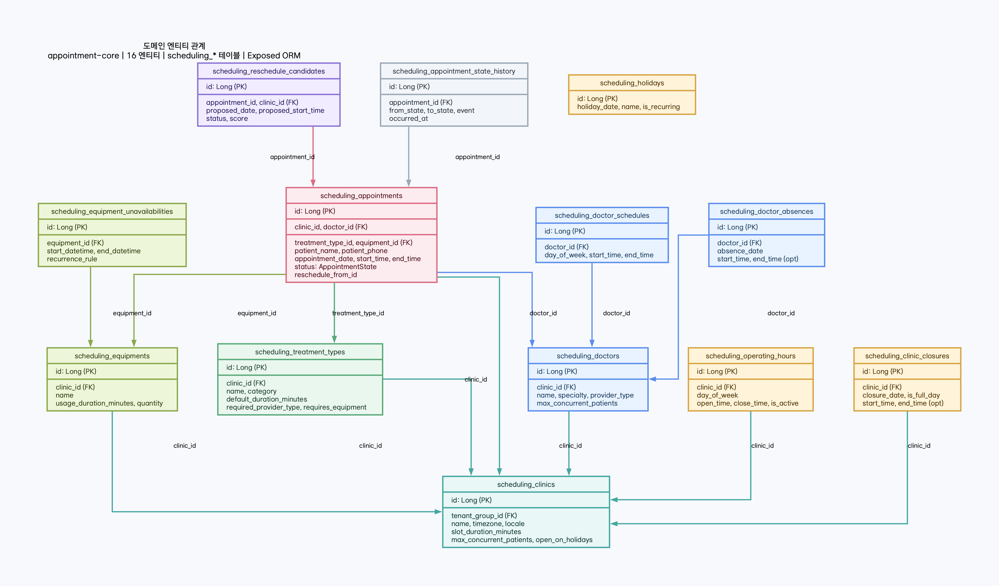
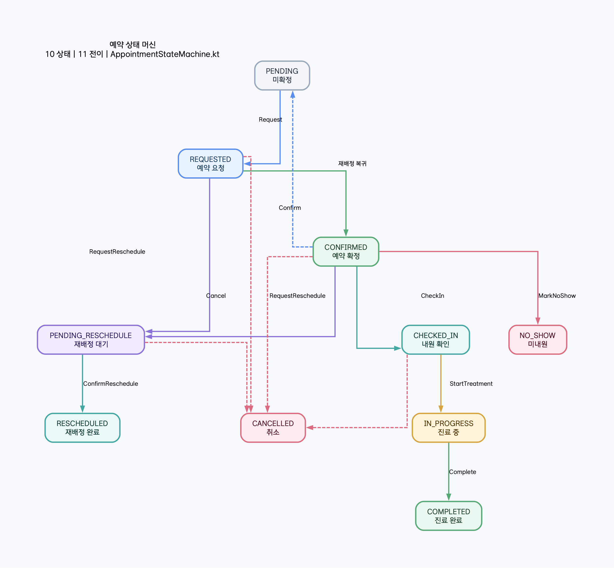

# appointment-core

[한국어 본문](README.md) | [한국어 참고본](README.ko.md)

도메인 모델, Exposed ORM 테이블, 리포지토리, 예약 상태머신, 슬롯 계산 서비스.
모든 다른 모듈의 기반이 되는 leaf 모듈.

## 책임

- **하는 것**: 도메인 엔티티 정의, DB 테이블 스키마, 리포지토리 CRUD, 상태머신 전이 검증, 가용 슬롯 계산
- **하지 않는 것**: Spring Context 의존성 없음, HTTP 없음, 알림 없음, 이벤트 발행 없음

## 예약 플랜 기반

`ProductCatalogProjection`은 tenant/clinic 범위의 불변 상품 버전과 정규 payload hash를
저장합니다. `AppointmentPlanFactory`는 날짜나 ID를 배정하지 않고 이 스냅숏을 순서가
있는 `PlannedTreatment` 회차와 구체화된 의존관계로 확장합니다.
`AppointmentPlanRepository`는 호출자가 `Exposed` transaction 안에서 전체 aggregate를
저장하고 조회합니다.

`AppointmentPlanQueryService`는 정제된 `AppointmentPlanView`만 노출합니다. 환자 참조
ciphertext, key ID, fingerprint는 영속성 경계 밖으로 나오지 않습니다. 플랜은 구매한
진료 의무이며 방문 예약이나 자원 선점이 아닙니다.

## 예약 정책 기반

불변 tenant baseline과 partial clinic override를 버전 정책 definition으로 저장합니다.
strict payload decoding, validation, canonical hashing, generation-fenced compilation,
activation command, preview job은 이 모듈에 있고 HTTP와 worker orchestration은
`appointment-api`에 있습니다.

[예약 정책 도메인 모델](../docs/requirements/domain-model.md#scheduling-policy-모델)과
[Scheduling Policy API 계약](../docs/api/scheduling-policy.md)을 참고하세요.

## 예약 신뢰도 도메인

`BookingReliabilityEvaluator`는 typed `NO_SHOW`·`CANCELLED` 사건을 평가하는 순수하고 결정적인
evaluator입니다. 고객 책임만 남기고 event ID/source version으로 중복을 제거한 뒤, 불변 정책
snapshot의 lookback·지각 취소·임계값을 적용하여 제한된 reason code, trigger ID, 만료 시각,
digest를 반환합니다. `BookingEligibilityPort`가 읽기 계약을 제공하고 rollout mode·권한은 API
모듈이 담당합니다. core 모델은 회원 이름·전화번호·자유 입력 메모를 읽지 않습니다.

영속 모델은 사건, 불변 결정, append-only override, keyset 재평가 작업을 위한 additive V17 테이블로
분리했습니다. Exposed `transaction {}` 경계는 호출자가 소유합니다.

[예약 신뢰도 기준 문서](../docs/booking-reliability-policy.ko.md),
[ERD](../docs/images/readme-diagrams/booking-reliability-erd-01-ko.png),
[클래스 경계](../docs/images/readme-diagrams/booking-reliability-class-01-ko.png)를 참고하세요.

## 핵심 클래스

### Tenant 소유권

`TenantGroupRecord`는 데이터 격리의 소유자입니다. `tenantCode`는 URL 경로에서 사용하는
1~64자의 안정적인 소문자 ASCII slug이며, `a-z`, `0-9`, 구간 사이의 단일 하이픈만
허용합니다. 병원과 공휴일은 tenant group을 참조합니다. locale은 병원의 표시 설정일 뿐
tenant를 식별하지 않습니다.

리포지토리 호출자는 `TenantGroupRepository.findActiveByCode()`로 활성 tenant를 확인한 뒤
`ClinicRepository.findByTenant()`와 `HolidayRepository.findByTenantAndDate()`를 사용해
조회 범위를 해당 tenant 안으로 제한해야 합니다.

### 도메인 엔티티 (Record)

| 클래스 | 역할 |
|--------|------|
| `TenantGroupRecord` | 안정적인 URL tenant code와 활성 상태를 가진 데이터 격리 소유자 |
| `AppointmentRecord` | 예약 — clinicId, doctorId, treatmentTypeId, appointmentDate, startTime, endTime, status |
| `ClinicRecord` | 병원 — slotDurationMinutes, maxConcurrentPatients, openOnHolidays |
| `DoctorRecord` | 의사 — clinicId, providerType, maxConcurrentPatients |
| `TreatmentTypeRecord` | 진료유형 — defaultDurationMinutes, requiredProviderType, requiresEquipment |
| `EquipmentRecord` | 장비 — usageDurationMinutes, quantity |
| `OperatingHoursRecord` | 영업시간 — dayOfWeek, openTime, closeTime, isActive |
| `DoctorScheduleRecord` | 의사 근무 — dayOfWeek, startTime, endTime |
| `DoctorAbsenceRecord` | 의사 부재 — absenceDate, startTime?(null=전일), endTime? |
| `ClinicClosureRecord` | 임시휴진 — closureDate, isFullDay, startTime?, endTime? |
| `HolidayRecord` | 공휴일 — holidayDate, recurring |
| `EquipmentUnavailabilityRecord` | 장비 사용불가 구간 — equipmentId, startDate, endDate, recurrenceRule, exceptions |

### 상태머신

```kotlin
// 상태 전이 예시
val machine = AppointmentStateMachine()
val newState = machine.transition(
    current = AppointmentState.REQUESTED,
    event = AppointmentEvent.Confirm,
)   // → AppointmentState.CONFIRMED
```

상태 전이 전체 목록: [도메인 모델 문서](../docs/requirements/domain-model.md#상태-전이도)

### 리포지토리

| 클래스 | 주요 메서드 |
|--------|-----------|
| `TenantGroupRepository` | `findActiveByCode()` |
| `AppointmentRepository` | `findByDateRange()`, `findByStatus()`, `save()`, `updateStatus()` |
| `ClinicRepository` | `findByIdAndTenant()`, `findByTenant()` |
| `DoctorRepository` | `findByClinic()`, `findByProviderType()` |
| `TreatmentTypeRepository` | `findAll()`, `findById()` |
| `HolidayRepository` | `findByTenantAndDate()`, `existsByDate()`, `findByDateRange()` |
| `RescheduleCandidateRepository` | `findPendingByClinic()`, `save()` |
| `EquipmentUnavailabilityRepository` | `findByEquipment()`, `findOverlapping()`, `save()`, `delete()` |
| `ProductCatalogRepository` | 불변 카탈로그 버전을 저장하고 동일 버전의 내용 충돌을 감지 |
| `AppointmentPlanRepository` | 정확한 tenant/clinic 범위에서 전체 플랜 aggregate 저장·조회 |

> **중요**: 모든 리포지토리 호출은 `transaction { }` 블록 안에서 실행해야 함.

### 서비스 value type (`model/service/`)

| 클래스 | 역할 |
|--------|------|
| `SlotQuery` | 슬롯 조회 파라미터 (tenant-clinic scope, doctorId, treatmentTypeId, date) |
| `AvailableSlot` | 계산된 가용 슬롯 결과 (date, startTime, endTime, doctorId, remainingCapacity) |
| `TimeRange` | 시간 범위 value type + `subtractRanges`, `computeEffectiveRanges` top-level 함수 |

### 서비스

| 클래스 | 역할 |
|--------|------|
| `SlotCalculationService` | 의사/날짜/진료유형 조합의 빈 슬롯 목록 반환 (실시간 단건) |
| `ClosureRescheduleService` | 임시휴진 날짜의 영향받는 예약을 첫 번째 가용 슬롯으로 재배정 |
| `ConcurrencyResolver` | 동시 예약 충돌 해결 |
| `ClinicTimezoneService` | 병원 타임존 변환 |
| `EquipmentUnavailabilityService` | 장비 사용불가 구간 CRUD + `UnavailabilityExpander` 기반 반복 규칙 전개 |

## 의존성

- **내부**: 없음 (leaf 모듈)
- **외부**: `exposed-core`, `exposed-jdbc`, `bluetape4k-coroutines`, Exposed ORM

## 테스트 실행

```bash
./gradlew :appointment-core:test

# 특정 테스트
./gradlew :appointment-core:test --tests "*.SlotCalculationServiceTest"
```

> 테스트에서 DB 초기화: `@BeforeEach` — `SchemaUtils.createMissingTablesAndColumns(Table)` + `Table.deleteAll()`
> Testcontainers: `@Testcontainers` 어노테이션 없이 bluetape4k singleton 패턴 사용

## 주요 엔티티 관계도



→ 전체 ERD: [erd.md](../docs/requirements/erd.md)

## 예약 상태머신



→ 상태 전이 전체 목록: [domain-model.md](../docs/requirements/domain-model.md#상태-전이도)

## 핵심 도메인 흐름


## 타임존 설계

### 저장 원칙

| 컬럼 | 타입 | 기준 |
|------|------|------|
| `appointment_date` | `LocalDate` | 클리닉 현지 날짜 |
| `start_time` / `end_time` | `LocalTime` | 클리닉 현지 시간 |
| `created_at` / `updated_at` | `Instant` (UTC) | 시스템 감사 타임스탬프 |

**예약 시간은 UTC 변환 없이 클리닉 현지 시간으로 저장합니다.**

UTC로 변환하지 않는 이유:
- 예약은 본질적으로 현지 이벤트 — "서울 클리닉 23:00" 를 UTC로 변환하면 날짜가 바뀜
- `WHERE appointment_date = '2026-04-01'` 같은 날짜 기반 쿼리가 timezone에 무관하게 정확
- 슬롯 계산, 영업시간 비교가 동일 timezone 안에서 단순하게 유지됨

### 다국가 SaaS 지원

각 클리닉은 `Clinics.timezone` 컬럼으로 ZoneId를 보유합니다 (예: `"Asia/Seoul"`, `"America/New_York"`).
`Clinics.locale` 은 날짜/시간 **표시 형식**과 언어 용도로만 사용합니다 — 타임존과는 별개입니다
(교민 병원처럼 `locale="ko-KR"` 이지만 timezone이 `"America/Los_Angeles"` 일 수 있음).

### API 흐름

```
Frontend  →  LocalDate + LocalTime (클리닉 현지)
               ↓  변환 없이 저장
DB        →  LocalDate + LocalTime (클리닉 현지)
               ↓  응답 시 Clinics.timezone / locale 포함
Frontend  →  ZonedDateTime 복원 가능 (appointmentDate + startTime + timezone)
```

### ClinicTimezoneService

`ClinicTimezoneService` 는 API 경계에서 timezone 정보를 조합할 때 사용합니다:

```kotlin
// 응답에 timezone/locale 포함 (단일 DB 조회)
val (timezone, locale) = timezoneService.getTimezoneAndLocale(clinicId)

// 크로스-클리닉 비교 시 ZonedDateTime 변환
val zoned: ZonedDateTime = timezoneService.toClinicTime(clinicId, date, time)
```

## 설계 문서

- [도메인 모델 전체](../docs/requirements/domain-model.md)

## Waitlist 전달 경계

waitlist core는 내구성 있는 vacancy, 후보, offer, hold, policy, command record 상태를
소유합니다. 당일 확정 예약이 `CANCELLED` 또는 `NO_SHOW`가 되면 범위가 고정된 vacancy
generation을 만들고, ranked matcher가 hard eligibility를 먼저 확인한 뒤 결정적인 policy
점수를 계산합니다. offer, hold, decision audit, notification draft, vacancy 완료는 호출자가
소유한 `transaction {}` 경계 안에서 기록합니다.

core는 Spring, Redis, notification provider, 회원 profile 서비스에 직접 호출하지 않습니다.
`SlotAvailable`은 빠른 신호일 뿐이며 durable vacancy job이 복구 권위입니다. worker lease를
잃으면 DB version과 owner predicate가 fencing하고, confirm 재요청은 durable command record로
해결합니다.

| 경계 | 계약 |
|---|---|
| 롤백 | `appointment.waitlist.delivery.enabled=false`는 새 dispatch만 멈추고 expiry, suppression, hold recovery는 계속 실행합니다. |
| 개인정보 | entry, event, offer, notification draft에는 opaque reference와 제한된 reason code만 담고 이름·연락처는 복제하지 않습니다. |
| 완료 | `OFFERED`는 `ACCEPTED`, `DECLINED`, `EXPIRED`, `WITHDRAWN` 중 하나로 한 번만 전이하며 terminal 재시도는 no-op 성공입니다. |

[waitlist 전달 API·운영 계약](../docs/api/waitlist-delivery.md)에서 전체 경계를 확인하세요.

## Tenant query 범위

스케줄링 조회는 검증된 `TenantClinicScope` value object를 사용합니다. 이 객체는
인증 객체가 아니라 DB 권위이며, 모든 Exposed query는 호출자가 소유한
`transaction {}` 경계 안에서 실행합니다.

```kotlin
val scope = TenantClinicScope(tenantGroupId = 1L, clinicId = 23L)
val slots = slotCalculationService.findAvailableSlots(
    SlotQuery(
        scope = scope,
        doctorId = 101L,
        treatmentTypeId = 202L,
        date = LocalDate.now(),
    ),
)
```

표준 cache key는 `${scope.tenantGroupId}:${scope.clinicId}`입니다. 병원 ID만 받는
스케줄링 query는 유효하지 않으므로 다른 tenant가 같은 clinic ID를 재사용해도 행을
조회할 수 없습니다.
