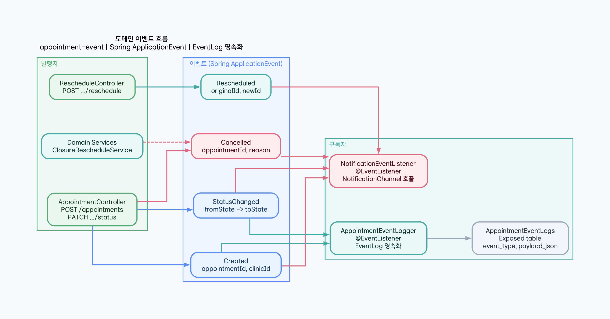

# appointment-event

[English](README.md) | [한국어](README.ko.md)

Spring `ApplicationEvent` 기반 도메인 이벤트 발행/구독 + 이벤트 로그 DB 저장.

## 책임

- **하는 것**: 도메인 이벤트 타입 정의, 이벤트 발행, 이벤트 로그 저장, 신뢰된 구매 이벤트를 예약 플랜으로 수렴
- **하지 않는 것**: 알림 직접 발송과 appointment-plan outbox 직접 발행

## 구매 이벤트 수렴

`PurchaseCompletedIngress`는 환자 참조를 보호하기 전에 producer, signature, issuer,
audience, payload hash, replay window, payload 제한을 검증합니다. `WRITE` 모드의
`PurchaseCompletedHandler`는 동일 transaction에서 inbox를 선점하고, 불변 플랜을
생성하고, 대기 상태의 `AppointmentPlanCreated` outbox 한 건을 기록합니다.

중복 event ID와 동일 구매는 하나로 수렴합니다. aggregate version gap은 제한된
백오프로 재시도하고 5회째 격리됩니다. `SHADOW`는 쓰기 없이 평가합니다. outbox
발행·ack·retry/DLQ·alert 책임을 가진 외부 전송 배포가 완성되기 전에는 운영
`WRITE`를 허용하지 않습니다. 방문 확정 약속 런북은 이 금지를 해제하기 전에 필요한
사전 운영 훈련과 증거를 정의할 뿐, 그 문서만으로 `WRITE`를 승인하지 않습니다.

<a id="profile-reevaluation"></a>
## 프로필 변경 재평가 이벤트

프로필 변경에는 `PatientSchedulingAssessmentChanged` schema만 허용합니다. 필드는
`eventId`, `tenantGroupId`, `clinicId`, `patientReferenceFingerprint`,
`profileRevision`, `materialChange`, `assessmentRef`, `assessmentHash`,
`occurredAt`입니다. 환자 식별자, 프로필 본문, 파생 특징, 점수, 설명, 보정 상세는
담지 않습니다.

`ProfileReevaluationEventService`는 inbox와 최신 revision 작업을 한 transaction에
기록하기 전에 producer, signature, issuer, audience, payload hash, schema,
replay window, fingerprint 형식, tenant/clinic 소속을 검증합니다. 중복 이벤트는
하나로 수렴하고 중요하지 않은 변경은 inbox 처리로 끝냅니다. 더 최신 revision이
오면 이전 대기 작업은 stale이 됩니다. 신뢰할 수 없는 입력은 별도 transaction에서
크기가 제한된 암호화 quarantine envelope로만 보존합니다.

event module은 작업을 만들 뿐 예약 변경을 판단하지 않습니다. API worker가
`PROPOSED`와 `HELD`를 다시 평가하며 `CONFIRMED`는 항상 건너뜁니다. 자세한 흐름은
[업무 흐름](../docs/superpowers/specs/2026-07-30-profile-change-reservation-reevaluation.ko.html)과
[운영 런북](../docs/runbooks/profile-reevaluation.ko.md)을 참고합니다.

## 예약 신뢰도 이벤트 ingress

`BookingReliabilityEventIngress`는 `NO_SHOW`·`CANCELLED` 결과의 strict typed schema를 받고,
신뢰된 producer envelope를 검증하며, 잘못되거나 신뢰할 수 없는 입력은 회원 프로필을 복제하지
않고 quarantine합니다. 이벤트에는 tenant/clinic/member 범위, 책임, source version, correlation,
payload hash만 담습니다. 자격 판단은 core evaluator의 책임이고 이 모듈은 사실을 검증·저장합니다.

[예약 신뢰도 기준 문서](../docs/booking-reliability-policy.ko.md),
[영속 ERD](../docs/images/readme-diagrams/booking-reliability-erd-01-ko.png),
[event ingress API 메모](../docs/api/booking-reliability.md)를 참고하세요.

## 외부 예약 사실

예약 서비스는 상품·구매·시술 이행의 소유권을 가져오지 않고 다음 사실만 수신합니다.

- `VisitPlanningEventIngress`와 `VisitPlanningEventHandler`는 불변 패키지 실행 BOM을
  검증하고 아직 진행하지 않은 미래 Plan 작업만 생성·개정합니다.
- `ProductVersionMigrationHandler`는 신뢰된 상품 version mapping과 고객 동의를
  확인하고 완료 시술 provenance를 보존합니다.
- `ProductVersionMigrationDeclinedHandler`는 현재 version을 유지한 채 고객 거부 운영
  예외를 기록합니다.
- `TreatmentFulfillmentHandler`는 정확한 item의 완료·부분 이행을 반영하고
  `BLOCKING` 미래 의존 항목만 dirty-set으로 만듭니다.
- `ExternalFactEventConsumer`는 닫힌 event type 허용목록만 routing하고 제한된
  redacted 실패를 격리합니다. 상품·구매·동의·환불·이행의 상태 변경 책임은 원천 서비스에
  그대로 남습니다.

## 이벤트 타입

```kotlin
sealed class AppointmentDomainEvent : ApplicationEvent {
    data class Created(val appointmentId: Long, val clinicId: Long)
    data class StatusChanged(val appointmentId: Long, val clinicId: Long,
                             val fromState: String, val toState: String, val reason: String?)
    data class Cancelled(val appointmentId: Long, val clinicId: Long, val reason: String)
    data class Rescheduled(val originalId: Long, val newId: Long, val clinicId: Long)
}
```

## 발행 패턴

```kotlin
// 발행 (appointment-api, appointment-core에서 사용)
eventPublisher.publishEvent(AppointmentDomainEvent.Created(id, clinicId))

// 구독
@EventListener
fun on(event: AppointmentDomainEvent.Created) { ... }
```

## 핵심 클래스

| 클래스 | 역할 |
|--------|------|
| `AppointmentDomainEvent` | 이벤트 sealed class — Created, StatusChanged, Cancelled, Rescheduled |
| `AppointmentEventLogger` | `@EventListener` — 모든 이벤트를 `AppointmentEventLogs` 테이블에 저장 |
| `AppointmentEventLogRecord` | 이벤트 로그 DTO |
| `AppointmentEventLogs` | Exposed 테이블 — event_type, appointment_id, payload_json, occurred_at |
| `PurchaseCompletedIngress` | 신뢰, 입력 제한, version proof, 환자 참조 보호 경계 |
| `PurchaseCompletedHandler` | 중복·gap 판정을 포함한 inbox/plan/outbox 원자 수렴 |
| `PurchaseEventRedriveService` | 전체 identity 확인, 행위자/사유, release 승인 참조, append-only audit를 강제하는 exact-quarantine dry-run·승인 redrive |
| `VisitPlanningEventIngress` | 엄격한 패키지 실행 payload decoding, 상한, 신뢰 검증 |
| `VisitPlanningEventHandler` | 불변 실행 Plan 생성과 미래 작업만 대상으로 하는 revision |
| `ProductVersionMigrationHandler` | 신뢰된 원천과 동의에 결합된 상품 version 전환 |
| `ProductVersionMigrationDeclinedHandler` | 활성 version을 바꾸지 않는 전환 거부 수렴 |
| `TreatmentFulfillmentHandler` | 정확한 이행 사실, 부분 완료, `BLOCKING` dirty-set 전파 |
| `ExternalFactEventConsumer` | 전환·거부·이행 사실의 닫힌 routing 경계 |

## 이벤트 발행/구독 흐름



## 의존성

- **내부**: `appointment-core`
- **외부**: Spring Context

## 알림 contract 재사용

`appointment-event`는 `NotificationOutboxWriter`와 타입이 지정된 envelope/draft를
순수 event contract로 제공한다. 이 contract에는 Exposed table, lease, retry, delivery
attempt 같은 persistence 세부사항이 없다. 예약 mutation과 API는 같은 caller-owned
`transaction {}` 안에서 이 port를 호출하고, 반환되는 `NotificationOutboxWriteReceipt`의
불투명 ID만 사용한다.

알림 table·write·claim·retry·readiness는 `appointment-notification`이 소유한다.
`JdbcNotificationOutboxRepository`는 event port의 구현체이며
`appointment-notification/.../notification/persistence/` 아래에서
`NotificationOutboxEvents`, `NotificationDeliveryAttempts`, waitlist table을 함께 관리한다.
따라서 event 모듈을 재사용하는 consumer는 contract만 의존하고 JDBC persistence 구현을
끌어오지 않는다.

## 모듈 재사용과 데이터 소유권

이 모듈은 `appointment-core`의 도메인 이벤트·scope·Exposed 모델을 직접 재사용하고,
이벤트 로그와 외부 사실 수렴을 담당합니다. `SchedulingOutboxEvents`는
`appointment-event/src/main/kotlin/io/bluetape4k/clinic/appointment/event/integration/SchedulingOutboxEvents.kt`에서
정의하지만, 예약 mutation의 outbox write는 `appointment-messaging`의
`AppointmentOutboxWriter`가 담당합니다. 따라서 event 모듈은 계약과 테이블 정의를
재사용 가능한 형태로 제공하고 Kafka producer나 notification provider를 직접 소유하지
않습니다.

## 테스트 실행

```bash
./gradlew :appointment-event:test
```

## Waitlist vacancy 신호

`SlotAvailable`은 commit 이후 발행되는 opaque fast signal이며 vacancy job, tenant/clinic
범위, correlation token, 발생 시각만 담습니다. event publisher는 member, appointment, 의사,
진료유형 세부정보를 전달하지 않습니다. event가 지연되거나 유실되어도
`appointment-core`의 durable vacancy job이 권위입니다. `WaitlistNotificationOutboxContracts`는
waitlist offer의 canonical payload와 codec을 제공합니다. 실제 durable row 변환과 adapter는
`appointment-notification/.../notification/persistence/WaitlistNotificationOutboxPersistence.kt`가
담당하며 provider SDK에는 의존하지 않습니다.

[waitlist 전달 API·운영 계약](../docs/api/waitlist-delivery.md)을 참고하세요.

## Appointment event 범위

모든 local `AppointmentDomainEvent`는 양수 ID의 `TenantClinicScope`를 담습니다.
event는 in-process Spring `ApplicationEvent` 값으로만 유지하며 broker나 Java wire
메시지로 직렬화하지 않습니다. best-effort event log에는 `tenant_group_id`를 기록하고,
감사 로그 실패가 이미 commit된 업무 결과를 바꾸지 않게 합니다. 내구성 notification
전달은 outbox의 tenant 범위를 계속 사용합니다.
