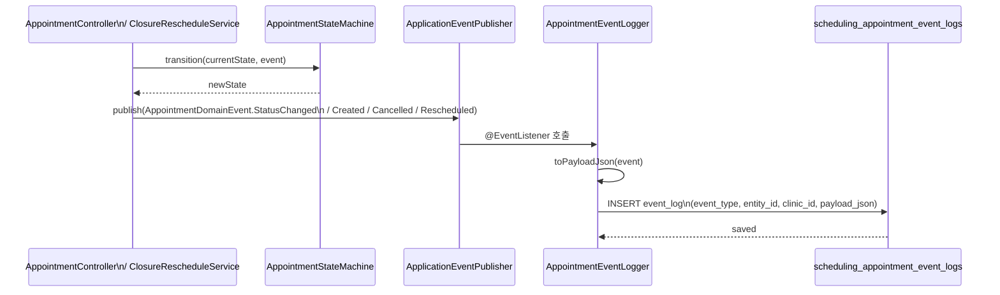
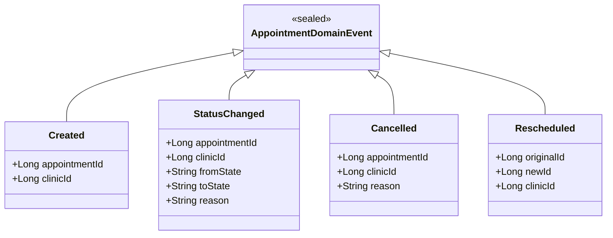

# appointment-event

예약 도메인 이벤트 정의 및 이벤트 로그 DB 저장 모듈입니다.

---

## 패키지 구조

```
io.bluetape4k.clinic.appointment.event
├── AppointmentDomainEvent.kt       # 도메인 이벤트 sealed class
├── AppointmentEventLogRecord.kt    # 이벤트 로그 Record
├── AppointmentEventLogs.kt         # Exposed Table
└── AppointmentEventLogger.kt       # Spring @EventListener 기반 로거
```

---

## 도메인 이벤트

```kotlin
sealed class AppointmentDomainEvent {
    data class StatusChanged(
        val appointmentId: Long,
        val clinicId: Long,
        val fromState: String,
        val toState: String,
        val reason: String? = null,
    ) : AppointmentDomainEvent()

    data class Created(
        val appointmentId: Long,
        val clinicId: Long,
    ) : AppointmentDomainEvent()

    data class Cancelled(
        val appointmentId: Long,
        val clinicId: Long,
        val reason: String,
    ) : AppointmentDomainEvent()

    data class Rescheduled(
        val originalId: Long,
        val newId: Long,
        val clinicId: Long,
    ) : AppointmentDomainEvent()
}
```

---

## 이벤트 로그 테이블

`scheduling_appointment_event_logs` — 모든 도메인 이벤트를 JSON payload와 함께 DB에 기록합니다.

| 칼럼 | 타입 | 설명 |
|------|------|------|
| `id` | Long | Primary Key |
| `event_type` | String | 이벤트 타입 (`Created`, `StatusChanged`, `Cancelled`, `Rescheduled`) |
| `entity_type` | String | 엔티티 타입 (항상 "Appointment") |
| `entity_id` | Long | 예약 ID 또는 원본 예약 ID |
| `clinic_id` | Long | 클리닉 ID |
| `payload_json` | Text | 이벤트 전체 JSON |
| `created_at` | Timestamp | 생성 시각 |

---

## 이벤트 로거

`AppointmentEventLogger` — Spring의 `@EventListener`를 사용하여 도메인 이벤트를 DB에 기록합니다.

```kotlin
@Component
class AppointmentEventLogger {
    @EventListener
    fun onStatusChanged(event: AppointmentDomainEvent.StatusChanged) {
        // DB에 이벤트 로그 저장
    }

    @EventListener
    fun onCreated(event: AppointmentDomainEvent.Created) {
        // DB에 이벤트 로그 저장
    }

    // ... onCancelled, onRescheduled
}
```

### 직렬화 주의사항

- 로그 payload 는 사람이 읽기 쉬운 JSON 문자열로 저장합니다.
- reason 문자열에 큰따옴표, 개행, 백슬래시가 포함되어도 깨지지 않도록 JSON escape 를 적용합니다.

---

## 이벤트 흐름



### 도메인 이벤트 타입



---

## 테스트

```bash
./gradlew :appointment-event:test
```

2026-03-28 기준 모듈 테스트 7건 통과.

---

## 의존성

- `appointment-core` 모듈의 테이블 정의 참조
- Spring Framework (ApplicationEventPublisher)
- JetBrains Exposed (v1 API)

---

## 주요 특징

- **감사 추적**: 모든 예약 상태 변경을 DB에 영구 기록
- **JSON Payload**: 이벤트 상세 정보를 구조화된 JSON으로 저장
- **Spring 통합**: ApplicationEventPublisher와 @EventListener 활용
- **Record 기반**: 불변 데이터 클래스로 안전성 확보
