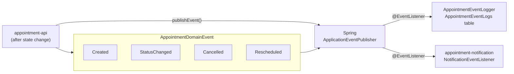

# appointment-event

[English](README.md) | [한국어](README.ko.md)

Domain event publishing, subscription, and event-log persistence based on Spring `ApplicationEvent`.

## Responsibilities

- **Does**: defines domain event types, publishes events, and persists event logs with Exposed tables.
- **Does not**: send notifications directly. Notification delivery is handled by `appointment-notification`, which subscribes to events.

## Event Types

```kotlin
sealed class AppointmentDomainEvent : ApplicationEvent {
    data class Created(val appointmentId: Long, val clinicId: Long)
    data class StatusChanged(
        val appointmentId: Long,
        val clinicId: Long,
        val fromState: String,
        val toState: String,
        val reason: String?,
    )
    data class Cancelled(val appointmentId: Long, val clinicId: Long, val reason: String)
    data class Rescheduled(val originalId: Long, val newId: Long, val clinicId: Long)
}
```

## Publishing Pattern

```kotlin
// Publish from appointment-api or appointment-core integration code.
eventPublisher.publishEvent(AppointmentDomainEvent.Created(id, clinicId))

// Subscribe from application modules.
@EventListener
fun on(event: AppointmentDomainEvent.Created) { ... }
```

## Core Classes

| Class | Role |
|--------|------|
| `AppointmentDomainEvent` | Sealed event hierarchy: Created, StatusChanged, Cancelled, Rescheduled. |
| `AppointmentEventLogger` | `@EventListener` that stores every event in `AppointmentEventLogs`. |
| `AppointmentEventLogRecord` | Event log DTO. |
| `AppointmentEventLogs` | Exposed table with event_type, appointment_id, payload_json, and occurred_at. |

## Event Flow



## Dependencies

- **Internal**: `appointment-core`
- **External**: Spring Context

## Tests

```bash
./gradlew :appointment-event:test
```
