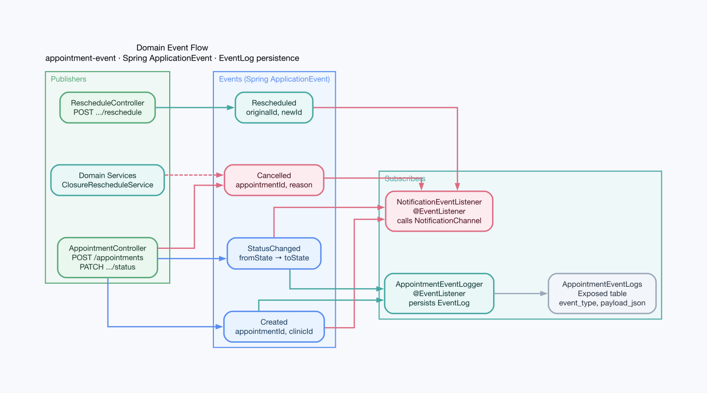

# appointment-event

[English](README.md) | [한국어](README.ko.md)

Domain event publishing, subscription, and event-log persistence based on Spring `ApplicationEvent`.

## Responsibilities

- **Does**: defines domain event types, publishes events, persists event logs, and converges trusted purchase events into appointment plans.
- **Does not**: send notifications or publish the appointment-plan outbox directly.

## Purchase Event Convergence

`PurchaseCompletedIngress` verifies producer, signature, issuer, audience,
payload hash, replay window, and bounded payload shape before protecting the
patient reference. In `WRITE` mode, `PurchaseCompletedHandler` claims the inbox,
creates the immutable plan, and inserts one pending `AppointmentPlanCreated`
outbox row in the same transaction.

Duplicate event IDs and source purchases converge. Aggregate-version gaps retry
with bounded backoff and end in quarantine after attempt 5. `SHADOW` evaluates
without writes. Production `WRITE` remains prohibited until a follow-up
transport owns outbox publish, acknowledgement, retry/DLQ, and alerts.

## Event Types

```kotlin
sealed class AppointmentDomainEvent : ApplicationEvent {
    data class Created(val appointmentId: Long, val clinicId: Long)
    data class StatusChanged(
        val appointmentId: Long,
        val clinicId: Long,
        val fromState: String,
        val toState: String,
        val reason: String?,
    )
    data class Cancelled(val appointmentId: Long, val clinicId: Long, val reason: String)
    data class Rescheduled(val originalId: Long, val newId: Long, val clinicId: Long)
}
```

## Publishing Pattern

```kotlin
// Publish from appointment-api or appointment-core integration code.
eventPublisher.publishEvent(AppointmentDomainEvent.Created(id, clinicId))

// Subscribe from application modules.
@EventListener
fun on(event: AppointmentDomainEvent.Created) { ... }
```

## Core Classes

| Class | Role |
|--------|------|
| `AppointmentDomainEvent` | Sealed event hierarchy: Created, StatusChanged, Cancelled, Rescheduled. |
| `AppointmentEventLogger` | `@EventListener` that stores every event in `AppointmentEventLogs`. |
| `AppointmentEventLogRecord` | Event log DTO. |
| `AppointmentEventLogs` | Exposed table with event_type, appointment_id, payload_json, and occurred_at. |
| `PurchaseCompletedIngress` | Trust, bounds, version-proof, and patient-reference protection boundary. |
| `PurchaseCompletedHandler` | Atomic inbox/plan/outbox convergence with duplicate and gap classification. |
| `PurchaseEventRedriveService` | Exact-quarantine dry-run and approved redrive with full identity confirmation, actor/reason, release approval references, and append-only audit. |

## Event Flow



## Dependencies

- **Internal**: `appointment-core`
- **External**: Spring Context

## Tests

```bash
./gradlew :appointment-event:test
```
