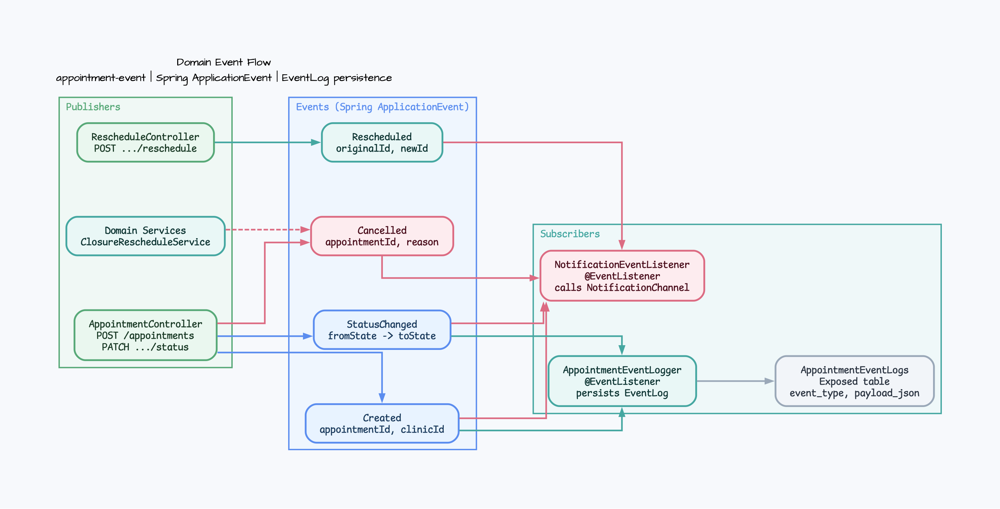

# appointment-event

[English](README.md) | [한국어](README.ko.md)

Domain event publishing, subscription, and event-log persistence based on Spring `ApplicationEvent`.

## Responsibilities

- **Does**: defines domain event types, publishes events, persists event logs, and converges trusted purchase events into appointment plans.
- **Does not**: send notifications or publish the appointment-plan outbox directly.

## Purchase Event Convergence

`PurchaseCompletedIngress` verifies producer, signature, issuer, audience,
payload hash, replay window, and bounded payload shape before protecting the
patient reference. In `WRITE` mode, `PurchaseCompletedHandler` claims the inbox,
creates the immutable plan, and inserts one pending `AppointmentPlanCreated`
outbox row in the same transaction.

Duplicate event IDs and source purchases converge. Aggregate-version gaps retry
with bounded backoff and end in quarantine after attempt 5. `SHADOW` evaluates
without writes. Production `WRITE` remains prohibited until an external
transport deployment owns outbox publish, acknowledgement, retry/DLQ, and
alerts. The visit commitment runbook defines a pre-production drill and the
evidence required before that prohibition can be lifted; it does not authorize
`WRITE` by itself.

<a id="profile-reevaluation"></a>
## Profile Change Reevaluation Event

`PatientSchedulingAssessmentChanged` is the only accepted profile-change
schema. Its fields are `eventId`, `tenantGroupId`, `clinicId`,
`patientReferenceFingerprint`, `profileRevision`, `materialChange`,
`assessmentRef`, `assessmentHash`, and `occurredAt`. It does not carry the
patient identifier, profile body, derived feature, score, explanation, or
correction detail.

`ProfileReevaluationEventService` verifies producer, signature, issuer,
audience, payload hash, schema, replay window, fingerprint shape, and
tenant/clinic membership before writing the inbox and latest-revision job in
one transaction. Duplicate events converge, a non-material change ends at the
inbox, and a newer revision makes older ready work stale. Untrusted input is
stored only as a bounded encrypted quarantine envelope in a separate
transaction.

The event module emits work; it does not decide the reservation mutation.
The API worker reevaluates `PROPOSED` and `HELD`, while `CONFIRMED` is always
skipped. See the
[workflow](../docs/superpowers/specs/2026-07-30-profile-change-reservation-reevaluation.html)
and [operations runbook](../docs/runbooks/profile-reevaluation.md).

## Booking Reliability Event Ingress

`BookingReliabilityEventIngress` accepts a strict typed schema for
`NO_SHOW`/`CANCELLED` outcomes, verifies the trusted producer envelope, and
quarantines malformed or untrusted input without copying profile data. The
event carries only tenant/clinic/member scope, responsibility, source version,
correlation, and a payload hash. The core evaluator decides eligibility; this
module only validates and persists the fact.

See the [reliability policy](../docs/booking-reliability-policy.md),
[persistence ERD](../docs/images/readme-diagrams/booking-reliability-erd-01-en.png),
and [event ingress API notes](../docs/api/booking-reliability.md).

## External Scheduling Facts

The reservation service consumes facts without taking ownership of commerce or
clinical fulfillment:

- `VisitPlanningEventIngress` and `VisitPlanningEventHandler` validate an
  immutable package execution BOM and create or revise only future plan work.
- `ProductVersionMigrationHandler` applies an authority-approved product
  version mapping while preserving completed treatment provenance.
- `ProductVersionMigrationDeclinedHandler` preserves the current version and
  records the customer-declined operational exception.
- `TreatmentFulfillmentHandler` marks exact items completed or partially
  fulfilled and dirties only blocking future dependants.
- `ExternalFactEventConsumer` routes the closed event-type allowlist and
  quarantines bounded, redacted failures. Product, purchase, consent, refund,
  and fulfillment ownership remain in their source services.

## Event Types

```kotlin
sealed class AppointmentDomainEvent : ApplicationEvent {
    data class Created(val appointmentId: Long, val clinicId: Long)
    data class StatusChanged(
        val appointmentId: Long,
        val clinicId: Long,
        val fromState: String,
        val toState: String,
        val reason: String?,
    )
    data class Cancelled(val appointmentId: Long, val clinicId: Long, val reason: String)
    data class Rescheduled(val originalId: Long, val newId: Long, val clinicId: Long)
}
```

## Publishing Pattern

```kotlin
// Publish from appointment-api or appointment-core integration code.
eventPublisher.publishEvent(AppointmentDomainEvent.Created(id, clinicId))

// Subscribe from application modules.
@EventListener
fun on(event: AppointmentDomainEvent.Created) { ... }
```

## Core Classes

| Class | Role |
|--------|------|
| `AppointmentDomainEvent` | Sealed event hierarchy: Created, StatusChanged, Cancelled, Rescheduled. |
| `AppointmentEventLogger` | `@EventListener` that stores every event in `AppointmentEventLogs`. |
| `AppointmentEventLogRecord` | Event log DTO. |
| `AppointmentEventLogs` | Exposed table with event_type, appointment_id, payload_json, and occurred_at. |
| `PurchaseCompletedIngress` | Trust, bounds, version-proof, and patient-reference protection boundary. |
| `PurchaseCompletedHandler` | Atomic inbox/plan/outbox convergence with duplicate and gap classification. |
| `PurchaseEventRedriveService` | Exact-quarantine dry-run and approved redrive with full identity confirmation, actor/reason, release approval references, and append-only audit. |
| `VisitPlanningEventIngress` | Strict package execution payload decoding, bounds, and trust verification. |
| `VisitPlanningEventHandler` | Immutable execution-plan creation and future-only revision. |
| `ProductVersionMigrationHandler` | Authority- and consent-bound product-version migration. |
| `ProductVersionMigrationDeclinedHandler` | Declined migration convergence without changing the active version. |
| `TreatmentFulfillmentHandler` | Exact fulfillment facts, partial completion, and blocking dirty-set propagation. |
| `ExternalFactEventConsumer` | Closed routing boundary for migration, decline, and fulfillment facts. |

## Event Flow



## Dependencies

- **Internal**: `appointment-core`
- **External**: Spring Context

## Tests

```bash
./gradlew :appointment-event:test
```
