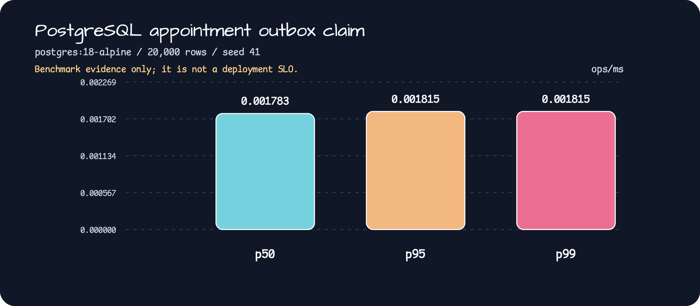

# appointment-messaging

`appointment-messaging` owns the Kafka 4 transactional-outbox delivery path for the
legacy appointment mutation stream.

## Contract

- `AppointmentOutboxWriter` is called inside the caller's Exposed `transaction {}`.
- The aggregate and the `scheduling_outbox_events` intent commit or roll back together.
- `AppointmentOutboxRelay` performs Kafka I/O outside a database transaction and uses a
  lease owner/token fence for terminal updates.
- Delivery is at-least-once. A broker acknowledgement followed by a database failure can
  publish the same immutable `eventId` again.
- The current stream is partial: create/status/cancel and final reschedule mutations are
  covered. Commitment-v2 controllers and the closure `PENDING_RESCHEDULE` transition are
  intentionally outside Issue #41.

## Installation

```kotlin
implementation(project(":appointment-messaging"))
```

Spring Boot discovers `AppointmentMessagingAutoConfiguration` from
`META-INF/spring/org.springframework.boot.autoconfigure.AutoConfiguration.imports`.
The default topic is `clinic.appointment.events`; only explicitly allow-listed topics are
accepted. Invalid lease, timeout, claim, or topic settings fail before a writer is built.

The external binding prefix is `appointment.messaging`:

```yaml
appointment:
  messaging:
    topic: clinic.appointment.events
    allowed-topics: [clinic.appointment.events]
    enabled: true
    kafka-client-retry-budget: 5s
    producer-acks: all
    producer-enable-idempotence: true
    producer-allow-auto-create-topics: false
    producer-request-timeout: 5s
    producer-delivery-timeout: 15s
    producer-metadata-timeout: 5s
    producer-security-protocol: SSL
    producer-credential-reference: secret://kafka/appointment-producer
```

`PLAINTEXT` is intended only for local development. Production must use `SSL` or
`SASL_SSL` and provide a secret-manager reference; credential values are never stored in
the outbox or emitted in logs. The producer contract is fail-closed at `acks=all`, idempotence,
auto-create disabled, and bounded request/delivery timeouts. The broker must also set
`auto.create.topics.enable=false`; Kafka producer metadata has no client-side override for that
broker policy. The application disables Spring Kafka admin topic creation and uses its
non-creating describe path before the relay is created. For `SSL`/`SASL_SSL`, the application must
provide an `AppointmentKafkaCredentialResolver` bean; it resolves the reference into only
`ssl.*`/`sasl.*` client properties without exposing the secret value to logs or the outbox.
When the Spring Kafka publisher is active, the relay uses the required `KafkaAdmin` non-creating
metadata path before claiming any outbox rows. The probe is bounded by
`producer-metadata-timeout` and checks every allow-listed topic before claiming. This keeps
missing topics and ACL/TLS/SASL failures from turning into lease churn. Custom publishers must
implement the readiness contract; a publisher without it is fail-closed and cannot claim rows.
Readiness also exposes `enabled`, `schemaValid`, and `serializerValid`; the relay remains
not-ready until the V22 columns/indexes and codec self-check pass.
When Spring Boot Actuator is present, the module registers the
`appointmentMessagingHealthIndicator` health component. Broker outage, operator pause, or a
held relay reports `OUT_OF_SERVICE` for readiness while application liveness remains independent;
invalid configuration, schema, or serializer state reports `DOWN`. Configure the Actuator
readiness group to include this component (for example,
`management.endpoint.health.group.readiness.include=readinessState,appointmentMessagingHealthIndicator`).
The health details contain only bounded readiness booleans.

Micrometer integration publishes low-cardinality `appointment_outbox_pending`,
`appointment_outbox_oldest_age_seconds`, and `appointment_outbox_partition_skew` gauges alongside
publish/retry/failure counters. No tenant, clinic, appointment, partition key, payload, or credential
value is used as a metric label.

An HTTP `2xx` means the aggregate and durable outbox intent committed. It does not mean
Kafka acknowledgement; broker outage leaves the row `PENDING` for the relay.

## Operations

The relay must be paused and held before schema rollback or manual redrive. Release the hold
only after the V22 schema/index and broker readiness checks pass. See
`docs/runbooks/appointment-messaging-operations.md` and the alert rules in
`docs/alerts/appointment-messaging-rules.yml`.

## PostgreSQL benchmark

The production-schema claim path has a separate `kotlinx-benchmark` module. It applies
the PostgreSQL Flyway migrations and calls the real store through Hikari and Exposed.
Run the Docker-backed smoke or full measurement from the repository root:

```bash
./gradlew :appointment-messaging-benchmark:mainSmokeBenchmark
./gradlew :appointment-messaging-benchmark:mainBenchmark
```



See the [baseline JSON](../docs/benchmarks/appointment-messaging-postgresql-baseline.json)
for the fixed seed, row count, and p50/p95/p99 throughput. These values are benchmark
evidence, not deployment SLOs.

| Percentile | Throughput |
|------------|------------:|
| p50 | 0.001783 ops/ms |
| p95 | 0.001815 ops/ms |
| p99 | 0.001815 ops/ms |

### PostgreSQL consumer inbox benchmark (Issue #42)

The same `kotlinx-benchmark` module measures the tenant-scoped consumer inbox on the
PostgreSQL V23 schema. It uses synthetic tenant `7` and clinic `31`, HikariCP plus Exposed,
one JMH fork, two warm-up iterations, and five measured iterations. The duplicate path
looks up the `(logicalConsumerId, logicalStreamId, eventId)` key; cleanup deletes at most
32 processed metadata rows per call. The dataset is held at 10,000 or 100,000 inbox rows.
The values below are measured evidence, not deployment SLOs.

| Operation | Inbox rows | p50 (ops/ms) | p95 (ops/ms) | p99 (ops/ms) |
|-----------|-----------:|-------------:|-------------:|-------------:|
| bounded cleanup | 10,000 | 0.109366 | 0.137452 | 0.137452 |
| bounded cleanup | 100,000 | 0.043797 | 0.045377 | 0.045377 |
| duplicate lookup | 10,000 | 0.520153 | 0.545037 | 0.545037 |
| duplicate lookup | 100,000 | 0.536926 | 0.578639 | 0.578639 |

The raw-payload-free [consumer baseline JSON](../docs/benchmarks/appointment-messaging-consumer-postgresql-baseline.json)
records the PostgreSQL image, row scenarios, batch bound, benchmark configuration, and
source report path. Reproduce it with `./gradlew :appointment-messaging-benchmark:mainBenchmark`;
the existing chart above remains the outbox claim visualization, while consumer values are
kept in this table and the dedicated artifact.

The V23 consumer contract also persists a five-minute processing lease. Expired
`PROCESSING` rows can be reclaimed, active duplicates are retried without acknowledgement,
and malformed/tombstone/schema-rejected records retain only broker provenance and a SHA-256
payload hash in the rejected ledger. Quarantined inbox rows remain as deduplication tombstones.

Run the focused module checks with:

```bash
./gradlew :appointment-messaging:test
```
