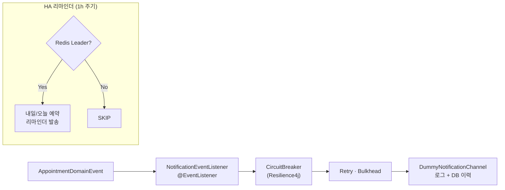

# appointment-notification

Redis Leader Election + Resilience4j 기반 고가용성(HA) 알림 스케줄러.
도메인 이벤트 구독으로 예약 상태 변경 알림 발송, 전날/당일 리마인더 지원.

## 책임

- **하는 것**: 도메인 이벤트 → 알림 발송, 리마인더 스케줄링, 알림 이력 DB 저장, Resilience4j 장애 격리
- **하지 않는 것**: `appointment-api`에 의존하지 않음, 직접 예약 CRUD 없음

## 핵심 클래스

| 클래스 | 역할 |
|--------|------|
| `NotificationChannel` | 알림 채널 인터페이스 — channelType, sendCreated/Confirmed/Cancelled/Rescheduled/Reminder |
| `DummyNotificationChannel` | 기본 구현 — 로그 출력 + DB 이력 저장, 항상 SUCCESS |
| `ResilientNotificationChannel` | Resilience4j CircuitBreaker/Retry/Bulkhead 래핑 |
| `NotificationEventListener` | `@EventListener` — AppointmentDomainEvent 구독 → NotificationChannel 호출 |
| `AppointmentReminderScheduler` | `@Scheduled(1시간)` — 내일/오늘 CONFIRMED 예약 리마인더, 중복 방지 |
| `NotificationHistoryRepository` | 알림 이력 조회/저장 |
| `NotificationAutoConfiguration` | Spring `@Configuration` — 자동 빈 등록 |

## 알림 처리 흐름



→ 전체 시나리오: [user-scenarios.md S5](../docs/requirements/user-scenarios.md#s5-ha-알림-리마인더-발송-스케줄러)

## HA 구성

다중 인스턴스에서 단일 노드만 스케줄러 실행:

```kotlin
@Scheduled(fixedRate = 3_600_000)
fun sendReminders() {
    if (!leaderElection.isLeader()) return
    // 이하 발송 로직
}
```

Redis SETNX 기반 `bluetape4k-leader` 라이브러리 사용.

## 설정 예시

```yaml
scheduling:
  notification:
    enabled: true
    events:
      created: true
      confirmed: true
      cancelled: true
      rescheduled: true
    reminder:
      enabled: true
      day-before: true
      same-day: true
      same-day-hours-before: 2
    resilience:
      circuit-breaker:
        failure-rate-threshold: 50
        wait-duration-in-open-state: 30s
      retry:
        max-attempts: 3
        wait-duration: 1s
      bulkhead:
        max-concurrent-calls: 10
```

## 의존성

- **내부**: `appointment-core`, `appointment-event`
- **외부**: `bluetape4k-leader`, `bluetape4k-lettuce`, `bluetape4k-resilience4j`, `bluetape4k-exposed-jdbc`

## 테스트 실행

```bash
./gradlew :appointment-notification:test
```

## 설계 문서

- [알림 모듈 설계 전체](../docs/requirements/notification.md)
