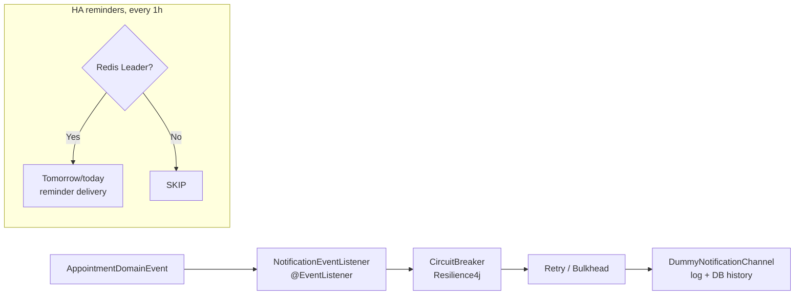

# appointment-notification

[English](README.md) | [한국어](README.ko.md)

High-availability notification scheduler built on Redis Leader Election and Resilience4j.
It subscribes to domain events, sends appointment status notifications, and supports day-before and same-day reminders.

## Responsibilities

- **Does**: converts domain events to notifications, schedules reminders, stores notification history, and isolates failures with Resilience4j.
- **Does not**: depend on `appointment-api` or perform appointment CRUD directly.

## Core Classes

| Class | Role |
|--------|------|
| `NotificationChannel` | Notification channel interface with channelType and sendCreated/Confirmed/Cancelled/Rescheduled/Reminder operations. |
| `DummyNotificationChannel` | Default implementation that logs output, stores DB history, and always returns SUCCESS. |
| `ResilientNotificationChannel` | Wraps a channel with Resilience4j CircuitBreaker, Retry, and Bulkhead. |
| `NotificationEventListener` | `@EventListener` that subscribes to AppointmentDomainEvent and calls NotificationChannel. |
| `AppointmentReminderScheduler` | Hourly `@Scheduled` reminder sender for tomorrow/today CONFIRMED appointments, with duplicate prevention. |
| `NotificationHistoryRepository` | Reads and writes notification history. |
| `NotificationAutoConfiguration` | Spring `@Configuration` that registers notification beans. |

## Notification Flow



Scenario details: [user-scenarios.md S5](../docs/requirements/user-scenarios.md#s5-ha-알림-리마인더-발송-스케줄러)

## HA Configuration

Only one node runs the scheduler in a multi-instance deployment:

```kotlin
@Scheduled(fixedRate = 3_600_000)
fun sendReminders() {
    if (!leaderElection.isLeader()) return
    // send reminders
}
```

This module uses the Redis SETNX based `bluetape4k-leader` library.

## Configuration Example

```yaml
scheduling:
  notification:
    enabled: true
    events:
      created: true
      confirmed: true
      cancelled: true
      rescheduled: true
    reminder:
      enabled: true
      day-before: true
      same-day: true
      same-day-hours-before: 2
    resilience:
      circuit-breaker:
        failure-rate-threshold: 50
        wait-duration-in-open-state: 30s
      retry:
        max-attempts: 3
        wait-duration: 1s
      bulkhead:
        max-concurrent-calls: 10
```

## Dependencies

- **Internal**: `appointment-core`, `appointment-event`
- **External**: `bluetape4k-leader`, `bluetape4k-lettuce`, `bluetape4k-resilience4j`, `exposed-jdbc`

## Tests

```bash
./gradlew :appointment-notification:test
```

## Design Documents

- [Full Notification Module Design](../docs/requirements/notification.md)
