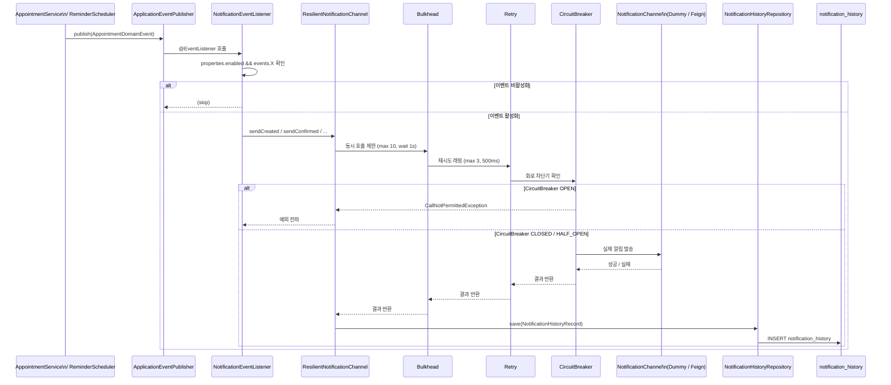
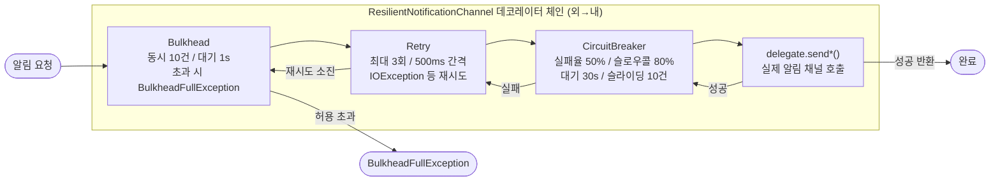
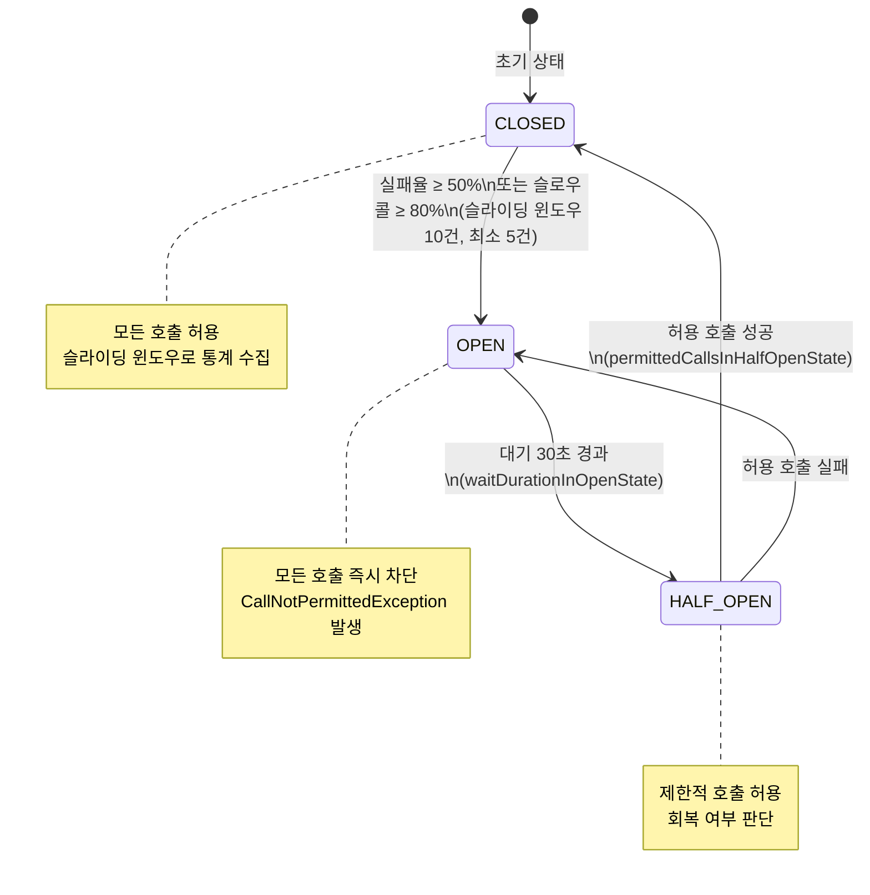
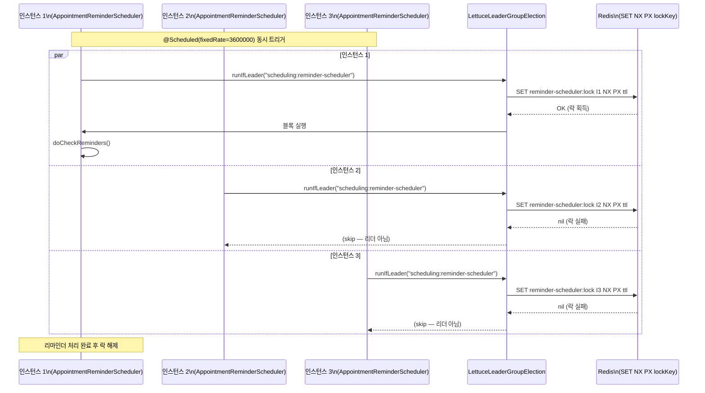
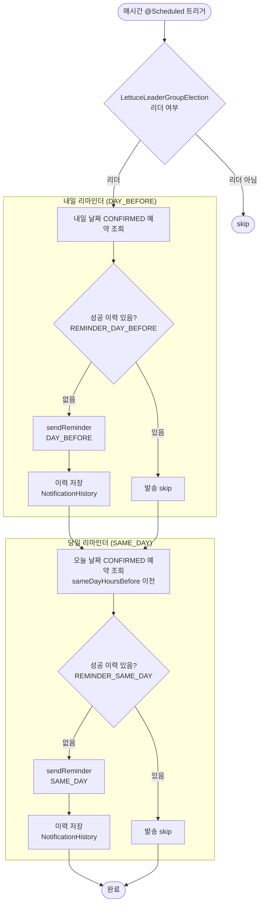

# appointment-notification

## 개요

예약 시스템의 알림(Notification) 모듈입니다. 도메인 이벤트 기반으로 예약 생성/확정/취소/재배정 알림을 발송하고, 스케줄러를 통해 리마인더를 전송합니다.

## 주요 기능

- **이벤트 기반 알림**: Spring `@EventListener`로 예약 도메인 이벤트(Created, Confirmed, Cancelled, Rescheduled) 수신 → 알림 발송
- **리마인더 스케줄러**: 매시간 실행되어 내일/당일 예약에 리마인더 발송 (중복 방지)
- **플러그인 채널**: `NotificationChannel` 인터페이스로 알림 채널 추상화, 운영 환경에서 Feign 기반 구현체로 교체 가능
- **이벤트별 on/off**: `NotificationProperties`로 이벤트별, 리마인더별 활성화/비활성화 설정
- **발송 이력**: `NotificationHistoryTable`에 모든 알림 발송 이력 저장
- **HA 리더 선출**: `LettuceLeaderGroupElection`으로 분산 환경에서 스케줄러 1개 인스턴스만 실행
- **장애 격리**: Resilience4j CircuitBreaker + Retry + Bulkhead로 외부 알림 서비스 장애 격리
- **중복 방지**: 성공 이력이 있는 리마인더는 재발송하지 않음

## 아키텍처

```
AppointmentDomainEvent
    ↓ (Spring Event)
NotificationEventListener
    ↓
ResilientNotificationChannel (CircuitBreaker + Retry + Bulkhead)
    ↓
NotificationChannel (interface)
    ├── DummyNotificationChannel (기본 - 로그 + 이력 저장)
    └── FeignNotificationChannel (운영 - 외부 서비스 호출)
    ↓
NotificationHistoryRepository → NotificationHistoryTable

AppointmentReminderScheduler
    ├── LettuceLeaderGroupElection (HA 리더 선출)
    └── ResilientNotificationChannel → NotificationChannel
```

### 알림 발송 플로우



### Resilience4j 데코레이터 체인



### CircuitBreaker 상태 전이



## 리마인더 동작

- `AppointmentReminderScheduler` 는 매시간 실행되어 대상 날짜의 `CONFIRMED` 예약을 조회합니다.
- 리마인더 대상 조회는 특정 클리닉에 고정하지 않고, 해당 날짜의 전체 예약을 기준으로 수행합니다.
- `NotificationHistoryRepository.existsByAppointmentAndEventType(...)` 로 성공 이력을 확인해 중복 발송을 막습니다.

## 설정

```yaml
scheduling:
    notification:
        enabled: true
        events:
            created: true
            confirmed: true
            cancelled: true
            rescheduled: true
        reminder:
            enabled: true
            day-before: true
            same-day: true
            same-day-hours-before: 2
        resilience:
            circuit-breaker:
                failure-rate-threshold: 50
                slow-call-rate-threshold: 80
                wait-duration-in-open-state: 30s
                sliding-window-size: 10
                minimum-number-of-calls: 5
            retry:
                max-attempts: 3
                wait-duration: 500ms
            bulkhead:
                max-concurrent-calls: 10
                max-wait-duration: 1s
```

## 주요 컴포넌트

| 클래스                                | 설명                                         |
|------------------------------------|--------------------------------------------|
| `NotificationChannel`              | 알림 채널 인터페이스                                |
| `DummyNotificationChannel`         | 더미 구현체 (로그 + DB 이력)                        |
| `ResilientNotificationChannel`     | Resilience4j 데코레이터 (CB + Retry + Bulkhead) |
| `NotificationEventListener`        | 도메인 이벤트 → 알림 발송 리스너                        |
| `AppointmentReminderScheduler`     | 리마인더 스케줄러 (매시간, HA 리더 선출)                  |
| `NotificationHistoryRepository`    | 알림 이력 저장/조회                                |
| `NotificationProperties`           | 알림 설정 프로퍼티                                 |
| `NotificationResilienceProperties` | Resilience4j 설정 프로퍼티                       |
| `NotificationAutoConfiguration`    | Spring Boot Auto-Configuration             |

## HA 구성

분산 환경(다중 인스턴스)에서 리마인더 스케줄러가 중복 실행되지 않도록 `LettuceLeaderGroupElection`을 사용합니다.

```kotlin
// Redis 연결이 있으면 자동으로 리더 선출 활성화
// maxLeaders = 1 (기본값) → 1개 인스턴스만 스케줄러 실행
@Bean
@ConditionalOnBean(StatefulRedisConnection::class)
fun notificationLeaderElection(connection: StatefulRedisConnection<String, String>) =
    connection.leaderGroupElection()
```

Redis가 없으면 리더 선출 없이 모든 인스턴스에서 실행됩니다 (단일 인스턴스 환경).

### LeaderGroupElection — 분산 리더 선출 흐름



### 리마인더 스케줄러 처리 흐름



## 장애 격리

외부 알림 서비스 호출 시 `ResilientNotificationChannel`이 자동 적용됩니다.

| 패턴             | 기본값             | 설명            |
|----------------|-----------------|---------------|
| CircuitBreaker | 실패율 50%, 대기 30s | 연속 실패 시 회로 차단 |
| Retry          | 최대 3회, 간격 500ms | 일시적 장애 재시도    |
| Bulkhead       | 동시 10건, 대기 1s   | 동시 호출 제한      |

## 사용 예제

```kotlin
// 커스텀 알림 채널 구현 (Feign 등)
@Component
class FeignNotificationChannel(
    private val notificationClient: NotificationFeignClient,
    private val historyRepository: NotificationHistoryRepository,
): NotificationChannel {
    override val channelType = "FEIGN"

    override fun sendCreated(appointment: AppointmentRecord) {
        notificationClient.send(CreateNotificationRequest(appointment))
    }
    // ...
}
```

## 테스트

```bash
./gradlew :appointment-notification:test
```

- `DummyNotificationChannelTest` — 알림 발송 → 이력 저장 검증 (8개)
- `NotificationEventListenerTest` — 이벤트 수신 → 알림 호출 검증 (8개)
- `NotificationHistoryRepositoryTest` — 이력 CRUD + 중복 체크 검증 (6개)
- `ResilientNotificationChannelTest` — CircuitBreaker + Retry + Bulkhead 검증 (8개)
- `AppointmentReminderSchedulerTest` — 날짜 기준 조회 + 중복 발송 방지 검증 (2개)

2026-03-28 기준 모듈 테스트 41건 통과.

## 의존성

- `appointment-core` — 예약/클리닉/의사/진료유형 조회
- `appointment-event` — 도메인 이벤트 구독
- Resilience4j (`CircuitBreaker`, `Retry`, `Bulkhead`)
- Lettuce / leader election — 다중 인스턴스 스케줄러 조율
