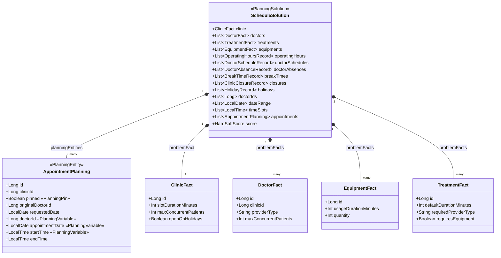
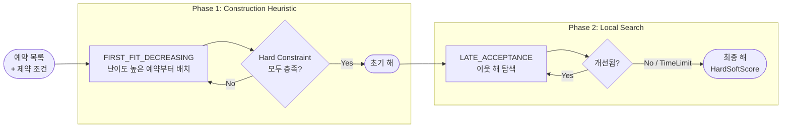
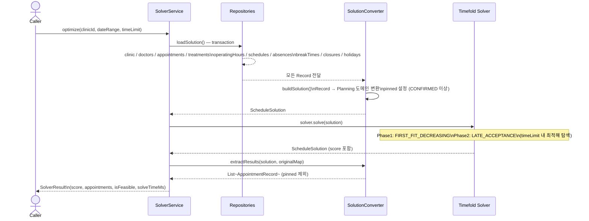
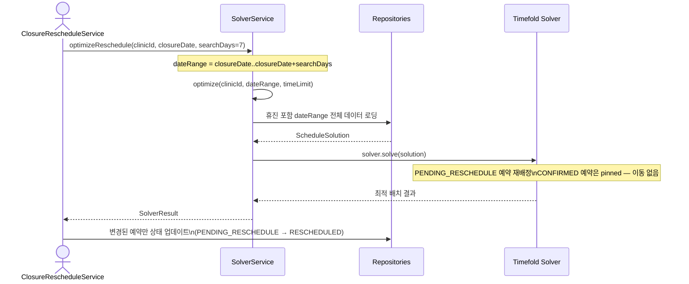
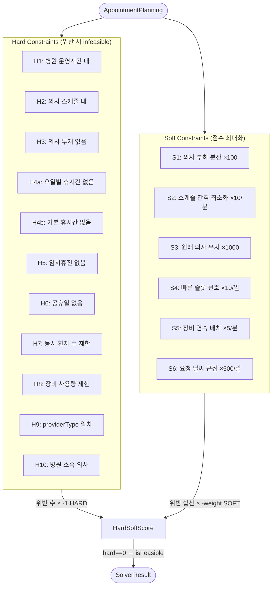

# appointment-solver

## 개요

Timefold Solver 기반의 병원 예약 스케줄링 최적화 엔진입니다. 복수의 예약을 동시에 고려하여 전역 최적 배치를 수행합니다.

## 주요 기능

- **배치 최적화**: 특정 날짜 범위의 예약을 전역 최적으로 재배치
- **임시휴진 재배정**: 휴진 영향 예약의 전역 최적 재스케줄링
- **2단계 최적화**: FIRST_FIT_DECREASING 구축 → LATE_ACCEPTANCE 지역 탐색
- **Custom MoveFilter**: 무효한 이동(휴진, 부재, 공휴일, providerType 불일치) 사전 필터링
- **Hard Constraints 11개**: 영업시간, 의사스케줄, 부재, 휴식, 휴진, 공휴일, 시간겹침, 동시환자수, 장비, providerType, 클리닉소속
- **Soft Constraints 6개**: 부하분산, 간격최소화, 원래의사유지, 빠른슬롯, 장비효율, 요청일근접

## 아키텍처

- **Planning Entity**: `AppointmentPlanning` (doctorId, appointmentDate, startTime)
  - `@PlanningPin` — CONFIRMED 예약은 이동하지 않음
  - `AppointmentDifficultyComparator` — FFD용 난이도 비교기 (장비필요 > 시간 > 요청일)
- **Planning Solution**: `ScheduleSolution` (Problem Facts + Planning Entities)
- **Constraint Streams API**: 선언적 제약 정의 (`HardConstraints`, `SoftConstraints`)
- **SolutionConverter**: core Record ↔ solver domain 변환
- **AppointmentMoveFilter**: 무효 이동 사전 필터링

### Planning 도메인 클래스 구조



## 2단계 최적화 전략



## 최적화 실행 시퀀스

### optimize() — 기간 전체 배치 최적화



### optimizeReschedule() — 임시휴진 재배정



## Constraint 평가



## SlotCalculationService와의 공존

| 시나리오 | 서비스 |
|---------|--------|
| 환자가 빈 슬롯 조회 | SlotCalculationService (실시간, 단건) |
| 관리자 배치 최적화 | SolverService.optimize (전역 최적) |
| 임시휴진 재배정 | SolverService.optimizeReschedule |

## 사용 예제

```kotlin
val solverService = SolverService()
val result = solverService.optimize(
    clinicId = 1L,
    dateRange = LocalDate.of(2026, 3, 23)..LocalDate.of(2026, 3, 27),
    timeLimit = Duration.ofSeconds(30),
)
if (result.isFeasible) {
    result.appointments.forEach { println(it) }
}
```

## 테스트

```bash
# 전체 테스트
./gradlew :appointment-solver:test

# ConstraintVerifier 단위 테스트 (20개)
./gradlew :appointment-solver:test --tests "*.ConstraintVerifierTest"

# SolverService 통합 테스트 (4개)
./gradlew :appointment-solver:test --tests "*.SolverServiceTest"

# Benchmark 성능 테스트 (3개, "benchmark" 태그)
./gradlew :appointment-solver:test --tests "*.BenchmarkTest"
```

2026-03-28 기준 모듈 테스트 27건 통과.

### Benchmark 규모

| 규모 | 의사 | 예약 | 시간 제한 |
|------|------|------|-----------|
| 소규모 | 2명 | 10건 | 10초 |
| 중규모 | 5명 | 30건 | 15초 |
| 대규모 | 10명 | 100건 | 30초 |

## 의존성

```kotlin
api(project(":appointment-core"))
api(Libs.timefold_solver_core)
implementation(Libs.timefold_solver_benchmark)
```
