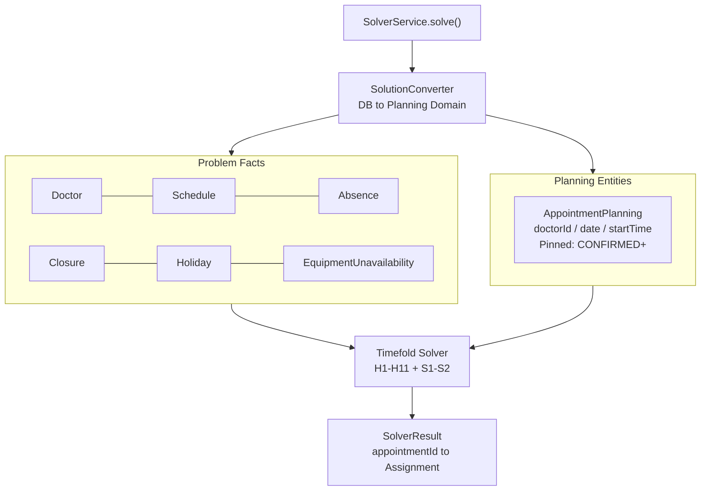

# appointment-solver

[English](README.md) | [한국어](README.ko.md)

Timefold Solver based AI appointment scheduler.
It optimizes bulk appointment placement across the global schedule while satisfying 11 hard constraints and 2 soft constraints.

## Responsibilities

- **Does**: assigns planning variables such as doctor, date, and start time; satisfies all hard constraints; minimizes soft-constraint penalties.
- **Does not**: provide real-time single-slot lookup, which belongs to `SlotCalculationService`; write results directly to the database, because `SolverService` returns results to its caller.

## Constraint Summary

Hard constraints (11):

- business hours
- doctor schedule
- doctor absence
- day-of-week rest
- default break time
- temporary clinic closure
- holiday
- concurrent patient capacity
- equipment availability
- treatment-type and doctor matching
- equipment unavailability windows

Soft constraints (2):

- doctor load balancing, weight 100
- schedule gap minimization, weight 10

Full details: [solver.md](../docs/requirements/solver.md)

## Core Classes

| Class | Role |
|--------|------|
| `AppointmentPlanning` | `@PlanningEntity`; doctorId, appointmentDate, and startTime are planning variables. Pinned statuses are fixed. |
| `ScheduleSolution` | `@PlanningSolution`; contains AppointmentPlanning entries and problem facts. |
| `SolverService` | Entry point; loads data from the database, runs SolverConfig, and returns the result. |
| `SolverConfig` | Timefold SolverFactory configuration, including termination and move filters. |
| `SolutionConverter` | Converts between DB records and the planning domain. |
| `AppointmentConstraintProvider` | Registers all constraints, H1-H11 and S1-S2. |
| `EquipmentUnavailabilityFact` | Problem fact for equipment unavailability windows used by H11. |

## Solver Data Flow



Full flow: [data-flow.md](../docs/requirements/data-flow.md#6-solver-데이터-흐름)

## Pinned Appointments

`@PlanningPin` prevents Solver from moving appointments in the following states:

- **Pinned**: `CONFIRMED`, `CHECKED_IN`, `IN_PROGRESS`, `COMPLETED`
- **Movable**: `REQUESTED`, `PENDING_RESCHEDULE`

## Usage Example

```kotlin
val result: SolverResult = solverService.solve(
    clinicId = 1L,
    appointmentIds = listOf(10L, 11L, 12L),
    dateRange = LocalDate.now()..LocalDate.now().plusDays(7),
)
// result.assignments: Map<Long, Assignment>
// appointmentId -> (doctorId, date, startTime)
```

## Dependencies

- **Internal**: `appointment-core`
- **External**: `ai.timefold.solver:timefold-solver-core`, `exposed-jdbc`

## Tests

```bash
./gradlew :appointment-solver:test
```

## Benchmarks

```bash
./gradlew :appointment-solver:test --tests "*.SolverBenchmarkTest"
```

HTML reports are generated under `build/reports/solver-benchmark/`.

Details: [solver-benchmark-report.md](../docs/requirements/solver.md#벤치마크)

## Design Documents

- [Full Solver Design](../docs/requirements/solver.md)
