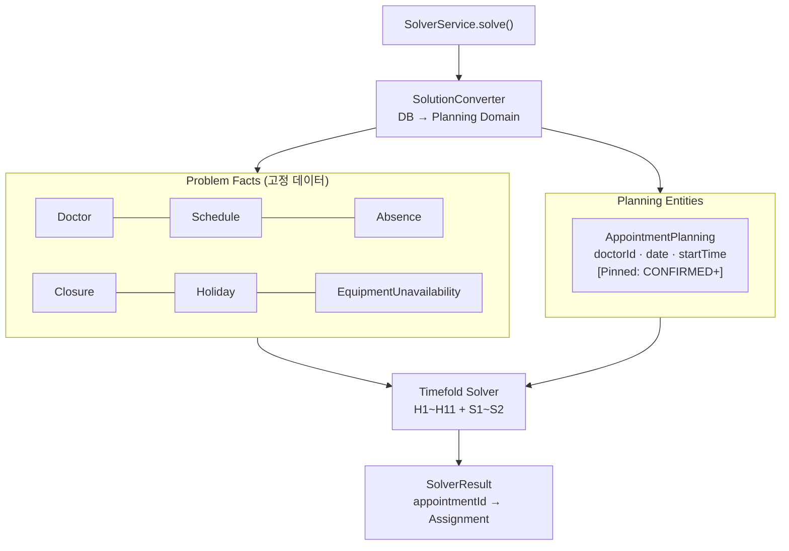

# appointment-solver

Timefold Solver 기반 AI 예약 최적화 스케줄러.
대량 예약을 동시에 고려하여 11개 Hard + 2개 Soft 제약을 만족하는 전역 최적 배치를 수행.

## 책임

- **하는 것**: Planning Variable(의사, 날짜, 시작시간) 최적 배정, Hard 제약 전부 충족, Soft 제약 최소화
- **하지 않는 것**: 실시간 단건 슬롯 조회 (→ `SlotCalculationService`), DB 직접 쓰기 (→ `SolverService`가 결과 반환 후 호출자가 저장)

## 제약조건 요약

Hard (11개): 영업시간, 의사 스케줄, 의사 부재, 요일 휴식, 기본 휴식, 임시휴진, 공휴일, 동시 환자 수, 장비 가용성, 진료유형-의사 매칭, 장비 사용불가 구간

Soft (2개): 의사 부하 분산(가중치 100), 스케줄 갭 최소화(가중치 10)

→ 전체 제약조건 상세: [solver.md](../docs/requirements/solver.md)

## 핵심 클래스

| 클래스 | 역할 |
|--------|------|
| `AppointmentPlanning` | `@PlanningEntity` — doctorId, appointmentDate, startTime이 결정 변수. status가 Pinned 상태면 고정 |
| `ScheduleSolution` | `@PlanningSolution` — AppointmentPlanning 목록 + Problem Facts |
| `SolverService` | 진입점 — DB에서 데이터 로드 → SolverConfig 실행 → 결과 반환 |
| `SolverConfig` | Timefold SolverFactory 설정 (termination, moveFilters) |
| `SolutionConverter` | DB Record ↔ Planning Domain 변환 |
| `AppointmentConstraintProvider` | 모든 제약 등록 (H1~H11, S1~S2) |
| `EquipmentUnavailabilityFact` | Problem Fact — 장비 사용불가 구간 데이터 (H11 제약용) |

## Solver 데이터 흐름



→ 전체 흐름: [data-flow.md](../docs/requirements/data-flow.md#6-solver-데이터-흐름)

## Pinned 예약

`@PlanningPin` — 아래 상태의 예약은 Solver가 이동 불가:
- **고정**: `CONFIRMED`, `CHECKED_IN`, `IN_PROGRESS`, `COMPLETED`
- **이동 가능**: `REQUESTED`, `PENDING_RESCHEDULE`

## Solver 실행 예시

```kotlin
val result: SolverResult = solverService.solve(
    clinicId = 1L,
    appointmentIds = listOf(10L, 11L, 12L),
    dateRange = LocalDate.now()..LocalDate.now().plusDays(7)
)
// result.assignments: Map<Long, Assignment> — appointmentId → (doctorId, date, startTime)
```

## 의존성

- **내부**: `appointment-core`
- **외부**: `ai.timefold.solver:timefold-solver-core`, `bluetape4k-exposed-jdbc`

## 테스트 실행

```bash
./gradlew :appointment-solver:test
```

## 벤치마크

```bash
./gradlew :appointment-solver:test --tests "*.SolverBenchmarkTest"
```

결과는 `build/reports/solver-benchmark/` 에 HTML 리포트로 생성됩니다.

→ 상세: [solver-benchmark-report.md](../docs/requirements/solver.md#벤치마크)

## 설계 문서

- [Solver 설계 전체](../docs/requirements/solver.md)
