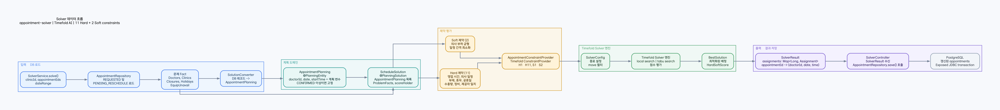
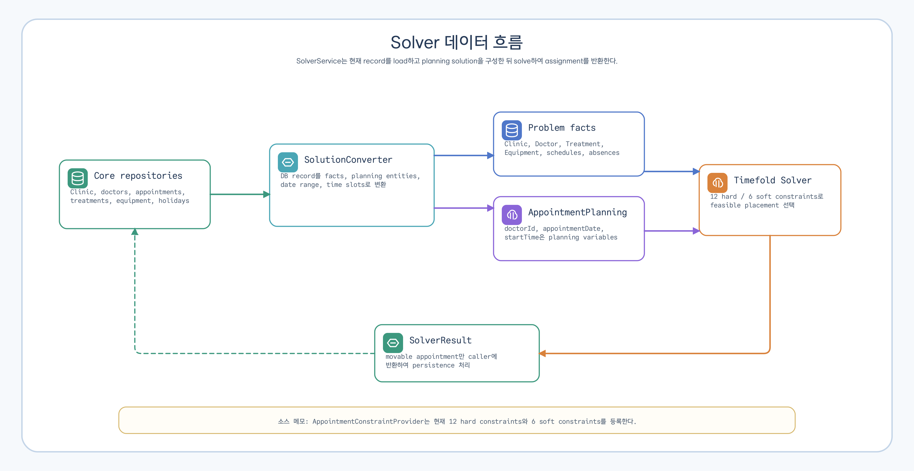

# appointment-solver

[한국어 본문](README.md) | [한국어 참고본](README.ko.md)

Timefold Solver 기반 AI 예약 최적화 스케줄러.
대량 예약을 동시에 고려하여 12개 Hard + 6개 Soft 제약을 만족하는 전역 최적 배치를 수행합니다.

## 책임

- **하는 것**: Planning Variable(의사, 날짜, 시작시간) 최적 배정, Hard 제약 전부 충족, Soft 제약 최소화
- **하지 않는 것**: 실시간 단건 슬롯 조회 (→ `SlotCalculationService`), DB 직접 쓰기 (→ `SolverService`가 결과 반환 후 호출자가 저장)

## 제약조건 요약

Hard (12개): 영업시간, 의사 스케줄, 의사 부재, 설정 휴식시간, 기본 휴식시간, 임시휴진, 공휴일, 동시 환자 수, 장비 가용성, 진료유형-의사 매칭, 의사 클리닉 소속, 장비 사용불가 구간

Soft (6개): 의사 부하 분산(가중치 100), 스케줄 갭 최소화(가중치 10), 기존 담당의 선호, 이른 슬롯 선호, 장비 활용 선호, 요청일 선호

→ 전체 제약조건 상세: [solver.md](../docs/requirements/solver.md)

## 핵심 클래스

| 클래스 | 역할 |
|--------|------|
| `AppointmentPlanning` | `@PlanningEntity` — doctorId, appointmentDate, startTime이 결정 변수. status가 Pinned 상태면 고정 |
| `ScheduleSolution` | `@PlanningSolution` — AppointmentPlanning 목록 + Problem Facts |
| `SolverService` | 진입점 — DB에서 데이터 로드 → SolverConfig 실행 → 결과 반환 |
| `SolverConfig` | Timefold SolverFactory 설정 (termination, moveFilters) |
| `SolutionConverter` | DB Record ↔ Planning Domain 변환 |
| `AppointmentConstraintProvider` | 모든 제약 등록 (H1~H12, S1~S6) |
| `EquipmentUnavailabilityFact` | Problem Fact — 장비 사용불가 구간 데이터 (H11 제약용) |

## Solver 데이터 흐름






→ 전체 흐름: [data-flow.md](../docs/requirements/data-flow.md#6-solver-데이터-흐름)

## Pinned 예약

`@PlanningPin` — 아래 상태의 예약은 Solver가 이동 불가:
- **고정**: `CONFIRMED`, `CHECKED_IN`, `IN_PROGRESS`, `COMPLETED`
- **이동 가능**: `REQUESTED`, `PENDING_RESCHEDULE`

## Solver 실행 예시

```kotlin
val result: SolverResult = solverService.optimize(
    scope = TenantClinicScope(tenantGroupId = 1L, clinicId = 23L),
    dateRange = LocalDate.now()..LocalDate.now().plusDays(7),
)
// result.assignments: Map<Long, Assignment> — appointmentId → (doctorId, date, startTime)
```

## 의존성

- **내부**: `appointment-core`
- **외부**: `ai.timefold.solver:timefold-solver-core`, `exposed-jdbc`

## 테스트 실행

```bash
./gradlew :appointment-solver:test
```

## 벤치마크

```bash
./gradlew :appointment-solver:test --tests "*solver.benchmark.BenchmarkTest"
```

이 명령은 고정 dataset의 score/time 임계값을 검증하는 JUnit 테스트이며, 결과는
`appointment-solver/build/reports/tests/test/`와 테스트 XML의 `system-out`에 기록됩니다.
`local/benchmark/` 보고서는 `BenchmarkConfig.createBenchmarkFactory`를 호출하는 별도
Planner Benchmark 실행 경로에서만 생성되며 이 테스트 명령은 해당 factory를 호출하지 않습니다.

→ 상세: [solver-benchmark-report.md](../docs/requirements/solver.md#벤치마크)

## 설계 문서

- [Solver 설계 전체](../docs/requirements/solver.md)

## Tenant 범위 최적화

`optimize`와 `optimizeReschedule`은 같은 검증된 `TenantClinicScope`를 요구합니다.
snapshot, fact query, source-version map, 적용 직전 freshness 검사는 모두 이 범위
안에서 수행하며 thread-local tenant context는 사용하지 않습니다. solver 결과는
읽기 전용이고, 변경 적용 직전에 `verifySourceVersions`가 성공한 경우에만 사용합니다.
