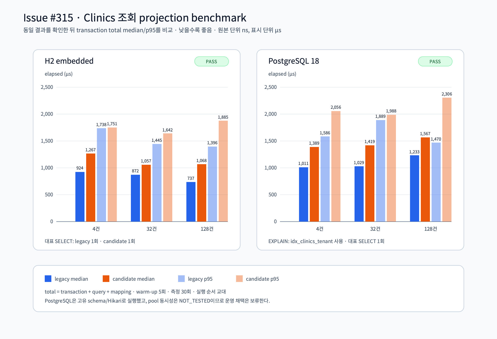

# Issue #315 Spring Data projection 파일럿 결과

## 결론

`Clinics` 조회 전용 Spring Data projection은 기존 `ClinicRepository`와 같은
필드·tenant 격리·`id ASC` 결과를 만들고, H2와 PostgreSQL에서 대표 조회를
각각 단일 SELECT로 수행했다. 다만 이번 파일럿의 total median은 모든 측정
구간에서 candidate가 legacy보다 느렸고, full-row DAO와 pool 동시성 미검증
경계도 남아 있다. 따라서 production route·repository 교체는 하지 않고
기존 Table DSL을 유지한다. Issue #315의 운영 채택 판정은 **보류**다.

## 기능·안전 게이트

| 게이트 | 증거 | 상태 |
|---|---|---|
| 결과·정렬 동일성 | H2/PostgreSQL 테스트에서 `ClinicRecord` equality와 `id ASC` 확인 | PASS |
| tenant 격리·입력 계약 | tenant A/B, unknown positive, `0`/negative 입력 테스트 | PASS |
| transaction wiring | Spring synchronization, `DataSourceUtils`와 Exposed physical connection identity, 단일 `springTransactionManager` | PASS |
| SQL/N+1 | typed PartTree predicate, `ORDER BY id ASC`, legacy/candidate representative SELECT 각 1회 | PASS |
| lifecycle | sentinel default/primary 복원, refresh/callback 실패, context close 실패와 suppressed 예외 보존 | PASS |
| PostgreSQL backend | 고유 `issue315_*` schema, bounded Hikari pool, `statement_timeout=5000ms`, `lock_timeout=2000ms` | PASS |
| PostgreSQL `EXPLAIN` | `idx_clinics_tenant` index scan 확인; 작은 fixture의 sort는 계획에 남음 | PASS |
| raw evidence secret scan | URL/credential sanitization 후 `gitleaks --no-git --config .gitleaks.toml` | PASS |
| pool 동시성 | 단일 worker benchmark만 실행 | **NOT_TESTED** |
| production 채택 | full-row column-level projection·authz route·동시성 증거 없음 | **보류** |

## 성능 결과

측정은 cardinality 4/32/128건, warm-up 5회, measured 30회이며
`LEGACY_FIRST`/`CANDIDATE_FIRST`를 교대했다. 값은 transaction begin/commit,
조회와 mapping을 포함한 total elapsed이고 raw 단위는 ns이다.

| Backend | 건수 | legacy median / p95 (ns) | candidate median / p95 (ns) | candidate median 증감 |
|---|---:|---:|---:|---:|
| H2 | 4 | 924,250 / 1,738,084 | 1,266,833 / 1,750,583 | +37.1% |
| H2 | 32 | 871,959 / 1,444,917 | 1,057,459 / 1,641,708 | +21.3% |
| H2 | 128 | 736,833 / 1,396,458 | 1,068,416 / 1,885,375 | +45.0% |
| PostgreSQL 18 | 4 | 1,010,834 / 1,585,541 | 1,388,667 / 2,056,000 | +37.4% |
| PostgreSQL 18 | 32 | 1,029,125 / 1,888,500 | 1,419,083 / 1,987,709 | +37.9% |
| PostgreSQL 18 | 128 | 1,232,792 / 1,470,375 | 1,567,208 / 2,306,250 | +27.1% |

candidate는 결과·SQL 단순성의 이점은 보였지만 이번 범위에서 성능 우위는
입증하지 못했다. component timing은 진단용으로만 기록했으며, 채택 비교는
동일한 total metric을 사용했다.

## 산출물과 재현

- 원본 측정: [`raw/h2-run.txt`](raw/h2-run.txt), [`raw/postgresql-run.txt`](raw/postgresql-run.txt)
- 단일 chart data: [`chart.data.json`](chart.data.json)
- 차트: [`chart.svg`](chart.svg), [`chart.png`](chart.png)
- semantic ledger: [`chart.semantic.json`](chart.semantic.json)
- 테스트/fixture: [`ClinicSpringDataProjectionPilotTest.kt`](../../../../appointment-api/src/test/kotlin/io/bluetape4k/clinic/appointment/api/projection/ClinicSpringDataProjectionPilotTest.kt)



```bash
./gradlew --no-daemon :appointment-api:test --tests \
  "io.bluetape4k.clinic.appointment.api.projection.ClinicSpringDataProjectionPilotTest"

./gradlew --no-daemon :appointment-api:test \
  -Dspring.profiles.active=test-postgresql \
  --tests "io.bluetape4k.clinic.appointment.api.projection.ClinicSpringDataProjectionPilotTest"
```

PostgreSQL 실행은 `Containers.Postgres` singleton과 Colima Docker context를
사용하며, 테스트가 만든 고유 schema는 pool close 뒤 drop하고
`pg_namespace` 부재를 read-back한다. 두 raw 파일은 저장 전에 sanitization을
거쳤고 secret scan은 PASS다.

## 남은 작업과 판정 경계

1. `poolConcurrency = NOT_TESTED`: 다중 호출 대기·pool contention·동시 종료를
   검증하는 별도 adoption 이슈가 필요하다.
2. full-row DAO가 읽는 column 범위와 column-level projection은 production
   전환 전에 별도 설계·보안 검토가 필요하다.
3. 실제 authenticated route에 적용할 경우 tenant predicate를 authz로
   간주하지 말고 `TenantClinicAccessChecker`를 유지해야 한다.
4. runtimeClasspath exact forbidden-match 0, fresh bootJar exact pilot class
   match 0, `appointment-api:test` 836 passing/3 pending와 `build` 성공을
   확인했다. 이 경계를 통과한 뒤에도 위 세 조건이 해소되기 전까지는 기존
   `ClinicRepository`를 유지한다.
