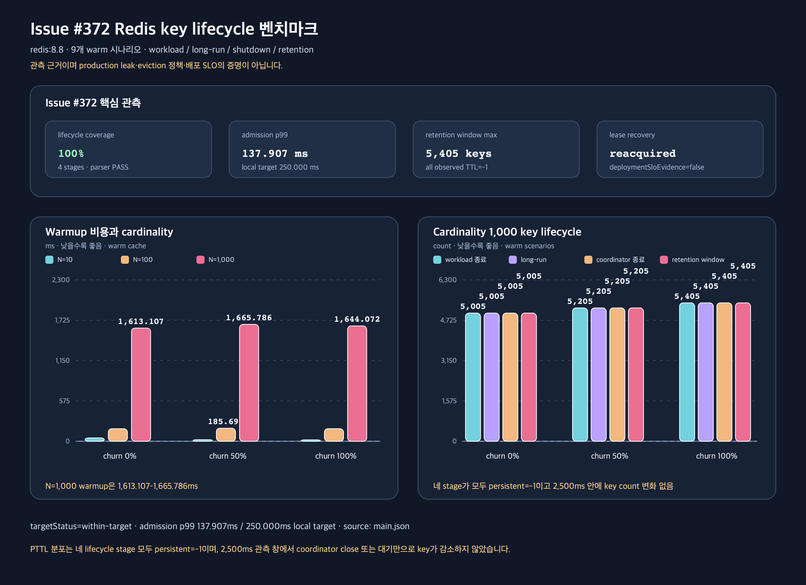

# Issue #372 Redis clinic permit key lifecycle 반복 관측 분석

## 목적과 범위

[Issue #372](https://github.com/bluetape4k/clinic-appointment/issues/372)는
notification clinic permit의 Redis key prefix, TTL, idle eviction, 명시적 cleanup
책임과 cardinality/churn에 따른 장기 key retention을 확인하는 후속 작업이다. 이
문서는 Redis `8.8` 로컬 characterization 결과와 현재 코드의 책임 경계를 함께
기록한다.

이번 작업은 production semaphore, fencing, rollout flag, 운영 SLO를 변경하지 않는다.
관측 결과의 `deploymentSloEvidence=false`도 이 범위를 기계적으로 보존한다. 따라서
아래 결과는 leak 판정이나 배포 SLO 증명이 아니라, 다음 production-like 관측을
설계할 수 있는 근거다.

## 코드 근거와 재현

| 항목 | 근거 |
|---|---|
| GitHub 이슈 | [Issue #372](https://github.com/bluetape4k/clinic-appointment/issues/372) |
| clinic registry와 idle 상한 | `appointment-notification/src/main/kotlin/io/bluetape4k/clinic/appointment/notification/NotificationOutboxConcurrencyCoordinator.kt` (`MAX_IDLE_ENTRIES=256`) |
| Redis semaphore factory | 같은 파일의 `LettuceNotificationPermitSemaphoreFactory` |
| lifecycle 측정 harness | `appointment-notification/src/test/kotlin/io/bluetape4k/clinic/appointment/notification/RedisNotificationKeyLifecycleBenchmark.kt` |
| Redis 고정 계약 | `appointment-notification/src/test/kotlin/io/bluetape4k/clinic/appointment/notification/Redis88Launcher.kt` |
| Gradle 진입점 | `appointment-notification/build.gradle.kts`의 `redisKeyLifecycleBenchmarkSmoke`, `redisKeyLifecycleBenchmark` |
| JSON 계약 검증 | `scripts/validate-issue372-redis-key-lifecycle-benchmark.mjs` |
| 차트 생성기 | `scripts/generate-issue372-redis-key-lifecycle-chart.mjs` |
| 전체 raw report | [main.json](main.json) |

실행 명령은 다음과 같다. Gradle 의존 서비스는 기존 bluetape4k singleton launcher를
통해 Redis `8.8` 컨테이너로 기동한다.

```bash
./gradlew :appointment-notification:redisKeyLifecycleBenchmarkSmoke --no-build-cache
./gradlew :appointment-notification:redisKeyLifecycleBenchmark --no-build-cache
node scripts/validate-issue372-redis-key-lifecycle-benchmark.mjs \
  --input appointment-notification/build/reports/redis-key-lifecycle/main/redis-notification-key-lifecycle.json \
  --target-admission-p99-ms 250 \
  --target-lifecycle-coverage 1
node scripts/generate-issue372-redis-key-lifecycle-chart.mjs \
  --input docs/benchmarks/issue-372-redis-key-lifecycle-benchmark/main.json \
  --output docs/benchmarks/issue-372-redis-key-lifecycle-benchmark/charts/issue-372-redis-key-lifecycle-chart-ko.svg
cairosvg docs/benchmarks/issue-372-redis-key-lifecycle-benchmark/charts/issue-372-redis-key-lifecycle-chart-ko.svg \
  -o docs/benchmarks/issue-372-redis-key-lifecycle-benchmark/charts/issue-372-redis-key-lifecycle-chart-ko.png -s 2
```

main 설정은 시나리오당 80개 operation, 3개 round(초기 workload 1회와 long-run
2회), 동시성 16, action 2ms, retention 관측 창 2,500ms를 사용한다. warm/cold,
cardinality `10/100/1,000`, churn `0/50/100%`의 18개 조합을 측정한다. smoke는
더 작은 cardinality와 24개 operation으로 parser와 lifecycle 계약을 빠르게
확인한다.

## 코드에서 확인한 lifecycle 책임

| 질문 | 현재 코드와 측정의 의미 |
|---|---|
| key prefix는 무엇인가? | sibling `bluetape4k-projects`의 `deriveSemaphoreKeys`가 `$namespace:{$hashTag}:semaphore:$name:<kind>`를 만들고, clinic factory는 별도로 `$namespace:{$hashTag}:capacity-contract:$name`을 사용한다. 관측 harness는 namespace를 UUID로 격리한다. |
| capacity contract에 TTL이 있는가? | `capacity-contract`는 `SET ... NX`로 한 번 기록하고 `PX/EX`를 지정하지 않는다. 따라서 이 키 자체는 persistent 계약이다. |
| expirable key는 무엇인가? | semaphore protocol은 `available`, `generation`, `capacity`, `allocations`, `allocation-leases`, `leases`, `deadlines`, `requests`를 관리한다. 각 lease의 만료 정리는 Redis server time을 기준으로 하며 command 한 번당 `cleanupBatchLimit=64`로 제한된다. |
| idle eviction 상한은 무엇인가? | `MAX_IDLE_ENTRIES=256`은 JVM 내부 `DistributedClinicPermitRegistry`의 idle entry 수 상한이다. 초과한 idle entry는 registry에서 제거하고 permit client를 닫지만, Redis namespace 전체의 key retention 상한이나 `DEL` 계약이 아니다. |
| normal shutdown은 무엇을 하는가? | coordinator close와 factory close는 cache/connection/semaphore client를 닫는다. `capacity-contract`나 semaphore key prefix 전체를 명시적으로 삭제하지 않는다. |
| cleanup은 언제 일어나는가? | expirable allocation cleanup은 Redis-time 기반의 lazy/bounded 동작이다. 후속 semaphore command가 실행될 때 만료 allocation을 일부 처리할 수 있지만, 단순히 client를 닫고 기다리는 것만으로 전체 prefix가 삭제된다고 가정할 수 없다. |

## lifecycle 관측 결과

차트와 raw report는 warm cardinality `1,000`에서 세 churn 수준을 lifecycle stage별로
비교한다. 아래 `key`는 각 stage에서 prefix로 조회한 Redis key 수이고,
`persistent`는 `PTTL=-1`인 key 수다.

| warm churn | warmup (ms) | workload 종료 key | long-run 2회차 key | coordinator 종료 key | retention 2,500ms key | persistent |
|---:|---:|---:|---:|---:|---:|---:|
| 0% | 1,613.107 | 5,005 | 5,005 | 5,005 | 5,005 | 5,005 |
| 50% | 1,665.786 | 5,205 | 5,205 | 5,205 | 5,205 | 5,205 |
| 100% | 1,644.072 | 5,405 | 5,405 | 5,405 | 5,405 | 5,405 |

세 수준 모두 네 lifecycle stage의 key 수가 같고, 모든 관측 key의 `PTTL`은 `-1`이었다.
관측된 key 종류는 `available`, `capacity`, `capacity-contract`, `generation`,
`requests`이며, warm cardinality `1,000`/churn `100%`에서는 종류별 1,081개였다.
이는 이번 workload가 lease를 각 operation 안에서 release하여 retention 시점에
활성 allocation key를 남기지 않았다는 뜻이지, 운영 traffic에서 expirable key가
항상 즉시 제거된다는 뜻은 아니다.

전체 report는 admission sample 4,320개, 성공 3,821개, backpressure 499개를
기록했다. lifecycle observation coverage는 `1.000`이고, lease recovery는
`reacquired`였다. smoke도 coverage `1.000`, admission p99 `138.514ms`,
`reacquired`를 기록했다.



차트의 왼쪽 패널은 warm cardinality별 준비 시간을, 오른쪽 패널은 cardinality
`1,000`의 churn별 네 stage key 수를 보여준다. 모든 막대에는 raw JSON의
`data-source`가 SVG에 남아 있으며, semantic ledger는
[issue-372-redis-key-lifecycle-chart.semantic.json](charts/issue-372-redis-key-lifecycle-chart.semantic.json)에
보존한다.

## local threshold와 baseline 비교

`250ms`는 기존 Issue #369 parser와 일치하는 local admission p99 threshold다. 운영
SLO가 아니며, 이 작업의 primary metric은 성능 개선이 아니라 lifecycle observation
coverage `1.000`이다.

| 검증 항목 | 결과 | 판정 |
|---|---:|---|
| lifecycle coverage | 1.000 / target 1.000 | PASS |
| main admission p99 | 137.907ms / local target 250ms | PASS |
| smoke admission p99 | 138.514ms / local target 250ms | PASS |
| fresh main baseline p99 범위 | 137.045–139.704ms | 후보 p99가 범위의 최댓값보다 낮음 |
| warm N=1,000 준비 시간 최댓값 | 1,665.786ms | 기존 반복 최댓값 1,691.780ms 이내 |
| lease recovery | reacquired | PASS |
| deployment SLO 증거 | false | 이 작업의 범위 밖 |

기존 Issue #369 harness는 primitive semaphore를 하나 더 만들어 warm N=1,000의 key
수를 `5,010/5,210/5,410`으로 보고했다. 이번 전용 lifecycle harness는 clinic
permit 경로만 관측하므로 `5,005/5,205/5,405`가 되며, 두 harness의 절대 key 수를
성능 회귀로 직접 비교하지 않는다. 이번 판단은 전용 harness 내부에서 네 stage가
동일한지와 parser가 요구한 coverage를 확인하는 데 한정한다.

## 결정과 다음 관측 경계

1. **운영 코드 변경 없음**: prefix, TTL, idle eviction, close, lazy cleanup의 현재
   책임을 코드와 Redis snapshot으로 확인했으므로 semaphore/fencing 동작을 수정하지
   않는다.
2. **이번 결과는 characterization-only**: 2개 long-run round와 2,500ms retention
   창에서 key가 줄지 않았지만, 이것만으로 leak 또는 무기한 retention을 판정하지
   않는다.
3. **다음 production-like 관측이 필요함**: 실제 traffic 비율, allocator/lease
   churn, Redis memory/DBSIZE, process restart와 장시간 idle을 포함한 별도 실험이
   있어야 cleanup 책임과 운영 threshold를 결정할 수 있다.

## 증명되지 않은 항목과 위험

- 한 대의 macOS/Colima 환경과 Redis `8.8`만 측정했으므로 운영 배포 전체를 대표하지
  않는다.
- `KEYS "$namespace:*"` snapshot은 이 격리된 benchmark에서만 사용한다. 운영 코드에
  broad key scan을 추가한 것이 아니다.
- 이번 workload는 각 operation의 lease를 release한 뒤 close하므로, retention
  window에 남은 persistent key는 coordination metadata다. 활성 lease가 쌓이는
  production traffic의 memory/cleanup 비용은 측정하지 않았다.
- `MAX_IDLE_ENTRIES=256`은 in-process cache eviction 상한이며 Redis key 삭제 정책이
  아니다.
- `deploymentSloEvidence=false`이므로 rollout, capacity planning, production SLO
  판정에 이 report를 재사용하지 않는다.

## 문서 검수

| 항목 | 결과 |
|---|---|
| 문제·범위·독자와 제외 범위 명시 | PASS |
| raw JSON·차트·semantic ledger 연결 | PASS |
| prefix/TTL/idle eviction/cleanup 책임 구분 | PASS |
| normal shutdown retention과 long-run 관측 분리 | PASS |
| local threshold와 unknown 운영 증거 명시 | PASS |
| 운영 semaphore/fencing 변경 없음 | PASS |
