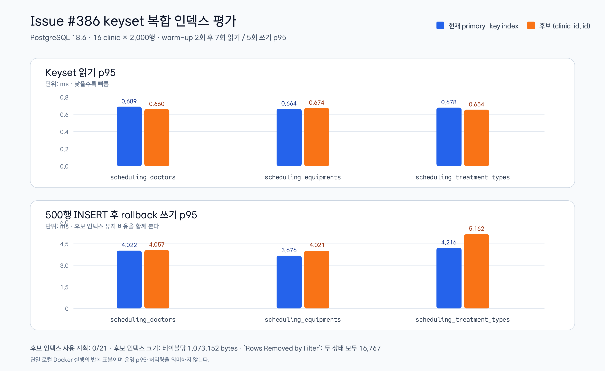

# Issue #386 keyset 복합 인덱스 평가

## 결론

PostgreSQL 18.6 singleton에서 `scheduling_doctors`,
`scheduling_equipments`, `scheduling_treatment_types`를 각각 32,000행으로
채우고, 16개 clinic에 2,000행씩 분산해 keyset 조회를 반복했다. 세 테이블 모두
`(clinic_id, id)` 후보 인덱스를 만든 뒤에도 측정한 21개 계획이 기존
`*_pkey`를 선택했다. 후보 인덱스는 읽기 계획의 `Rows Removed by Filter`를 줄이지
못했고, 테이블마다 1,073,152 bytes를 추가했다.

따라서 이번 범위에서는 Flyway migration과 API SQL 변경을 추가하지 않고 현재
스키마를 유지한다. 후보 인덱스를 생성한 뒤 제거하는 롤백도 확인했다.

## 반복 측정 결과

| 테이블 | 현재 읽기 p95 (ms) | 후보 읽기 p95 (ms) | 현재 쓰기 p95 (ms) | 후보 쓰기 p95 (ms) | 후보 계획이 사용한 인덱스 | `Rows Removed by Filter` |
|---|---:|---:|---:|---:|---|---:|
| `scheduling_doctors` | 0.689 | 0.660 | 4.022 | 4.057 | `scheduling_doctors_pkey` | 16,767 |
| `scheduling_equipments` | 0.664 | 0.674 | 3.676 | 4.021 | `scheduling_equipments_pkey` | 16,767 |
| `scheduling_treatment_types` | 0.678 | 0.654 | 4.216 | 5.162 | `scheduling_treatment_types_pkey` | 16,767 |

읽기는 각 상태에서 warm-up 2회 뒤 `EXPLAIN (ANALYZE, BUFFERS)`를 7회
실행했다. 쓰기는 500행 `INSERT`를 트랜잭션에서 실행하고 `ROLLBACK`하는 샘플을
5회 수집했다. 읽기 계획은 두 상태 모두 50행을 반환했고, `OFFSET`은 사용하지
않았다. 원문 계획·시간·버퍼·쓰기 샘플은 테스트가 생성하는 다음 파일에 남는다.

`appointment-api/build/reports/performance/issue-386-keyset-index-assessment.txt`

## 측정 조건

- 이미지: `postgres:18-alpine`, PostgreSQL `18.6`, `aarch64-unknown-linux-musl`
- `shared_buffers=128MB`, `random_page_cost=4`
- 1개 tenant, 16개 clinic, clinic마다 2,000행
- 대상 clinic: `3860108`, cursor: `3860116008`, `LIMIT 50`
- 기존 인덱스: 각 테이블의 primary-key index만 존재
- 테스트: `ClinicKeysetIndexAssessmentTest`

이 결과는 하나의 로컬 Docker 실행에서 얻은 반복 표본이다. 운영 cardinality,
동시 쓰기량, 실제 캐시 상태, p95 처리량을 대신하지 않으므로 운영 성능 목표나
배포 승인 근거로 사용하지 않는다.

## 배포·롤백 판단

| 항목 | 판단 |
|---|---|
| Flyway migration | 추가하지 않음. 현재 keyset SQL에서 후보 인덱스가 선택되지 않았고 읽기 개선을 재현하지 못했다. |
| API SQL | 변경하지 않음. Issue #386 범위 밖이며 후보 인덱스만으로 계획이 바뀌지 않았다. |
| 롤아웃 | 보류. 운영 cardinality와 쓰기 패턴을 확보한 별도 측정이 먼저다. |
| 롤백 | 테스트에서 후보 인덱스를 제거하고 `to_regclass(...) IS NULL`을 확인했다. |

운영 데이터에서 후보 인덱스가 실제로 선택되는 증거가 생기면, 해당 cardinality와
동시 쓰기 조건을 고정한 별도 이슈에서 migration·배포·롤백 절차를 다시 승인받는다.
