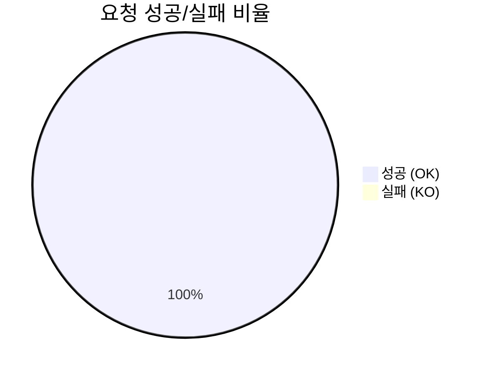
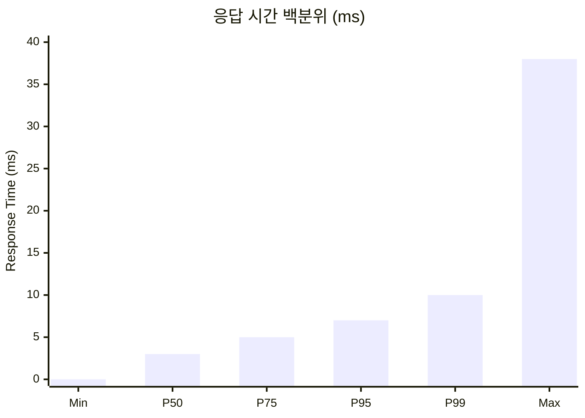
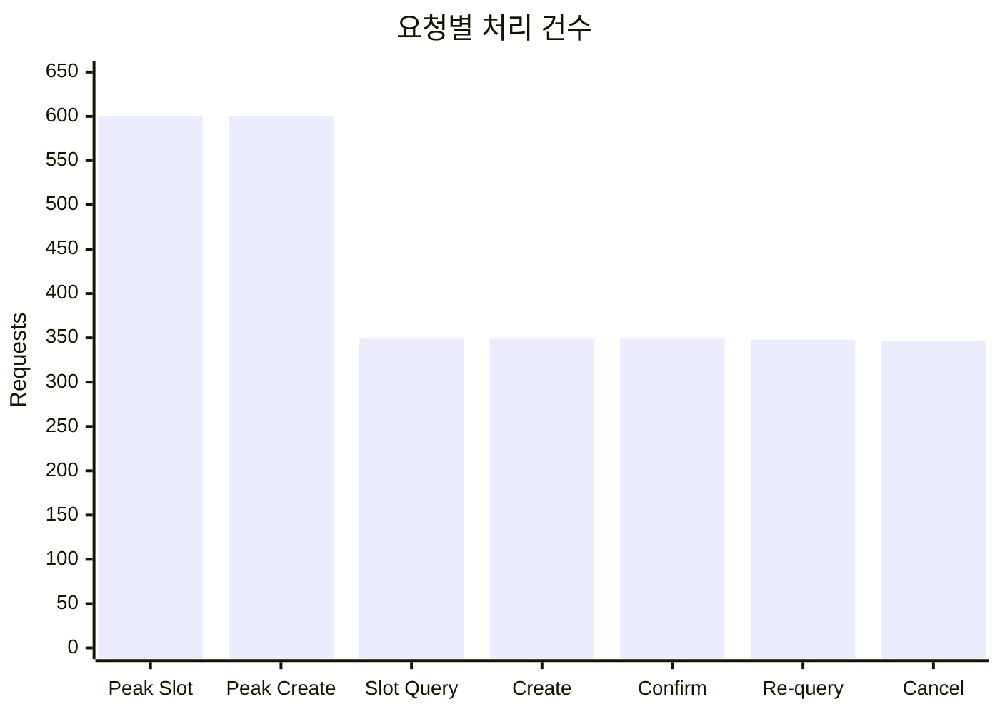
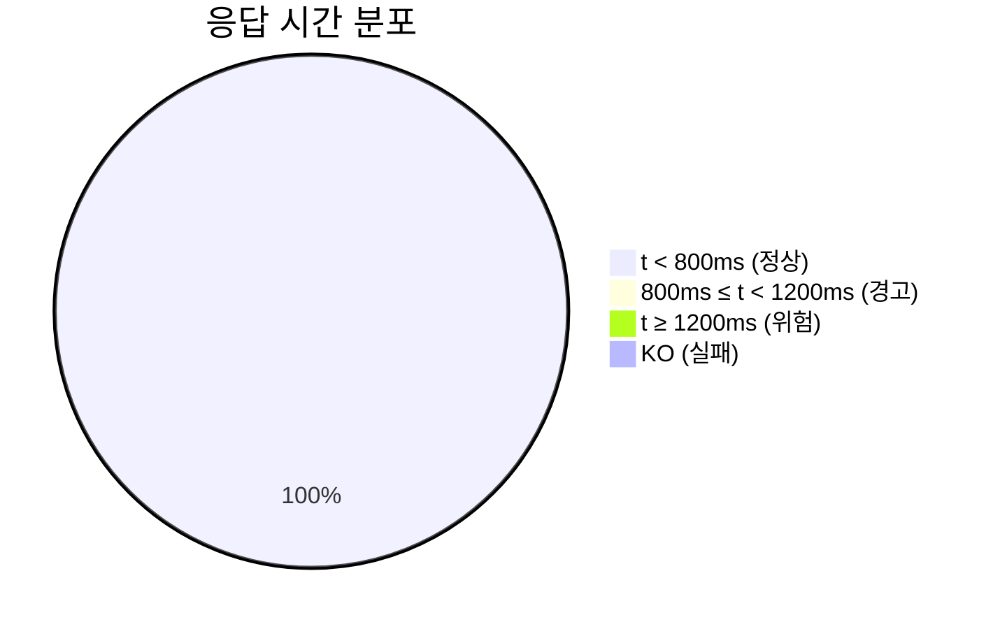
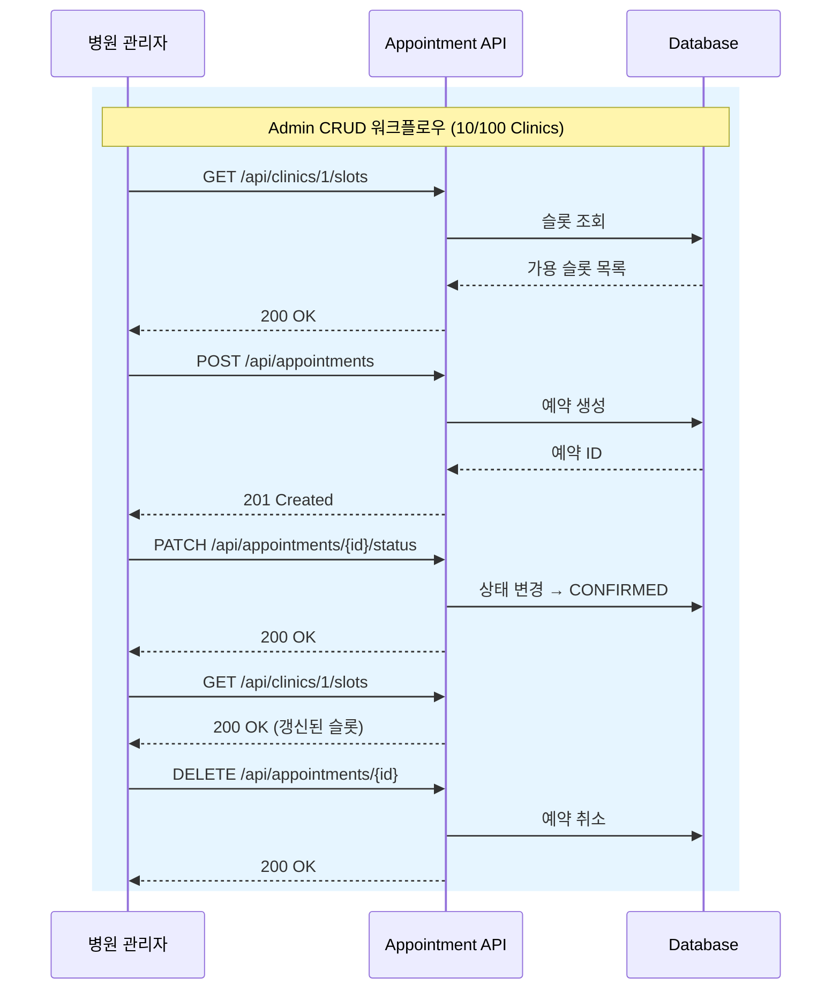

# Gatling 멀티 클리닉 부하 테스트 결과

**실행일시:** 2026-04-19 18:36:46 KST  
**시뮬레이션:** `MultiClinicScaleSimulation`  
**서버 환경:** Spring Boot 4.0.5 / H2 인메모리 / dev 프로파일  
**Gatling 버전:** 3.15.0  
**HTML 리포트:** [`docs/gatling-reports/multi-clinic-scale-20260419/index.html`](gatling-reports/multi-clinic-scale-20260419/index.html)

---

## 시나리오 구성

```mermaid
gantt
    title 부하 주입 타임라인
    dateFormat s
    axisFormat %Ss

    section 10 Clinic Admins
    10 users ramp (×5 반복) :a1, 0, 30s

    section 100 Clinic Admins
    100 users ramp (×3 반복) :a2, 0, 60s

    section 100 Clinics Peak
    300 users ramp (×2 반복) :a3, 0, 60s
```



| 시나리오 | 동시 사용자 | Ramp 기간 | 워크플로우 반복 | 설명 |
|----------|------------|-----------|----------------|------|
| 10 Clinic Admins | 10명 | 30초 | 5회 | 소규모 병원 관리자 CRUD |
| 100 Clinic Admins | 100명 | 60초 | 3회 | 대규모 병원 관리자 CRUD |
| 100 Clinics Peak | 300명 | 60초 | 2회 | 피크 부하 (슬롯 조회 + 예약 생성) |

---

## 전체 결과 요약



| 지표 | 값 |
|------|-----|
| 총 요청 수 | **2,950** |
| 성공 (OK) | **2,950 (100%)** |
| 실패 (KO) | **0 (0%)** |
| 총 시뮬레이션 시간 | **60초** |
| 평균 처리량 | **48.36 rps** |

---

## 응답 시간 분석



| 지표 | 값 (ms) |
|------|---------|
| 최소 응답 시간 | 0 |
| 최대 응답 시간 | 38 |
| 평균 응답 시간 | 4 |
| 표준 편차 | 2 |
| P50 (중간값) | 3 |
| P75 | 5 |
| **P95** | **7** |
| P99 | 10 |

---

## 요청별 상세 결과



| 요청 | Total | OK | KO |
|------|-------|-----|-----|
| Peak - Slot Query | 600 | 600 | 0 |
| Peak - Create Appointment | 600 | 600 | 0 |
| Slot Query | 349 | 349 | 0 |
| Create Appointment | 349 | 349 | 0 |
| Confirm Appointment | 349 | 349 | 0 |
| Slot Re-query | 348 | 348 | 0 |
| Cancel Appointment | 347 | 347 | 0 |

---

## 응답 시간 분포



---

## Assertions 결과

```mermaid
quadrantChart
    title Assertion 달성도
    x-axis "낮음" --> "높음"
    y-axis "실패" --> "성공"
    P95 응답시간: [0.993, 0.95]
    실패율: [1.0, 0.95]
```

| Assertion | 기준 | 실측 | 달성률 | 결과 |
|-----------|------|------|--------|------|
| P95 응답 시간 ≤ 1000ms | 1,000ms | **7ms** | 99.3% 여유 | **PASS** |
| 실패율 ≤ 5% | 5.0% | **0.0%** | 100% 여유 | **PASS** |

---

## 워크플로우 다이어그램



---

## 결론

- 모든 시나리오에서 **100% 성공률** 달성
- P95 응답 시간 **7ms**로 목표(1000ms) 대비 **99.3% 여유**
- 300명 동시 사용자 피크 부하에서도 안정적 응답
- 전체 요청이 800ms 미만으로 처리됨

### 권장 사항

| 항목 | 설명 |
|------|------|
| PostgreSQL 재측정 | H2 인메모리 대비 실제 DB I/O 반영 필요 |
| 동시성 증가 테스트 | 500~1000명 규모 추가 시나리오 |
| 장시간 부하 | 5분 이상 sustained load로 메모리 누수 확인 |
| 멀티 클리닉 시드 | ClinicController CRUD 구현 후 실제 clinicId 분산 |

---

## 실행 방법

```bash
# 1. 서버 시작
./gradlew :appointment-api:bootRun

# 2. Gatling 실행
./gradlew :appointment-api:gatlingRun --simulation=io.bluetape4k.clinic.appointment.api.MultiClinicScaleSimulation

# 3. HTML 리포트 확인
open appointment-api/build/reports/gatling/*/index.html
```

---

## 파일 참조

| 파일 | 설명 |
|------|------|
| `docs/gatling-reports/multi-clinic-scale-20260419/` | HTML 리포트 (영구 보관) |
| `appointment-api/src/gatling/kotlin/.../MultiClinicScaleSimulation.kt` | 시뮬레이션 소스 |
