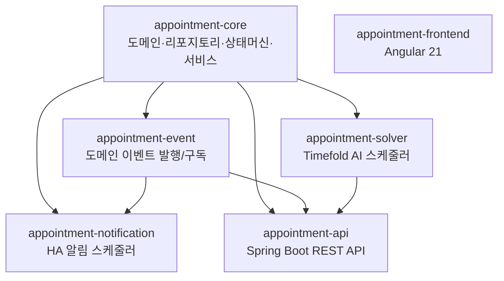

# 아키텍처 설계

## 모듈 의존성 그래프



> `appointment-api`는 `appointment-notification`에 **의존하지 않는다**.
> 알림은 도메인 이벤트를 구독하여 독립적으로 동작한다.

## 주요 설계 결정 (ADR)

### ADR-1: 디렉토리 구조 — 하이브리드 플랫 구조

**결정**: 백엔드 모듈은 루트 직하 플랫 배치, Angular는 `frontend/` 서브디렉토리.

**이유**: 백엔드 6개 모듈은 플랫으로 충분히 관리 가능. Angular는 Node.js 기반으로 Kotlin 빌드 체계와 다르므로 분리가 자연스럽다.

**결과**: `settings.gradle.kts`에서 백엔드는 `includeModules()`, 프론트엔드는 `includeFrontendModules()`로 자동 스캔.

---

### ADR-2: bluetape4k-projects 의존성 — 조건부 Composite Build

**결정**: 로컬에 `../bluetape4k-projects`가 있으면 `includeBuild`로 소스 직접 참조, 없으면 Maven Central 좌표 사용.

**이유**: 로컬 개발 시 bluetape4k 라이브러리 수정 즉시 반영. CI 환경에서는 Maven Central 자동 폴백.

```kotlin
// settings.gradle.kts
val bluetape4kProjectsDir = file("../bluetape4k-projects")
if (bluetape4kProjectsDir.exists()) {
    includeBuild(bluetape4kProjectsDir) { ... }
}
```

---

### ADR-3: 패키지명 — io.bluetape4k.clinic.appointment

**결정**: `io.bluetape4k.scheduling.appointment` → `io.bluetape4k.clinic.appointment`

**이유**: 독립 저장소이므로 `clinic` 도메인을 명시. `scheduling`은 bluetape4k-experimental 내부 컨텍스트이므로 독립 저장소에 부적합.

---

### ADR-4: SlotCalculationService vs SolverService 역할 분리

**결정**: 두 서비스를 공존시키되 용도를 명확히 분리.

| 서비스 | 용도 | 특성 |
|--------|------|------|
| `SlotCalculationService` | 환자 대면 실시간 슬롯 조회 (단건) | Greedy, 빠름 |
| `SolverService` | 관리자 배치 최적화 (대량 예약 재배치) | Timefold, 전역 최적 |

---

### ADR-5: 알림 모듈 독립성

**결정**: `appointment-api`는 `appointment-notification`에 의존하지 않음.

**이유**: 알림은 `AppointmentDomainEvent`를 구독하는 독립 컴포넌트. API가 알림 모듈 없이도 동작해야 한다.

**결과**: API 서버와 알림 스케줄러는 별도 프로세스로 배포 가능.

---

### ADR-6: git 히스토리 — 단순 소스 복사

**결정**: `bluetape4k-experimental/scheduling/`에서 파일만 복사, 초기 커밋으로 시작.

**이유**: 커밋 히스토리가 짧았고, 독립 저장소의 깨끗한 시작이 더 가치 있다. 원본은 `bluetape4k-experimental`에서 참조 가능.

---

### ADR-7: API Controller 테스트 — MockMvc → RestClient

**결정**: `@SpringBootTest(RANDOM_PORT)` + Spring Boot 4 `RestClient` 방식으로 전면 전환 (v0.3.0).

**이유**: MockMvc는 실제 HTTP 스택을 타지 않아 필터/인터셉터 누락 위험. RestClient는 실제 포트에서 전 계층을 통과하므로 통합 테스트 신뢰도가 높다.

---

### ADR-9: appointment-core 패키지 구조 — model/service 배치

**결정**: 슬롯 계산 value type(`AvailableSlot`, `SlotQuery`, `TimeRange`)을 `service.model` 대신 `model.service`에 배치.

**이유**: `model/` 하위에 DB 무관 데이터 타입을 일관성 있게 집중. `service.model`은 "서비스의 내부 구현 세부 사항"처럼 읽히고, `model.service`는 "서비스 계층용 도메인 모델"로 의도가 명확하다.

**결과**:

| 패키지 | 내용 |
|--------|------|
| `model.dto` | DB 조회 결과 Record DTO (16개 엔티티) |
| `model.service` | 슬롯 계산 value type — `AvailableSlot`, `SlotQuery`, `TimeRange` |
| `model.tables` | Exposed ORM 테이블 정의 |

미래에 Exposed DAO 방식 Entity가 추가되면 `model.entities`에 배치. `model.entities`는 Exposed에 의존하므로 `appointment-domain` 모듈(예정)에 위치.

---

### ADR-8: Flyway 마이그레이션 — 벤더별 SQL 분리

**결정**: H2 / PostgreSQL / MySQL 각각 별도 SQL 파일 유지 + CI 매트릭스로 전 벤더 검증.

**이유**: ORM-agnostic DDL 문법 차이(자동 증가, 타입명 등)가 벤더별로 달라 단일 SQL로 모두 커버 불가.

**결과**: `resources/db/migration/h2/`, `postgresql/`, `mysql/` 경로 분리. `FlywayMigrationTest`가 CI에서 3 벤더 모두 실행.
