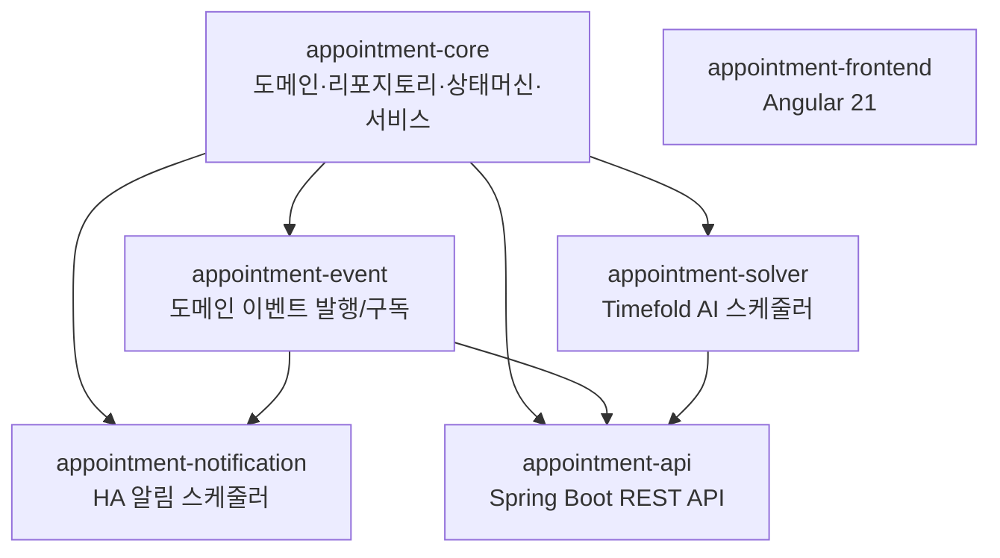
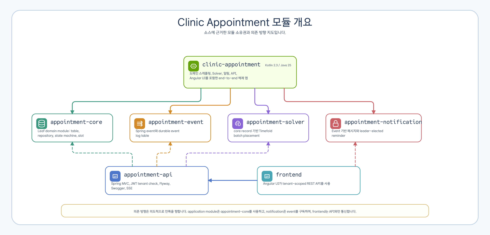
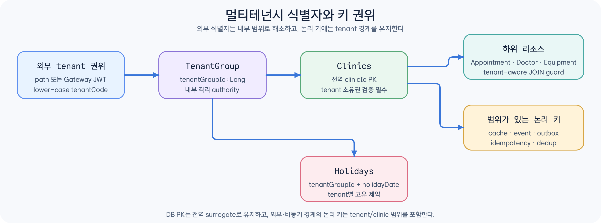

# 아키텍처 설계

## 모듈 의존성 그래프


```mermaid
graph TD
    core[appointment-core\n도메인·리포지토리·상태머신·서비스]
    event[appointment-event\n도메인 이벤트 발행/구독]
    solver[appointment-solver\nTimefold AI 스케줄러]
    notification[appointment-notification\nHA 알림 스케줄러]
    api[appointment-api\nSpring Boot REST API]
    frontend[appointment-frontend\nAngular 21]

    core --> event
    core --> solver
    core --> notification
    event --> notification
    core --> api
    event --> api
    solver --> api
```



[SVG](assets/architecture-01-module-dependency-ko.svg) · [Mermaid source](assets/architecture-01-module-dependency.mmd)

> `appointment-api`는 `appointment-notification`에 **의존하지 않는다**.
> 알림은 도메인 이벤트를 구독하여 독립적으로 동작한다.

## 주요 설계 결정 (ADR)

### ADR-1: 디렉토리 구조 — 하이브리드 플랫 구조

**결정**: 백엔드 모듈은 루트 직하 플랫 배치, Angular는 `frontend/` 서브디렉토리.

**이유**: 백엔드 6개 모듈은 플랫으로 충분히 관리 가능. Angular는 Node.js 기반으로 Kotlin 빌드 체계와 다르므로 분리가 자연스럽다.

**결과**: `settings.gradle.kts`에서 백엔드는 `includeModules()`, 프론트엔드는 `includeFrontendModules()`로 자동 스캔.

---

### ADR-2: bluetape4k-projects 의존성 — 조건부 Composite Build

**결정**: 로컬에 `../bluetape4k-projects`가 있으면 `includeBuild`로 소스 직접 참조, 없으면 Maven Central 좌표 사용.

**이유**: 로컬 개발 시 bluetape4k 라이브러리 수정 즉시 반영. CI 환경에서는 Maven Central 자동 폴백.

```kotlin
// settings.gradle.kts
val bluetape4kProjectsDir = file("../bluetape4k-projects")
if (bluetape4kProjectsDir.exists()) {
    includeBuild(bluetape4kProjectsDir) { ... }
}
```

---

### ADR-3: 패키지명 — io.bluetape4k.clinic.appointment

**결정**: `io.bluetape4k.scheduling.appointment` → `io.bluetape4k.clinic.appointment`

**이유**: 독립 저장소이므로 `clinic` 도메인을 명시. `scheduling`은 bluetape4k-experimental 내부 컨텍스트이므로 독립 저장소에 부적합.

---

### ADR-4: SlotCalculationService vs SolverService 역할 분리

**결정**: 두 서비스를 공존시키되 용도를 명확히 분리.

| 서비스 | 용도 | 특성 |
|--------|------|------|
| `SlotCalculationService` | 환자 대면 실시간 슬롯 조회 (단건) | Greedy, 빠름 |
| `SolverService` | 관리자 배치 최적화 (대량 예약 재배치) | Timefold, 전역 최적 |

---

### ADR-5: 알림 모듈 독립성

**결정**: `appointment-api`는 `appointment-notification`에 의존하지 않음.

**이유**: 알림은 `AppointmentDomainEvent`를 구독하는 독립 컴포넌트. API가 알림 모듈 없이도 동작해야 한다.

**결과**: API 서버와 알림 스케줄러는 별도 프로세스로 배포 가능.

---

### ADR-6: git 히스토리 — 단순 소스 복사

**결정**: `bluetape4k-experimental/scheduling/`에서 파일만 복사, 초기 커밋으로 시작.

**이유**: 커밋 히스토리가 짧았고, 독립 저장소의 깨끗한 시작이 더 가치 있다. 원본은 `bluetape4k-experimental`에서 참조 가능.

---

### ADR-7: API Controller 테스트 — MockMvc → RestClient

**결정**: `@SpringBootTest(RANDOM_PORT)` + Spring Boot 4 `RestClient` 방식으로 전면 전환 (v0.3.0).

**이유**: MockMvc는 실제 HTTP 스택을 타지 않아 필터/인터셉터 누락 위험. RestClient는 실제 포트에서 전 계층을 통과하므로 통합 테스트 신뢰도가 높다.

---

### ADR-9: appointment-core 패키지 구조 — model/service 배치

**결정**: 슬롯 계산 value type(`AvailableSlot`, `SlotQuery`, `TimeRange`)을 `service.model` 대신 `model.service`에 배치.

**이유**: `model/` 하위에 DB 무관 데이터 타입을 일관성 있게 집중. `service.model`은 "서비스의 내부 구현 세부 사항"처럼 읽히고, `model.service`는 "서비스 계층용 도메인 모델"로 의도가 명확하다.

**결과**:

| 패키지 | 내용 |
|--------|------|
| `model.dto` | DB 조회 결과 Record DTO (16개 엔티티) |
| `model.service` | 슬롯 계산 value type — `AvailableSlot`, `SlotQuery`, `TimeRange` |
| `model.tables` | Exposed ORM 테이블 정의 |

미래에 Exposed DAO 방식 Entity가 추가되면 `model.entities`에 배치. `model.entities`는 Exposed에 의존하므로 `appointment-domain` 모듈(예정)에 위치.

---

### ADR-8: Flyway 마이그레이션 — 벤더별 SQL 분리

**결정**: H2 / PostgreSQL / MySQL 각각 별도 SQL 파일 유지 + CI 매트릭스로 전 벤더 검증.

**이유**: ORM-agnostic DDL 문법 차이(자동 증가, 타입명 등)가 벤더별로 달라 단일 SQL로 모두 커버 불가.

**결과**: `resources/db/migration/h2/`, `postgresql/`, `mysql/` 경로 분리. `FlywayMigrationTest`가 CI에서 3 벤더 모두 실행.

---

### ADR-10: Scheduling Policy Foundation — V9/V10 분리 배포

**결정**: V9는 scheduling policy definition, scope head, effective snapshot,
activation command, preview job, generic outbox 호환 컬럼을 먼저 추가한다. V10은
legacy 예약/플랜 outbox column 제거 또는 aggregate-only 소비 전환을 별도 배포로
다룬다.

**이유**: 예약 정책은 향후 예약 생성, 운영 장애 복구, 재확인, overbooking, 고객
신뢰도 signal에 영향을 준다. 한 번의 migration에서 writer, reader, worker, consumer를
동시에 바꾸면 aggregate-null, dual-write 불일치, stale snapshot을 운영 중에 되돌리기
어렵다.

**결과**:

| 단계 | 계약 |
|------|------|
| V9 | 새 테이블과 generic aggregate column 추가, legacy column 유지, writer dual-write |
| V10 준비 | aggregate-null 0건, legacy/new parity, 모든 writer version dual-write 관측 |
| V10 | aggregate-only 소비 또는 legacy 제거를 별도 검증 뒤 수행 |

### ADR-11: Scheduling Policy Transaction Ownership

**결정**: controller는 HTTP status/header와 path-derived scope만 구성한다. 정책 lifecycle,
revision/generation CAS, approval separation, preview evidence, activation command
claim은 application service와 repository transaction이 소유한다.

**이유**: 정책 명령은 DB row lock, idempotency unique key, durable command lease,
scope head revision이 동시에 맞아야 한다. HTTP 계층에서 부분 판단을 하면 multi-dialect
동시성 계약을 유지하기 어렵다.

**결과**:

| 영역 | 소유자 |
|------|------|
| path tenant/clinic 검증 | controller + `TenantClinicAccessChecker` |
| actor 해석 | `ActorContextResolver` |
| lifecycle/CAS/승인 | `SchedulingPolicyCommandService` |
| preview admission/polling | `SchedulingPolicyPreviewService` |
| due activation claim | `SchedulingPolicyWorker` + repository lease |
| metric cardinality 제한 | `SchedulingPolicyMetrics` |

### ADR-12: Effective Read Double-Read and Fail-Closed

**결정**: effective snapshot은 compile 전후로 권위 generation을 다시 읽는다. 두 generation이
다르면 snapshot을 반환하지 않고 retryable conflict로 실패한다.

**이유**: 정책이 activation되는 순간에 오래된 tenant baseline과 새 clinic override를 섞어
예약 결정을 내리면, 호출자는 재현 가능한 snapshot hash를 신뢰할 수 없다.

**결과**: `GET .../effective`는 generation conflict를
`POLICY_EFFECTIVE_READ_CONFLICT`, 권위 저장소 장애를
`POLICY_EFFECTIVE_READ_UNAVAILABLE`로 반환한다. 두 경우 모두 stale cache를 관대하게
반환하지 않는 fail-closed 계약이다.

---

### ADR-13: 외부 메시징 — Kafka4 전용 outbox relay

**결정**: 외부 broker 기반 메시징은 `bluetape4k-kafka4`, Spring Kafka 4,
Jackson 3 조합만 지원한다. DB가 aggregate와 outbox의 transaction authority이며,
별도 relay가 commit된 outbox를 Kafka4에 발행한다. 버전은 bluetape4k governed catalog를
따르며 clinic-appointment가 Kafka client, Spring Kafka 또는 Jackson 버전을 독립적으로
override하지 않는다.

**전달 계약**:

- end-to-end at-least-once와 stable event ID 기반 producer/consumer 멱등성을 사용한다.
- consumer dedup unique key는 stable logical consumer/stream identity와 `eventId`로 구성하고,
  topic/partition/offset은 provenance로만 기록해 partition 변경이나 topic migration 뒤에도
  같은 event의 side effect가 다시 실행되지 않게 한다.
- aggregate scope를 partition key로 사용해 같은 aggregate의 순서를 보존한다.
- partition 증설은 단일 hot aggregate 해결책이 아니며, 기존 key remap에 대비한 producer
  pause/relay hold, drain/checkpoint 또는 새 topic migration과 ordering 증명 없이 실행하지 않는다.
- envelope는 `eventId`, `eventType`, `schemaVersion`, UTC `occurredAt`,
  tenant/clinic/aggregate scope, correlation/causation ID와 bounded payload를 가진다.
- DB와 Kafka를 하나의 전역 exactly-once transaction으로 표현하지 않는다.
- unsafe typing, FQN type header, 기본 tombstone/null payload와 raw PHI DLT 복제를 금지한다.

**보안·운영 gate**:

- broker credential을 저장소에 커밋하지 않고 producer/consumer principal을 필요한
  topic/action과 application scope로 제한한다.
- patient/PII 식별자를 key, metric label, log 또는 raw payload 출력에 넣지 않는다.
- replay는 별도 group, 승인된 scope/offset, dry-run과 audit을 요구하며 운영 group
  offset을 되감지 않는다. rollback도 offset rewind나 topic 삭제로 event를 숨기지 않는다.
- application topic auto-create를 금지하고 startup/readiness에서 authn/authz, topic/config,
  serializer/envelope 호환성을 확인한다.

**후속 검증 gate**: #41/#42는 구현 전에 burst와 지속 부하, publish-to-ack p95/p99,
consumer lag catch-up, oldest-age, broker outage recovery, partition skew, heap/thread 상한과
재현 명령을 수치화한다. #42의 dedup ledger retention/cleanup, index/partition 전략,
cardinality/storage 상한과 target cardinality duplicate lookup p95도 수치화한다. relay
lease/fencing·bounded backpressure와 record/header/depth 상한, partition-change ordering
migration도 해당 spec과 테스트의 차단 기준이다.

**후속 책임**:

| 이슈 | 책임 |
|---|---|
| #41 | `appointment-messaging`, producer envelope/partition key, 세 dialect outbox lease/fencing migration, bounded relay와 readiness |
| #42 | bounded consumer idempotency ledger/offset, Schema Registry compatibility, retry/DLT/quarantine와 승인된 replay |

**기각**: Kafka3는 Spring Boot 3/Jackson 2 line이라 기각한다. RabbitMQ는 replay와
schema evolution 요구 및 bluetape4k runtime 지원이 약해 기각한다. broker-neutral
abstraction은 Kafka partition/offset/replay 의미를 숨기는 YAGNI이므로 도입하지 않는다.

**근거**: 상세 failure mode, 보안·운영 계약과 검증 gate는
`docs/superpowers/specs/2026-08-03-issue-40-kafka4-messaging-decision-design.md`를 따른다.

---

### ADR-14: 멀티테넌시 식별자와 Key Authority

**상태**: 채택. PR #118에서 도입한 멀티테넌시 기반을 현재 API·outbox·cache·멱등성
key까지 확장해 해석하는 권위 계약이다.

#### 식별자 역할

| 식별자 | 역할 | 규칙 |
|---|---|---|
| `tenantCode` | 외부 routing·인가 식별자 | 불투명하고 안정적인 lower-case ASCII tenant slug다. 국가 코드나 locale이 아니며 ingress에서 정규형이 아닌 값을 거부한다. 현재 DB collation과 입력 계층은 이 규칙을 완전히 강제하지 않으므로 #37·#38에서 보강한다. |
| `tenantGroupId: Long` | 내부 DB 관계·격리 authority | `TenantGroups.id`에서 해소한 불변 surrogate ID다. repository, cache, event, outbox, 멱등성 key는 가능한 한 이 값을 사용한다. |
| `clinicId: Long` | tenant 아래 clinic 식별자 | DB PK는 전역 surrogate로 유지하지만, 외부 입력이나 비동기 경계에서는 단독으로 권위를 갖지 못한다. 항상 `tenantGroupId`와 함께 검증한다. |
| child resource ID | Doctor, Appointment, Equipment 등의 전역 surrogate PK | composite PK로 재작성하지 않는다. 조회할 때 `tenantGroupId` 또는 `(tenantGroupId, clinicId)` JOIN guard를 강제한다. |

`TenantGroup`은 데이터 격리 단위다. 사용자 locale, clinic timezone, currency, 국가 코드와
직교한다. 따라서 `KR`, `JP`, `EN`을 tenant identity로 강제하거나 locale을 이용해 기존
행의 tenant를 추론하지 않는다. 현재 `TenantGroups`의 최소 필드인 `tenantCode`,
`displayName`, `active`, `createdAt`을 기준 계약으로 유지하고 locale/timezone은 clinic 또는
별도 configuration이 소유한다.

#### HTTP Tenant Authority

HTTP endpoint는 다음 두 모드 중 정확히 하나를 선언한다. 한 요청에서 두 모드를
fallback하거나 body의 ID로 tenant를 역추론하지 않는다.

| 모드 | 적용 경로 | Source of truth | 내부 scope 해소 |
|---|---|---|---|
| Path-selected | `/api/{tenantCode}/...` | URL `tenantCode`와 JWT `allowedTenants` membership | active `TenantGroup`을 조회해 `tenantGroupId`를 만들고 path `clinicId` 소유권을 검증 |
| Gateway-selected | `/api/v2/...` | 검증된 JWT의 단일 `allowedTenants`, `clinicId`, `allowedClinicIds` membership | claim 범위를 먼저 검증하고 downstream의 tenant-aware 조회에서 tenant-clinic 관계를 검증해 내부 scope 생성 |

Gateway-selected endpoint는 path-selected endpoint의 예외적인 호환 경계다. 현재 v2 ingress는
claim membership을 검증하지만 중앙 DB clinic ownership guard를 일괄 수행하지 않으며,
각 downstream tenant-aware 조회가 관계 검증을 맡는다. 신규 endpoint는 어느 모드를
사용하는지 KDoc과 security test에 명시해야 한다. 다중 tenant JWT에서 임의의 첫 값을
선택하거나 `/api/v2`에서 `TenantContext`로 fallback하는 동작은 금지한다.

#### Logical Key 규칙

DB의 전역 surrogate PK와 데이터 격리용 logical key를 구분한다.

| 범위 | 최소 logical key |
|---|---|
| tenant 전역 | `(tenantGroupId, businessKey)` |
| clinic 전역 | `(tenantGroupId, clinicId, businessKey)` |
| aggregate event/outbox | `(tenantGroupId, clinicId?, aggregateType, aggregateId, eventId)` |
| cache | authority 범위 + 조회 결과를 바꾸는 모든 입력 |
| 멱등성/dedup | authority 범위 + stable caller/consumer identity + idempotency/event key |

테이블이 `clinicId` FK로 tenant에 간접 귀속되더라도 신규 API, cache, durable event, outbox,
idempotency/dedup key에서는 `tenantGroupId`를 생략하지 않는다. 이 규칙은 같은 numeric ID나
business key가 다른 tenant에서 재사용될 때 충돌·오염·cross-tenant replay가 생기지 않게 한다.
현재 `DoctorRepository`, `EquipmentRepository`, `TreatmentTypeRepository` cache key와 legacy
`AppointmentDomainEvent`/`AppointmentEventLogs`는 이 목표 계약보다 좁다. 전역 clinic PK 덕분에
즉시 충돌이 재현된 상태는 아니지만, 외부화하거나 key 공간을 바꾸기 전에 #39에서 전환한다.



[한국어 SVG](assets/architecture-02-multitenancy-key-authority-ko.svg) ·
[English SVG](assets/architecture-02-multitenancy-key-authority-en.svg) ·
[English PNG](assets/architecture-02-multitenancy-key-authority-en.png)

#### 생명주기와 전파 규칙

- tenant 삭제는 `RESTRICT`를 기본으로 한다. clinic·holiday 연쇄 삭제를 허용하는 `CASCADE`는
  별도의 데이터 보존 설계와 승인 없이는 적용하지 않는다.
- `tenantCode` rename은 Phase 1에서 지원하지 않는다. 향후 허용하려면 URL/JWT/cache/event key
  migration, alias 만료, 감사 기록을 포함한 별도 설계가 필요하다.
- `TenantContext`는 동기 HTTP filter와 HTTP-bound adapter/helper의 편의 기능이다. adapter는
  context를 읽은 즉시 명시적인 scope 값으로 변환한다. core service, coroutine, background job,
  event consumer에는 `tenantGroupId`와 필요한 `clinicId`를 명시적으로 전달한다.
- 모든 Exposed 조회는 `transaction {}` 안에서 실행하고, 외부에 노출된 resource ID 조회는
  tenant-aware repository 메서드 또는 선행 clinic ownership guard로 증명한다.

#### 후속 이슈 경계

| 이슈 | ADR-14 이후 책임 |
|---|---|
| #37 | live issue의 지역 필드·seed·`CASCADE` 요구를 이 ADR과 정합화하고 tenant-aware Clinic/Holiday repository 계약을 확정 |
| #38 | Path-selected/Gateway-selected endpoint 목록, 오류 매트릭스, `TenantContext` 가시성과 coroutine 전파를 검증 |
| #39 | Holiday·clinic child·solver를 포함한 externally reachable query를 전수 감사하고 cross-tenant negative test로 잠금 |

#### 검토한 대안

| 대안 | 채택하지 않은 이유 |
|---|---|
| tenant별 DB schema 분리 | tenant 수만큼 Flyway·connection routing·운영 점검이 갈라지고 기존 단일 schema migration 자산을 직접 재사용하기 어렵다. 현재 규모에는 row-level 격리가 더 단순하다. |
| tenant별 database 분리 | provisioning·connection pool·backup·관측·장애 복구 비용이 tenant 수에 비례한다. 규제 또는 물리 격리 요구가 생기기 전에는 운영 복잡도가 이득보다 크다. |
| subdomain만으로 tenant 선택 | DNS/TLS와 local/test 환경을 복잡하게 만들고 API route만으로 scope를 재현하기 어렵다. Phase 1의 canonical 선택은 path다. |
| JWT만으로 모든 tenant 선택 | path-selected API에서 요청 대상이 URL에 드러나지 않고 routing과 인증 claim이 결합된다. `/api/v2` Gateway-selected mode만 명시적 예외로 유지한다. |
| 모든 PK를 `(tenantGroupId, id)` composite key로 변경 | 기존 전역 surrogate 참조와 migration 비용이 크고, 조회 authority를 명시하는 JOIN guard로 같은 격리 목적을 달성할 수 있다. |
| `tenantCode`를 내부 FK와 모든 key에 직접 사용 | rename·alias·문자열 collation이 내부 관계와 비동기 key를 흔든다. 외부 slug는 ingress에서 `tenantGroupId`로 해소한다. |
| locale/국가 코드를 tenant identity로 사용 | 한 tenant가 여러 locale/clinic timezone을 가질 수 있어 데이터 격리 단위와 표시 설정을 혼동한다. |
| `clinicId`만으로 모든 logical key 구성 | 현재 PK 전역성에 과도하게 의존하고 외부·비동기 경계에서 tenant authority가 사라진다. |
| `TenantContext`를 coroutine·background 작업까지 암묵 전파 | thread-local 생명주기와 실행 컨텍스트가 달라 누락·잔존 scope 위험이 있다. 명시 전달이 실패를 더 일찍 드러낸다. |

**근거**: [멀티테넌시 상세 설계](../superpowers/specs/2026-05-19-multitenancy-design.md),
[아키텍처 blueprint](../superpowers/research/2026-05-19-multitenancy-architecture-blueprint.md),
[2026-08-04 완료 상태 감사](../reviews/2026-08-04-multitenancy-audit.md)를 따른다.
