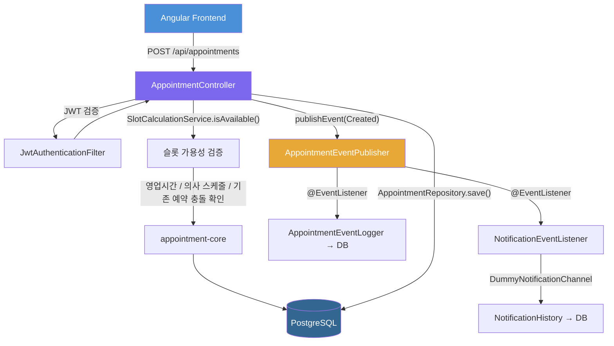
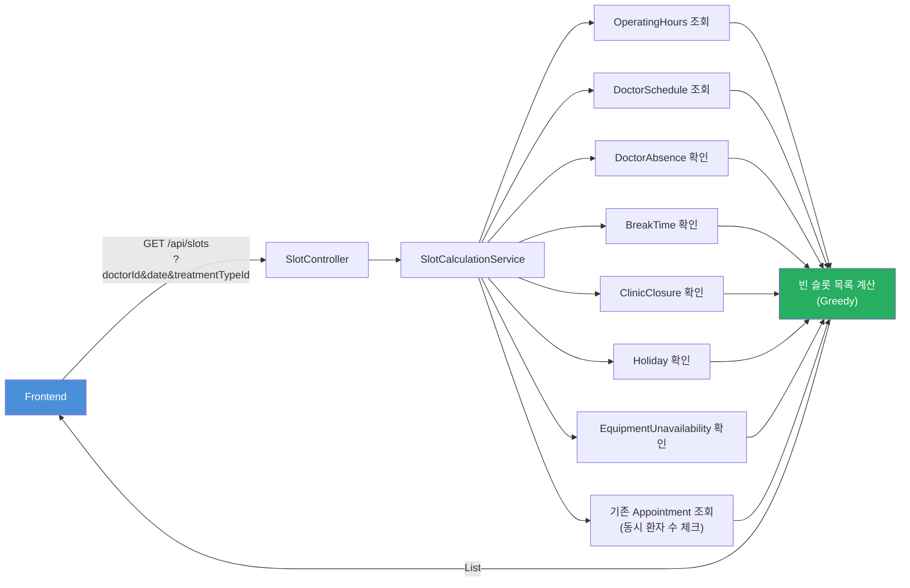
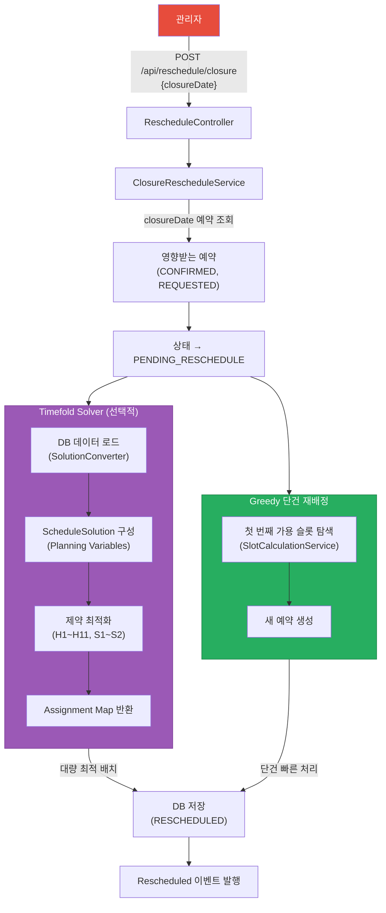
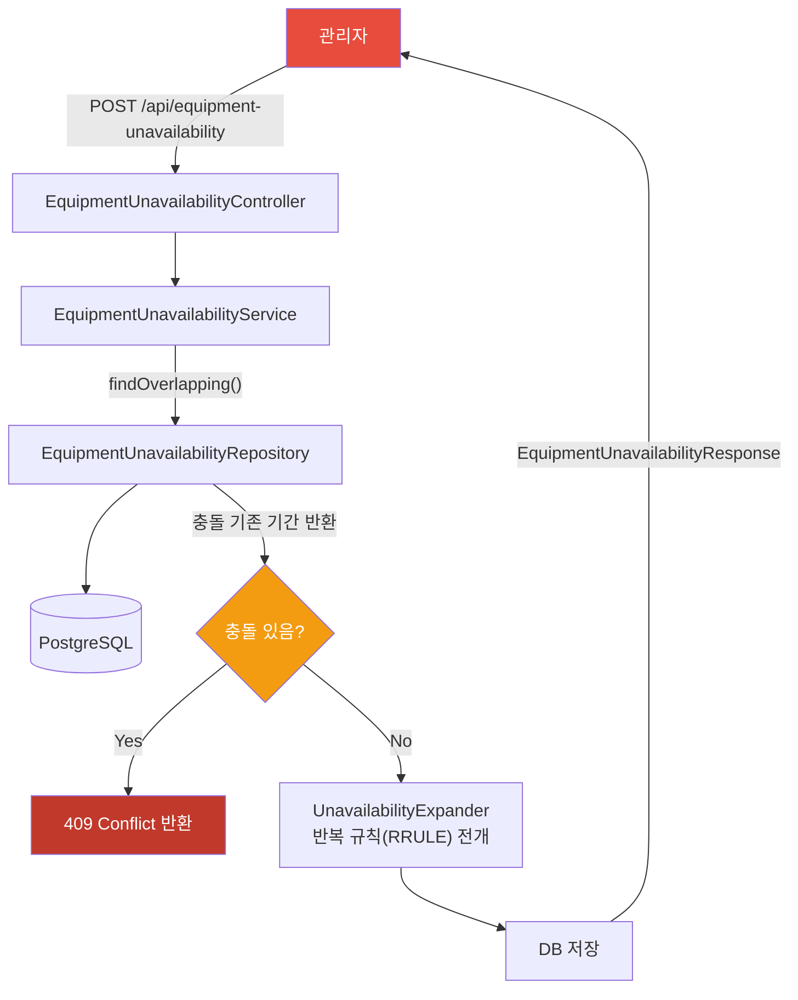
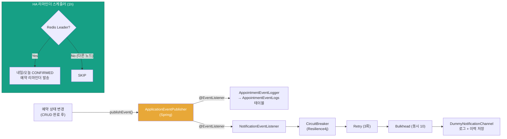
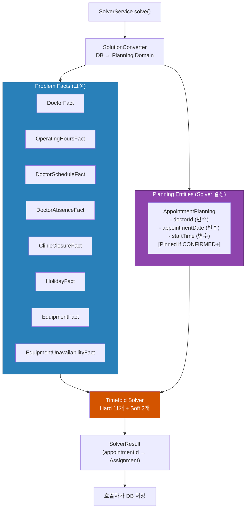

# 데이터 흐름 (Data Flow)

## 1. 예약 생성 흐름

```mermaid
flowchart TD
    FE["Angular Frontend"] -->|"POST /api/appointments"| API["AppointmentController"]
    API -->|"JWT 검증"| SEC["JwtAuthenticationFilter"]
    SEC --> API
    API -->|"SlotCalculationService.isAvailable()"| SLOT["슬롯 가용성 검증"]
    SLOT -->|"영업시간 / 의사 스케줄 / 기존 예약 충돌 확인"| CORE["appointment-core"]
    CORE --> DB[("PostgreSQL")]
    API -->|"AppointmentRepository.save()"| DB
    API -->|"publishEvent(Created)"| EVT["AppointmentEventPublisher"]
    EVT -->|"@EventListener"| LOG["AppointmentEventLogger → DB"]
    EVT -->|"@EventListener"| NOTIF["NotificationEventListener"]
    NOTIF -->|"DummyNotificationChannel"| HIST["NotificationHistory → DB"]

    style FE fill:#4A90D9,color:#fff
    style API fill:#7B68EE,color:#fff
    style DB fill:#336791,color:#fff
    style EVT fill:#E8A838,color:#fff
```

## 2. 슬롯 조회 흐름

```mermaid
flowchart LR
    FE["Frontend"] -->|"GET /api/slots\n?doctorId&date&treatmentTypeId"| API["SlotController"]
    API --> SVC["SlotCalculationService"]

    SVC --> OH["OperatingHours 조회"]
    SVC --> DS["DoctorSchedule 조회"]
    SVC --> DA["DoctorAbsence 확인"]
    SVC --> BT["BreakTime 확인"]
    SVC --> CC["ClinicClosure 확인"]
    SVC --> HOL["Holiday 확인"]
    SVC --> EQ["EquipmentUnavailability 확인"]
    SVC --> APT["기존 Appointment 조회\n(동시 환자 수 체크)"]

    OH & DS & DA & BT & CC & HOL & EQ & APT --> CALC["빈 슬롯 목록 계산\n(Greedy)"]
    CALC -->|"List<SlotResponse>"| FE

    style FE fill:#4A90D9,color:#fff
    style CALC fill:#27AE60,color:#fff
```

## 3. 임시휴진 재배정 흐름

```mermaid
flowchart TD
    ADMIN["관리자"] -->|"POST /api/reschedule/closure\n{closureDate}"| API["RescheduleController"]
    API --> CRS["ClosureRescheduleService"]

    CRS -->|"closureDate 예약 조회"| AFFECTED["영향받는 예약\n(CONFIRMED, REQUESTED)"]
    AFFECTED --> MARK["상태 → PENDING_RESCHEDULE"]

    subgraph Solver["Timefold Solver (선택적)"]
        direction TB
        LOAD["DB 데이터 로드\n(SolutionConverter)"] --> PLAN["ScheduleSolution 구성\n(Planning Variables)"]
        PLAN --> OPT["제약 최적화\n(H1~H11, S1~S2)"]
        OPT --> RESULT["Assignment Map 반환"]
    end

    subgraph Greedy["Greedy 단건 재배정"]
        direction TB
        FIRST["첫 번째 가용 슬롯 탐색\n(SlotCalculationService)"] --> ASSIGN["새 예약 생성"]
    end

    MARK --> Solver
    MARK --> Greedy
    Solver -->|"대량 최적 배치"| SAVE["DB 저장\n(RESCHEDULED)"]
    Greedy -->|"단건 빠른 처리"| SAVE
    SAVE --> EVT["Rescheduled 이벤트 발행"]

    style ADMIN fill:#E74C3C,color:#fff
    style Solver fill:#9B59B6,color:#fff,stroke:#7D3C98
    style Greedy fill:#27AE60,color:#fff,stroke:#1E8449
```

## 4. 장비 사용불가 등록 흐름

```mermaid
flowchart TD
    ADMIN["관리자"] -->|"POST /api/equipment-unavailability"| API["EquipmentUnavailabilityController"]
    API --> SVC["EquipmentUnavailabilityService"]

    SVC -->|"findOverlapping()"| REPO["EquipmentUnavailabilityRepository"]
    REPO --> DB[("PostgreSQL")]

    REPO -->|"충돌 기존 기간 반환"| CONFLICT{"충돌 있음?"}
    CONFLICT -->|"Yes"| ERR["409 Conflict 반환"]
    CONFLICT -->|"No"| EXPAND["UnavailabilityExpander\n반복 규칙(RRULE) 전개"]
    EXPAND --> SAVE["DB 저장"]
    SAVE -->|"EquipmentUnavailabilityResponse"| ADMIN

    style ADMIN fill:#E74C3C,color:#fff
    style CONFLICT fill:#F39C12,color:#fff
    style ERR fill:#C0392B,color:#fff
```

## 5. 알림 이벤트 흐름

```mermaid
flowchart LR
    APT["예약 상태 변경\n(CRUD 완료 후)"] -->|"publishEvent()"| PUB["ApplicationEventPublisher\n(Spring)"]

    PUB -->|"@EventListener"| LOG["AppointmentEventLogger\n→ AppointmentEventLogs 테이블"]
    PUB -->|"@EventListener"| NOTIF["NotificationEventListener"]

    NOTIF --> CB["CircuitBreaker\n(Resilience4j)"]
    CB --> RETRY["Retry (3회)"]
    RETRY --> BH["Bulkhead (동시 10)"]
    BH --> CH["DummyNotificationChannel\n로그 + 이력 저장"]

    subgraph HA["HA 리마인더 스케줄러 (1h)"]
        LEADER{"Redis Leader?"}
        LEADER -->|"Yes"| REMIND["내일/오늘 CONFIRMED\n예약 리마인더 발송"]
        LEADER -->|"No (다른 노드)"| SKIP["SKIP"]
    end

    style PUB fill:#E8A838,color:#fff
    style HA fill:#16A085,color:#fff,stroke:#0E6655
```

## 6. Solver 데이터 흐름

```mermaid
flowchart TD
    API["SolverService.solve()"] --> LOAD["SolutionConverter\nDB → Planning Domain"]

    subgraph Facts["Problem Facts (고정)"]
        direction LR
        F1["DoctorFact"] 
        F2["OperatingHoursFact"]
        F3["DoctorScheduleFact"]
        F4["DoctorAbsenceFact"]
        F5["ClinicClosureFact"]
        F6["HolidayFact"]
        F7["EquipmentFact"]
        F8["EquipmentUnavailabilityFact"]
    end

    subgraph Planning["Planning Entities (Solver 결정)"]
        PE["AppointmentPlanning\n- doctorId (변수)\n- appointmentDate (변수)\n- startTime (변수)\n[Pinned if CONFIRMED+]"]
    end

    LOAD --> Facts
    LOAD --> Planning

    Facts & Planning --> SOLVE["Timefold Solver\nHard 11개 + Soft 2개"]
    SOLVE --> RESULT["SolverResult\n(appointmentId → Assignment)"]
    RESULT --> CALLER["호출자가 DB 저장"]

    style Facts fill:#2980B9,color:#fff,stroke:#1A5276
    style Planning fill:#8E44AD,color:#fff,stroke:#6C3483
    style SOLVE fill:#D35400,color:#fff
```
