# 데이터 흐름 (Data Flow)

## 1. 예약 생성 흐름

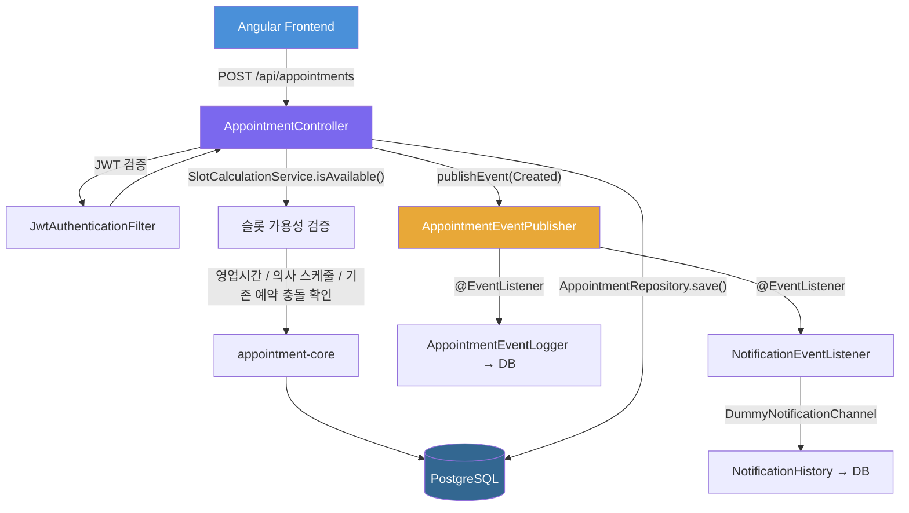

[SVG](assets/data-flow-01-appointment-create-ko.svg) · [Mermaid source](assets/data-flow-01-appointment-create.mmd)

## 2. 슬롯 조회 흐름

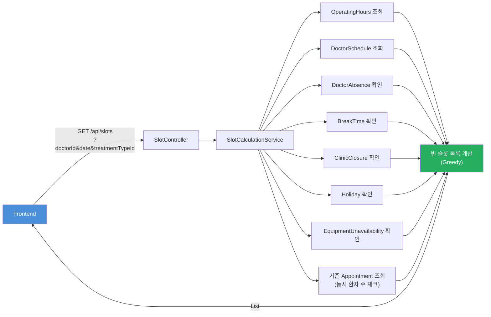

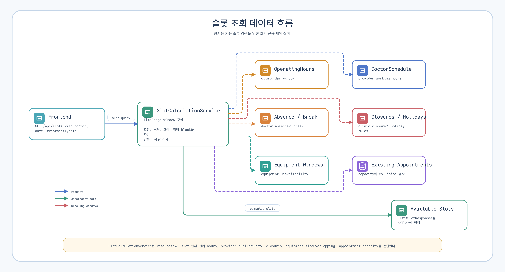

[SVG](assets/data-flow-02-slot-query-ko.svg) · [Mermaid source](assets/data-flow-02-slot-query.mmd)

## 3. 임시휴진 재배정 흐름

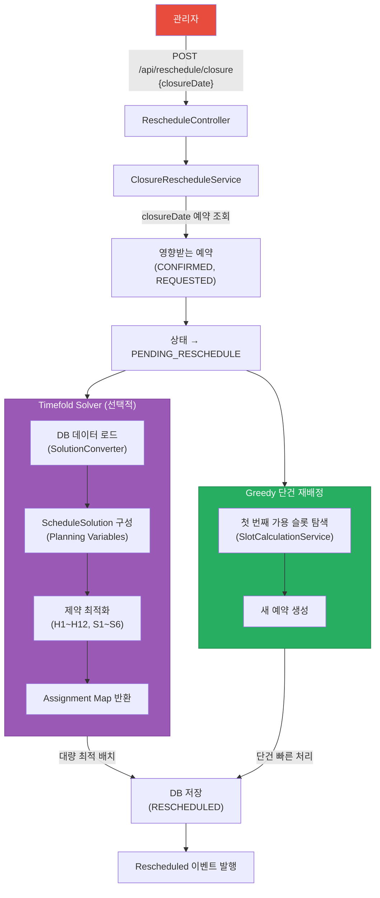

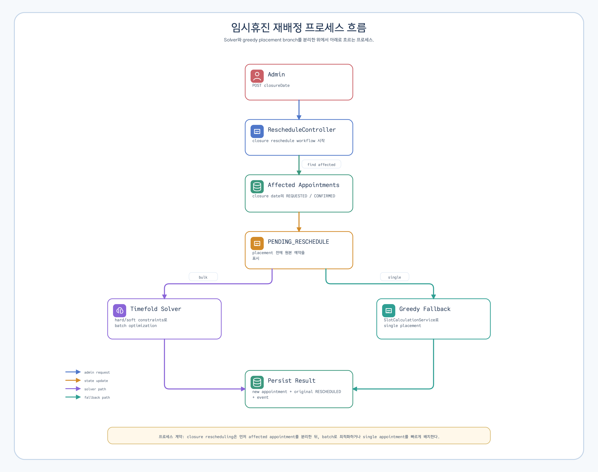

[SVG](assets/data-flow-03-closure-reschedule-ko.svg) · [Mermaid source](assets/data-flow-03-closure-reschedule.mmd)

## 4. 장비 사용불가 등록 흐름

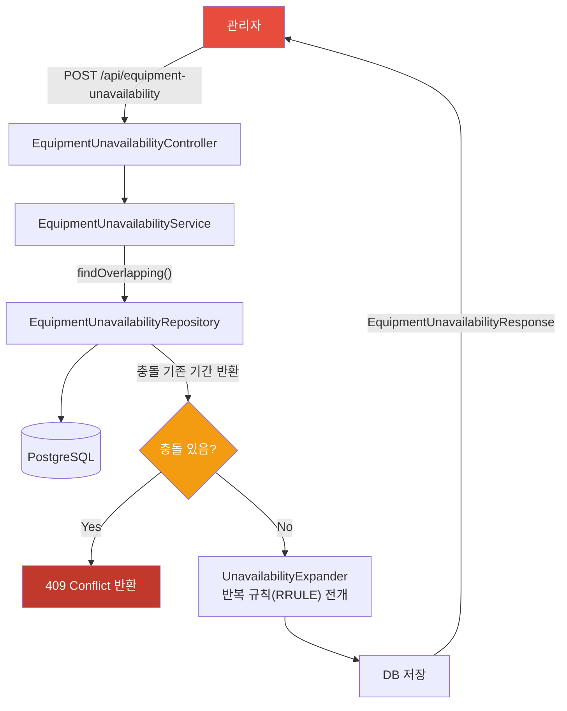

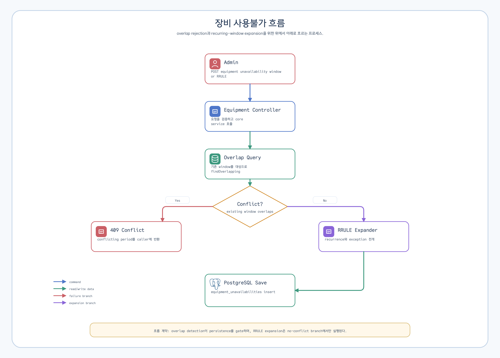

[SVG](assets/data-flow-04-equipment-unavailability-ko.svg) · [Mermaid source](assets/data-flow-04-equipment-unavailability.mmd)

## 5. 알림 이벤트 흐름

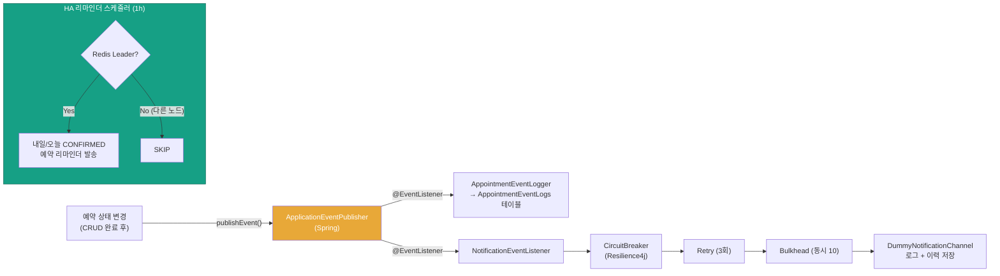

[SVG](assets/data-flow-05-notification-events-ko.svg) · [Mermaid source](assets/data-flow-05-notification-events.mmd)

## 6. Solver 데이터 흐름

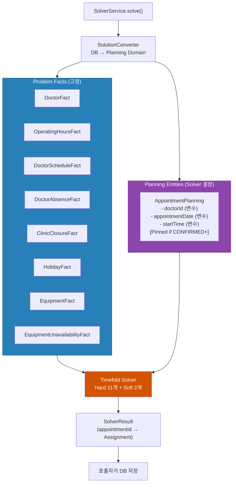

[SVG](assets/data-flow-06-solver-data-ko.svg) · [Mermaid source](assets/data-flow-06-solver-data.mmd)

## 7. Scheduling Policy 관리 흐름

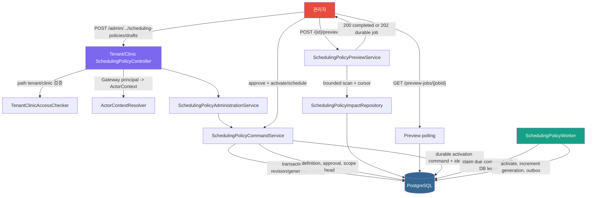

이 흐름은 예약 생성 경로를 직접 바꾸지 않는다. booking consumer flag는 foundation에
없으며, 예약 생성 서비스가 effective snapshot을 소비하는 단계는 후속 변경이다.

## 8. Scheduling Policy Effective Read 흐름

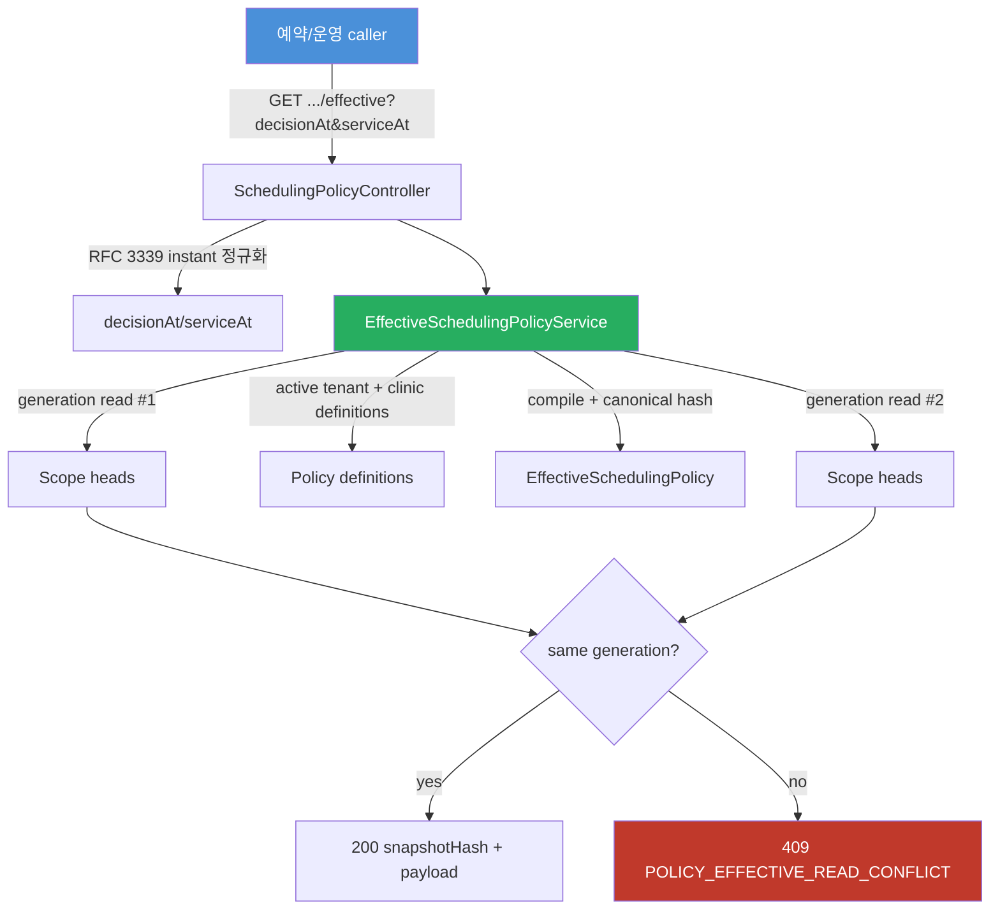

권위 저장소를 읽을 수 없으면 `503 POLICY_EFFECTIVE_READ_UNAVAILABLE`로 fail-closed 한다.
stale cache나 암묵적 기본값을 반환하지 않는다.

## 9. Scheduling Policy 운영 장애 재조정 흐름

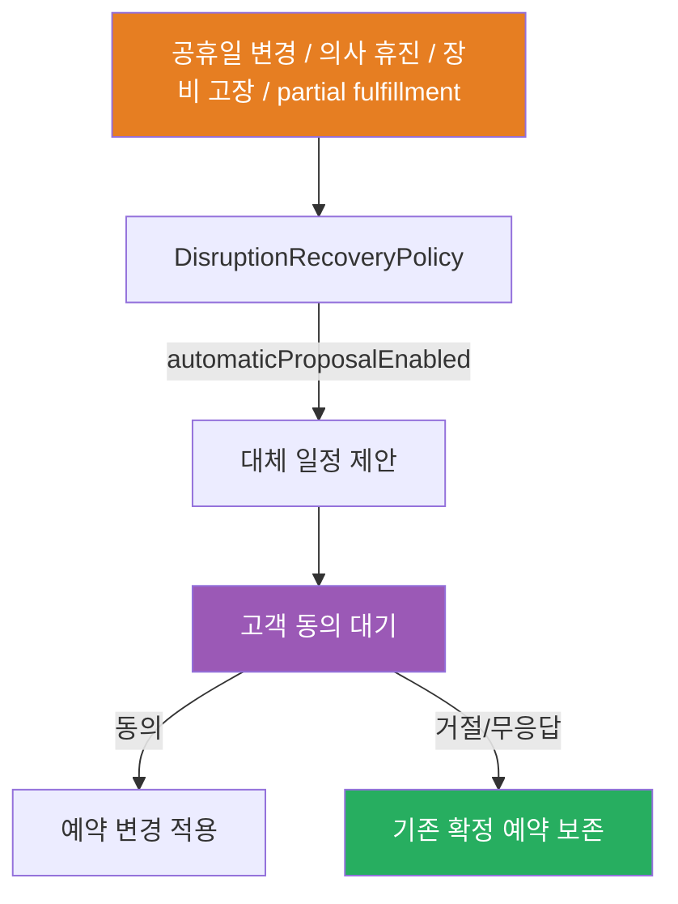

확정 예약 변경은 고객 동의 후 적용한다. 예약 서비스는 재예약 제안과 예약 상태만 다루며,
환불·보상·민원 처리는 외부 서비스의 event로 수렴한다.
