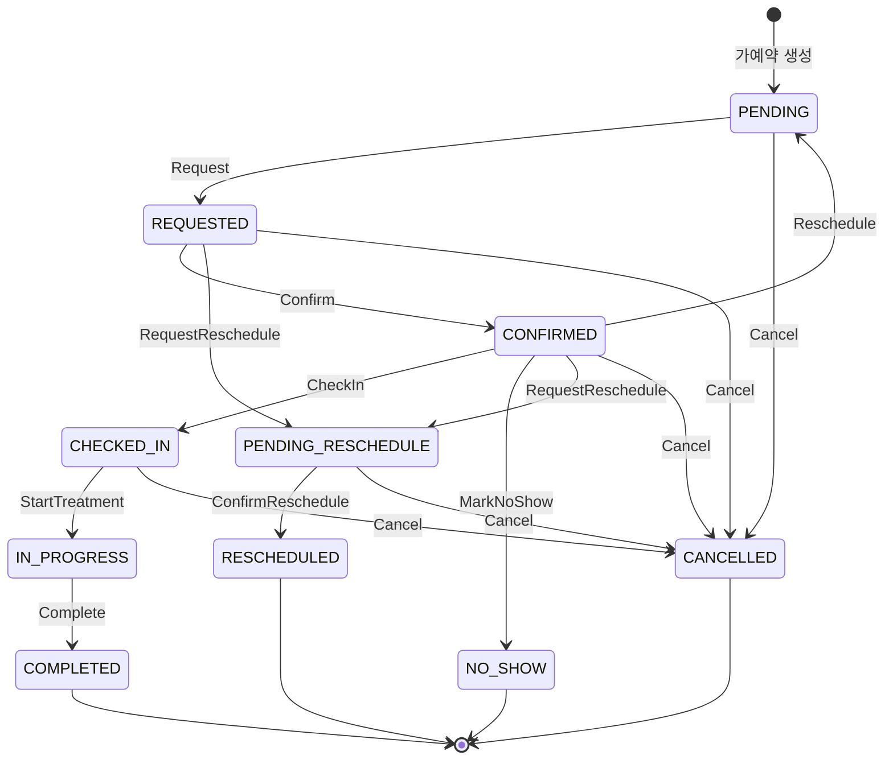

# 도메인 모델

## 엔티티 목록

| Record | Exposed Table | 역할 |
|--------|--------------|------|
| `ClinicRecord` | `Clinics` | 병원 — slotDurationMinutes, maxConcurrentPatients, openOnHolidays |
| `DoctorRecord` | `Doctors` | 의사 — clinicId, providerType, maxConcurrentPatients |
| `AppointmentRecord` | `Appointments` | 예약 — clinicId, doctorId, treatmentTypeId, equipmentId, appointmentDate, startTime, endTime, status |
| `TreatmentTypeRecord` | `TreatmentTypes` | 진료 유형 — defaultDurationMinutes, requiredProviderType, requiresEquipment, maxConcurrentPatients |
| `EquipmentRecord` | `Equipments` | 장비 — usageDurationMinutes, quantity |
| `TreatmentEquipmentRecord` | `TreatmentEquipments` | 진료-장비 매핑 |
| `OperatingHoursRecord` | `OperatingHoursTable` | 영업시간 — dayOfWeek, openTime, closeTime, isActive |
| `DoctorScheduleRecord` | `DoctorSchedules` | 의사 근무 시간 — dayOfWeek, startTime, endTime |
| `DoctorAbsenceRecord` | `DoctorAbsences` | 의사 부재 — absenceDate, startTime, endTime (null=전일) |
| `BreakTimeRecord` | `BreakTimes` | 요일별 휴식시간 — dayOfWeek, startTime, endTime |
| `ClinicDefaultBreakTimeRecord` | `ClinicDefaultBreakTimes` | 기본 휴식시간 — startTime, endTime |
| `ClinicClosureRecord` | `ClinicClosures` | 임시휴진 — closureDate, isFullDay, startTime, endTime |
| `HolidayRecord` | `Holidays` | 공휴일 — holidayDate, recurring |
| `AppointmentNoteRecord` | `AppointmentNotes` | 예약 메모 |
| `ConsultationTopicRecord` | `ConsultationTopics` | 상담 주제 |
| `RescheduleCandidateRecord` | `RescheduleCandidates` | 재배정 후보 |
| `EquipmentUnavailabilityRecord` | `EquipmentUnavailabilities` | 장비 사용불가 구간 — startDate, endDate, recurrenceRule, exceptions |

## 예약 상태머신

### 상태 정의

| 상태 | 의미 |
|------|------|
| `PENDING` | 가예약/미확정 |
| `REQUESTED` | 예약 요청됨 |
| `CONFIRMED` | 예약 확정 |
| `CHECKED_IN` | 내원 확인 |
| `IN_PROGRESS` | 진료 중 |
| `COMPLETED` | 진료 완료 |
| `NO_SHOW` | 미내원 |
| `PENDING_RESCHEDULE` | 재배정 대기 (임시휴진 등) |
| `RESCHEDULED` | 재배정 완료 |
| `CANCELLED` | 취소 |

### 상태 전이도

### Solver Pinned 상태

Timefold Solver가 이동할 수 없는 고정 상태:
- **고정(Pinned)**: `CONFIRMED`, `CHECKED_IN`, `IN_PROGRESS`, `COMPLETED`
- **이동 가능**: `REQUESTED`, `PENDING_RESCHEDULE`

### 이벤트 정의

| 이벤트 | 전이 |
|--------|------|
| `Request` | PENDING → REQUESTED |
| `Confirm` | REQUESTED → CONFIRMED |
| `CheckIn` | CONFIRMED → CHECKED_IN |
| `StartTreatment` | CHECKED_IN → IN_PROGRESS |
| `Complete` | IN_PROGRESS → COMPLETED |
| `Cancel(reason)` | cancellable 상태 → CANCELLED |
| `MarkNoShow` | CONFIRMED → NO_SHOW |
| `Reschedule` | CONFIRMED → PENDING |
| `RequestReschedule(reason)` | REQUESTED/CONFIRMED → PENDING_RESCHEDULE |
| `ConfirmReschedule` | PENDING_RESCHEDULE → RESCHEDULED |

## 슬롯 계산 모델 (`model.service`)

DB에 직접 의존하지 않는 순수 value type.

| 클래스 | 역할 |
|--------|------|
| `SlotQuery` | 슬롯 조회 파라미터 — clinicId, doctorId, treatmentTypeId, date, requestedDurationMinutes |
| `AvailableSlot` | 가용 슬롯 결과 — date, startTime, endTime, doctorId, equipmentIds, remainingCapacity |
| `TimeRange` | 시간 범위 (start inclusive, end exclusive) + `subtractRanges`, `computeEffectiveRanges` 헬퍼 |

## 서비스

| 서비스 | 역할 |
|--------|------|
| `SlotCalculationService` | 단건 가용 슬롯 계산 — (의사, 날짜, 진료유형) 조합의 빈 시간 목록 반환 |
| `ClosureRescheduleService` | 임시휴진 시 영향받는 예약을 첫 번째 가용 슬롯으로 재배정 |
| `ConcurrencyResolver` | 동시 예약 요청 충돌 해결 |
| `ClinicTimezoneService` | 병원 타임존 관리 |
| `EquipmentUnavailabilityService` | 장비 사용불가 구간 CRUD + 반복 규칙(`UnavailabilityExpander`) 기반 기간 전개 |
