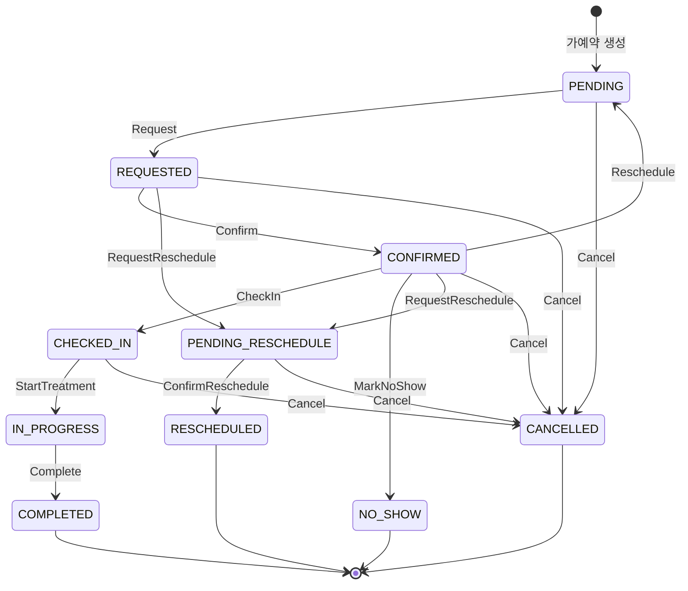
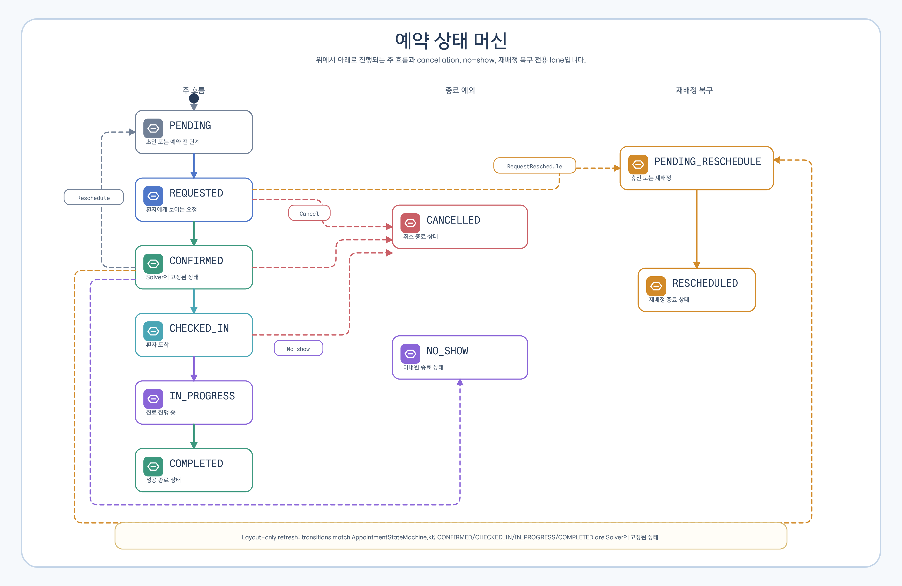

# 도메인 모델

## 엔티티 목록

| Record | Exposed Table | 역할 |
|--------|--------------|------|
| `ClinicRecord` | `Clinics` | 병원 — slotDurationMinutes, maxConcurrentPatients, openOnHolidays |
| `DoctorRecord` | `Doctors` | 의사 — clinicId, providerType, maxConcurrentPatients |
| `AppointmentRecord` | `Appointments` | 예약 — clinicId, doctorId, treatmentTypeId, equipmentId, appointmentDate, startTime, endTime, status |
| `TreatmentTypeRecord` | `TreatmentTypes` | 진료 유형 — defaultDurationMinutes, requiredProviderType, requiresEquipment, maxConcurrentPatients |
| `EquipmentRecord` | `Equipments` | 장비 — usageDurationMinutes, quantity |
| `TreatmentEquipmentRecord` | `TreatmentEquipments` | 진료-장비 매핑 |
| `OperatingHoursRecord` | `OperatingHoursTable` | 영업시간 — dayOfWeek, openTime, closeTime, isActive |
| `DoctorScheduleRecord` | `DoctorSchedules` | 의사 근무 시간 — dayOfWeek, startTime, endTime |
| `DoctorAbsenceRecord` | `DoctorAbsences` | 의사 부재 — absenceDate, startTime, endTime (null=전일) |
| `BreakTimeRecord` | `BreakTimes` | 요일별 휴식시간 — dayOfWeek, startTime, endTime |
| `ClinicDefaultBreakTimeRecord` | `ClinicDefaultBreakTimes` | 기본 휴식시간 — startTime, endTime |
| `ClinicClosureRecord` | `ClinicClosures` | 임시휴진 — closureDate, isFullDay, startTime, endTime |
| `HolidayRecord` | `Holidays` | 공휴일 — holidayDate, recurring |
| `AppointmentNoteRecord` | `AppointmentNotes` | 예약 메모 |
| `ConsultationTopicRecord` | `ConsultationTopics` | 상담 주제 |
| `RescheduleCandidateRecord` | `RescheduleCandidates` | 재배정 후보 |
| `EquipmentUnavailabilityRecord` | `EquipmentUnavailabilities` | 장비 사용불가 구간 — startDate, endDate, recurrenceRule, exceptions |
| `SchedulingPolicyDefinitionRecord` | `SchedulingPolicyDefinitions` | tenant/clinic scheduling policy immutable version |
| `SchedulingPolicyScopeHeadRecord` | `SchedulingPolicyScopeHeads` | scope별 head revision과 effective generation |
| `SchedulingPolicyApprovalRecord` | `SchedulingPolicyApprovals` | draft revision에 묶인 승인 증빙 |
| `EffectiveSchedulingPolicySnapshotRecord` | `EffectiveSchedulingPolicySnapshots` | compiled policy snapshot hash와 source versions |
| `SchedulingPolicyActivationCommandRecord` | `SchedulingPolicyActivationCommands` | due activation, idempotency, replay, lease 상태 |
| `SchedulingPolicyPreviewJobRecord` | `SchedulingPolicyPreviewJobs` | bounded impact preview 진행률, cursor, evidence token |

## 예약 상태머신

### 상태 정의

| 상태 | 의미 |
|------|------|
| `PENDING` | 가예약/미확정 |
| `REQUESTED` | 예약 요청됨 |
| `CONFIRMED` | 예약 확정 |
| `CHECKED_IN` | 내원 확인 |
| `IN_PROGRESS` | 진료 중 |
| `COMPLETED` | 진료 완료 |
| `NO_SHOW` | 미내원 |
| `PENDING_RESCHEDULE` | 재배정 대기 (임시휴진 등) |
| `RESCHEDULED` | 재배정 완료 |
| `CANCELLED` | 취소 |

### 상태 전이도


```mermaid
stateDiagram-v2
    [*] --> PENDING : 가예약 생성
    PENDING --> REQUESTED : Request
    PENDING --> CANCELLED : Cancel

    REQUESTED --> CONFIRMED : Confirm
    REQUESTED --> PENDING_RESCHEDULE : RequestReschedule
    REQUESTED --> CANCELLED : Cancel

    CONFIRMED --> CHECKED_IN : CheckIn
    CONFIRMED --> NO_SHOW : MarkNoShow
    CONFIRMED --> PENDING_RESCHEDULE : RequestReschedule
    CONFIRMED --> PENDING : Reschedule
    CONFIRMED --> CANCELLED : Cancel

    CHECKED_IN --> IN_PROGRESS : StartTreatment
    CHECKED_IN --> CANCELLED : Cancel

    IN_PROGRESS --> COMPLETED : Complete

    PENDING_RESCHEDULE --> RESCHEDULED : ConfirmReschedule
    PENDING_RESCHEDULE --> CANCELLED : Cancel

    COMPLETED --> [*]
    RESCHEDULED --> [*]
    CANCELLED --> [*]
    NO_SHOW --> [*]
```



[SVG](assets/domain-model-01-appointment-state-machine-ko.svg) · [Mermaid source](assets/domain-model-01-appointment-state-machine.mmd)

### Solver Pinned 상태

Timefold Solver가 이동할 수 없는 고정 상태:
- **고정(Pinned)**: `CONFIRMED`, `CHECKED_IN`, `IN_PROGRESS`, `COMPLETED`
- **이동 가능**: `REQUESTED`, `PENDING_RESCHEDULE`

### 이벤트 정의

| 이벤트 | 전이 |
|--------|------|
| `Request` | PENDING → REQUESTED |
| `Confirm` | REQUESTED → CONFIRMED |
| `CheckIn` | CONFIRMED → CHECKED_IN |
| `StartTreatment` | CHECKED_IN → IN_PROGRESS |
| `Complete` | IN_PROGRESS → COMPLETED |
| `Cancel(reason)` | cancellable 상태 → CANCELLED |
| `MarkNoShow` | CONFIRMED → NO_SHOW |
| `Reschedule` | CONFIRMED → PENDING |
| `RequestReschedule(reason)` | REQUESTED/CONFIRMED → PENDING_RESCHEDULE |
| `ConfirmReschedule` | PENDING_RESCHEDULE → RESCHEDULED |

## 슬롯 계산 모델 (`model.service`)

DB에 직접 의존하지 않는 순수 value type.

| 클래스 | 역할 |
|--------|------|
| `SlotQuery` | 슬롯 조회 파라미터 — clinicId, doctorId, treatmentTypeId, date, requestedDurationMinutes |
| `AvailableSlot` | 가용 슬롯 결과 — date, startTime, endTime, doctorId, equipmentIds, remainingCapacity |
| `TimeRange` | 시간 범위 (start inclusive, end exclusive) + `subtractRanges`, `computeEffectiveRanges` 헬퍼 |

## 서비스

| 서비스 | 역할 |
|--------|------|
| `SlotCalculationService` | 단건 가용 슬롯 계산 — (의사, 날짜, 진료유형) 조합의 빈 시간 목록 반환 |
| `ClosureRescheduleService` | 임시휴진 시 영향받는 예약을 첫 번째 가용 슬롯으로 재배정 |
| `ConcurrencyResolver` | 동시 예약 요청 충돌 해결 |
| `ClinicTimezoneService` | 병원 타임존 관리 |
| `EquipmentUnavailabilityService` | 장비 사용불가 구간 CRUD + 반복 규칙(`UnavailabilityExpander`) 기반 기간 전개 |

## Scheduling Policy 모델

Scheduling policy는 예약 생성 자체를 수행하지 않고, 예약 결정자가 따라야 할 병원별
정책 snapshot을 만든다. tenant baseline은 필수 기준이고 clinic override는 허용된 필드만
좁히거나 대체할 수 있다.

### Policy Scope

| Scope | clinic ID | 의미 |
|------|-----------|------|
| `TENANT_DEFAULT` | `null` | tenant group 전체 baseline |
| `CLINIC_OVERRIDE` | 양수 | 특정 clinic partial override |

### Policy Kind

| Kind | 담당 업무 규칙 |
|------|----------------|
| `BOOKING_COMMITMENT` | 관리자 직접 확정, 고객 기원 가예약, hold, 확정 변경 동의 |
| `HOLD_AND_CONSENT` | hold 중 동의 증빙 요구사항 |
| `CAPACITY_AND_OVERBOOKING` | 정상 수용량, 의도적 overbooking, hard ceiling |
| `PRIORITY_AND_RELIABILITY` | no-show, 당일 취소 같은 객관 signal 기반 scheduling weight |
| `RECONFIRMATION` | 방문 전 재확인 lead time과 retry ceiling |
| `DISRUPTION_RECOVERY` | 공휴일 변경, 휴진, 장비 고장, partial fulfillment 이후 재예약 제안 |
| `OPERATING_EXTENSION` | 정상 영업시간 초과 진료 허용 범위 |
| `NOTIFICATION_AND_SLA` | 통지 channel과 운영 응답 SLA |

### Lifecycle

```text
DRAFT -> SCHEDULED | ACTIVE | RETIRED
SCHEDULED -> ACTIVE | RETIRED
ACTIVE -> RETIRED
```

정책 payload는 immutable version이다. 발행된 row를 수정하지 않고 새 draft revision을
만들어 preview, approval, activation을 다시 거친다.

### 고객 동의와 확정 예약 보호

`BookingCommitmentPolicy`는 고객이 직접 등록한 예약을
`PROVISIONAL_APPROVAL_REQUIRED`로 표현한다. 병원 담당자가 승인하기 전까지는 가예약
상태이며, 확정 예약 변경은 `NEW_PROPOSAL_AND_CUSTOMER_CONSENT`를 따른다.

운영 장애나 하루에 모든 세부 진료를 완료하지 못한 경우에도 기존 확정 예약을 고객 동의
없이 덮어쓰지 않는다. `DisruptionRecoveryPolicy`는 대체 일정 제안을 만들 수 있는지와
얼마나 빨리 제안해야 하는지를 저장하지만, 환불·보상·민원 처리는 예약 서비스 밖의
서비스가 다룬다.

### Effective Snapshot

`EffectiveSchedulingPolicy`는 다음 값을 묶어 hash한다.

| 값 | 목적 |
|----|------|
| `decisionAt` | 현재 명령을 평가할 정책 시각 |
| `serviceAt` | 실제 시술/진료일에 적용될 future-effective 정책 시각 |
| `generation` | tenant/clinic 권위 세대 |
| `sourceVersions` | kind별 tenant/clinic source version |
| `sourceByPath` | leaf policy 값의 출처 |
| `disabledFeatures` | 유효한 clinic override가 끈 선택 기능 |
| `payload` | 완전히 해석된 `CompiledSchedulingPolicy` |

컴파일은 generation double-read로 stale snapshot을 거절한다. 필요한 정책 kind가 없으면
관대한 zero/default로 대체하지 않고 unavailable 상태로 취급한다.
