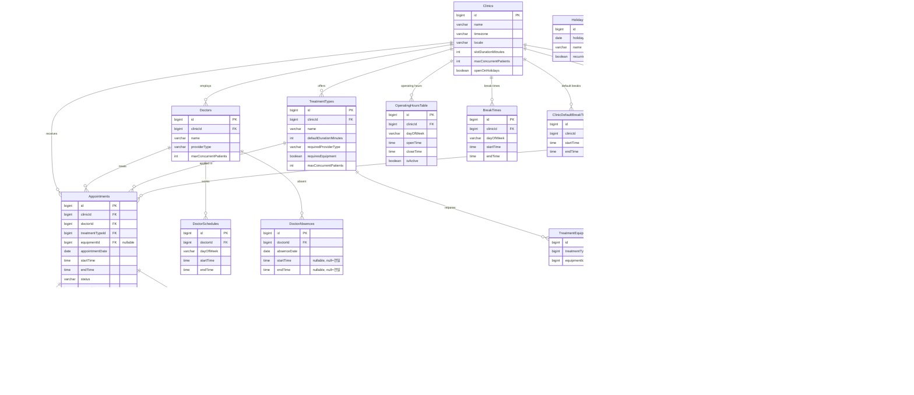

# ERD (Entity Relationship Diagram)

## 전체 테이블 관계도

## 핵심 관계 요약

| 관계 | 카디널리티 | 설명 |
|------|-----------|------|
| Clinic → Doctor | 1:N | 한 병원에 여러 의사 |
| Clinic → TreatmentType | 1:N | 한 병원에 여러 진료유형 |
| Clinic → Equipment | 1:N | 한 병원에 여러 장비 |
| Doctor → Appointment | 1:N | 한 의사가 여러 예약 담당 |
| TreatmentType → TreatmentEquipment | 1:N | 진료유형이 여러 장비 필요 가능 |
| Equipment → EquipmentUnavailability | 1:N | 장비별 사용불가 구간 다수 등록 |
| Appointment → AppointmentNote | 1:N | 예약 메모 여러 개 |
| Appointment → RescheduleCandidate | 1:N | 재배정 이력 추적 |

## 컬럼 타입 규칙

| 필드 종류 | 타입 | 예시 |
|---------|------|------|
| 예약 날짜 | `LocalDate` | `2026-04-20` (클리닉 현지) |
| 예약 시간 | `LocalTime` | `09:00:00` (클리닉 현지) |
| 감사 타임스탬프 | `Instant` (UTC) | `created_at`, `updated_at` |
| 타임존 | `String` (ZoneId) | `"Asia/Seoul"` |
| 반복 규칙 | `String` (iCal RRULE) | `"FREQ=WEEKLY;BYDAY=MO,WE"` |
