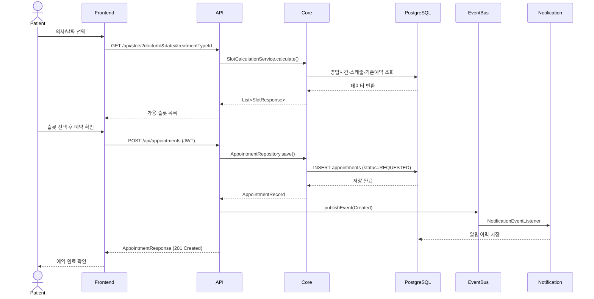
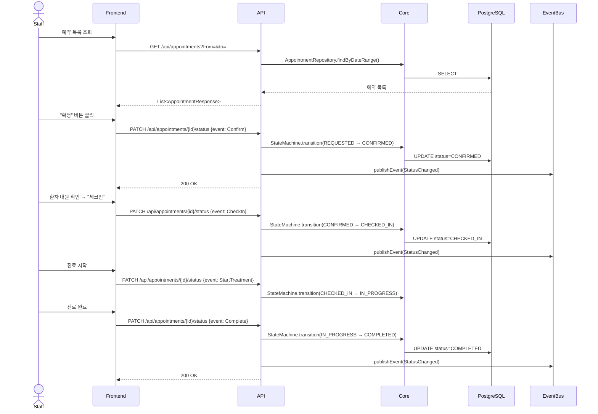
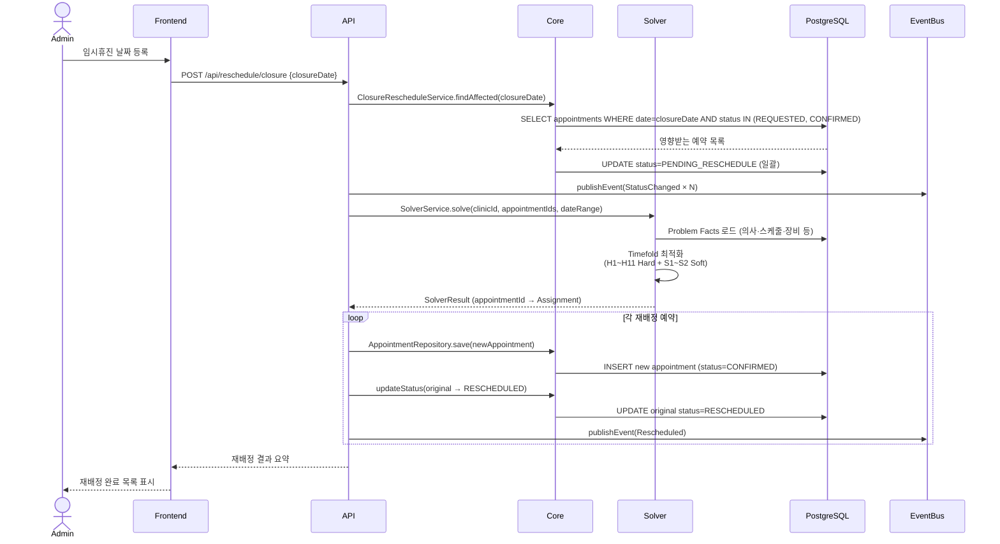
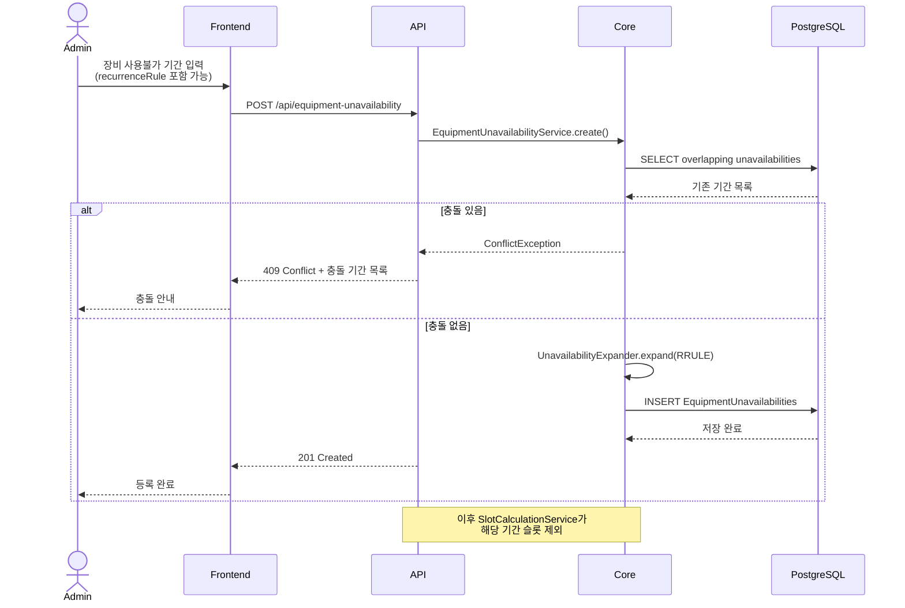
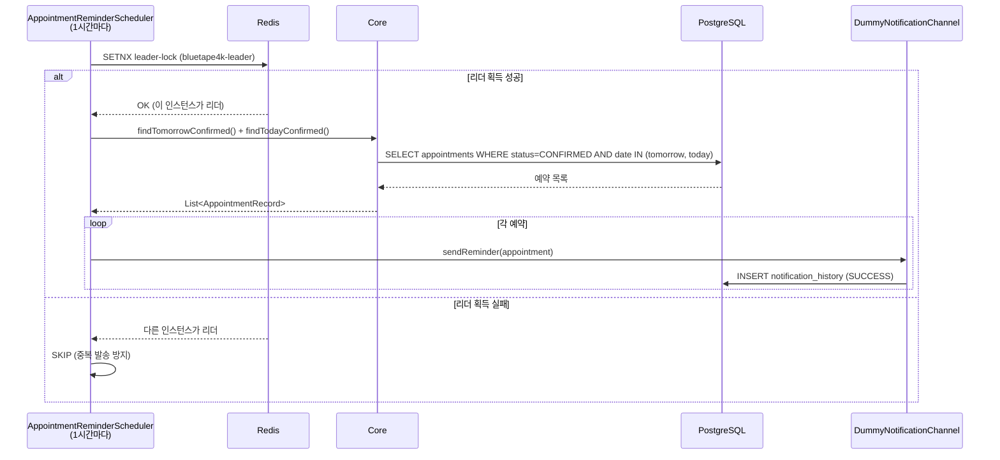

# 사용자 시나리오 (User Scenarios)

## 참여자

| 참여자 | 설명 |
|--------|------|
| `Patient` | 예약을 생성/취소하는 환자 |
| `Staff` | 체크인·상태 변경을 처리하는 병원 직원 |
| `Admin` | 임시휴진·재배정·장비 관리를 담당하는 관리자 |
| `Frontend` | Angular SPA |
| `API` | appointment-api (Spring Boot) |
| `Core` | appointment-core (도메인 서비스·리포지토리) |
| `Solver` | appointment-solver (Timefold) |
| `EventBus` | Spring ApplicationEventPublisher |
| `Notification` | appointment-notification |

---

## S1. 환자 예약 생성

---

## S2. 예약 확정 → 체크인 → 진료 완료

---

## S3. 임시휴진 재배정 (Solver 활용)

---

## S4. 장비 사용불가 등록 + 예약 충돌 확인

---

## S5. HA 알림 리마인더 발송 (스케줄러)

