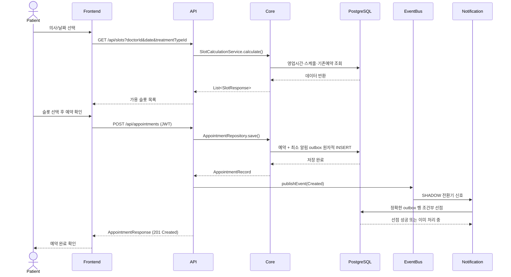
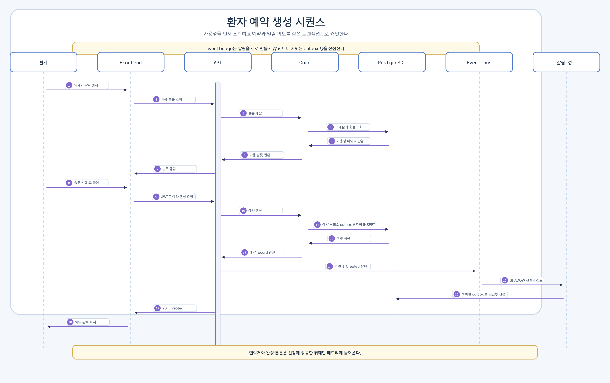
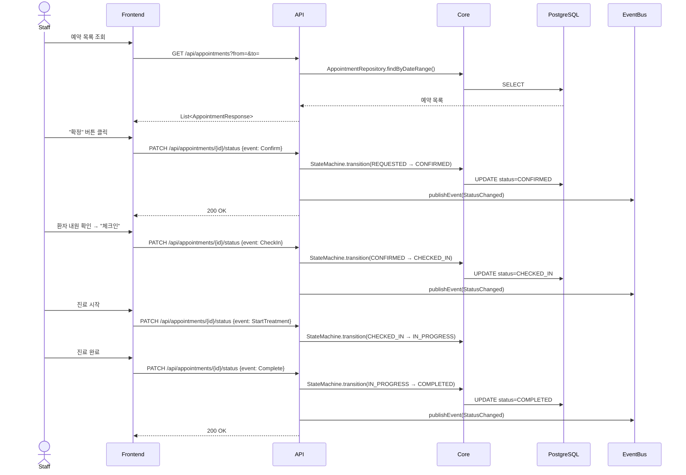
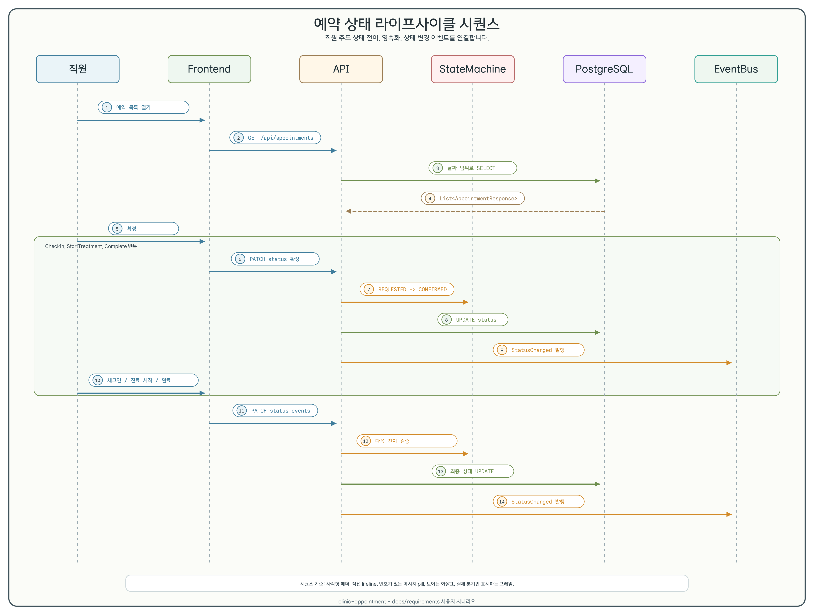
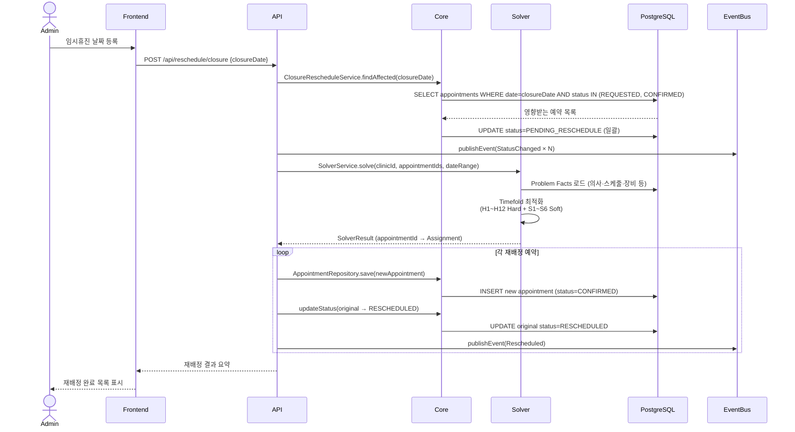
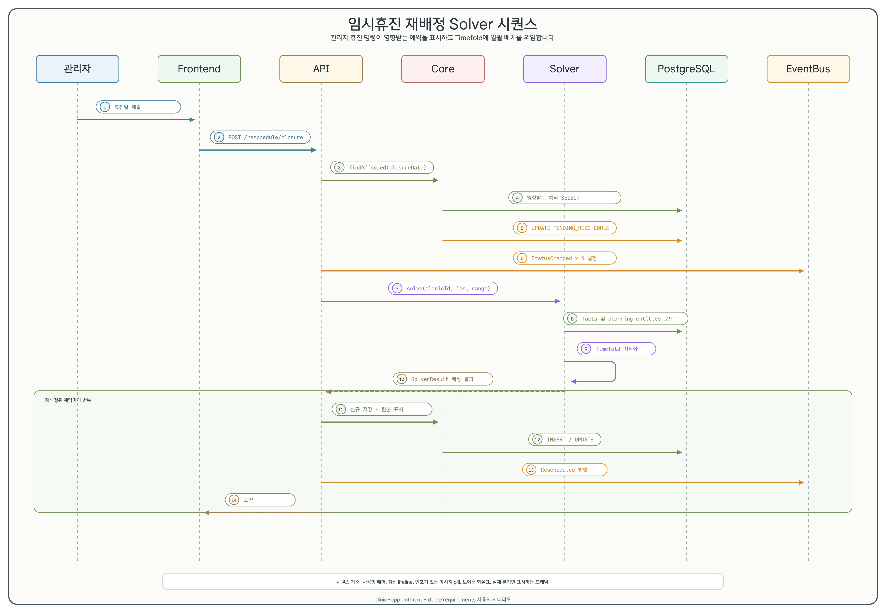
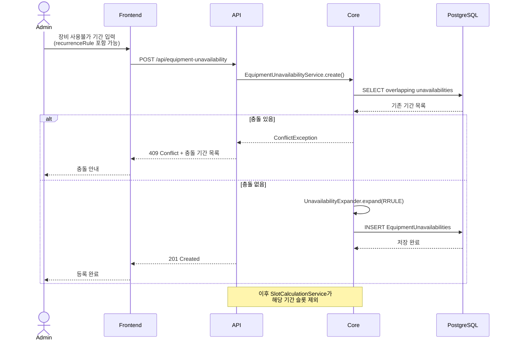
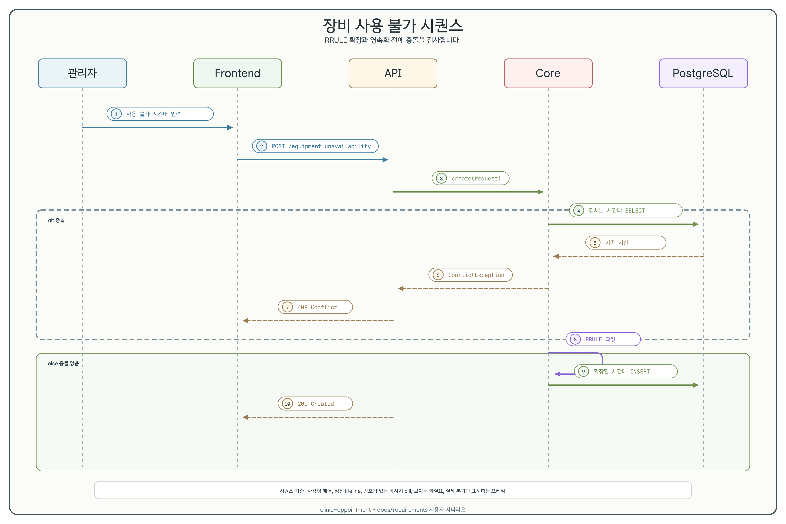
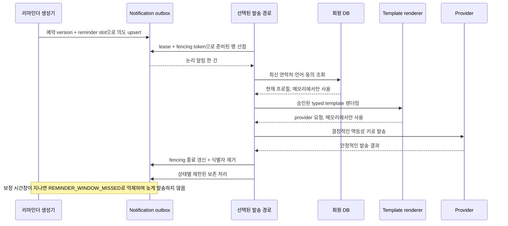
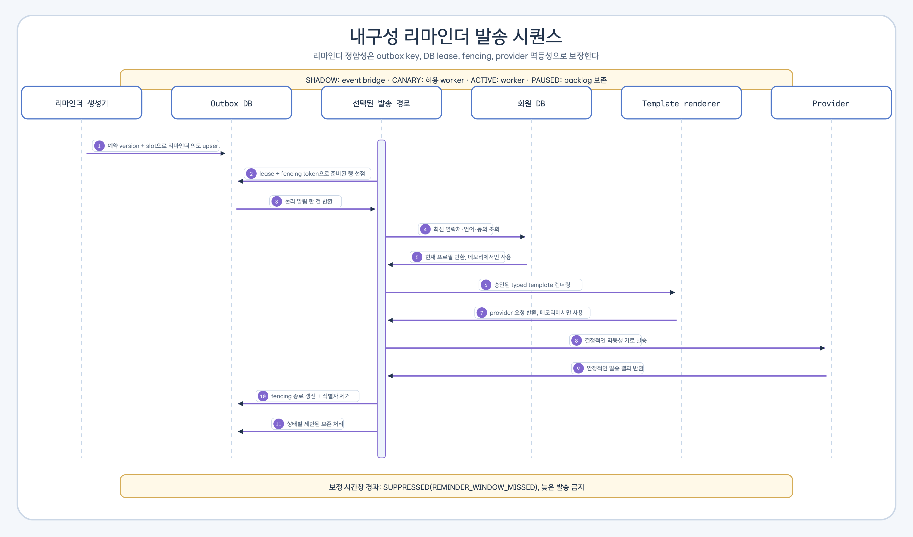

# 사용자 시나리오 (User Scenarios)

## 참여자

| 참여자 | 설명 |
|--------|------|
| `Patient` | 예약을 생성/취소하는 환자 |
| `Staff` | 체크인·상태 변경을 처리하는 병원 직원 |
| `Admin` | 임시휴진·재배정·장비 관리를 담당하는 관리자 |
| `Frontend` | Angular SPA |
| `API` | appointment-api (Spring Boot) |
| `Core` | appointment-core (도메인 서비스·리포지토리) |
| `Solver` | appointment-solver (Timefold) |
| `EventBus` | Spring ApplicationEventPublisher |
| `Notification` | appointment-notification |

---

## S1. 환자 예약 생성

```mermaid
sequenceDiagram
    actor Patient
    participant Frontend
    participant API
    participant Core
    participant DB as PostgreSQL
    participant EventBus
    participant Notification

    Patient->>Frontend: 의사/날짜 선택
    Frontend->>API: GET /api/slots?doctorId&date&treatmentTypeId
    API->>Core: SlotCalculationService.calculate()
    Core->>DB: 영업시간·스케줄·기존예약 조회
    DB-->>Core: 데이터 반환
    Core-->>API: List<SlotResponse>
    API-->>Frontend: 가용 슬롯 목록

    Patient->>Frontend: 슬롯 선택 후 예약 확인
    Frontend->>API: POST /api/appointments (JWT)
    API->>Core: AppointmentRepository.save()
    Core->>DB: 예약 + 최소 알림 outbox 원자적 INSERT
    DB-->>Core: 저장 완료
    Core-->>API: AppointmentRecord
    API->>EventBus: publishEvent(Created)
    EventBus->>Notification: SHADOW 전환기 신호
    Notification->>DB: 정확한 outbox 행 조건부 선점
    DB-->>Notification: 선점 성공 또는 이미 처리 중
    API-->>Frontend: AppointmentResponse (201 Created)
    Frontend-->>Patient: 예약 완료 확인
```

<picture>
  <source media="(prefers-color-scheme: dark)" srcset="assets/user-scenarios-01-patient-booking-ko-dark.png">
  
</picture>

[한국어 light SVG](assets/user-scenarios-01-patient-booking-ko.svg) ·
[한국어 dark SVG](assets/user-scenarios-01-patient-booking-ko-dark.svg) ·
[English light SVG](assets/user-scenarios-01-patient-booking-en.svg) ·
[English dark SVG](assets/user-scenarios-01-patient-booking-en-dark.svg) ·
[Mermaid 의미 스케치](assets/user-scenarios-01-patient-booking.mmd)

---

## S2. 예약 확정 → 체크인 → 진료 완료

```mermaid
sequenceDiagram
    actor Staff
    participant Frontend
    participant API
    participant Core
    participant DB as PostgreSQL
    participant EventBus

    Staff->>Frontend: 예약 목록 조회
    Frontend->>API: GET /api/appointments?from=&to=
    API->>Core: AppointmentRepository.findByDateRange()
    Core->>DB: SELECT
    DB-->>API: 예약 목록
    API-->>Frontend: List<AppointmentResponse>

    Staff->>Frontend: "확정" 버튼 클릭
    Frontend->>API: PATCH /api/appointments/{id}/status {event: Confirm}
    API->>Core: StateMachine.transition(REQUESTED → CONFIRMED)
    Core->>DB: UPDATE status=CONFIRMED
    API->>EventBus: publishEvent(StatusChanged)
    API-->>Frontend: 200 OK

    Staff->>Frontend: 환자 내원 확인 → "체크인"
    Frontend->>API: PATCH /api/appointments/{id}/status {event: CheckIn}
    API->>Core: StateMachine.transition(CONFIRMED → CHECKED_IN)
    Core->>DB: UPDATE status=CHECKED_IN
    API->>EventBus: publishEvent(StatusChanged)

    Staff->>Frontend: 진료 시작
    Frontend->>API: PATCH /api/appointments/{id}/status {event: StartTreatment}
    API->>Core: StateMachine.transition(CHECKED_IN → IN_PROGRESS)

    Staff->>Frontend: 진료 완료
    Frontend->>API: PATCH /api/appointments/{id}/status {event: Complete}
    API->>Core: StateMachine.transition(IN_PROGRESS → COMPLETED)
    Core->>DB: UPDATE status=COMPLETED
    API->>EventBus: publishEvent(StatusChanged)
    API-->>Frontend: 200 OK
```

[SVG](assets/user-scenarios-02-status-lifecycle-ko.svg) · [Mermaid source](assets/user-scenarios-02-status-lifecycle.mmd)

---

## S3. 임시휴진 재배정 (Solver 활용)

```mermaid
sequenceDiagram
    actor Admin
    participant Frontend
    participant API
    participant Core
    participant Solver
    participant DB as PostgreSQL
    participant EventBus

    Admin->>Frontend: 임시휴진 날짜 등록
    Frontend->>API: POST /api/reschedule/closure {closureDate}
    API->>Core: ClosureRescheduleService.findAffected(closureDate)
    Core->>DB: SELECT appointments WHERE date=closureDate AND status IN (REQUESTED, CONFIRMED)
    DB-->>Core: 영향받는 예약 목록

    Core->>DB: UPDATE status=PENDING_RESCHEDULE (일괄)
    API->>EventBus: publishEvent(StatusChanged × N)

    API->>Solver: SolverService.solve(clinicId, appointmentIds, dateRange)
    Solver->>DB: Problem Facts 로드 (의사·스케줄·장비 등)
    Solver->>Solver: Timefold 최적화<br/>(H1~H12 Hard + S1~S6 Soft)
    Solver-->>API: SolverResult (appointmentId → Assignment)

    loop 각 재배정 예약
        API->>Core: AppointmentRepository.save(newAppointment)
        Core->>DB: INSERT new appointment (status=CONFIRMED)
        API->>Core: updateStatus(original → RESCHEDULED)
        Core->>DB: UPDATE original status=RESCHEDULED
        API->>EventBus: publishEvent(Rescheduled)
    end

    API-->>Frontend: 재배정 결과 요약
    Frontend-->>Admin: 재배정 완료 목록 표시
```

[SVG](assets/user-scenarios-03-closure-reschedule-solver-ko.svg) · [Mermaid source](assets/user-scenarios-03-closure-reschedule-solver.mmd)

---

## S4. 장비 사용불가 등록 + 예약 충돌 확인

```mermaid
sequenceDiagram
    actor Admin
    participant Frontend
    participant API
    participant Core
    participant DB as PostgreSQL

    Admin->>Frontend: 장비 사용불가 기간 입력<br/>(recurrenceRule 포함 가능)
    Frontend->>API: POST /api/equipment-unavailability
    API->>Core: EquipmentUnavailabilityService.create()
    Core->>DB: SELECT overlapping unavailabilities
    DB-->>Core: 기존 기간 목록

    alt 충돌 있음
        Core-->>API: ConflictException
        API-->>Frontend: 409 Conflict + 충돌 기간 목록
        Frontend-->>Admin: 충돌 안내
    else 충돌 없음
        Core->>Core: UnavailabilityExpander.expand(RRULE)
        Core->>DB: INSERT EquipmentUnavailabilities
        DB-->>Core: 저장 완료
        API-->>Frontend: 201 Created
        Frontend-->>Admin: 등록 완료
    end

    Note over API,Core: 이후 SlotCalculationService가<br/>해당 기간 슬롯 제외
```

[SVG](assets/user-scenarios-04-equipment-unavailability-ko.svg) · [Mermaid source](assets/user-scenarios-04-equipment-unavailability.mmd)

---

## S5. 내구성 리마인더 발송

```mermaid
sequenceDiagram
    participant Materializer as 리마인더 생성기
    participant DB as Notification outbox
    participant Route as 선택된 발송 경로
    participant Member as 회원 DB
    participant Template as Template renderer
    participant Provider

    Materializer->>DB: 예약 version + reminder slot으로 의도 upsert
    Route->>DB: lease + fencing token으로 준비된 행 선점
    DB-->>Route: 논리 알림 한 건
    Route->>Member: 최신 연락처·언어·동의 조회
    Member-->>Route: 현재 프로필, 메모리에서만 사용
    Route->>Template: 승인된 typed template 렌더링
    Template-->>Route: provider 요청, 메모리에서만 사용
    Route->>Provider: 결정적인 멱등성 키로 발송
    Provider-->>Route: 안정적인 발송 결과
    Route->>DB: fencing 종료 갱신 + 식별자 제거
    Route->>DB: 상태별 제한된 보존 처리

    Note over Materializer,DB: 보정 시간창이 지나면 REMINDER_WINDOW_MISSED로 억제하며 늦게 발송하지 않음
```

<picture>
  <source media="(prefers-color-scheme: dark)" srcset="assets/user-scenarios-05-ha-reminder-ko-dark.png">
  
</picture>

[한국어 light SVG](assets/user-scenarios-05-ha-reminder-ko.svg) ·
[한국어 dark SVG](assets/user-scenarios-05-ha-reminder-ko-dark.svg) ·
[English light SVG](assets/user-scenarios-05-ha-reminder-en.svg) ·
[English dark SVG](assets/user-scenarios-05-ha-reminder-en-dark.svg) ·
[Mermaid 의미 스케치](assets/user-scenarios-05-ha-reminder.mmd)

Redis 리더 선출은 이 발송 시퀀스의 정합성 경계가 아닙니다. 향후 SaaS 병원 수가
커지면 리마인더 보정 scanner의 trigger 수를 줄이는 최적화로 사용할 수 있지만,
중복 방지는 outbox 멱등성 키, DB lease, fencing, provider 멱등성 키로 처리합니다.
