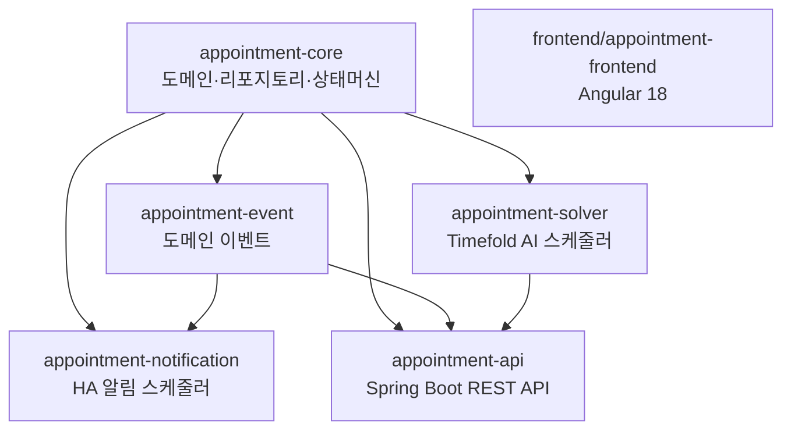
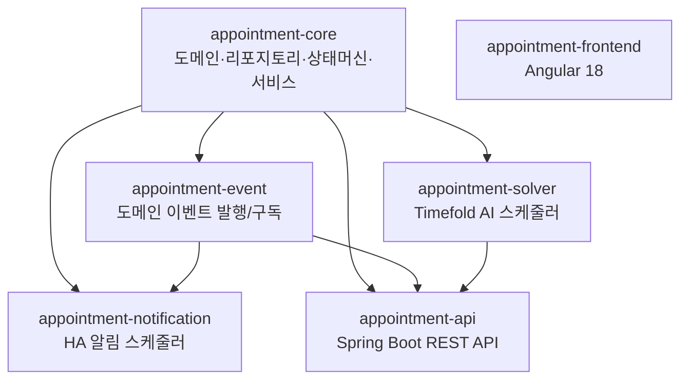
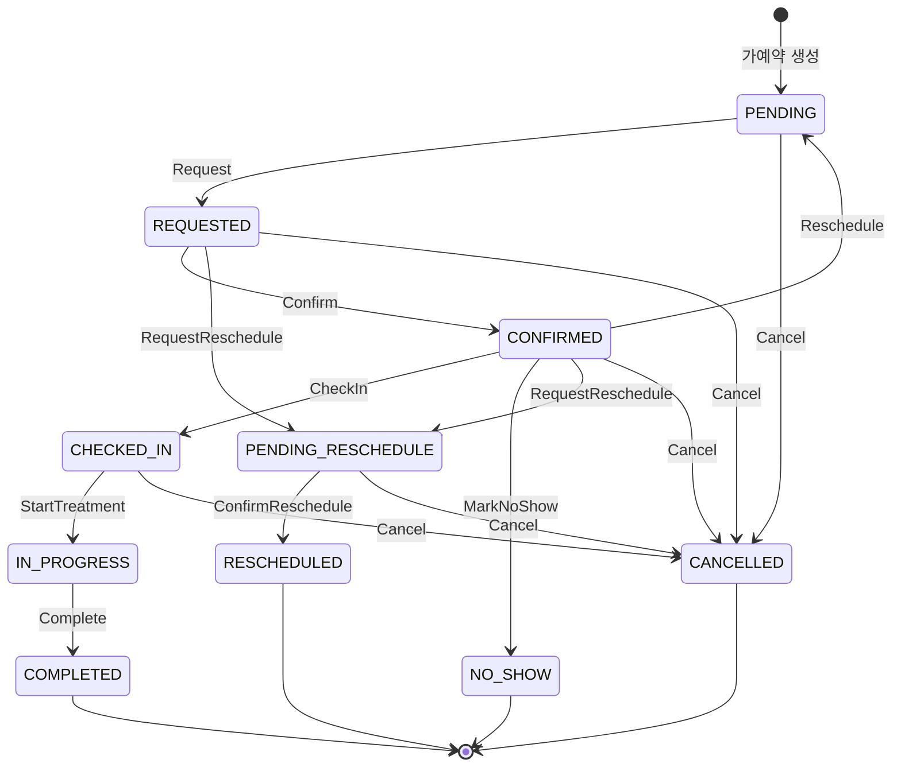

# Living Documentation Implementation Plan

> **For agentic workers:
** REQUIRED SUB-SKILL: Use superpowers:subagent-driven-development (recommended) or superpowers:executing-plans to implement this plan task-by-task. Steps use checkbox (
`- [ ]`) syntax for tracking.

**Goal:
** README 전면 개편, CHANGELOG 도입, docs/requirements/ 요구사항 문서화, 6개 모듈별 README 작성으로 clinic-appointment 저장소의 Living Documentation 체계를 구축한다.

**Architecture:
** 루트 README는 사용자 대상 기능 중심, 모듈 README는 개발자 대상 구현 중심, docs/requirements/는 요구사항/설계 기록. CHANGELOG는 Keep a Changelog 1.1.0 표준.

**Tech Stack:** Markdown, Mermaid (다이어그램), Keep a Changelog 1.1.0

---

## File Structure

### 신규 생성 파일

| 파일                                        | 역할                        |
|-------------------------------------------|---------------------------|
| `README.md`                               | 루트 README 전면 개편 (사용자 대상)  |
| `CHANGELOG.md`                            | Keep a Changelog 형식 변경 이력 |
| `docs/requirements/README.md`             | 요구사항 인덱스 + 구현 상태표         |
| `docs/requirements/architecture.md`       | 모듈 의존성, 설계 결정             |
| `docs/requirements/domain-model.md`       | 도메인 엔티티, 상태머신, 테이블 관계     |
| `docs/requirements/solver.md`             | Timefold Solver 설계        |
| `docs/requirements/notification.md`       | 알림 모듈 설계                  |
| `docs/requirements/frontend.md`           | Angular 프론트엔드 설계          |
| `appointment-core/README.md`              | 개발자용 — 상세                 |
| `appointment-event/README.md`             | 개발자용 — 간략                 |
| `appointment-solver/README.md`            | 개발자용 — 상세                 |
| `appointment-notification/README.md`      | 개발자용 — 상세                 |
| `appointment-api/README.md`               | 개발자용 — 중간                 |
| `frontend/appointment-frontend/README.md` | 개발자용 — 간략                 |

### 수정 파일

| 파일          | 변경 내용  |
|-------------|--------|
| `README.md` | 전면 재작성 |

---

## Task 1: 루트 README.md 전면 개편

**Files:**

- Modify: `README.md`

- [ ] **Step 1: README.md 전면 재작성**

```markdown
# clinic-appointment

[](https://github.com/bluetape4k/clinic-appointment/actions/workflows/ci.yml)

개인병원 환자 예약 관리 시스템 — Kotlin 2.3 + Spring Boot 4 + Timefold Solver AI 스케줄링

## 주요 기능

- **예약 상태 머신** — PENDING → REQUESTED → CONFIRMED → CHECKED_IN → IN_PROGRESS → COMPLETED 전이, 취소/재배정 지원
- **AI 최적 스케줄링** — Timefold Solver로 의사·장비·영업시간 10개 Hard + 2개 Soft 제약을 동시에 만족하는 최적 배치
- **고가용성 알림** — Redis Leader Election으로 단일 노드 전송 보장, Resilience4j CircuitBreaker/Retry/Bulkhead 적용
- **REST API** — Spring Boot 4 MVC, JWT 인증, Flyway 마이그레이션, Swagger UI 제공
- **Angular 18 웹 UI** — 예약 조회/생성/상태 변경 인터페이스

## 아키텍처



## 모듈

| 모듈                              | 역할                                                            | 개발자 문서                                            |
|---------------------------------|---------------------------------------------------------------|---------------------------------------------------|
| `appointment-core`              | 도메인 모델(16개 엔티티), Exposed ORM 테이블, 리포지토리, 예약 상태머신, 슬롯 계산 서비스   | [README](appointment-core/README.md)              |
| `appointment-event`             | Spring ApplicationEvent 기반 도메인 이벤트 발행/구독, 이벤트 로그 저장           | [README](appointment-event/README.md)             |
| `appointment-solver`            | Timefold Solver AI 최적화 — 10개 Hard + 2개 Soft 제약으로 대량 예약 최적 배치  | [README](appointment-solver/README.md)            |
| `appointment-notification`      | Redis Leader Election + Resilience4j 기반 HA 알림 스케줄러, 리마인더 발송   | [README](appointment-notification/README.md)      |
| `appointment-api`               | Spring Boot 4 REST API — 예약 CRUD, 슬롯 조회, 재배정, JWT 인증, Swagger | [README](appointment-api/README.md)               |
| `frontend/appointment-frontend` | Angular 18 웹 UI — 예약 관리 인터페이스                                 | [README](frontend/appointment-frontend/README.md) |

## 빠른 시작

> TODO: Docker Compose 환경 구성 후 업데이트 예정

현재는 수동으로 PostgreSQL + Redis를 실행한 뒤 API를 기동합니다.

```bash
# API 서버 기동 (PostgreSQL + Redis 필요)
./gradlew :appointment-api:bootRun
# Swagger UI: http://localhost:8080/swagger-ui.html
```

## 빌드 & 테스트

```bash
# 전체 빌드 (frontend 제외)
./gradlew build -x :frontend:appointment-frontend:build

# 모듈별 빌드
./gradlew :appointment-core:build
./gradlew :appointment-solver:build
./gradlew :appointment-api:build

# 특정 테스트 실행
./gradlew :appointment-core:test --tests "fully.qualified.ClassName.methodName"
```

### Prerequisites

- JDK 25
- Docker (Testcontainers — 테스트 시 자동 기동)
- Node.js 22+ (frontend 빌드 시만 필요)

## 문서

### 요구사항 & 설계

| 문서                                          | 내용                         |
|---------------------------------------------|----------------------------|
| [요구사항 인덱스](docs/requirements/README.md)     | 전체 요구사항 목록 + 구현 상태         |
| [아키텍처](docs/requirements/architecture.md)   | 모듈 의존성, 주요 설계 결정 (ADR)     |
| [도메인 모델](docs/requirements/domain-model.md) | 16개 엔티티, 예약 상태머신, 테이블 관계   |
| [AI 스케줄러](docs/requirements/solver.md)      | Timefold Solver 제약조건 설계    |
| [알림 모듈](docs/requirements/notification.md)  | 알림 채널, HA 구성, Resilience4j |
| [프론트엔드](docs/requirements/frontend.md)      | Angular 구성, 페이지 구조         |

### 변경 이력

- [CHANGELOG.md](CHANGELOG.md)

```

- [ ] **Step 2: 커밋**

```bash
git add README.md
git commit -m "docs: 루트 README 전면 개편 — 기능 설명, 아키텍처, 문서 링크 추가"
```

Expected: `master` 브랜치에 커밋 성공

---

## Task 2: CHANGELOG.md 생성

**Files:**

- Create: `CHANGELOG.md`

- [ ] **Step 1: CHANGELOG.md 작성**

```markdown
# Changelog

All notable changes to this project will be documented in this file.

The format is based on [Keep a Changelog](https://keepachangelog.com/en/1.1.0/).

## [Unreleased]

### Added
- (다음 릴리스에 포함될 항목)

---

## [0.1.0] - 2026-03-30

### Added
- `appointment-core`: 도메인 모델 16개 엔티티 (Clinic, Doctor, Appointment, TreatmentType, Equipment 등), Exposed ORM 테이블, 예약 상태머신 (10개 상태, 10개 이벤트)
- `appointment-core`: 슬롯 계산 서비스 (`SlotCalculationService`), 임시휴진 재배정 서비스 (`ClosureRescheduleService`), 동시성 해결기 (`ConcurrencyResolver`)
- `appointment-event`: Spring `ApplicationEvent` 기반 도메인 이벤트 (Created, StatusChanged, Cancelled, Rescheduled), 이벤트 로그 Exposed 테이블 저장
- `appointment-solver`: Timefold Solver AI 최적 스케줄링 — Hard 제약 10개 (영업시간, 의사 스케줄, 부재, 휴식, 임시휴진, 공휴일, 동시환자, 장비, 진료유형, 클리닉 소속), Soft 제약 2개 (의사 부하 분산, 스케줄 갭 최소화)
- `appointment-notification`: Redis Leader Election 기반 단일 노드 알림 보장, Resilience4j CircuitBreaker/Retry/Bulkhead 적용, 예약 리마인더 스케줄러 (전날/당일), 알림 이력 DB 저장
- `appointment-api`: Spring Boot 4 REST API — 예약 CRUD (`/api/appointments`), 슬롯 조회 (`/api/slots`), 재배정 (`/api/reschedule`), JWT 인증, Flyway 마이그레이션, Swagger UI, Gatling 부하 테스트
- `frontend/appointment-frontend`: Angular 18 웹 UI
- GitHub Actions CI workflow (PR 빌드 + 테스트)
- `settings.gradle.kts`: bluetape4k-projects 조건부 Composite Build (`includeBuild`) 연결

[Unreleased]: https://github.com/bluetape4k/clinic-appointment/compare/v0.1.0...HEAD
[0.1.0]: https://github.com/bluetape4k/clinic-appointment/releases/tag/v0.1.0
```

- [ ] **Step 2: 커밋**

```bash
git add CHANGELOG.md
git commit -m "docs: CHANGELOG.md 추가 — Keep a Changelog 1.1.0 형식, v0.1.0 초기 항목"
```

---

## Task 3: docs/requirements/README.md — 요구사항 인덱스

**Files:**

- Create: `docs/requirements/README.md`

- [ ] **Step 1: 디렉토리 생성**

```bash
mkdir -p docs/requirements
```

- [ ] **Step 2: docs/requirements/README.md 작성**

```markdown
# 요구사항 & 구현 상태

clinic-appointment 프로젝트의 전체 요구사항 목록과 구현 상태를 추적합니다.

## 구현 상태표

| 요구사항 | 모듈 | 상태 | 상세 문서 |
|---------|------|------|----------|
| 예약 CRUD + 상태머신 | `appointment-core` | ✅ 완료 | [domain-model.md](domain-model.md) |
| 슬롯 계산 (단건 가용 시간 조회) | `appointment-core` | ✅ 완료 | [domain-model.md](domain-model.md) |
| 임시휴진 시 예약 재배정 | `appointment-core` | ✅ 완료 | [domain-model.md](domain-model.md) |
| 도메인 이벤트 발행/구독 | `appointment-event` | ✅ 완료 | [architecture.md](architecture.md) |
| AI 최적 스케줄링 (배치 최적화) | `appointment-solver` | ✅ 완료 | [solver.md](solver.md) |
| HA 알림 스케줄러 | `appointment-notification` | ✅ 완료 | [notification.md](notification.md) |
| 예약 리마인더 (전날/당일) | `appointment-notification` | ✅ 완료 | [notification.md](notification.md) |
| REST API + JWT 인증 | `appointment-api` | ✅ 완료 | [architecture.md](architecture.md) |
| Flyway DB 마이그레이션 | `appointment-api` | ✅ 완료 | — |
| Swagger UI | `appointment-api` | ✅ 완료 | — |
| Angular 18 웹 UI | `appointment-frontend` | ✅ 완료 | [frontend.md](frontend.md) |
| GitHub Actions CI | `.github/workflows` | ✅ 완료 | — |
| **실제 알림 채널 (Email/SMS/Push)** | `appointment-notification` | ❌ 미구현 | [notification.md](notification.md) |
| **Docker Compose 로컬 개발 환경** | — | ❌ 미구현 | — |
| **환자 포털 (자가 예약 웹앱)** | `appointment-patient-portal` (신규) | ❌ 미구현 | — |
| **멀티테넌시 (병원 그룹 데이터 격리)** | `appointment-core` | ❌ 미구현 | — |
| **메시지 큐 (Kafka/RabbitMQ 비동기)** | `appointment-messaging` (신규) | ❌ 미구현 | — |
| **관리자 대시보드 (통계/분석)** | `appointment-dashboard` (신규) | ❌ 미구현 | — |

## 설계 문서 목록

| 문서 | 내용 |
|------|------|
| [architecture.md](architecture.md) | 모듈 의존성 그래프, 주요 설계 결정 (ADR 스타일) |
| [domain-model.md](domain-model.md) | 16개 도메인 엔티티, 예약 상태머신 전이도, Exposed 테이블 목록 |
| [solver.md](solver.md) | Timefold Solver Planning Variable, Hard/Soft 제약조건 전체 목록 |
| [notification.md](notification.md) | NotificationChannel 인터페이스, HA 구성, Resilience4j 설정, 미구현 항목 |
| [frontend.md](frontend.md) | Angular 페이지 구성, API 연동, 빌드 설정 |
```

- [ ] **Step 3: 커밋**

```bash
git add docs/requirements/README.md
git commit -m "docs: docs/requirements/README.md 추가 — 요구사항 인덱스 및 구현 상태표"
```

---

## Task 4: docs/requirements/architecture.md

**Files:**

- Create: `docs/requirements/architecture.md`

- [ ] **Step 1: architecture.md 작성**

```markdown
# 아키텍처 설계

## 모듈 의존성 그래프



> `appointment-api`는 `appointment-notification`에 **의존하지 않는다**.
> 알림은 도메인 이벤트를 구독하여 독립적으로 동작한다.

## 주요 설계 결정 (ADR)

### ADR-1: 디렉토리 구조 — 하이브리드 플랫 구조

**결정**: 백엔드 모듈은 루트 직하 플랫 배치, Angular는 `frontend/` 서브디렉토리.

**이유**: 백엔드 6개 모듈은 플랫으로 충분히 관리 가능. Angular는 Node.js 기반으로 Kotlin 빌드 체계와 다르므로 분리가 자연스럽다.

**결과**: `settings.gradle.kts`에서 백엔드는 `includeModules()`, 프론트엔드는 `includeFrontendModules()`로 자동 스캔.

---

### ADR-2: bluetape4k-projects 의존성 — 조건부 Composite Build

**결정**: 로컬에 `../bluetape4k-projects`가 있으면 `includeBuild`로 소스 직접 참조, 없으면 Maven Central 좌표 사용.

**이유**: 로컬 개발 시 bluetape4k 라이브러리 수정 즉시 반영. CI 환경에서는 Maven Central 자동 폴백.

```kotlin
// settings.gradle.kts
val bluetape4kProjectsDir = file("../bluetape4k-projects")
if (bluetape4kProjectsDir.exists()) {
    includeBuild(bluetape4kProjectsDir) { ... }
}
```

---

### ADR-3: 패키지명 — io.bluetape4k.clinic.appointment

**결정**: `io.bluetape4k.scheduling.appointment` → `io.bluetape4k.clinic.appointment`

**이유**: 독립 저장소이므로 `clinic` 도메인을 명시. `scheduling`은 bluetape4k-experimental 내부 컨텍스트이므로 독립 저장소에 부적합.

---

### ADR-4: SlotCalculationService vs SolverService 역할 분리

**결정**: 두 서비스를 공존시키되 용도를 명확히 분리.

| 서비스                      | 용도                     | 특성              |
|--------------------------|------------------------|-----------------|
| `SlotCalculationService` | 환자 대면 실시간 슬롯 조회 (단건)   | Greedy, 빠름      |
| `SolverService`          | 관리자 배치 최적화 (대량 예약 재배치) | Timefold, 전역 최적 |

---

### ADR-5: 알림 모듈 독립성

**결정**: `appointment-api`는 `appointment-notification`에 의존하지 않음.

**이유**: 알림은 `AppointmentDomainEvent`를 구독하는 독립 컴포넌트. API가 알림 모듈 없이도 동작해야 한다.

**결과**: API 서버와 알림 스케줄러는 별도 프로세스로 배포 가능.

---

### ADR-6: git 히스토리 — 단순 소스 복사

**결정**: `bluetape4k-experimental/scheduling/`에서 파일만 복사, 초기 커밋으로 시작.

**이유**: 커밋 히스토리가 짧았고, 독립 저장소의 깨끗한 시작이 더 가치 있다. 원본은 `bluetape4k-experimental`에서 참조 가능.

```

- [ ] **Step 2: 커밋**

```bash
git add docs/requirements/architecture.md
git commit -m "docs: docs/requirements/architecture.md 추가 — 모듈 의존성 그래프, ADR 6개"
```

---

## Task 5: docs/requirements/domain-model.md

**Files:**

- Create: `docs/requirements/domain-model.md`

- [ ] **Step 1: domain-model.md 작성**

```markdown
# 도메인 모델

## 엔티티 목록

| Record | Exposed Table | 역할 |
|--------|--------------|------|
| `ClinicRecord` | `Clinics` | 병원 — slotDurationMinutes, maxConcurrentPatients, openOnHolidays |
| `DoctorRecord` | `Doctors` | 의사 — clinicId, providerType, maxConcurrentPatients |
| `AppointmentRecord` | `Appointments` | 예약 — clinicId, doctorId, treatmentTypeId, equipmentId, appointmentDate, startTime, endTime, status |
| `TreatmentTypeRecord` | `TreatmentTypes` | 진료 유형 — defaultDurationMinutes, requiredProviderType, requiresEquipment, maxConcurrentPatients |
| `EquipmentRecord` | `Equipments` | 장비 — usageDurationMinutes, quantity |
| `TreatmentEquipmentRecord` | `TreatmentEquipments` | 진료-장비 매핑 |
| `OperatingHoursRecord` | `OperatingHoursTable` | 영업시간 — dayOfWeek, openTime, closeTime, isActive |
| `DoctorScheduleRecord` | `DoctorSchedules` | 의사 근무 시간 — dayOfWeek, startTime, endTime |
| `DoctorAbsenceRecord` | `DoctorAbsences` | 의사 부재 — absenceDate, startTime, endTime (null=전일) |
| `BreakTimeRecord` | `BreakTimes` | 요일별 휴식시간 — dayOfWeek, startTime, endTime |
| `ClinicDefaultBreakTimeRecord` | `ClinicDefaultBreakTimes` | 기본 휴식시간 — startTime, endTime |
| `ClinicClosureRecord` | `ClinicClosures` | 임시휴진 — closureDate, isFullDay, startTime, endTime |
| `HolidayRecord` | `Holidays` | 공휴일 — holidayDate, recurring |
| `AppointmentNoteRecord` | `AppointmentNotes` | 예약 메모 |
| `ConsultationTopicRecord` | `ConsultationTopics` | 상담 주제 |
| `RescheduleCandidateRecord` | `RescheduleCandidates` | 재배정 후보 |

## 예약 상태머신

### 상태 정의

| 상태 | 의미 |
|------|------|
| `PENDING` | 가예약/미확정 |
| `REQUESTED` | 예약 요청됨 |
| `CONFIRMED` | 예약 확정 |
| `CHECKED_IN` | 내원 확인 |
| `IN_PROGRESS` | 진료 중 |
| `COMPLETED` | 진료 완료 |
| `NO_SHOW` | 미내원 |
| `PENDING_RESCHEDULE` | 재배정 대기 (임시휴진 등) |
| `RESCHEDULED` | 재배정 완료 |
| `CANCELLED` | 취소 |

### 상태 전이도



### Solver Pinned 상태

Timefold Solver가 이동할 수 없는 고정 상태:

- **고정(Pinned)**: `CONFIRMED`, `CHECKED_IN`, `IN_PROGRESS`, `COMPLETED`
- **이동 가능**: `REQUESTED`, `PENDING_RESCHEDULE`

### 이벤트 정의

| 이벤트                         | 전이                                       |
|-----------------------------|------------------------------------------|
| `Request`                   | PENDING → REQUESTED                      |
| `Confirm`                   | REQUESTED → CONFIRMED                    |
| `CheckIn`                   | CONFIRMED → CHECKED_IN                   |
| `StartTreatment`            | CHECKED_IN → IN_PROGRESS                 |
| `Complete`                  | IN_PROGRESS → COMPLETED                  |
| `Cancel(reason)`            | cancellable 상태 → CANCELLED               |
| `MarkNoShow`                | CONFIRMED → NO_SHOW                      |
| `Reschedule`                | CONFIRMED → PENDING                      |
| `RequestReschedule(reason)` | REQUESTED/CONFIRMED → PENDING_RESCHEDULE |
| `ConfirmReschedule`         | PENDING_RESCHEDULE → RESCHEDULED         |

## 서비스

| 서비스                        | 역할                                          |
|----------------------------|---------------------------------------------|
| `SlotCalculationService`   | 단건 가용 슬롯 계산 — (의사, 날짜, 진료유형) 조합의 빈 시간 목록 반환 |
| `ClosureRescheduleService` | 임시휴진 시 영향받는 예약을 첫 번째 가용 슬롯으로 재배정            |
| `ConcurrencyResolver`      | 동시 예약 요청 충돌 해결                              |
| `ClinicTimezoneService`    | 병원 타임존 관리                                   |

```

- [ ] **Step 2: 커밋**

```bash
git add docs/requirements/domain-model.md
git commit -m "docs: docs/requirements/domain-model.md 추가 — 16개 엔티티, 상태머신 전이도 (Mermaid)"
```

---

## Task 6: docs/requirements/solver.md

**Files:**

- Create: `docs/requirements/solver.md`

- [ ] **Step 1: solver.md 작성**

```markdown
# AI 스케줄링 — Timefold Solver 설계

**모듈**: `appointment-solver`
**의존**: `appointment-core`

## 개요

복수 예약을 동시에 고려하여 전역 최적 배치를 수행하는 AI 스케줄러.
`SlotCalculationService`(단건 Greedy)와 역할을 분리하여 배치 최적화 전용으로 동작한다.

## Planning Variable

| Variable | 후보 범위 | 설명 |
|----------|----------|------|
| `doctorId` | 같은 clinicId, requiredProviderType 일치 의사 | 의사 배정 |
| `appointmentDate` | 지정 날짜 범위 (향후 7~30일) | 날짜 배정 |
| `startTime` | clinic.slotDurationMinutes 간격 이산 시간 목록 | 시작 시간 배정 |
| `endTime` | startTime + treatmentDuration (Shadow Variable) | 자동 계산 |

## Hard 제약조건 (위반 시 배치 불가)

| ID | 제약 | 설명 |
|----|------|------|
| H1 | `withinOperatingHours` | 예약 시간이 영업시간(isActive=true) 내에 있어야 함 |
| H2 | `withinDoctorSchedule` | 의사 근무 스케줄 내에 있어야 함 |
| H3 | `noDoctorAbsenceConflict` | 의사 부재(전일 또는 시간 구간)와 겹치지 않아야 함 |
| H4a | `noBreakTimeConflict` | 요일별 휴식시간과 겹치지 않아야 함 |
| H4b | `noDefaultBreakTimeConflict` | 기본 휴식시간과 겹치지 않아야 함 |
| H5 | `noClinicClosureConflict` | 임시휴진(전일 또는 부분)과 겹치지 않아야 함 |
| H6 | `noHolidayConflict` | clinic.openOnHolidays=false인 경우 공휴일 예약 불가 |
| H7 | `maxConcurrentPatientsPerDoctor` | 의사별 동시 환자 수 제한 (treatmentMax > doctorMax > clinicMax 우선) |
| H8 | `equipmentAvailability` | 장비 동시 사용 수가 quantity 이하 |
| H9 | `providerTypeMatch` | 의사 providerType이 진료의 requiredProviderType과 일치 |
| H10 | `doctorBelongsToClinic` | 배정된 의사가 해당 클리닉 소속 |

## Soft 제약조건 (최적화 목표)

| ID | 제약 | 가중치 | 설명 |
|----|------|--------|------|
| S1 | `doctorLoadBalance` | 100 | 같은 날짜에 의사 간 예약 수 분산 |
| S2 | `minimizeGaps` | 10 | 의사 하루 스케줄의 빈 시간 간격 최소화 |

## 주요 클래스

| 클래스 | 역할 |
|--------|------|
| `AppointmentPlanning` | Planning Entity — doctorId, appointmentDate, startTime이 결정 변수 |
| `ScheduleSolution` | Planning Solution — 예약 목록 + Problem Facts |
| `ClinicFact` / `DoctorFact` / `EquipmentFact` / `TreatmentFact` | Problem Facts |
| `AppointmentConstraintProvider` | H1~H10, S1~S2 제약 등록 |
| `HardConstraints` | Hard 제약 구현 |
| `SoftConstraints` | Soft 제약 구현 |
| `SolverService` | Solver 실행 진입점 |
| `SolverConfig` | Timefold Solver 설정 |
| `SolutionConverter` | DB 레코드 ↔ Planning Domain 변환 |

## SlotCalculationService와의 역할 분리

| | SlotCalculationService | SolverService |
|--|------------------------|---------------|
| 용도 | 환자 대면 실시간 슬롯 조회 | 관리자 배치 최적화 |
| 처리 단위 | 단건 (의사, 날짜, 진료유형) | 복수 예약 동시 최적화 |
| 방식 | Greedy | Timefold Constraint Streams |
| 호출 시점 | API 요청 시 실시간 | 배치 작업 / 임시휴진 재배정 |
```

- [ ] **Step 2: 커밋**

```bash
git add docs/requirements/solver.md
git commit -m "docs: docs/requirements/solver.md 추가 — Timefold Solver 제약조건 H1~H10, S1~S2 전체 목록"
```

---

## Task 7: docs/requirements/notification.md

**Files:**

- Create: `docs/requirements/notification.md`

- [ ] **Step 1: notification.md 작성**

```markdown
# 알림 모듈 설계

**모듈**: `appointment-notification`
**의존**: `appointment-core`, `appointment-event`

## 개요

예약 이벤트(생성/확정/취소/재배정) 발생 시 알림 발송 + 예약 전날/당일 리마인더.
고가용성(HA) 구성으로 다중 인스턴스에서 단일 노드만 발송 보장.

## 알림 채널 인터페이스

```kotlin
interface NotificationChannel {
    val channelType: String   // "DUMMY", "EMAIL", "SMS", "PUSH"

    fun sendCreated(appointment: AppointmentRecord)
    fun sendConfirmed(appointment: AppointmentRecord)
    fun sendCancelled(appointment: AppointmentRecord, reason: String?)
    fun sendRescheduled(original: AppointmentRecord, newAppointment: AppointmentRecord)
    fun sendReminder(appointment: AppointmentRecord, reminderType: ReminderType)
}

enum class ReminderType { DAY_BEFORE, SAME_DAY }
```

### 현재 구현체

| 구현체                            | channelType | 동작                                              |
|--------------------------------|-------------|-------------------------------------------------|
| `DummyNotificationChannel`     | `DUMMY`     | 로그 출력 + `NotificationHistory` DB 저장, 항상 SUCCESS |
| `ResilientNotificationChannel` | (위임)        | Resilience4j CircuitBreaker/Retry/Bulkhead 래핑   |

### 미구현 채널 (향후 구현 예정)

| 채널    | 구현 방법                |
|-------|----------------------|
| Email | SendGrid Feign 클라이언트 |
| SMS   | Twilio Feign 클라이언트   |
| Push  | FCM Feign 클라이언트      |

## 알림 이력 테이블 (`scheduling_notification_history`)

| 컬럼               | 타입        | 설명                                                                                 |
|------------------|-----------|------------------------------------------------------------------------------------|
| `id`             | Long PK   | —                                                                                  |
| `appointment_id` | Long FK   | 예약 ID                                                                              |
| `channel_type`   | String    | DUMMY, EMAIL, SMS, PUSH                                                            |
| `event_type`     | String    | CREATED, CONFIRMED, CANCELLED, RESCHEDULED, REMINDER_DAY_BEFORE, REMINDER_SAME_DAY |
| `recipient`      | String?   | 환자 연락처                                                                             |
| `payload_json`   | Text      | 발송 페이로드                                                                            |
| `status`         | String    | SUCCESS, FAILED                                                                    |
| `error_message`  | String?   | 실패 시 오류 메시지                                                                        |
| `created_at`     | Timestamp | —                                                                                  |

## HA 구성 — Redis Leader Election

다중 인스턴스 배포 시 한 노드만 스케줄러 실행:

```kotlin
// AppointmentReminderScheduler
@Scheduled(fixedRate = 3_600_000)  // 1시간 간격
fun sendReminders() {
    if (!leaderElection.isLeader()) return   // leader가 아니면 skip
    // 내일/오늘 CONFIRMED 예약 조회 → 중복 방지(NotificationHistory) → 발송
}
```

- `bluetape4k-leader` 라이브러리 — Redis SETNX 기반 분산 락
- Leader 변경 시 다음 스케줄 주기에 자동 인계

## Resilience4j 설정

`NotificationResilienceProperties`로 설정:

```yaml
scheduling:
  notification:
    resilience:
      circuit-breaker:
        failure-rate-threshold: 50
        wait-duration-in-open-state: 30s
      retry:
        max-attempts: 3
        wait-duration: 1s
      bulkhead:
        max-concurrent-calls: 10
```

## 알림 활성화 설정

```yaml
scheduling:
  notification:
    enabled: true
    events:
      created: true
      confirmed: true
      cancelled: true
      rescheduled: true
    reminder:
      enabled: true
      day-before: true
      same-day: true
      same-day-hours-before: 2
```

```

- [ ] **Step 2: 커밋**

```bash
git add docs/requirements/notification.md
git commit -m "docs: docs/requirements/notification.md 추가 — NotificationChannel, HA 구성, Resilience4j 설정"
```

---

## Task 8: docs/requirements/frontend.md

**Files:**

- Create: `docs/requirements/frontend.md`

- [ ] **Step 1: frontend.md 작성**

```markdown
# 프론트엔드 설계

**모듈**: `frontend/appointment-frontend`
**기술**: Angular 18, TypeScript, Node.js 22

## 개요

병원 예약 관리 Angular SPA. `appointment-api` REST API와 연동하여 예약 조회/생성/상태 변경을 제공한다.

## 빌드 통합

Gradle `node-gradle` 플러그인으로 Kotlin 빌드 시스템에 통합:

```kotlin
// frontend/appointment-frontend/build.gradle.kts
plugins {
    id("com.github.node-gradle.node")
}

node {
    version.set("22.14.0")
    download.set(true)
}
```

빌드 명령:

```bash
# 프론트엔드 빌드
./gradlew :frontend:appointment-frontend:build

# 개발 서버 실행 (Angular CLI 직접)
cd frontend/appointment-frontend
npm start    # http://localhost:4200
```

## API 연동

- API 서버: `http://localhost:8080`
- 인증: JWT Bearer token (Authorization 헤더)
- 개발 환경 프록시: `proxy.conf.json`으로 CORS 우회

## 개발 환경

```bash
cd frontend/appointment-frontend
npm install
npm start        # 개발 서버 (http://localhost:4200)
npm run build    # 프로덕션 빌드 (dist/)
npm test         # Karma 단위 테스트
```

```

- [ ] **Step 2: 커밋**

```bash
git add docs/requirements/frontend.md
git commit -m "docs: docs/requirements/frontend.md 추가 — Angular 18 구성, Gradle 통합, API 연동"
```

---

## Task 9: appointment-core/README.md (상세)

**Files:**

- Create: `appointment-core/README.md`

- [ ] **Step 1: appointment-core/README.md 작성**

```markdown
# appointment-core

도메인 모델, Exposed ORM 테이블, 리포지토리, 예약 상태머신, 슬롯 계산 서비스.
모든 다른 모듈의 기반이 되는 leaf 모듈.

## 책임

- **하는 것**: 도메인 엔티티 정의, DB 테이블 스키마, 리포지토리 CRUD, 상태머신 전이 검증, 가용 슬롯 계산
- **하지 않는 것**: Spring Context 의존성 없음, HTTP 없음, 알림 없음, 이벤트 발행 없음

## 핵심 클래스

### 도메인 엔티티 (Record)

| 클래스 | 역할 |
|--------|------|
| `AppointmentRecord` | 예약 — clinicId, doctorId, treatmentTypeId, appointmentDate, startTime, endTime, status |
| `ClinicRecord` | 병원 — slotDurationMinutes, maxConcurrentPatients, openOnHolidays |
| `DoctorRecord` | 의사 — clinicId, providerType, maxConcurrentPatients |
| `TreatmentTypeRecord` | 진료유형 — defaultDurationMinutes, requiredProviderType, requiresEquipment |
| `EquipmentRecord` | 장비 — usageDurationMinutes, quantity |
| `OperatingHoursRecord` | 영업시간 — dayOfWeek, openTime, closeTime, isActive |
| `DoctorScheduleRecord` | 의사 근무 — dayOfWeek, startTime, endTime |
| `DoctorAbsenceRecord` | 의사 부재 — absenceDate, startTime?(null=전일), endTime? |
| `ClinicClosureRecord` | 임시휴진 — closureDate, isFullDay, startTime?, endTime? |
| `HolidayRecord` | 공휴일 — holidayDate, recurring |

### 상태머신

```kotlin
// 상태 전이 예시
val machine = AppointmentStateMachine()
val newState = machine.transition(
    current = AppointmentState.REQUESTED,
    event = AppointmentEvent.Confirm
)   // → AppointmentState.CONFIRMED
```

상태 전이 전체 목록: [도메인 모델 문서](../docs/requirements/domain-model.md#상태-전이도)

### 리포지토리

| 클래스                             | 주요 메서드                                                            |
|---------------------------------|-------------------------------------------------------------------|
| `AppointmentRepository`         | `findByDateRange()`, `findByStatus()`, `save()`, `updateStatus()` |
| `ClinicRepository`              | `findById()`, `findAll()`                                         |
| `DoctorRepository`              | `findByClinic()`, `findByProviderType()`                          |
| `TreatmentTypeRepository`       | `findAll()`, `findById()`                                         |
| `HolidayRepository`             | `isHoliday(date)`, `findByYear()`                                 |
| `RescheduleCandidateRepository` | `findPendingByClinic()`, `save()`                                 |

> **중요**: 모든 리포지토리 호출은 `transaction { }` 블록 안에서 실행해야 함.

### 서비스

| 클래스                        | 역할                                 |
|----------------------------|------------------------------------|
| `SlotCalculationService`   | 의사/날짜/진료유형 조합의 빈 슬롯 목록 반환 (실시간 단건) |
| `ClosureRescheduleService` | 임시휴진 날짜의 영향받는 예약을 첫 번째 가용 슬롯으로 재배정 |
| `ConcurrencyResolver`      | 동시 예약 충돌 해결                        |
| `ClinicTimezoneService`    | 병원 타임존 변환                          |

## 의존성

- **내부**: 없음 (leaf 모듈)
- **외부**: `bluetape4k-exposed-core`, `bluetape4k-exposed-jdbc`, `bluetape4k-coroutines`, Exposed ORM

## 테스트 실행

```bash
./gradlew :appointment-core:test

# 특정 테스트
./gradlew :appointment-core:test --tests "*.SlotCalculationServiceTest"
```

> 테스트에서 DB 초기화: `@BeforeEach` — `SchemaUtils.createMissingTablesAndColumns(Table)` + `Table.deleteAll()`
> Testcontainers: `@Testcontainers` 어노테이션 없이 bluetape4k singleton 패턴 사용

## 설계 문서

- [도메인 모델 전체](../docs/requirements/domain-model.md)

```

- [ ] **Step 2: 커밋**

```bash
git add appointment-core/README.md
git commit -m "docs: appointment-core/README.md 추가 — 상태머신, 리포지토리, 서비스 상세 설명"
```

---

## Task 10: appointment-event/README.md (간략)

**Files:**

- Create: `appointment-event/README.md`

- [ ] **Step 1: appointment-event/README.md 작성**

```markdown
# appointment-event

Spring `ApplicationEvent` 기반 도메인 이벤트 발행/구독 + 이벤트 로그 DB 저장.

## 책임

- **하는 것**: 도메인 이벤트 타입 정의, 이벤트 발행, 이벤트 로그 Exposed 테이블 저장
- **하지 않는 것**: 알림 발송 없음 (알림은 `appointment-notification`이 이벤트 구독)

## 이벤트 타입

```kotlin
sealed class AppointmentDomainEvent : ApplicationEvent {
    data class Created(val appointmentId: Long, val clinicId: Long)
    data class StatusChanged(val appointmentId: Long, val clinicId: Long,
                             val fromState: String, val toState: String, val reason: String?)
    data class Cancelled(val appointmentId: Long, val clinicId: Long, val reason: String)
    data class Rescheduled(val originalId: Long, val newId: Long, val clinicId: Long)
}
```

## 발행 패턴

```kotlin
// 발행 (appointment-api, appointment-core에서 사용)
eventPublisher.publishEvent(AppointmentDomainEvent.Created(id, clinicId))

// 구독
@EventListener
fun on(event: AppointmentDomainEvent.Created) { ... }
```

## 핵심 클래스

| 클래스                         | 역할                                                                  |
|-----------------------------|---------------------------------------------------------------------|
| `AppointmentDomainEvent`    | 이벤트 sealed class — Created, StatusChanged, Cancelled, Rescheduled   |
| `AppointmentEventLogger`    | `@EventListener` — 모든 이벤트를 `AppointmentEventLogs` 테이블에 저장           |
| `AppointmentEventLogRecord` | 이벤트 로그 DTO                                                          |
| `AppointmentEventLogs`      | Exposed 테이블 — event_type, appointment_id, payload_json, occurred_at |

## 의존성

- **내부**: `appointment-core`
- **외부**: Spring Context

## 테스트 실행

```bash
./gradlew :appointment-event:test
```

```

- [ ] **Step 2: 커밋**

```bash
git add appointment-event/README.md
git commit -m "docs: appointment-event/README.md 추가 — 이벤트 타입, 발행/구독 패턴"
```

---

## Task 11: appointment-solver/README.md (상세)

**Files:**

- Create: `appointment-solver/README.md`

- [ ] **Step 1: appointment-solver/README.md 작성**

```markdown
# appointment-solver

Timefold Solver 기반 AI 예약 최적화 스케줄러.
대량 예약을 동시에 고려하여 10개 Hard + 2개 Soft 제약을 만족하는 전역 최적 배치를 수행.

## 책임

- **하는 것**: Planning Variable(의사, 날짜, 시작시간) 최적 배정, Hard 제약 전부 충족, Soft 제약 최소화
- **하지 않는 것**: 실시간 단건 슬롯 조회 (→ `SlotCalculationService`), DB 직접 쓰기 (→ `SolverService`가 결과 반환 후 호출자가 저장)

## 제약조건 요약

Hard (10개): 영업시간, 의사 스케줄, 의사 부재, 요일 휴식, 기본 휴식, 임시휴진, 공휴일, 동시 환자 수, 장비 가용성, 진료유형-의사 매칭

Soft (2개): 의사 부하 분산(가중치 100), 스케줄 갭 최소화(가중치 10)

→ 전체 제약조건 상세: [solver.md](../docs/requirements/solver.md)

## 핵심 클래스

| 클래스 | 역할 |
|--------|------|
| `AppointmentPlanning` | `@PlanningEntity` — doctorId, appointmentDate, startTime이 결정 변수. status가 Pinned 상태면 고정 |
| `ScheduleSolution` | `@PlanningSolution` — AppointmentPlanning 목록 + Problem Facts |
| `SolverService` | 진입점 — DB에서 데이터 로드 → SolverConfig 실행 → 결과 반환 |
| `SolverConfig` | Timefold SolverFactory 설정 (termination, moveFilters) |
| `SolutionConverter` | DB Record ↔ Planning Domain 변환 |
| `AppointmentConstraintProvider` | 모든 제약 등록 (H1~H10, S1~S2) |

## Pinned 예약

`@PlanningPin` — 아래 상태의 예약은 Solver가 이동 불가:
- **고정**: `CONFIRMED`, `CHECKED_IN`, `IN_PROGRESS`, `COMPLETED`
- **이동 가능**: `REQUESTED`, `PENDING_RESCHEDULE`

## Solver 실행 예시

```kotlin
val result: SolverResult = solverService.solve(
    clinicId = 1L,
    appointmentIds = listOf(10L, 11L, 12L),
    dateRange = LocalDate.now()..LocalDate.now().plusDays(7)
)
// result.assignments: Map<Long, Assignment> — appointmentId → (doctorId, date, startTime)
```

## 의존성

- **내부**: `appointment-core`
- **외부**: `ai.timefold.solver:timefold-solver-core`, `bluetape4k-exposed-jdbc`

## 테스트 실행

```bash
./gradlew :appointment-solver:test
```

## 설계 문서

- [Solver 설계 전체](../docs/requirements/solver.md)

```

- [ ] **Step 2: 커밋**

```bash
git add appointment-solver/README.md
git commit -m "docs: appointment-solver/README.md 추가 — 제약조건 요약, Pinned 예약, 핵심 클래스"
```

---

## Task 12: appointment-notification/README.md (상세)

**Files:**

- Create: `appointment-notification/README.md`

- [ ] **Step 1: appointment-notification/README.md 작성**

```markdown
# appointment-notification

Redis Leader Election + Resilience4j 기반 고가용성(HA) 알림 스케줄러.
도메인 이벤트 구독으로 예약 상태 변경 알림 발송, 전날/당일 리마인더 지원.

## 책임

- **하는 것**: 도메인 이벤트 → 알림 발송, 리마인더 스케줄링, 알림 이력 DB 저장, Resilience4j 장애 격리
- **하지 않는 것**: `appointment-api`에 의존하지 않음, 직접 예약 CRUD 없음

## 핵심 클래스

| 클래스 | 역할 |
|--------|------|
| `NotificationChannel` | 알림 채널 인터페이스 — channelType, sendCreated/Confirmed/Cancelled/Rescheduled/Reminder |
| `DummyNotificationChannel` | 기본 구현 — 로그 출력 + DB 이력 저장, 항상 SUCCESS |
| `ResilientNotificationChannel` | Resilience4j CircuitBreaker/Retry/Bulkhead 래핑 |
| `NotificationEventListener` | `@EventListener` — AppointmentDomainEvent 구독 → NotificationChannel 호출 |
| `AppointmentReminderScheduler` | `@Scheduled(1시간)` — 내일/오늘 CONFIRMED 예약 리마인더, 중복 방지 |
| `NotificationHistoryRepository` | 알림 이력 조회/저장 |
| `NotificationAutoConfiguration` | Spring `@Configuration` — 자동 빈 등록 |

## HA 구성

다중 인스턴스에서 단일 노드만 스케줄러 실행:

```kotlin
@Scheduled(fixedRate = 3_600_000)
fun sendReminders() {
    if (!leaderElection.isLeader()) return
    // 이하 발송 로직
}
```

Redis SETNX 기반 `bluetape4k-leader` 라이브러리 사용.

## 설정 예시

```yaml
scheduling:
  notification:
    enabled: true
    events:
      created: true
      confirmed: true
      cancelled: true
      rescheduled: true
    reminder:
      enabled: true
      day-before: true
      same-day: true
      same-day-hours-before: 2
    resilience:
      circuit-breaker:
        failure-rate-threshold: 50
        wait-duration-in-open-state: 30s
      retry:
        max-attempts: 3
        wait-duration: 1s
      bulkhead:
        max-concurrent-calls: 10
```

## 의존성

- **내부**: `appointment-core`, `appointment-event`
- **외부**: `bluetape4k-leader`, `bluetape4k-lettuce`, `bluetape4k-resilience4j`, `bluetape4k-exposed-jdbc`

## 테스트 실행

```bash
./gradlew :appointment-notification:test
```

## 설계 문서

- [알림 모듈 설계 전체](../docs/requirements/notification.md)

```

- [ ] **Step 2: 커밋**

```bash
git add appointment-notification/README.md
git commit -m "docs: appointment-notification/README.md 추가 — HA 구성, Resilience4j 설정, 알림 채널"
```

---

## Task 13: appointment-api/README.md (중간)

**Files:**

- Create: `appointment-api/README.md`

- [ ] **Step 1: appointment-api/README.md 작성**

```markdown
# appointment-api

Spring Boot 4 REST API 서버 — JWT 인증, Flyway 마이그레이션, Swagger UI, Gatling 부하 테스트.

## 책임

- **하는 것**: HTTP API 제공, 인증/인가, DB 마이그레이션, 도메인 이벤트 발행
- **하지 않는 것**: 알림 직접 발송 없음 (이벤트로 위임), Solver 직접 호출 가능

## API 엔드포인트

| 그룹 | 경로 | 설명 |
|------|------|------|
| 예약 | `GET /api/appointments` | 기간별 예약 목록 조회 |
| 예약 | `POST /api/appointments` | 예약 생성 |
| 예약 | `PATCH /api/appointments/{id}/status` | 상태 변경 (Confirm, CheckIn, Complete 등) |
| 예약 | `DELETE /api/appointments/{id}` | 예약 취소 |
| 슬롯 | `GET /api/slots` | 가용 슬롯 조회 (의사/날짜/진료유형) |
| 재배정 | `POST /api/reschedule/closure` | 임시휴진 날짜 재배정 실행 |

**Swagger UI**: 서버 기동 후 `http://localhost:8080/swagger-ui.html`

## 인증

JWT Bearer Token:
- 헤더: `Authorization: Bearer <token>`
- 설정: `JwtSecurityProperties` (`scheduling.security.jwt.*`)
- 필터: `JwtAuthenticationFilter` → `SchedulingUserPrincipal`

## DB 마이그레이션

Flyway — `src/main/resources/db/migration/V*.sql`

> **주의**: `scheduling_*` 테이블명은 Flyway 스크립트에 고정되어 있으므로 변경 금지.

## 핵심 클래스

| 클래스 | 역할 |
|--------|------|
| `AppointmentController` | 예약 CRUD + 상태 변경 |
| `SlotController` | 가용 슬롯 조회 |
| `RescheduleController` | 임시휴진 재배정 |
| `SecurityConfig` | JWT 기반 Spring Security 설정 |
| `GlobalExceptionHandler` | 전역 예외 처리 → `ApiResponse` 반환 |
| `TestDataSeeder` | 개발/테스트 초기 데이터 자동 삽입 |

## 의존성

- **내부**: `appointment-core`, `appointment-event`, `appointment-solver`
- **외부**: Spring Boot 4 Web/Security, `jjwt`, Flyway, springdoc-openapi, `bluetape4k-exposed-jdbc`

## 실행

```bash
# 기동 (PostgreSQL + Redis 필요)
./gradlew :appointment-api:bootRun

# 빌드
./gradlew :appointment-api:build

# Gatling 부하 테스트
./gradlew :appointment-api:gatlingRun
```

## 테스트 실행

```bash
./gradlew :appointment-api:test
```

```

- [ ] **Step 2: 커밋**

```bash
git add appointment-api/README.md
git commit -m "docs: appointment-api/README.md 추가 — API 엔드포인트, JWT 인증, Flyway, Swagger"
```

---

## Task 14: frontend/appointment-frontend/README.md (간략)

**Files:**

- Create: `frontend/appointment-frontend/README.md`

- [ ] **Step 1: README.md 작성**

```markdown
# appointment-frontend

Angular 18 기반 병원 예약 관리 웹 UI.

## 개발 서버 실행

```bash
cd frontend/appointment-frontend
npm install
npm start   # http://localhost:4200
```

API 서버(`http://localhost:8080`)가 먼저 실행되어 있어야 합니다.

## 빌드

```bash
# Angular CLI 직접
npm run build   # dist/ 생성

# Gradle 통합 빌드
./gradlew :frontend:appointment-frontend:build
```

## 테스트

```bash
npm test   # Karma 단위 테스트
```

## 설계 문서

- [프론트엔드 설계](../../docs/requirements/frontend.md)

```

- [ ] **Step 2: 커밋**

```bash
git add frontend/appointment-frontend/README.md
git commit -m "docs: frontend/appointment-frontend/README.md 추가 — 개발 서버, 빌드, 테스트"
```

---

## Self-Review

**스펙 커버리지:**

- ✅ G1 루트 README 전면 개편 → Task 1
- ✅ G2 CHANGELOG → Task 2
- ✅ G3 docs/requirements/ 구조 → Task 3~8
- ✅ G4 모듈별 README → Task 9~14
- ✅ 루트 README에서 docs/requirements/ 파일 전체 링크 → Task 1
- ✅ 모듈별 README: 역할 비중 큰 것(core/solver/notification) 상세, 나머지 간략
- ✅ 모듈별 README에 설계 문서 링크 추가

**Placeholder 없음:** TBD, TODO 없음 (Docker Compose TODO는 README에서 의도적으로 명시)

**타입 일관성:** 모든 클래스명, 메서드명이 실제 소스(`find` 결과)와 일치 확인
