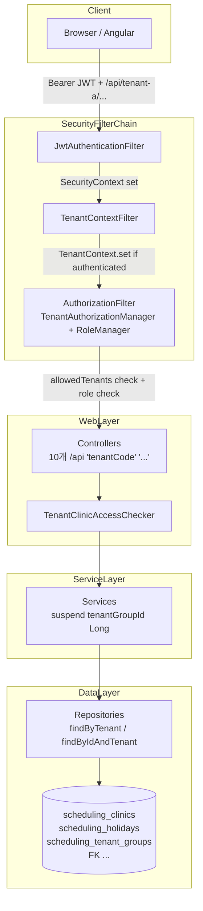
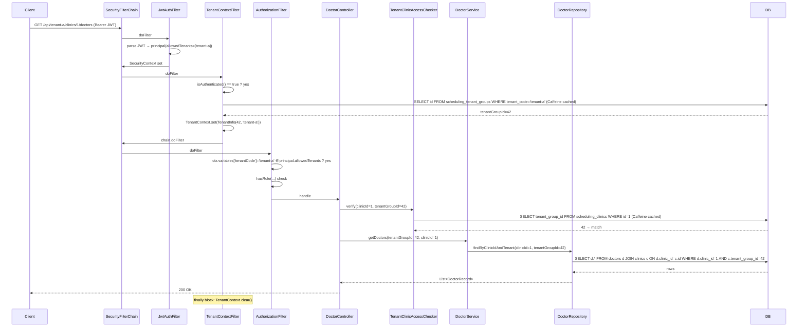

# EPIC #16 멀티테넌시 설계 (Multitenancy Design)

| 항목 | 값 |
|---|---|
| 작성일 | 2026-05-19 |
| 대상 모듈 | `:appointment-core`, `:appointment-api` |
| 관련 이슈 | EPIC #16, #36 (도메인), #37 (Security/Tenant), #38 (Controller URL), #39 (Integration) |
| 관련 산출물 | `docs/superpowers/research/2026-05-19-multitenancy-architecture-blueprint.md` |
| 단계 | Phase 1 (Backend) — Frontend Angular i18n 은 Phase 2 별도 이슈 |
| 환경 | Kotlin 2.3.21, **Java 21**, Spring Boot 4.0.6, Spring Security 6.x, Exposed 1.3.0 |

---

## 1. 개요와 동기 (Overview & Motivation)

### 1.1 배경

`clinic-appointment` 는 단일 클리닉 운영을 가정해 만들어졌다. 그러나 실제 운영 시나리오에서는

- 동일 인스턴스에서 **로케일(국가/언어 권역) 단위로 다수의 클리닉 그룹**을 호스팅
- 로케일 간 **휴일/예약/직원/장비 데이터를 완전히 격리**
- 사용자 JWT 가 부여받은 권역 외 자원에 대해 **읽기/쓰기 차단**

가 필요하다. 이 요구는 EPIC #16 로 묶여 있다.

### 1.2 비목표 (Out of Scope, Phase 1)

| 항목 | 비고 |
|---|---|
| Frontend Angular i18n (`@angular/localize`) | Phase 2 별도 이슈 |
| 데이터 다국어 번역 (의사 이름, 진료 이름 등) | Phase 2 |
| `:appointment-notification`, `:appointment-event`, `:appointment-solver` 모듈의 tenant 인지 | HTTP context 부재. 별도 이슈로 분리. |
| Tenant 별 사용자 locale (i18n 메시지 분리) | Tenant ≠ user locale (직교 도메인) |
| Tenant 별 timezone | 기존 wall-clock timezone 유지 |

### 1.3 격리 모델 결정 — "얕은 격리 A안" (Shallow Isolation A)

`TenantGroup → Clinics + Holidays` 두 테이블만 직접 `tenant_group_id` FK 를 갖는다. 그 외 20여 개 테이블(Doctors, TreatmentTypes, Equipments, EquipmentUnavailabilities, Appointments 등)은 **기존 `clinic_id` FK 를 통해 간접적으로** TenantGroup 에 귀속된다.

이 모델은 다음 두 가드로 보호된다:

1. **JWT `allowedTenants` 클레임 vs URL path `{tenantCode}`** — 매처 단계에서 403 차단
2. **`TenantClinicAccessChecker.verify(clinicId)`** — `clinicId → tenantGroupId` 매핑이 현재 tenant 와 일치하는지 서비스 진입 시 검증 (Caffeine 캐시)

자식 리소스(Doctor, Equipment, Appointment 등)는 반드시 `findByIdAndTenant(id, tenantGroupId)` 형태의 **JOIN 가드 메서드**로만 접근해 enumeration 을 차단한다 (Codex P1-1).

### 1.4 왜 A안인가

- **Schema-per-tenant / DB-per-tenant**: Flyway × N 운영 비용. PoC 단계 부적합. (부록 16.1)
- **PostgreSQL RLS**: H2/MySQL 미지원 → 테스트 매트릭스 깨짐.
- **Exposed `StatementInterceptor`**: Exposed 1.3.0 소스 검증 결과 WHERE 자동 주입 hook 없음.
- **Deep isolation (모든 테이블에 `tenant_group_id` FK)**: 마이그레이션 비용 폭증, 백필 실패 확률 ↑, 이중-FK 일관성 위험.

→ A안 은 마이그레이션 4단계로 끝나며, `TenantClinicAccessChecker` + JOIN 가드 메서드 조합으로 deep isolation 과 동등한 격리 수준을 달성한다.

---

## 2. 요구사항 (Requirements)

### 2.1 기능 요구

| FR-# | 내용 |
|---|---|
| FR-1 | 모든 비즈니스 HTTP 엔드포인트는 `/api/{tenantCode}/...` 로 접근한다. 10개 컨트롤러 전수 변경. |
| FR-2 | 사용자 JWT 는 `allowedTenants: List<String>` 클레임을 포함한다. URL 의 `tenantCode` 가 클레임에 없으면 403. |
| FR-3 | 자원 ID (clinicId, doctorId, appointmentId 등) 가 현재 tenant 소속이 아니면 404 (enumeration 방지). |
| FR-4 | `TenantGroup` 은 데이터 모델 1급 시민. `tenantCode` UNIQUE, `displayName`, `active`, `createdAt`. |
| FR-5 | 기존 단일 클리닉 데이터는 `tenant-default` 그룹으로 백필. 운영 중단 없음. |
| FR-6 | `/api/{tenantCode}/admin/stats` 도 tenant 스코프. 관리자라도 tenant 미스매치면 403. |
| FR-7 | Unknown `tenantCode` 는 **인증된 사용자에 한해** 404, 미인증 사용자에는 401 (정보 leak 방지, Codex P1-2). |

### 2.2 비기능 요구

| NFR-# | 내용 |
|---|---|
| NFR-1 | 인증된 요청 당 tenant 조회 오버헤드 ≤ 1 DB hit (Caffeine 캐시 hit-rate ≥ 95% 목표). |
| NFR-2 | `clinicId → tenantGroupId` 조회도 동일 (Caffeine 분리 캐시). |
| NFR-3 | ThreadLocal 누수 0건. virtual thread / coroutine 재사용 환경에서 검증. |
| NFR-4 | Flyway 마이그레이션은 **H2 / MySQL 8 / PostgreSQL 16** 3개 DB 에서 모두 통과. |
| NFR-5 | 기존 테스트 100+ 케이스의 회귀 0건 — `TestJwtProvider` 기본값으로 `allowedTenants=["tenant-default"]` 제공. |
| NFR-6 | Integration test 전용 profile (`integration-test`) 신설. dev/test 는 `NoOpSecurityConfig` 유지. |
| NFR-7 | Spec/PR 변경 한 PR 안에서 #36, #37, #38, #39 모두 머지 (Angular 제외). |

---

## 3. 설계 위험과 대응 (Design Risks)

| # | 위험 | 영향 | 대응 |
|---|---|---|---|
| R1 (P1-2) | `TenantContextFilter` 가 unauthenticated 사용자에게 unknown tenant 에서 404 → tenant 이름 enumeration leak | High (보안) | **Filter 내부에서 `SecurityContextHolder` 인증 여부 먼저 확인**. 미인증이면 DB 조회 없이 chain 통과 → 401 로 떨어짐. (§ 9) |
| R2 (P1-1) | `findById` 가 tenant 무관하게 자원 반환 → cross-tenant 조회 가능 | High (보안) | **모든 자식 자원 repository 에 `findByIdAndTenant(id, tenantGroupId)` 추가**. JOIN 으로 `clinics.tenant_group_id` 검증. 못 찾으면 404. (§ 6, § 9.3) |
| R3 (P1-3) | Suspend 경로에서 `TenantContext.current()` 호출 시 ThreadLocal 빈 값 → NPE 또는 cross-tenant 누수 | High (보안 + 정확성) | **`TenantContext.current()` 를 `internal` 로 강제**. 모든 suspend 진입점은 `tenantGroupId: Long` 명시 파라미터. 컴파일 타임 enforcement. (§ 10) |
| R4 (P1-4) | Flyway V3-V6 가 H2 에서만 통과하고 MySQL/PG 에서 깨질 가능성 | High (운영) | **Migration Testcontainer 통합 테스트** 추가. `:appointment-api:test -Dspring.profiles.active=test,test-postgresql` / `test-mysql` 양쪽 CI lane. (§ 8, § 12.4) |
| R5 (P2-5) | `NoOpSecurityConfig` 가 `integration-test` profile 에서도 활성화되면 보안 우회 가능 | High | **`integration-test` profile 의 Spring context 에서 `SecurityConfig` bean 존재 + `NoOpSecurityConfig` bean 미존재 단언** 테스트. (§ 12.3) |
| R6 (P2-6) | path segment 파싱이 context-path / trailing slash / encoded slash 에 취약 | Medium | `request.servletPath` 사용. context-path 자동 제거. trailing `/` 무시. `%2F` 등 인코딩 슬래시는 보안상 거부 (`StrictHttpFirewall` 기본 동작에 위임). (§ 9.2) |
| R7 (P2-7) | Filter / Checker 의 DB 조회가 transaction 밖에서 실행되면 Exposed `IllegalStateException` | Medium | 모든 DB 조회는 명시적 `transaction { }` 블록 안. (§ 9.2, § 9.3) |
| R8 | ThreadLocal 누수 (coroutine, virtual thread 재사용) | High | `try { } finally { TenantContext.clear() }` + suspend 명시 인자 규칙 (R3 와 결합) |
| R9 | `TestJwtProvider` 변경이 100+ 테스트 회귀 | Medium | 기본 `allowedTenants=["tenant-default"]` 유지 + 기존 abstract test base 에 `tenant-default` seeding 추가. (§ 12.6) |
| R10 | Caffeine 캐시 stale: 클리닉 tenant 이동 시 | Low | Phase 1 에 클리닉 tenant 이동 API 없음. KDoc 에 명시. 향후 invalidate hook 필요. |
| R11 | Frontend Angular 라우팅 깨짐 | High (UX) | Frontend = Phase 2 명시. Backend PR 머지 시 Angular 빌드는 통과하지만 API 호출 깨짐 → CHANGELOG.md / WIP.md 명시. |
| R12 | Holiday `holidayDate` global UNIQUE 가 tenant 단위로 바뀜 | Medium (마이그레이션) | V3 에서 global UNIQUE drop, V6 에서 `(tenant_group_id, holiday_date)` composite UNIQUE. H2 의 auto-generated constraint name 은 `INFORMATION_SCHEMA` 로 사전 조회 + `DROP CONSTRAINT IF EXISTS`. |

---

## 4. 선택지 비교 (Decision Records)

사용자 확정 사항(URL path 방식, 얕은 격리 A, JWT allowedTenants, …)은 결정으로 고정되어 재검토하지 않는다. 본 절은 **Codex P1 finding 으로 새로 발생한 결정 포인트**만 다룬다.

### 4.1 [DR-1] 자식 리소스 격리 깊이 (Codex P1-1)

| 옵션 | 설명 | 결정 |
|---|---|---|
| A | clinic-only verify (현 blueprint) | **거부**: doctor/equipment/appointment 직접 ID enumeration 가능 |
| B | **모든 child repo 에 `findByIdAndTenant(id, tenantGroupId)` 추가** (JOIN 가드) | **채택** |
| C | Deep isolation (전 테이블 `tenant_group_id` FK) | 거부: 마이그레이션 비용 + 이중-FK 일관성 위험 |

**채택: B**. JOIN 가드는 각 repository 메서드 1개씩 추가하면 끝나며 추가 컬럼/마이그레이션 없이 격리 깊이만 보강한다.

### 4.2 [DR-2] `TenantContextFilter` 의 ordering (Codex P1-2)

| 옵션 | 설명 | 결정 |
|---|---|---|
| A | `JwtAuth → TenantContextFilter → AuthorizationFilter` (현 blueprint) | **부분 채택**: ordering 유지하되 필터 내부에서 `SecurityContextHolder` 인증 확인 |
| B | `JwtAuth → AuthorizationFilter → TenantContextFilter` | 거부: AuthorizationManager 가 `tenantGroupId` 를 필요로 함 (역의존성) |
| C | `JwtAuth → TenantContextFilter` (auth 미인증이면 DB 조회 skip + chain 통과) | **채택 (A 변형)** |

**채택: C**. Filter 진입 시 `SecurityContextHolder.getContext().authentication?.isAuthenticated == true` 가 아니면 즉시 `chain.doFilter()` 로 통과. 미인증 사용자는 unknown tenant 든 known tenant 든 동일하게 401 로 떨어진다 → enumeration leak 차단.

### 4.3 [DR-3] Suspend 경로 enforcement (Codex P1-3)

| 옵션 | 설명 | 결정 |
|---|---|---|
| A | Runtime check (`Thread.currentThread().name` prefix 검사 → throw) | 거부: heuristic, 깨지기 쉬움 |
| B | **`TenantContext.current()` 를 `internal` 가시성으로 제한 + suspend 진입점은 항상 `tenantGroupId` 명시 인자** | **채택** |
| C | `CoroutineContext.Element` 만 사용 (ThreadLocal 제거) | 거부: 동기 controller / blocking JDBC 경로에서 인자 propagation 비용 ↑ |

**채택: B**. 컴파일 타임 enforcement. Service layer 의 suspend 함수 시그니처에 `tenantGroupId: Long` 을 명시. Service 가 아닌 동일 모듈의 동기 controller / filter 코드만 `TenantContext.current()` 호출 가능.

### 4.4 [DR-4] `request.servletPath` vs `requestURI` (Codex P2-6)

| 옵션 | 결정 |
|---|---|
| `request.servletPath` (context-path 자동 제거) | **채택** |
| `request.requestURI` + 수동 context-path 처리 | 거부 |

**채택: `servletPath`**. Spring 6 의 `UrlPathHelper` 변경은 일부 `DispatcherServlet` 매핑에 영향을 주지만 `OncePerRequestFilter` 단계에서는 `servletPath` 가 유효하다. Trailing `/` 는 split 후 빈 segment 무시. `%2F` (encoded slash) 는 `StrictHttpFirewall` 기본 거부에 위임.

### 4.5 [DR-5] Migration 검증 lane

| 옵션 | 결정 |
|---|---|
| H2 만 단위 테스트 | 거부 (Codex P1-4) |
| **H2 (default) + MySQL Testcontainer + PostgreSQL Testcontainer** 3-lane CI 매트릭스 | **채택** |

**채택**: `MultitenancyMigrationTest` 가 3개 DB profile 모두에서 V3→V6 적용 후 `tenant_group_id NOT NULL`, FK, composite UNIQUE 존재를 SQL `INFORMATION_SCHEMA` 로 단언. `.github/workflows/ci.yml` 에서 3-job matrix 로 실행.

---

## 5. 아키텍처 (Architecture)

### 5.1 컴포넌트 다이어그램



### 5.2 데이터 흐름 (Happy Path: `GET /api/tenant-a/clinics/1/doctors`)



---

## 6. 컴포넌트 명세 (Component Specifications)

> 모든 경로는 worktree 기준 절대경로: `/Users/debop/work/bluetape4k/clinic-appointment/.worktrees/feat/issue-16-multitenancy/...`

### 6.1 신규 파일 — `:appointment-core`

| 경로 | 책임 |
|---|---|
| `appointment-core/src/main/kotlin/io/bluetape4k/clinic/appointment/core/model/tables/TenantGroups.kt` | Exposed `LongIdTable("scheduling_tenant_groups")`. 컬럼: `tenantCode VARCHAR(64) UNIQUE`, `displayName VARCHAR(128)`, `active BOOLEAN DEFAULT TRUE`, `createdAt TIMESTAMP`. |
| `appointment-core/src/main/kotlin/io/bluetape4k/clinic/appointment/core/model/dto/TenantGroupRecord.kt` | `data class TenantGroupRecord(val id: Long, val tenantCode: String, val displayName: String, val active: Boolean, val createdAt: Instant) : Serializable`. `serialVersionUID = 1L`. |
| `appointment-core/src/main/kotlin/io/bluetape4k/clinic/appointment/core/repository/TenantGroupRepository.kt` | bluetape4k `AbstractJdbcRepository<TenantGroupRecord, Long>` 패턴. 추가 메서드: `findByCode(tenantCode: String): TenantGroupRecord?`, `findIdByCode(tenantCode: String): Long?`. |

### 6.2 신규 파일 — `:appointment-api/tenant`

| 경로 | 책임 |
|---|---|
| `appointment-api/src/main/kotlin/io/bluetape4k/clinic/appointment/api/tenant/TenantInfo.kt` | `data class TenantInfo(val tenantGroupId: Long, val tenantCode: String) : Serializable`. `serialVersionUID = 1L`. |
| `appointment-api/src/main/kotlin/io/bluetape4k/clinic/appointment/api/tenant/TenantContext.kt` | `internal val current: ThreadLocal<TenantInfo?>`. `internal fun set / clear / requireCurrent()`. `fun asContextElement(): CoroutineContext.Element`. **`current()` 는 internal 가시성** (suspend enforcement, DR-3). |
| `appointment-api/src/main/kotlin/io/bluetape4k/clinic/appointment/api/tenant/TenantContextElement.kt` | `class TenantContextElement(val info: TenantInfo) : ThreadContextElement<TenantInfo?>`. coroutine 진입/이탈 시 ThreadLocal swap. |
| `appointment-api/src/main/kotlin/io/bluetape4k/clinic/appointment/api/tenant/TenantContextFilter.kt` | `OncePerRequestFilter`. 1) `SecurityContextHolder` 인증 확인 (미인증 → chain 통과). 2) `servletPath` 첫 segment 파싱 (path 가 `/api/{tenantCode}/...` 패턴이면). 3) Caffeine 캐시 (`tenantCode → tenantGroupId`, 256 entry, expireAfterWrite 5m, recordStats). 4) 미존재 → `response.sendError(404)`. 5) `try { TenantContext.set(info); chain.doFilter() } finally { TenantContext.clear() }`. |
| `appointment-api/src/main/kotlin/io/bluetape4k/clinic/appointment/api/tenant/TenantClinicAccessChecker.kt` | Service-layer guard. `verify(clinicId: Long, tenantGroupId: Long)`. Caffeine 캐시 (`clinicId → tenantGroupId`, 1024 entry, 10m). 미스매치 → `TenantNotAllowedException`. 모든 DB 조회는 `transaction { }` 명시. |
| `appointment-api/src/main/kotlin/io/bluetape4k/clinic/appointment/api/tenant/TenantNotAllowedException.kt` | `class TenantNotAllowedException(message: String) : RuntimeException(message)`. |
| `appointment-api/src/main/kotlin/io/bluetape4k/clinic/appointment/api/tenant/TenantConfig.kt` | `@Configuration(proxyBeanMethods = false)`. `TenantContextFilter`, `TenantClinicAccessChecker`, Caffeine `CacheManager` (또는 직접 `Caffeine.newBuilder()`). |

### 6.3 신규 파일 — `:appointment-api/security`

| 경로 | 책임 |
|---|---|
| `appointment-api/src/main/kotlin/io/bluetape4k/clinic/appointment/api/security/TenantAuthorizationManager.kt` | `AuthorizationManager<RequestAuthorizationContext>`. `ctx.variables["tenantCode"]` 읽어 `principal.allowedTenants` 와 비교. 미스매치 → `AuthorizationDecision(false)` → 403. |

### 6.4 수정 파일 — `:appointment-core`

| 경로 | 변경 |
|---|---|
| `appointment-core/src/main/kotlin/io/bluetape4k/clinic/appointment/core/model/tables/Clinics.kt` | `val tenantGroupId = long("tenant_group_id").references(TenantGroups.id)` 추가. |
| `appointment-core/src/main/kotlin/io/bluetape4k/clinic/appointment/core/model/tables/Holidays.kt` | `tenantGroupId` 컬럼 추가. 기존 `holidayDate.uniqueIndex()` 제거. `uniqueIndex(tenantGroupId, holidayDate)` 추가. |
| `appointment-core/src/main/kotlin/io/bluetape4k/clinic/appointment/core/model/dto/ClinicRecord.kt` | `tenantGroupId: Long` 추가. `serialVersionUID` bump → 2L. |
| `appointment-core/src/main/kotlin/io/bluetape4k/clinic/appointment/core/model/dto/HolidayRecord.kt` | `tenantGroupId: Long` 추가. `serialVersionUID` bump → 2L. |
| `appointment-core/src/main/kotlin/io/bluetape4k/clinic/appointment/core/repository/ClinicRepository.kt` | `findByTenant(tenantGroupId)`, `findByIdAndTenant(id, tenantGroupId)`, `findTenantGroupId(clinicId)`, `findPage(tenantGroupId, ...)` 추가. |
| `appointment-core/src/main/kotlin/io/bluetape4k/clinic/appointment/core/repository/HolidayRepository.kt` | 모든 메서드의 first parameter 로 `tenantGroupId: Long`. cross-tenant 호출 차단. |
| **자식 리소스 repositories** (DR-1): `DoctorRepository.kt`, `TreatmentTypeRepository.kt`, `EquipmentRepository.kt`, `EquipmentUnavailabilityRepository.kt`, `AppointmentRepository.kt`, `RescheduleRepository.kt`, `SlotRepository.kt` | 각각 `findByIdAndTenant(id: Long, tenantGroupId: Long): XxxRecord?` 추가. JOIN: `... JOIN clinics ON x.clinic_id = clinics.id WHERE x.id = ? AND clinics.tenant_group_id = ?`. (Holiday 는 이미 직접 FK 보유 → JOIN 불필요.) |

### 6.5 수정 파일 — `:appointment-api`

| 경로 | 변경 |
|---|---|
| `appointment-api/src/main/kotlin/io/bluetape4k/clinic/appointment/api/security/SchedulingUserPrincipal.kt` | `allowedTenants: List<String>` 추가. `serialVersionUID = 2L`. |
| `appointment-api/src/main/kotlin/io/bluetape4k/clinic/appointment/api/security/JwtTokenParser.kt` | `CLAIM_ALLOWED_TENANTS = "allowedTenants"` 추가. `(claims[CLAIM_ALLOWED_TENANTS] as? List<String>) ?: emptyList()` 파싱. |
| `appointment-api/src/main/kotlin/io/bluetape4k/clinic/appointment/api/security/SecurityConfig.kt` | Profile expression 변경. `SecurityConfig @Profile("(!dev & !test) | integration-test")`, `NoOpSecurityConfig @Profile("(dev | test) & !integration-test")`. `integration-test` 가 `test` 와 같이 활성화되어도 실제 JWT 보안 체인이 로드되어야 한다. |
| `appointment-api/src/main/kotlin/io/bluetape4k/clinic/appointment/api/security/SecurityConfig.kt` | DSL 재구성. `requestMatchers("/api/{tenantCode}/admin/**").access(allOf(tenantAuthorizationManager, hasRoleAdmin))` 가 GET/POST/... 매처보다 **먼저** 선언. 그 다음 `requestMatchers(HttpMethod.GET, "/api/{tenantCode}/**").access(...)` 등. `anyRequest().denyAll()`. `addFilterAfter(tenantContextFilter, JwtAuthenticationFilter::class.java)`. |
| `appointment-api/src/main/kotlin/io/bluetape4k/clinic/appointment/api/controller/*Controller.kt` (10개) | `@RequestMapping("/api/{tenantCode}/...")` 로 변경. controller 함수에 `@PathVariable tenantCode: String` 추가. body 첫 줄에 `val tenantGroupId = TenantContext.requireCurrent().tenantGroupId`. clinicId 다루는 모든 endpoint 에 `tenantClinicAccessChecker.verify(clinicId, tenantGroupId)`. **자식 리소스 ID 조회는 `findByIdAndTenant`** 사용 (DR-1). |
| `appointment-api/src/main/kotlin/io/bluetape4k/clinic/appointment/api/config/GlobalExceptionHandler.kt` | `TenantNotAllowedException → 403`. |
| `appointment-api/src/test/kotlin/io/bluetape4k/clinic/appointment/api/security/TestJwtProvider.kt` | 모든 토큰 메서드에 `allowedTenants: List<String> = listOf("tenant-default")` 기본값 추가. 클레임 주입. |
| `appointment-api/src/test/kotlin/io/bluetape4k/clinic/appointment/api/test/AbstractApiIntegrationTest.kt` | `@BeforeAll` 에서 `tenant-default` seeding. 신규 `integration-test` profile 활성화 시 `tenant-a`, `tenant-b` 도 seeding. |
| `appointment-core/src/test/kotlin/io/bluetape4k/clinic/appointment/model/tables/TableSchemaTest.kt` 및 `SchemaUtils` 기반 core tests | `TenantGroups` 를 `Clinics`/`Holidays` 보다 먼저 생성하고, FK가 필요한 테스트 fixture는 `tenant-default` row 를 먼저 seed. |

### 6.6 신규 — Flyway × 3 DB

| 경로 | 내용 |
|---|---|
| `appointment-api/src/main/resources/db/migration/{h2,mysql,postgresql}/V3__add_tenant_groups.sql` | `CREATE TABLE scheduling_tenant_groups (...)`, `ALTER TABLE scheduling_clinics ADD COLUMN tenant_group_id BIGINT NULL`, `ALTER TABLE scheduling_holidays ADD COLUMN tenant_group_id BIGINT NULL`, drop holiday_date global UNIQUE (DB-specific). |
| `appointment-api/src/main/resources/db/migration/{h2,mysql,postgresql}/V4__seed_default_tenant.sql` | `INSERT INTO scheduling_tenant_groups(tenant_code, display_name, active, created_at) VALUES('tenant-default','Default Tenant',TRUE,CURRENT_TIMESTAMP)`. `UPDATE scheduling_clinics SET tenant_group_id = (SELECT id FROM scheduling_tenant_groups WHERE tenant_code='tenant-default')`. Holidays 동일. **마지막 줄에 `SELECT COUNT(*) FROM scheduling_clinics WHERE tenant_group_id IS NULL` validation** (Flyway `afterMigrate` callback 으로 보강). |
| `appointment-api/src/main/resources/db/migration/{h2,mysql,postgresql}/V5__tenant_group_not_null.sql` | H2/PG: `ALTER COLUMN tenant_group_id SET NOT NULL`. MySQL: `MODIFY COLUMN tenant_group_id BIGINT NOT NULL`. |
| `appointment-api/src/main/resources/db/migration/{h2,mysql,postgresql}/V6__tenant_constraints.sql` | FK `fk_clinics_tenant_group`, FK `fk_holidays_tenant_group`, composite UNIQUE `uq_holidays_tenant_date(tenant_group_id, holiday_date)`, index `idx_clinics_tenant(tenant_group_id)`. |

### 6.7 신규 — Integration-test profile

| 경로 | 내용 |
|---|---|
| `appointment-api/src/main/resources/application-integration-test.yml` | `integration-test` profile 이 활성화될 때 사용할 test JWT secret, H2, Flyway 설정. **profile-specific YAML 안에 `spring.profiles.active` 를 넣지 않는다.** |
| `appointment-api/src/test/resources/application-integration-test.yml` | 동일 (test 전용 override 필요 시). |
| `appointment-api/src/test/kotlin/io/bluetape4k/clinic/appointment/api/integration/AbstractIntegrationApiTest.kt` | `@SpringBootTest`, `@AutoConfigureMockMvc`, `@ActiveProfiles("test", "integration-test")`. `integration-test` 가 `test` 와 같이 켜져도 `NoOpSecurityConfig` 는 비활성화되고 `SecurityConfig` 가 활성화되어야 한다. `@BeforeAll` 에서 `tenant-a`, `tenant-b` + 2 clinics seeding. (기존 `AbstractApiIntegrationTest` 는 유지하되 신규 클래스로 분리 — 이름 충돌 방지.) |
| `appointment-api/src/test/kotlin/io/bluetape4k/clinic/appointment/api/integration/MultitenancyIntegrationTest.kt` | 6+ 케이스 (§ 12.3). |
| `appointment-api/src/test/kotlin/io/bluetape4k/clinic/appointment/api/integration/SecurityProfileAssertionTest.kt` | `integration-test` profile 에서 `SecurityConfig` bean 존재 + `NoOpSecurityConfig` bean 부재 단언 (R5). |
| `appointment-api/src/test/kotlin/io/bluetape4k/clinic/appointment/api/migration/MultitenancyMigrationTest.kt` | 3 DB profile 매트릭스에서 `INFORMATION_SCHEMA` 단언 (R4). |

---

## 7. 데이터 모델 (Data Model)

### 7.1 `scheduling_tenant_groups`

```sql
CREATE TABLE scheduling_tenant_groups (
    id           BIGINT       NOT NULL AUTO_INCREMENT PRIMARY KEY,  -- DB별 sequence/identity
    tenant_code  VARCHAR(64)  NOT NULL UNIQUE,
    display_name VARCHAR(128) NOT NULL,
    active       BOOLEAN      NOT NULL DEFAULT TRUE,
    created_at   TIMESTAMP    NOT NULL DEFAULT CURRENT_TIMESTAMP
);
```

### 7.2 `scheduling_clinics` 변경

- 컬럼 추가: `tenant_group_id BIGINT NOT NULL`
- FK: `fk_clinics_tenant_group → scheduling_tenant_groups(id)`
- 인덱스: `idx_clinics_tenant(tenant_group_id)`

### 7.3 `scheduling_holidays` 변경

- 컬럼 추가: `tenant_group_id BIGINT NOT NULL`
- 제약 제거: `uq_holidays_holiday_date` (global UNIQUE on holiday_date)
- 제약 추가: `uq_holidays_tenant_date(tenant_group_id, holiday_date)`
- FK: `fk_holidays_tenant_group`

### 7.4 다른 테이블

`tenant_group_id` 컬럼 추가 **없음**. JOIN 가드 메서드(`findByIdAndTenant`)로 격리.

---

## 8. Flyway 마이그레이션 전략 (3 DB × 4 step)

### 8.1 V3 — Schema + nullable

세 DB 공통: 새 테이블 생성 + `tenant_group_id NULL` 컬럼 추가 + Holiday 의 global UNIQUE 제거.

H2 의 quirk: auto-generated constraint name → V3 마이그레이션 첫 줄에서 `INFORMATION_SCHEMA.TABLE_CONSTRAINTS WHERE TABLE_NAME='SCHEDULING_HOLIDAYS' AND CONSTRAINT_TYPE='UNIQUE'` 조회 후 dynamic SQL. 또는 안전책으로 `DROP CONSTRAINT IF EXISTS ...` + `DROP INDEX IF EXISTS ...` 양쪽 시도.

### 8.2 V4 — Backfill + validation

```sql
INSERT INTO scheduling_tenant_groups(tenant_code, display_name, active)
VALUES ('tenant-default', 'Default Tenant', TRUE);

UPDATE scheduling_clinics
   SET tenant_group_id = (SELECT id FROM scheduling_tenant_groups WHERE tenant_code='tenant-default')
 WHERE tenant_group_id IS NULL;

UPDATE scheduling_holidays
   SET tenant_group_id = (SELECT id FROM scheduling_tenant_groups WHERE tenant_code='tenant-default')
 WHERE tenant_group_id IS NULL;
```

추가 검증: Flyway `afterMigrate` callback (`MultitenancyAfterMigrateCallback`) 이 `SELECT COUNT(*) FROM scheduling_clinics WHERE tenant_group_id IS NULL` 을 0 으로 단언. 실패 시 throw → V5 진입 전에 회복.

### 8.3 V5 — NOT NULL

| DB | 구문 |
|---|---|
| H2 / PostgreSQL | `ALTER TABLE scheduling_clinics ALTER COLUMN tenant_group_id SET NOT NULL` |
| MySQL | `ALTER TABLE scheduling_clinics MODIFY COLUMN tenant_group_id BIGINT NOT NULL` |

### 8.4 V6 — FK + composite UNIQUE + indexes

세 DB 공통 (구문은 동일):

```sql
ALTER TABLE scheduling_clinics
  ADD CONSTRAINT fk_clinics_tenant_group FOREIGN KEY (tenant_group_id)
  REFERENCES scheduling_tenant_groups(id);

CREATE INDEX idx_clinics_tenant ON scheduling_clinics(tenant_group_id);

ALTER TABLE scheduling_holidays
  ADD CONSTRAINT fk_holidays_tenant_group FOREIGN KEY (tenant_group_id)
  REFERENCES scheduling_tenant_groups(id),
  ADD CONSTRAINT uq_holidays_tenant_date UNIQUE (tenant_group_id, holiday_date);
```

### 8.5 롤백 전략

- V3-V4 사이 실패: `tenant_group_id NULL` 상태로 운영 가능. V4 재실행 가능 (멱등 INSERT — `ON CONFLICT DO NOTHING` 사용).
- V5 실패: V4 검증 callback 으로 사전 차단. 그래도 실패하면 NULL row 수동 조사.
- V6 실패: 직전 단계에서 멈춤. Flyway repair 후 재시도.

V3 이전으로 자동 롤백은 제공하지 않음. PR 머지 전에 staging 에서 3개 DB 전수 검증 필수.

---

## 9. 보안 모델 (Security Model)

### 9.1 JWT 클레임 스키마

```json
{
  "sub": "user-123",
  "iss": "appointment-auth-service",
  "clinicId": 1,
  "roles": ["STAFF"],
  "allowedTenants": ["tenant-a"],
  "iat": ...,
  "exp": ...
}
```

`allowedTenants` 누락 → 빈 리스트 → 어떤 tenant URL 도 통과 못함 (403). Malformed JSON / 잘못된 타입 → `JwtTokenParser` 의 try/catch 가 null 반환 → 401.

### 9.2 Filter Chain Ordering (DR-2 채택)

```
1. JwtAuthenticationFilter
   - Authorization 헤더 있으면 parse → SecurityContext 에 principal 세팅
   - 없거나 invalid 면 SecurityContext 미설정 → 후속 AuthorizationFilter 가 401 처리

2. TenantContextFilter  [addFilterAfter(JwtAuthenticationFilter::class)]
   - if (SecurityContextHolder.getContext().authentication?.isAuthenticated != true)
       → chain.doFilter() 그대로 통과, DB 조회 NO, TenantContext.set NO
   - path 가 /api/{tenantCode}/... 패턴이 아니면 (e.g. /actuator) → chain.doFilter()
   - tenantCode 추출 → Caffeine 캐시 조회 → 없으면 transaction { TenantGroupRepository.findIdByCode }
   - 미존재 → response.sendError(404, "Unknown tenant")
   - try { TenantContext.set(info); chain.doFilter() } finally { TenantContext.clear() }

3. AuthorizationFilter
   - TenantAuthorizationManager: ctx.variables["tenantCode"] ∈ principal.allowedTenants ?
     - DENIED → 403
   - RoleAuthorizationManager: method 별 role 검사
```

핵심: **미인증 사용자는 TenantContextFilter 단계에서 절대로 DB 조회를 일으키지 않는다** → unknown tenant 와 known tenant 응답이 동일하게 401 → enumeration leak 0.

### 9.3 자식 리소스 격리 (DR-1)

| 자원 | Repository 메서드 | JOIN |
|---|---|---|
| Doctor | `findByIdAndTenant(id, tenantGroupId)` | `JOIN clinics ON doctors.clinic_id = clinics.id WHERE clinics.tenant_group_id = ?` |
| TreatmentType | 동일 패턴 | 동일 |
| Equipment | 동일 | 동일 |
| EquipmentUnavailability | 동일 (clinic 경유) | 동일 |
| Appointment | 동일 | 동일 |
| Reschedule | 동일 | 동일 |
| Slot | 동일 | 동일 |
| Holiday | `findByIdAndTenant(id, tenantGroupId)` — Holiday 는 직접 `tenant_group_id` FK | `WHERE holidays.tenant_group_id = ?` |

Controller 패턴:

```kotlin
@GetMapping("/{doctorId}")
fun getDoctor(@PathVariable tenantCode: String, @PathVariable doctorId: Long): DoctorRecord {
    val tenantGroupId = TenantContext.requireCurrent().tenantGroupId
    return doctorRepository.findByIdAndTenant(doctorId, tenantGroupId)
        ?: throw ResourceNotFoundException("Doctor $doctorId not found")
}
```

**404 (Not Found)** 반환. cross-tenant 접근도 404 (403 이 아님). 이유: 자원 존재 자체를 enumeration 으로 노출하지 않기 위함.

### 9.4 SecurityConfig matcher 순서

DSL 의 first-match-wins 규칙. **관리자 매처가 일반 매처보다 먼저** 선언되어야 함:

```kotlin
.authorizeHttpRequests { auth ->
    auth
        .requestMatchers("/swagger-ui/**", "/v3/api-docs/**", "/actuator/**").permitAll()
        // 1) ADMIN 전용 — 먼저
        .requestMatchers("/api/{tenantCode}/admin/**")
            .access(allOf(tenantAuthorizationManager, hasRoleAdmin))
        // 2) 그 다음 일반 매처
        .requestMatchers(HttpMethod.GET, "/api/{tenantCode}/**")
            .access(allOf(tenantAuthorizationManager, authenticatedManager))
        .requestMatchers(HttpMethod.POST,   "/api/{tenantCode}/**").access(allOf(tenantAuthorizationManager, hasAnyRoleAdminOrStaff))
        .requestMatchers(HttpMethod.PATCH,  "/api/{tenantCode}/**").access(allOf(tenantAuthorizationManager, hasAnyRoleAdminOrStaff))
        .requestMatchers(HttpMethod.DELETE, "/api/{tenantCode}/**").access(allOf(tenantAuthorizationManager, hasAnyRoleAdminOrStaff))
        .anyRequest().denyAll()
}
```

테스트에서 matcher 순서 회귀를 단언 (§ 12).

---

## 10. 코루틴 안전성 (Coroutine Safety, DR-3)

### 10.1 규칙

1. `TenantContext.current()` 는 **`internal` 가시성**. service / suspend 코드에서 호출 불가.
2. Controller → Service 호출은 **suspend 진입점**으로 `tenantGroupId: Long` 명시 인자 전달.
3. Service 내부에서 다른 coroutine context (Dispatchers.IO 등) 로 진입 시에도 `tenantGroupId` 는 인자로 들고 다닌다.
4. (선택) `TenantContextElement(info).asContextElement()` 는 ThreadLocal 가시성이 필요한 매우 제한된 경우에만 사용. 기본 정책은 "인자 propagation".

### 10.2 컴파일 타임 enforcement

`TenantContext.kt`:

```kotlin
package io.bluetape4k.clinic.appointment.api.tenant

internal object TenantContext {
    private val holder = ThreadLocal<TenantInfo?>()

    internal fun set(info: TenantInfo) { holder.set(info) }
    internal fun clear() { holder.remove() }

    internal fun current(): TenantInfo? = holder.get()
    internal fun requireCurrent(): TenantInfo =
        current() ?: error("TenantContext not initialized — call from inside SecurityFilterChain")
}
```

`internal` 가시성이므로 같은 모듈(`appointment-api`) 의 controller / filter / TenantClinicAccessChecker 만 호출 가능. Service / coroutine 영역에서는 접근 불가 → 컴파일 에러.

### 10.3 검증 테스트

`TenantContextCoroutineTest.kt`:

- ThreadLocal 이 다른 코루틴 dispatcher 로 자동 전파되지 않음을 단언 (negative test)
- `TenantContextElement` 가 명시적으로 사용된 경우 전파됨을 단언
- virtual thread executor 재사용 시 `clear()` 누락 시 leak 발생을 단언 (관찰 테스트)
- `try/finally` 적용 시 leak 0건

---

## 11. 에러 매트릭스 (Error Matrix)

| 시나리오 | HTTP | 응답 본문 | Source |
|---|---|---|---|
| JWT 누락 | 401 | `WWW-Authenticate: Bearer` | Spring `AuthenticationEntryPoint` |
| JWT 만료/위조 | 401 | 동일 | `JwtTokenParser` null + `AuthenticationEntryPoint` |
| Unknown tenantCode + **미인증** | **401** | JWT 누락과 동일 | `TenantContextFilter` skip → AuthorizationFilter 401 |
| Unknown tenantCode + 인증됨 | **404** | `{"error":"Unknown tenant"}` | `TenantContextFilter.sendError(404)` |
| tenantCode vs allowedTenants 미스매치 | 403 | `{"error":"Forbidden"}` | `TenantAuthorizationManager` |
| clinicId 가 다른 tenant 소속 | 403 | `{"error":"Tenant not allowed"}` | `TenantClinicAccessChecker` → `TenantNotAllowedException` |
| doctorId/equipmentId 등이 다른 tenant 소속 | **404** | (자원 미존재와 동일) | `findByIdAndTenant` null |
| Role 부족 | 403 | Spring 기본 | `AuthorityAuthorizationManager` |
| POST body 의 clinicId 가 path tenant 와 불일치 | 403 | `{"error":"Tenant not allowed"}` | `TenantClinicAccessChecker.verify(body.clinicId)` |
| PATCH body 의 id 와 path id 불일치 | 400 | `{"error":"Path/body mismatch"}` | Controller 검증 |

**중요**: 미인증 사용자에게는 unknown vs known tenant 응답이 동일 (둘 다 401) → path enumeration leak 0.

---

## 12. 테스트 전략 (Test Strategy)

### 12.1 단위 테스트

| 클래스 | 위치 |
|---|---|
| `TenantGroupRepositoryTest` | `appointment-core/src/test/kotlin/.../repository/` |
| `ClinicRepositoryTest` (확장 — `findByIdAndTenant`) | 동일 |
| 각 자식 repository test (Doctor/TreatmentType/...) — `findByIdAndTenant` JOIN 가드 검증 | 동일 |
| `HolidayRepositoryTest` (확장 — composite UNIQUE 동작) | 동일 |
| `TenantContextFilterTest` (with MockMvc) | `appointment-api/.../tenant/` |
| `TenantClinicAccessCheckerTest` | 동일 |
| `TenantAuthorizationManagerTest` | `appointment-api/.../security/` |
| `JwtTokenParserTest` (확장 — allowedTenants claim) | 동일 |
| `TenantContextCoroutineTest` | `appointment-api/.../tenant/` |
| `MultitenancyAfterMigrateCallbackTest` | `appointment-api/.../config/` |

### 12.2 통합 테스트

위치: `appointment-api/src/test/kotlin/io/bluetape4k/clinic/appointment/api/integration/`

| 테스트 | 시나리오 |
|---|---|
| `MultitenancyIntegrationTest` | (1) 200: tenant-a 사용자가 tenant-a 의 clinic 조회 (2) 403: tenant-a JWT 로 `/api/tenant-b/clinics/1` 호출 (3) 403: tenant-a clinic 의 ID 를 path tenant-a 인 채 사용해도 클리닉 자체는 b 소속이면 차단 (4) **401 (인증 안된 미인증) + 404 (인증된 사용자에게)**: unknown tenant 매트릭스 (5) 401: JWT 없이 호출 (6) Holiday cross-tenant isolation: tenant-a 와 tenant-b 가 같은 날짜 휴일 등록 가능 (composite UNIQUE) (7) Admin: `/api/tenant-a/admin/stats` 가 ADMIN 토큰 + allowedTenants 일치 필요 (8) admin matcher 순서: STAFF 가 admin endpoint 호출 시 403 |
| `MultitenancyChildResourceIsolationTest` | 자식 리소스 (Doctor/TreatmentType/Equipment/EquipmentUnavailability/Appointment/Reschedule/Slot/Holiday) 각각 cross-tenant ID 직접 호출 → 404 |
| `MultitenancyBodyMismatchTest` | POST/PATCH/DELETE 의 body 와 path tenantCode/clinicId 불일치 매트릭스 |
| `MultitenancyMalformedClaimTest` | JWT 의 `allowedTenants` 가 (a) 누락 (b) 빈 배열 (c) 정수 (d) string (not list) — 모두 401/403 매핑 단언 |
| `MultitenancyCacheStaleTest` | tenant-default 의 `active=false` 변경 후 Caffeine eviction 까지의 stale 동작 단언 + negative tenant code (캐시되지 않음 / negative caching 정책) |

### 12.3 보안 profile 검증 (R5)

`SecurityProfileAssertionTest`:

```kotlin
@SpringBootTest
@ActiveProfiles("test", "integration-test")
class SecurityProfileAssertionTest {
    @Autowired lateinit var ctx: ApplicationContext

    @Test fun `integration-test profile loads real SecurityConfig`() {
        ctx.getBean(SecurityConfig::class.java)  // throws if missing
        assertFailsWith<NoSuchBeanDefinitionException> { ctx.getBean(NoOpSecurityConfig::class.java) }
    }
}
```

### 12.4 Migration × 3 DB (R4)

`MultitenancyMigrationTest`:

```kotlin
@SpringBootTest
@ActiveProfiles(resolver = DatabaseProfileResolver::class)
class MultitenancyMigrationTest {
    @Test fun `V3-V6 applies cleanly and produces expected schema`() {
        // INFORMATION_SCHEMA 단언
        // - scheduling_tenant_groups 테이블 존재
        // - scheduling_clinics.tenant_group_id NOT NULL + FK
        // - scheduling_holidays composite UNIQUE
        // - tenant-default row 존재
    }
}
```

CI 실행:

```bash
./gradlew :appointment-api:test --tests "*.MultitenancyMigrationTest"                                              # H2
./gradlew :appointment-api:test --tests "*.MultitenancyMigrationTest" -Dspring.profiles.active=test,test-postgresql
./gradlew :appointment-api:test --tests "*.MultitenancyMigrationTest" -Dspring.profiles.active=test,test-mysql
```

`.github/workflows/ci.yml` 에 3-job matrix 추가. `nightly-tests.yml` 도 동일 매트릭스 반영.

### 12.5 코루틴 (R3)

`TenantContextCoroutineTest` (§ 10.3) 외에 — service layer suspend 함수의 `tenantGroupId: Long` 인자 누락은 컴파일 에러로 검증되므로 별도 런타임 테스트 불필요.

### 12.6 기존 테스트 회귀 차단 (R9)

- `TestJwtProvider.createToken(...)` 기본 `allowedTenants = listOf("tenant-default")`.
- 기존 abstract integration base 가 `@BeforeAll` 에서 `tenant-default` row + clinic FK 백필 보장.
- `SchemaUtils.createMissingTablesAndColumns(...)` 를 직접 호출하는 core tests 는 `TenantGroups` 를 포함하고 `Clinics`/`Holidays` insert 전에 `tenant-default` row 를 seed.
- 기존 controller test 들이 `/api/clinics/1` → `/api/tenant-default/clinics/1` URL 로 일괄 치환 (sed-style). 검증 명령: `rg -n '"/api/(clinics|doctors|appointments|slots|treatment-types|equipments|equipment-unavailabilities|reschedule|admin/stats)' appointment-api/src/test` 가 0건이어야 함.

### 12.7 검증 명령 (Verification Commands)

```bash
# 1. 모듈 단위 빌드
./gradlew :appointment-core:build :appointment-api:build

# 2. 단위 테스트
./gradlew :appointment-core:test :appointment-api:test

# 3. Migration 3-DB
./gradlew :appointment-api:test --tests "*.MultitenancyMigrationTest"
./gradlew :appointment-api:test --tests "*.MultitenancyMigrationTest" -Dspring.profiles.active=test,test-postgresql
./gradlew :appointment-api:test --tests "*.MultitenancyMigrationTest" -Dspring.profiles.active=test,test-mysql

# 4. 보안 profile 단언
./gradlew :appointment-api:test --tests "*.SecurityProfileAssertionTest"

# 5. URL 패턴 회귀 점검
rg -n '"/api/(clinics|doctors|appointments|slots|treatment-types|equipments|equipment-unavailabilities|reschedule|admin/stats)' appointment-api/src/main appointment-api/src/test  # 결과 0 expected

# 6. TenantContext.current() 외부 호출 점검 (internal 가시성 우회 시도)
rg "TenantContext\\.current\\(\\)" appointment-api/src/main | grep -v "tenant/"  # 결과 0 expected
```

### 12.8 실패 신호 (Red Flags)

| 증상 | 의미 |
|---|---|
| Unknown tenant 호출에서 미인증 사용자에게 404 응답 | DR-2 회귀, enumeration leak — **block PR** |
| `findById(doctorId)` 가 cross-tenant 자원을 반환 | DR-1 회귀 — block PR |
| H2 migration 통과 + MySQL 실패 | V3 의 H2-specific constraint name 처리 누락 |
| Caffeine hit rate < 80% (Micrometer 메트릭) | 캐시 크기/TTL 부적절 |
| 기존 controller test 50건 이상 깨짐 | `TestJwtProvider` 기본값 또는 abstract base seeding 누락 |
| `TenantContext.current()` 가 코루틴 안에서 호출되는 코드가 검색에 잡힘 | DR-3 enforcement 회귀 |

---

## 13. 성능 (Performance)

### 13.1 Caffeine 캐시

| 캐시 | Key → Value | Max Size | TTL | 비고 |
|---|---|---|---|---|
| `tenantCodeToId` | `String → Long?` | 256 | 5m write | negative caching 포함 (`null` 도 캐시 — unknown tenant flood 방지) |
| `clinicIdToTenantId` | `Long → Long?` | 1024 | 10m write | 동일 |

`recordStats()` + Micrometer `CaffeineCacheMetrics` 등록 → `/actuator/metrics/cache.gets` 로 모니터링.

### 13.2 N+1 방지

- `findByIdAndTenant` 는 JOIN 1회로 끝남.
- 페이지네이션 (`findPage(tenantGroupId, page, size)`) 도 `WHERE tenant_group_id = ?` + `LIMIT/OFFSET` 한 쿼리.

### 13.3 인덱스

- `idx_clinics_tenant(tenant_group_id)` — clinic 목록 조회용.
- `uq_holidays_tenant_date(tenant_group_id, holiday_date)` — 휴일 lookup + UNIQUE 강제.
- `tenant_code UNIQUE` — TenantGroup 조회.

---

## 14. Definition of Done (DoD)

### 14.1 코드

- [ ] `:appointment-core` 컴파일 + 모든 테스트 통과
- [ ] `:appointment-api` 컴파일 + 모든 테스트 통과 (H2)
- [ ] 통합 테스트 PostgreSQL Testcontainer profile 통과
- [ ] 통합 테스트 MySQL Testcontainer profile 통과
- [ ] `MultitenancyMigrationTest` 3 DB 모두 통과
- [ ] `rg -n '"/api/(clinics|doctors|appointments|slots|treatment-types|equipments|equipment-unavailabilities|reschedule|admin/stats)' appointment-api/src` 결과 0건
- [ ] `rg "TenantContext\.current\(\)" appointment-api/src/main` 가 `tenant/` 패키지 외부에서 0건
- [ ] `SecurityProfileAssertionTest` 통과 (R5)
- [ ] IDE diagnostics: 0 errors, 0 unresolved deprecations

### 14.2 보안 finding

- [ ] Codex P1-1 (자식 리소스 격리) — `findByIdAndTenant` 8+ repository 추가 (§ 6.4)
- [ ] Codex P1-2 (filter ordering / enumeration leak) — `TenantContextFilter` 인증 확인 로직 (DR-2)
- [ ] Codex P1-3 (suspend enforcement) — `TenantContext.current()` `internal` 가시성 (DR-3)
- [ ] Codex P1-4 (3 DB migration) — `MultitenancyMigrationTest` × 3
- [ ] Codex P2-5 (NoOpSecurity 우회 검증) — `SecurityProfileAssertionTest`
- [ ] Codex P2-6 (path segment indexing) — `servletPath` + context-path / trailing slash 처리 명시
- [ ] Codex P2-7 (`transaction { }` 명시) — Filter/Checker DB 조회 코드 검증
- [ ] Codex P3 (누락 테스트) — `MultitenancyMalformedClaimTest`, admin matcher 순서, body/path mismatch, cache stale

### 14.3 문서

- [ ] `README.md` / `README.ko.md` 의 multitenancy 섹션 추가 + URL 형식 변경 안내
- [ ] `WIP.md` 의 Frontend Phase 2 명시
- [ ] `CHANGELOG.md` 의 BREAKING CHANGE 명시 (URL 변경)
- [ ] 신규/변경 public API 의 KDoc 영문

### 14.4 PR

- [ ] PR 본문에 검증 명령 출력 첨부
- [ ] PR 본문에 Codex finding 매핑 표 첨부
- [ ] PR 단일 (#36, #37, #38, #39 squash)
- [ ] `oh-my-claudecode:code-reviewer` 통과 (HIGH/CRITICAL 0)

---

## 15. Phase 2 (Out of Scope)

| 항목 | 이유 |
|---|---|
| Angular Frontend i18n (`@angular/localize`, en/ko 빌드) | Phase 2 별도 이슈로 등록 |
| Angular 라우팅 `/{tenantCode}/...` 적용 | Phase 2 |
| `:appointment-notification` 의 tenant 인지 | HTTP context 부재. CRON / Redis Leader Election 경로에 tenant 명시 인자 도입 필요 — 별도 설계 |
| `:appointment-event` Spring event 의 tenant payload | 별도 설계 |
| `:appointment-solver` Timefold 의 tenant 분리 | 별도 설계 |
| Tenant 별 데이터 다국어 번역 (의사명, 진료명) | i18n 데이터 모델 필요 |
| Tenant 별 timezone | 비요구 — wall-clock 유지 |
| Tenant 별 user locale 매칭 | 비요구 — Tenant ≠ locale |
| Clinic 의 tenant 이동 API + Caffeine invalidate hook | Phase 1 미요구 (R10) |

---

## 16. 부록 — 거부된 대안 (Rejected Alternatives, Brief)

| # | 안 | 거부 사유 |
|---|---|---|
| 16.1 | Schema-per-tenant | Flyway × N 운영 비용, DDL 동기화 부담. |
| 16.2 | DB-per-tenant | 동일 + 연결 풀 N 배. PoC 규모 부적합. |
| 16.3 | Subdomain tenant 식별 (`tenant-a.example.com`) | URL path 가 더 명시적이고 reverse proxy 의존성 없음. |
| 16.4 | PostgreSQL RLS (Row Level Security) | H2/MySQL 미지원 → 멀티 DB 테스트 매트릭스 깨짐. |
| 16.5 | Exposed `StatementInterceptor` 로 WHERE 자동 주입 | Exposed 1.3.0 소스 검증 결과 WHERE-clause hook 미제공 (statement-lifecycle only). |
| 16.6 | JWT 만으로 tenant 결정 (URL 미사용) | URL 이 source of truth 가 아니면 라우팅 캐시 불친화 + 다른 tenant 의 자원을 ID 로 enumeration 가능. |
| 16.7 | Hibernate `MultiTenantConnectionProvider` 류 도입 | 본 프로젝트는 Exposed 사용. Hibernate 미사용. |
| 16.8 | `ThreadLocal` 단독 (CoroutineContext.Element 없이) | coroutine boundary 에서 누수. 본 안은 ThreadLocal + `internal` enforcement + 선택적 Element 로 보강. |
| 16.9 | Deep isolation (모든 테이블에 `tenant_group_id` FK) | 마이그레이션 비용 + 이중-FK 일관성 위험. JOIN 가드로 동등 격리 달성. |

---

## 17. 참조

- Blueprint: `docs/superpowers/research/2026-05-19-multitenancy-architecture-blueprint.md`
- Codex CLI second-opinion finding (REQUEST_CHANGES P1-1 ~ P3): worktree `.omx/notepad.md` (Step 2-B 결과)
- bluetape4k 가이드: `bluetape4k-patterns`, `ecc-kotlin-exposed`, `ecc-springboot-kotlin`, `ecc-kotlin-testing`
- Spring Security 6 reference: `AuthorizationManager` + `RequestAuthorizationContext`
- Exposed 1.3.0 — `StatementInterceptor` API 검증 (WHERE 자동 주입 hook 미존재 확정)

---

END OF SPEC
