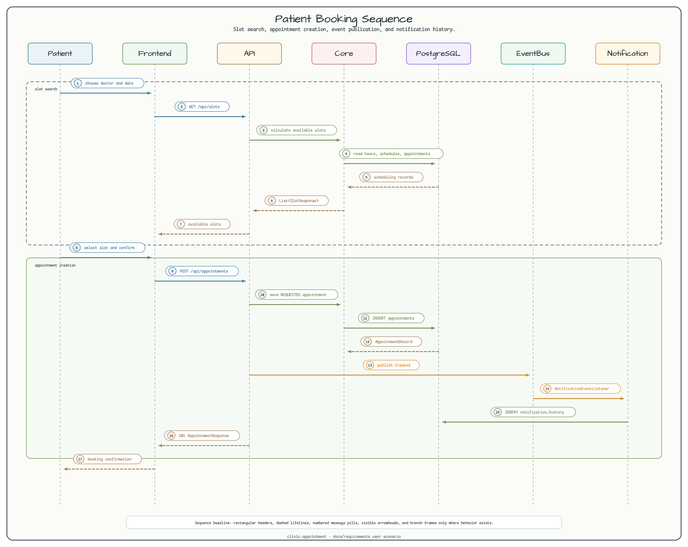
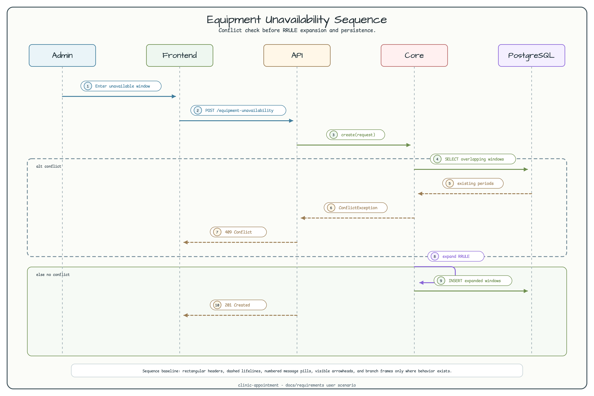

# appointment-frontend

[English](README.md) | [한국어](README.ko.md)

Angular 18 web UI for clinic appointment management.

## Development Server

```bash
cd frontend/appointment-frontend
npm install
npm start   # http://localhost:4200
```

The API server at `http://localhost:8080` must be running first.

## User Flows





## Build

```bash
# Direct Angular CLI build
npm run build   # creates dist/

# Gradle-integrated build
./gradlew :frontend:appointment-frontend:build
```

## Tests

```bash
npm test   # Karma unit tests
```

## Design Documents

- [Frontend Design](../../docs/requirements/frontend.md)
